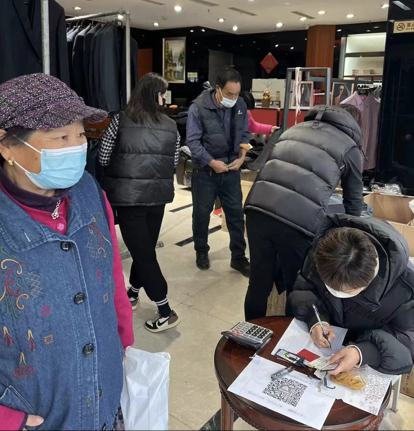

# 夏天捐红十字会羽绒服“左手倒右手”？涉事公司：就是走一个正规手续

企业提供照片，称是村民挑选服装和登记签名的现场。

 _（受访者供图/图）_

近日，网传“五木服装公司三伏天给北京市红十字会捐赠几千件西装，又被红会捐回公司所在地”，迅速引发网友关注。

北京市红十字会公布的“2023年5月接收社会捐赠物资使用明细表”显示，上千件羽绒服、大衣、毛背心等衣物被捐赠给北京市通州区张家湾镇陆辛庄村和北大化村，项目用途为“救灾救助”。

物资使用明细表显示，捐赠衣物共2611件，总额146万余元，平均每件近560元，其中包括羽绒服、针织衬衫、皮衣等，物资来源单位为北京五木服装有限责任公司（以下简称五木服装）。引起网络围观的是，物资捐赠目的地北大化村与物资来源单位所在地重合，陆辛庄村也紧邻北大化村。

对于五木服装捐赠的物资又回到公司所在地，有网友疑惑：“转个圈又回到自己手中？”“这算逃税吗？”2023年8月8日，北京市红十字会一名工作人员回复南方周末记者：“对于整个事件，我们后续会有一个官方的说明。”

不仅如此，五木服装的法定代表人与北京市红十字会一名常务理事会成员同名，都叫季连旭。

8月8日下午，上述北京市红十字会工作人员向南方周末记者证实，他们是同一人：“他（指季连旭）作为民企代表，多年来热心公益事业，参与我们的一些活动，所以当选了我们的常务理事，但并不是我们的工作人员，不参加我们的日常工作管理。”

“走一个正规手续”

对于本次引发争议的捐赠项目，8月8日下午，五木服装相关负责人付女士告诉南方周末记者，2611件衣服是自己公司生产的，捐给了陆辛庄村和北大化村的村民，属于定向捐赠，即村民挑选完衣服后，公司再将相关数据报至北京市红十字会“走一个正规手续”。

五木服装实控人季荣忠补充：“我们捐赠服装是视同销售，上的是增值税。”南方周末记者以市民身份咨询了北京市税务部门相关工作人员，工作人员称据《增值税暂行条例实施细则》第四条，企业或个体工商户将自产、委托加工或者购进的货物无偿捐送其他单位或者个人，视同销售货物，需要缴纳增值税。

付女士称：“（衣服）没有入红十字会的库，只是因为捐赠服装不通过红十字会就没法入账，相当于走了这么一个正规手续。”她称，除了通过北京市红十字会，该公司曾于2018年通过北京市通州区慈善协会给当地村民捐赠过衣物，“因为如果你不通过它们，直接发老百姓手里不行。我们是一般纳税人，账目要接受税务核查。你给到村上，村上给你出一证明，但这账没法做”。

对于捐赠衣物能否避税，上述北京市红十字会工作人员说“是能够根据捐赠发票抵扣一定量的税”，付女士解释：“捐赠只能避企业所得税，我们企业从疫情到现在一直亏损，没有所得税。”

对于为何公司处于亏损状态仍给村民捐赠衣物，季荣忠回复说：“我的宗旨是施舍发财、放生长寿。”实际上，将衣物捐赠给村民还有更为实际的考量，付女士称：“现在实体店难做，开门一天也卖不了几件，但是人工工资要出，电费要出，标高了卖不出去，标低了，不好听，我们曾经是中国驰名商标，现在还想维护这个面子，我们宁愿白送也不愿意让人当尾货买走。”

除了方便入账，五木服装为何通过北京红十字会来进行此次捐赠？付女士解释，五木服装曾参与多次重大灾难的捐赠活动，如汶川地震、鲁甸地震、1998年洪水等，有些捐赠是通过北京市红十字会，“所以这熟悉，我们跟红十字会不可能不认识，至于经济来往，一分都没有”。据北京市红十字会官微消息，2021年五木服装向该机构捐赠9682件服装，价值200余万元，该批物资有衬衫、西服、夹克等，于当年8月23日入库。

至于捐赠是否存在向陆辛庄村和北大化村输送利益的可能，两个村的村干部均向南方周末记者确认，季荣忠及其家人并未在村内担任任何职务。

天眼查显示，五木服装成立于1995年，注册资本5686万元，实控人为季荣忠，法定代表人季连旭，两人是父子关系。66岁的季荣忠告诉南方周末记者，自己是陆辛庄人，工厂原址在陆辛庄，后搬迁扩建到北大化村，两个村挨着，很近。

5000元服装卡

“好人护三村，好狗护三邻。”季荣忠这样解释其动机，“我是当地村民，挣钱了不能忘了当地老百姓，我捐给本村的村民，最起码人家上这儿来取衣服会说这是老季给的。我们是2023年春节前发的，给两个村的村民每家一张服装卡，有人爱穿皮衣，有人愿意选羽绒服，那是人家个人爱好。”

这场春节前的衣物捐赠，就是此次备受争议的衣物捐赠的缘起。季荣忠称，并非自己大夏天捐皮衣、西服，而是因为村民挑选衣服的时间比较长，“有的人没时间，什么时候来取的都有，我给了几个月的时间，得等人选完了”。

季荣忠讲述，每张服装卡里有5000元额度，由村委会协助发放，村民签字领卡。领到服装卡后即可到季荣忠搭建的专门场地挑选衣服，结账时按照衣服吊牌价抵扣。主打中高端价位的五木服装的吊牌价并不便宜，如一件休闲衬衫580元，休闲棉服1490元，貂领羽绒服3280元。而据其所述，捐赠给红十字会的衣物单价为成本价。

陆辛庄一位村干部向南方周末记者证实，2022年底，该村村委会负责发卡，陆辛庄村七百多户，每家每户都收到了服装卡。“我平常都不上他那儿买衣服，太贵了。5000块钱大概能买一套西服，能再拿个裤子或衬衫之类的。我用给的卡给我们家老人买了一件羽绒服。”

北大化村一位女性村民告诉南方周末记者：“疫情还没放开就开始领了，领了很长时间，每一家每一户都有，我们村有七八百户。店里男装比较多，女装也有，但少，我买的是棉服外套。”

58岁的刘凤荣和69岁的张永平都是北大化村村民，她们向南方周末记者证实2023年春节前，确实领取了有5000元额度的服装卡。刘凤荣用服装卡“买”了一条裤子和一件棉袄，张永平则在2022年11月用服装卡“买”了5条裤子，“只扣一个扣子的西服我们老农民穿不习惯”。

季荣忠提供的“五木福利卡发放明细表”记录了北大化村700余户领取服装卡的情况，多数由户主本人签字领取，也有家人代领的情况，刘凤荣即代90岁的婆婆丁庆兰领取了服装卡。鲜有出现没有签字的空白处，即为无人领取该服装卡。上述陆辛庄的一位村干部称，他们的领取明细表没找着。

对于季荣忠给村民发放服装卡的行为，多位村民告诉南方周末记者：“他对我们农民有点福利，我们也挺知足的，念着他的好。”多位村民称，这并不是季荣忠第一次在村里发衣服。“前五年也发过一次，卡里多少钱我给忘了，（那一次）我是拿了五个背心。”张永平说。

付女士是陆辛庄的村民，与季荣忠同村。“两个村子都没受灾，就是出于一种很朴素的情怀，善良感恩的情感（去发衣服）。”付女士称五木服装时常帮助两个村子，“比如疫情期间，我们自己花钱给两个村各买了一吨消毒液。2019年春节的时候，我们给两个村80岁以上的老人每人发500块钱，还发米发面，总共有139人”。但多位受访村民告诉南方周末记者，自己并不清楚给老人发钱的事。

付女士称，经过三年疫情，五木服装现在面临很大的困境，还没有好转。季荣忠回忆，五木服装最兴盛那年是2012年，员工有八百多人，现在只有三十多人。

上述北京市红十字会工作人员强调：“我们每一笔的收和支在我们官网都有挂出，一定会按照公开透明的原则，把捐赠人的爱心都用到实处，大家都可以对我们进行监督，有问题也可以打我们电话，欢迎大家的监督检查。”

南方周末记者 陈佳慧 南方周末实习生 张紫鹃

