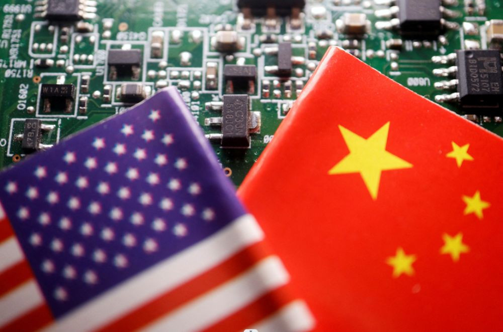
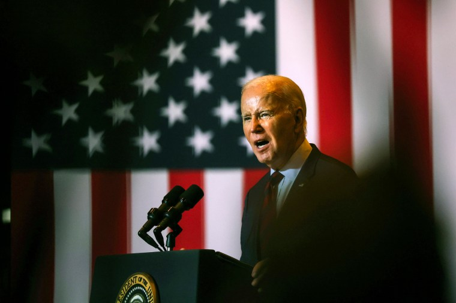

# 外媒：拜登签署“对华投资限制”行政命令，中国驻美使馆发言人回应

【环球网报道】据路透社等媒体9日报道，美国总统拜登于当地时间周三（9日）签署了关于“对华投资限制”的行政命令，该命令将严格限制美国对中国敏感技术领域的投资，并要求美企就其他科技领域的在华投资情况向美政府进行通报。值得注意的是，美方此前已就该行政令多次放风，中方也已明确表达反对立场。

关于该行政命令，路透社在最新报道中称，它授权美国财政部禁止或限制美国在包括半导体和微电子、量子信息技术和人工智能系统三个领域对中国实体的投资。报道称，拜登在给国会的一封信中声称，他宣布国家进入紧急状态，是为应对中国等国家“在军事、情报、监视或网络能力等重要敏感技术和产品方面的进步所带来的威胁”。

_资料图 图源：路透社报道配图_

这种对所谓中国威胁的渲染，在华盛顿已经屡见不鲜。路透社援引知情人士说法称，该行政令预计明年实施，此前将征求多轮公众意见。报道进一步称，尽管美国官员坚称，该行政令旨在解决“最急迫的国家安全风险”，而不是将美中两国高度依赖的经济关系分开，但这一举措仍可能加剧这两个世界上最大经济体之间的紧张关系。

对于拜登9日签署上述行政令，俄卫星通讯社称，中国驻美国使馆发言人刘鹏宇同日晚些时候作出回应，表示非常遗憾。“尽管中方一再表示深切关注，但美方仍继续实施新的投资限制。中方对此非常失望，”刘鹏宇说，“中美经贸关系的本质是互利共赢的。双向投资是双边贸易的重要组成部分。”

 _拜登 资料图 图源：美国全国广播公司_

“美国推进对华投资新限制，中美关系再受考验。”据《纽约时报》9日报道，拜登政府计划在当天推出涉及敏感技术领域的对华投资限制措施，包括量子计算、人工智能和先进半导体等行业，以阻止美元和专业技术向中国转移。这家美媒将白宫的这一行动称为“美国在与中国的经济冲突中为遏制金融流动而采取的首批重要措施之一”，分析人士认为，沟通和执行这项措施将会很困难，美国“商界已经开始反对私人市场政治化”。通信技术专家项立刚9日对《环球时报》记者表示，美国明年就要举行大选，拜登政府在竞选压力之下需要显示对华强硬态度，因此会将打压中国的措施作为拉选票的工具。在这种情况下，华盛顿并不看重这些措施实施后的效果，即便美国企业的利益将受到损害。

**相关报道**

商务部新闻发言人就美发布对外投资审查行政令答记者问

