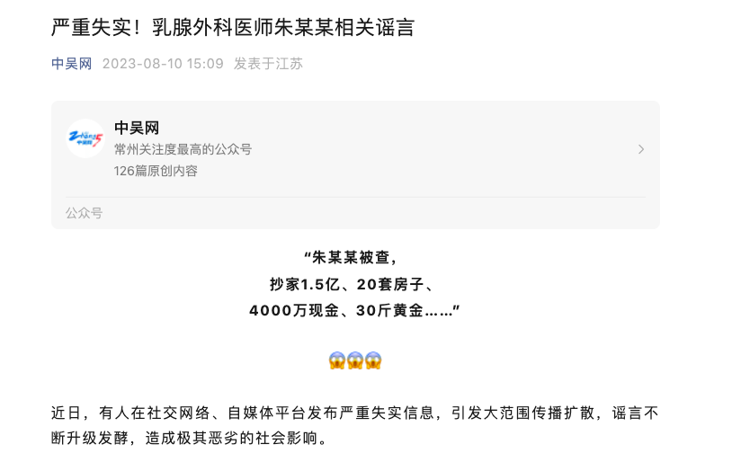
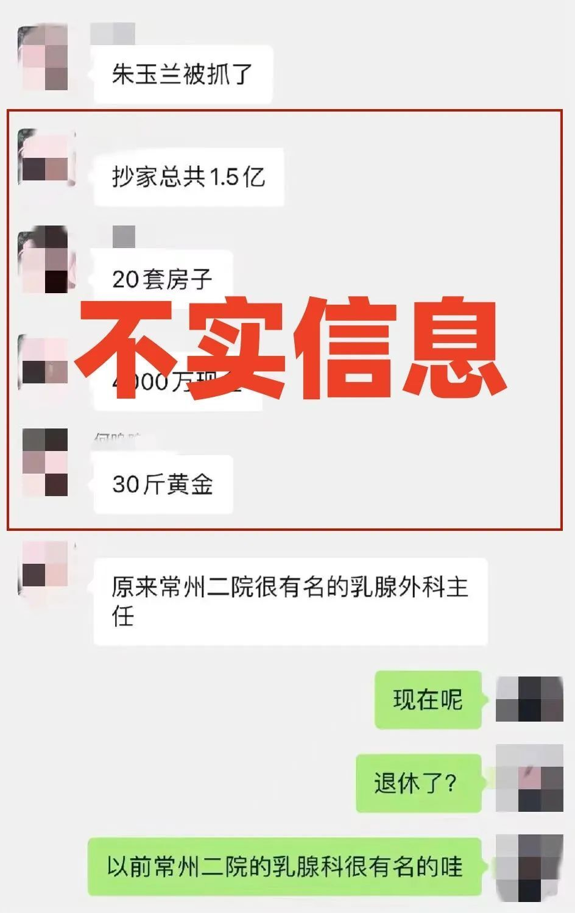

# 常州二医院乳腺医生被抄家1.5亿？当地发文：不实信息，知情人：半年前被留置

红星资本局8月10日消息，近日有消息称，常州市第二人民医院乳腺外科医生朱某兰被查，家中查出“4000万现金、20套房子、30斤黄金”的巨额财产，引发关注。

10日下午，红星资本局致电常州市第二人民医院，对方表示，朱某兰已经于两年前退休，不清楚被查一事。据澎湃新闻报道，常州市卫生健康委员会办公室人员表示，目前朱某兰的情况已“在公安系统的处理之中”，至于是否已立案调查，其称“不清楚，如果有必要，会由公安方面说明情况”。

随后，认证主体为常州广播电视台的公众号“中吴网”发布《严重失实！乳腺外科医师朱某某相关谣言》，其中提到：“近日，有人在社交网络、自媒体平台发布严重失实信息，引发大范围传播扩散，谣言不断升级发酵，造成极其恶劣的社会影响。”

上文也贴出网络截图，将“抄家1.5亿、20套房子”和“朱某某医生的主要收入来源是从医药代理商和患者那里拿回扣和红包”等列为“不实信息”。

而据央广网记者从知情人士处获悉，朱某兰半年前即被有关部门采取留置措施，并非在此轮医疗反腐风暴中被查。另外，网传金额与实际情况有出入。

官网显示，常州市第二人民医院暨南京医科大学附属常州第二人民医院，是三级甲等综合性医院，有城中、阳湖两个院区。据澎湃新闻报道，朱某兰曾是常州市第二人民医院乳腺外科主任，主任医生，硕士生导师，还曾是江苏省乳腺抗癌协会委员和常州市抗癌协会委员。

红星新闻记者 强亚铣

编辑 肖子琦

