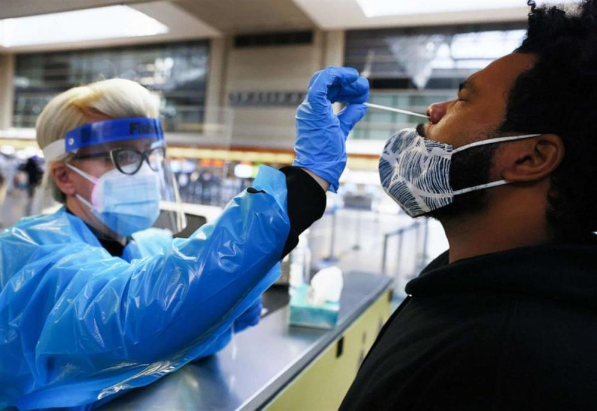

# 新冠毒株EG.5在美流行，一周近万人住院，世卫将其升级为受关注变体

极目新闻记者 宋清影

综合CNN、美国广播公司8月9日报道，根据美国疾病控制与预防中心最新估计，新冠病毒奥密克戎亚变体EG.5成为美国最主要的毒株。在全国范围内，EG.5约占该国新病例的17%，而另一个最常见的毒株XBB.1.16
占病例的16%。

 _2020年12月洛杉矶一男子在接受鼻拭子检测（图源：美国广播公司）_

EG.5是奥密克戎的亚变体，也由XBB.1.9.2菌株突变而来，从4月份起就已经在美国流行。据美国联邦卫生机构称，美国各地的新冠肺炎住院人数不断增加，最近一周住院人数增加了12.5%，达到9056人。

与此同时，根据英国卫生安全局的数据，在英国，EG.5.1变异株占病例的14.55%，使其成为第二常见的毒株。

8月9日，由于EG.5在全球的稳定增长，世界卫生组织将其从不太令人担忧的“受监测变体”类别升级为“受关注变体”。根据世界卫生组织8月3日的情况报告，到目前为止，在45个国家发现的EG.5病例报告，从6月中旬到7月中旬几乎增加了一倍。

美国专家表示，在临床上，EG.5并没有引起与之前的毒株不同或更严重的症状。

“与XBB系列中的先例相比，EG.5基本上具有更多的免疫逃逸功能。”斯克里普斯转化研究所的心脏病专家埃里克·托波尔博士说，“这就是它在世界各地都有立足之地的原因。”

流行病学家指出，创纪录的高温，促使更多人在室内使用空调，而这有助于病毒传播。专家表示，除非有证据表明EG.5或其亚系正在导致更严重的疾病，否则公共卫生官员的建议和指导仍然和之前相同，包括让人们评估风险承受能力、保持警惕并及时了解最新的疫苗接种情况。

（来源：极目新闻）

