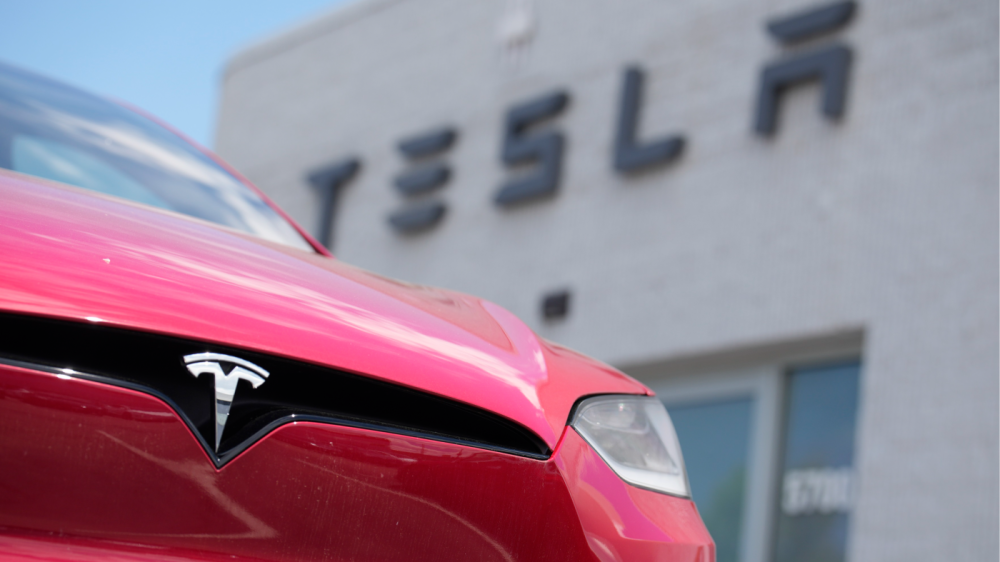

# 特斯拉电池供应链40%依赖中国 被迫自建锂精炼厂降低依赖性

腾讯汽车讯
8月10日消息，国外媒体的一项分析发现，特斯拉电动车电池所用材料的供应商中，近40%是中国公司，这突显出中国在具有重要战略意义的电池领域的强大影响力。

根据对特斯拉供应链的分析，中国是特斯拉电动车所用锂离子电池的最大材料供应商，占“蓄电池”类别61家公司的39%。随着各国收紧监管、增加投资以确保对经济安全至关重要的原材料供应，这些发现具有复杂的影响。

国外媒体利用机器学习算法对财务报表和新闻稿中的公开信息进行分析，发现有13，428家公司被认为向“五级”供应商提供特斯拉电动车生产所需的物品。“五级”供应商是指供应链中的五个环节。在42家从事“有色金属冶炼”的公司中，不包括铝冶炼厂，中国占了40%。在“无机化学”组的102家供应商中，中国公司也占据了33%的最高份额。这些数据显示了特斯拉对中国合作伙伴的严重依赖。

在这项分析中，使用“瓶颈分数”指数来评估特斯拉对主要供应商的依赖程度。该指数以10分制衡量最终产品制造商对特定供应商的依赖程度，10分代表最严重的依赖。被认为是特斯拉重要供应商的中国公司包括锂产品的主要制造商赣锋锂业，其“瓶颈分数”为6.8分；无机化合物的主要生产商联瑞新材得分为7.1；生产钴材料的浙江华友钴业得分为5.7分。截至目前，特斯拉对依赖中国供应商的报道未予置评。

美国公司占特斯拉供应商总数的22%，中国公司占17%。特斯拉在中国供应商中的份额比通用汽车高出4个百分点。目前，特斯拉正在采取措施降低对中国零部件和材料的依赖。“展望未来几年，电动车发展的一个根本瓶颈是电池级锂的可用性，”特斯拉首席执行官埃隆·马斯克（Elon
Musk）在5月初德克萨斯州锂精炼厂的奠基仪式上说。这座投资3.75亿美元的工厂旨在生产足够的电池材料，到2025年能够为100万辆电动车提供电池材料。

美国地质调查局（the U.S. Geological Survey)和国际能源署（International Energy
Agency）的报告显示，智利拥有世界上最大的锂储量，占总储量的36%。智利和澳大利亚合计占全球电动车电池所需金属产量的80%。与此同时，中国是全球最大的锂精炼国，60%的锂精炼都在中国完成。

特斯拉一直致力于提高其锂供应链的弹性。该公司2022年发布的一份报告显示，该公司从美国的Albemarle和Livent以及中国的赣锋锂业等供应商处购买锂。赣锋锂业在2021年同特斯拉签署了一份为期三年的合同，向后者提供电池级锂产品。特斯拉还在2022年与澳大利亚Liontown
Resources签署了一份为期五年的锂供应协议。这些交易将使特斯拉通过直接合同购买超过95%的氢氧化锂，这是制造电动车电池的关键成分。特斯拉还开始投资建设锂精炼厂，进入由中国主导的行业。

今年5月，马斯克突访中国，并与政府官员举行了会谈。在展示他对中国市场承诺的同时，马斯克正在采取精心策划的战略举措来降低风险。电动车制造商显然有兴趣建立集成系统，以确保对经济安全至关重要的材料，涵盖从原材料采购到生产的整个供应链。专家认为，这种方法将有助于电动车制造商确保稳定的材料价格，并提高其成本竞争力。但是沉重的投资负担需要政府和企业合作来分散风险。应该指出的是，特斯拉的电动车，尤其是Model
Y和Model 3，被认为是当今最具有美国制造属性的电动车之一。在Cars.com的2023年美国制造指数中，Model Y位居首位，Model
3位居第二，Model X SUV位居第三，Model S位居第四。（无忌）

