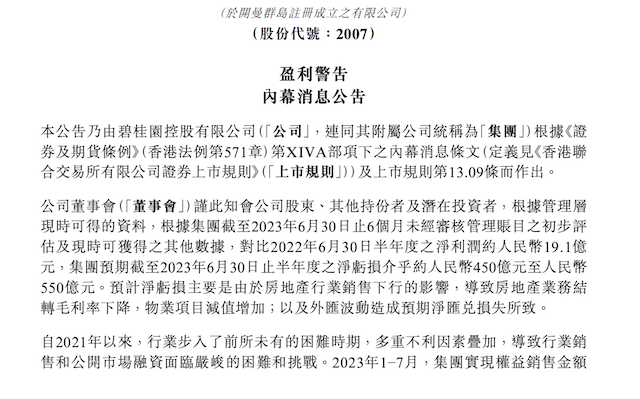

# 碧桂园官宣：遭遇“成立以来最大困难”，上半年预亏450-550亿

8月10日，碧桂园控股（02007.HK）突然发布公告，披露公司上半年预计出现较大亏损，未经审计的亏损额度大约介乎约450亿元至550亿元（人民币，下同）。导致亏损原因主要是由于房地产行业销售下行的影响，业务结转毛利率下降，物业项目减值增加，以及外汇波动造成预期净汇兑损失所致。

同时，碧桂园还透露，当下公司遇到了自成立以来最大的困难，受近期销售额与再融资环境持续恶化的影响，账面可动用资金持续减少，出现了阶段性的流动压力。碧桂园表示，“面对行业整体极端困难的局面，公司上下一心，千方百计开展自救，但市场整体尚未回暖，行业绝对规模的下降以及资本市场信心修复均尚需时间，企业整体经营压力有增无减”。

对于经营亏损和流动性困难，碧桂园管理层公开致歉并反省，称虽然对本轮市场调整周期有预判，但对市场下行的深度、烈度和持续度估计不足，未能及早做出更有力度的应对措施，未能洞见房地产市场供求关系已发生重大变化，对三四线及更低线城市投资比例过大、负债率压降速度不够等潜在风险的认识不够深刻、化解行动不够及时有力。

目前，碧桂园已成立由董事会主席任组长的专项工作小组，将工作重心聚焦于“保交付”、化解流动性压力、保障经营有序三个方面，尽快渡过难关。

数据显示，2023年1-7月，碧桂园实现权益销售金额人民币1408亿元，同比下降35%，较2021年下降61%；7月单月实现权益销售金额人民币121亿元，连续第四个月环比下降，同比下降60%，较2021年下降78%。

碧桂园表示，自2021年以来，房地产行业步入了前所未有的困难时期，多重不利因素叠加，导致行业销售和公开市场融资面临严峻的困难和挑战。

今年第一季度，全国多城楼市在经历了短暂回暖后快速下滑，尤其5月份以来的萎缩程度超出业内预期。7月份，百强房企实现销售操盘金额3504.3亿元，环比下降33.5%，同比亦大降33.1%，降幅较上月进一步扩大。

目前，碧桂园虽然没有公开违约，但已陷入流动性困难局面，公司表示接下来会努力化债，与债权人保持沟通，采取各种债务管理措施，以保障本公司的长远发展，并为债权人保存价值、维护利益。

与此同时，还将全力保交付。2022年该公司交楼量70万套，今年上半年交楼27.8万套，均为行业第一。下半年，即便公司面临着流动性压力，但仍将压实主体责任，保交付、保民生，实现今年交付量与去年持平。

碧桂园还披露，截至2022年底，公司净资产约人民币3096亿元，总权益可售资源人民币12083亿元（其中已获取权益可售资源人民币9555亿元）。接下来将尽最大努力做好销售，维持公司正常运转，并努力盘活酒店、写字楼、商铺等沉淀资产，同时加强内部管控，进一步精简组织、减少行政管理费用开支，改善经营效益，更好保障供应商、合作方等各利益相关方的权益。

在这轮房地产行业下行的过程中，许多开发商在正式对外宣布流动性困难以前，都先经历了一轮舆论风波。碧桂园亦如是。

7月下旬起，碧桂园境内多笔公司债出现下跌，期间伴随着包括佛山市副市长带工作组进驻、“大小杨”离境、毕马威入驻等一系列传闻，该公司皆予以否认澄清。

但资本市场上，碧桂园股债遭遇双杀，连番下挫。市场如此风声鹤唳，原因在于对碧桂园近期偿债能力感到担忧。企业预警通显示，截至8月上旬，碧桂园存续的境内债券共19只，其中8月10日有一笔13.6亿元的公司债到期；9月2日有一笔58.3亿元的私募债到期，债券剩余为39.04亿；11月20日有一笔价值30亿元的公司债到期，债券剩余价值为9.93亿元。另外，该集团旗下其他融资主体也有少量债务将于未来一个季度内到期。

海外债方面，根据wind数据，截至目前，碧桂园的海外存续债券共20只，总额约171亿美元，2023年年内到期的海外债券共一笔，该笔海外债的规模为4亿美元，到期日为2023年10月19日。

据悉，碧桂园已在8月7日偿还了10日到期的13.6亿公司债的全部尾款，但当日需要支付的两笔美元票据的票息却未付息。鉴于这两笔美元票据仍有30天付息宽限期，至此还不能评判碧桂园已经违约。

