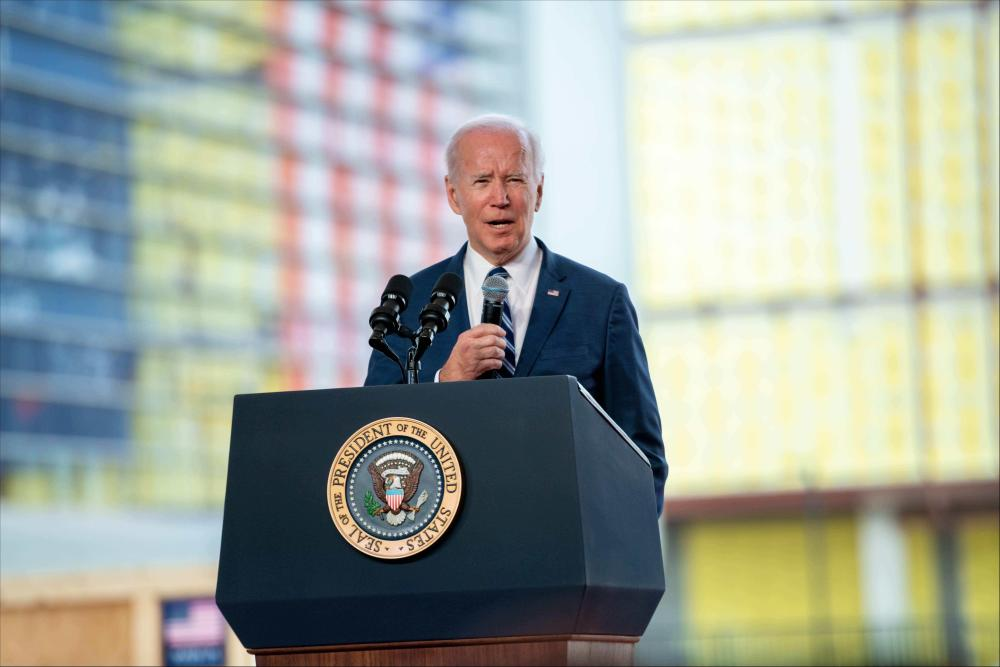
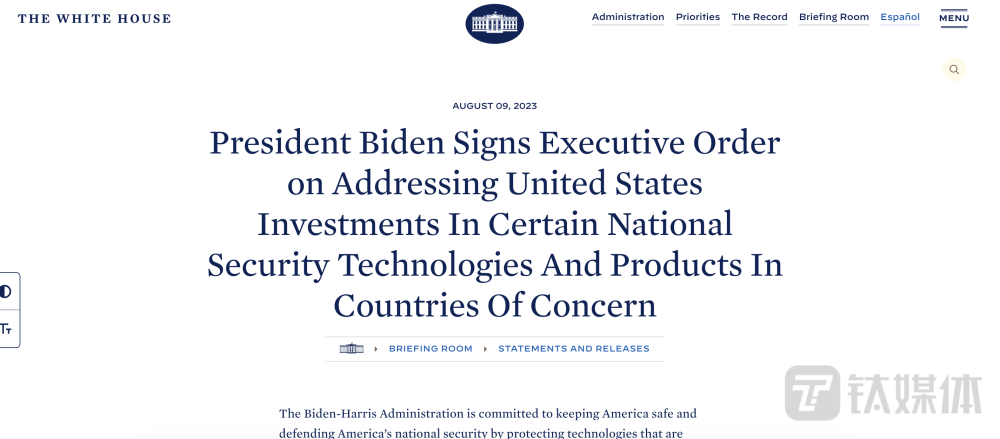

# 美国公布对中国投资限制令，锁定芯片、AI 和量子科技三个领域

_美国总统拜登2022年12月在台积电亚利桑那州厂上演讲（来源：钛媒体/台积公司）_

**钛媒体App 8月10日消息** ，美国白宫官方网站今晨公布，美国总统拜登（Joe
Biden）签署了关于解决美国在相关国家对某些国家安全技术和产品的投资问题的行政命令（E.O.），授权美国财政部长监管美国对受关注国家的某些投资。某些国家安全领域涉及半导体与微电子、量子信息技术、人工智能三个领域。行政令附件中重点提到中国。

白宫称，该计划以“小院子、高围栏”方式补充美国现有的出口管制和入境筛查工具，以解决有关国家推进此类敏感技术所构成的国家安全威胁。具体来说，它将禁止对从事与这些构成最严重国家安全风险的技术领域相关的特定活动的实体进行某些投资，并要求对其他敏感投资进行通报。

同时，美国财政部发布拟议规则制定预先通知（ANPRM），详细说明该计划范围，有关ANPRM的书面意见45天内在美国财政部网站公布，稍晚些将发布法规草案。据称，经过多轮评议后，该命令预计将于明年实施。

白宫强调，这是拜登在与数百名利益相关者、行业成员以及盟友和合作伙伴进行广泛、彻底的磋商后签署的这项行政命令。美国政府将继续进行这些活动通知和评论，征求更多公众反馈，以便在规则生效前做出任何必要调整。

行政命令公布后，中方表示反对和严重关切。中国商务部新闻发言人表示，美方限制本国企业对外投资，打着“去风险”的幌子在投资领域搞“脱钩断链”，严重背离美方一贯提倡的市场经济和公平竞争原则，影响企业正常经营决策，破坏国际经贸秩序，严重扰乱全球产业链供应链安全，中方对此表示严重关切，将保留采取措施的权利。希望美方尊重市场经济规律和公平竞争原则，不要人为阻碍全球经贸交流与合作，不要为世界经济恢复增长设置障碍。

**据悉，**
自2018年8月时任美国总统特朗普签署“2019财年国防授权法案”，强化了海外投资委员会（CFIUS）审查海外投资的能力，拜登上台后美国对更多中国企业实施出口管制。此前，中国驻美大使谢锋表示，美方迄今将1300多个中国企业和个人列入“实体清单”中。

去年10月，美国商务部工业与安全局(BIS)公开了一系列对中国先进计算和半导体制造物项实施出口管制的新规则，分阶段于2022年10月7日，12日和21日生效。BIS在先进计算芯片和半导体制造物项的两个关键领域，限制美国物项出口、扩大长臂管辖范围和控制“美国人”从业等措施，限制中国获得先进芯片、超级计算机以及制造能力。

今年5月，央视网报道称，拜登政府计划七国集团领导人广岛峰会前后签署一项行政令，严格限制美国企业对中国部分高科技产业投资，其中可能涉及人工智能、半导体和量子技术领域。5月31日美国国会听证会上，美国财政部投资安全助理部长保罗·罗森（Paul
Rosen）证实，“我们正在考虑一个计划，限制美国的美元投资的流动。”随后美媒报道限令更多细节。

美东时间7月25日，美国参议院讨论新一年的“国防授权法案”（NDAA），就其中一项对华投资审查的修正案——“对外投资透明度法”进行了投票，最终该修正案以91：6获参议院通过。

该法案要求，生效90天后美国实体如果对中国、俄罗斯、伊朗和朝鲜等国的敏感技术进行投资，须不晚于投资前14天，以及在交易完成后14天内，申报给美国财政部。美国财政部将建立机制，寻找没有申报的交易。此外，美国政府还要与盟国和伙伴进行协调，在伙伴国家也建立对外投资审查和申报机制。须申报的投资类型包括收购、短期或长期债务的权益、子公司的设立、合资企业等，包括通过业务合作、董事会代表或提供商业服务进行技术转让。须申报的相关产业涉及先进半导体和微电子、人工智能、量子信息技术、特超音速、卫星通信和两用网络激光扫描系统。

**如今，拜登政府签署在半导体、AI
和量子技术三个领域对中国的投资限制行政命令。根据白宫官网公布拜登签署的条款内容，钛媒体App编辑简要梳理出其中十个关键信息：**

**通知和禁止交易：**
美国财政部长应与其他相关机构共同制定规定，要求美国人向财政部通报与被覆盖的外国人有关的某些交易（通知交易）并禁止与被覆盖的外国人进行某些其他交易（禁止交易）。

**财政部长的职责** ：财政部长负责与国会和公众沟通、与其他政府机构合作咨询，研究此命令的影响，并对违规行为进行调查。

**项目发展** ：一年后，财政部长应评估是否需要修改相关的规定，并定期检查规定的有效性。

**向总统和国会报告** ：财政部长应向总统报告此命令执行的效果以及任何推荐的修改。同时，财政部长有权向国会提交关于此命令的报告。

**被覆盖的国家安全技术和产品：** 半导体和微电子、量子信息技术和人工智能领域的敏感技术和产品。

**美国政府方向** ：本命令不禁止美国政府官员、受助人或承包商进行的正式业务交易。

**保密性** ：制定的规定应确保按此命令提交的信息或文档材料的保密性。

**其他通知和禁令**
：禁止任何旨在违反此命令的阴谋和行为。禁止为避免本命令或根据本命令发布的任何规定而进行的任何行动。此外，财政部的规定可能要求美国人通报由这种美国人控制的外国实体的任何交易，如果由美国人进行这种交易，则该交易将是一个通知交易。

**定义**
：此部分为“关心国家”、“涵盖的外国人”、以及“涵盖的国家安全技术和产品”等术语提供了定义。其中，“关注国家”是指在附件中列出的国家或地区，总统已确定这些国家或地区正在进行全面、长期的战略；“被覆盖的外国人”是指从事与一个或多个被覆盖的国家安全技术和产品有关的活动的关心国家的人；产品覆盖半导体和微电子、量子信息技术和人工智能领域的敏感技术和产品。

**一般条款** ：确定了财政部长的权利和职责，并说明了该命令的适用范围。

值得注意的是，该命令限制与特定外国实体之间的某些交易，尤其是涉及被定义为“被覆盖的国家安全技术和产品”交易。而条款中，有六处提及“投资”（Investments），有26处提及“产品”（product），多次提到“应酌情”，因此该行政命令更多体现交易措施，相关限制投资条款比之前报道的更谨慎。

多位半导体投资人日前对钛媒体App表示，美国投资限制措施对于国内私募股权、风险投资领域的交易有一定影响，尤其对美元基金交易的资金流向LP（有限合伙人）将有更多的要求。同时，该法案将对芯片产业链有很大影响，因为国内芯片制造端五成以上依赖外资和海外巨头企业，是否利好基金投资国产化产品还有待观察。

当下，国内风投市场募投退三个环节处于下行周期。公开数据显示，2023年第一季度，中国股权投资市场新募集基金数量和金额分别为1601支、3532.12亿元人民币，同比下降7.6%、33%，投资案例数同比下降44.2%，投资金额为1300.3亿元，同比下降49.8%，退出案例总量共521笔，同比下滑51.5%，各类退出交易数量均有所减少。

一位美元基金投资人对钛媒体App表示，他非常担心这种措施是否会持续扩大，团队已开始逐步暂停高技术领域投资，目前重心在投后部分。

多位投资行业人士也向钛媒体App表示，目前其内部重点在 AI 非核心部分、智能制造、生物医疗、新能源等没有涉及美国投资审查的赛道，项目退出为优先事项。

根据美国财政部官网显示，拜登签署的这份美国对外投资审查行政令，详细措施将会在45天内公布，最终法案预计将于明年起实施。（本文首发钛媒体App，作者｜林志佳）

**相关阅读：**

商务部新闻发言人就美发布对外投资审查行政令答记者问

外交部发言人就美国总统拜登签署对华投资限制行政令答记者问

