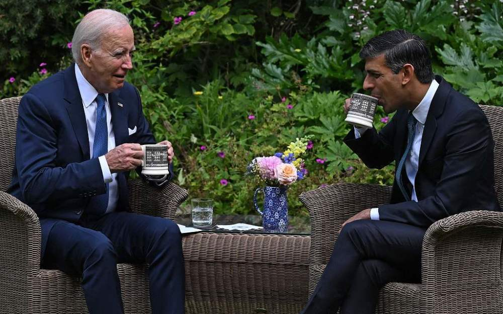

# 跟随美国？英媒曝英国正考虑对华科技投资限制，但苏纳克“更谨慎”

（观察者网讯）在美国总统拜登签署行政令限制对华科技投资后，英国《金融时报》10日报道称，苏纳克政府正考虑是否效仿美国做法，但态度“更为谨慎”。

当地时间9日，拜登以“国家安全”之名签令设立对外投资审查机制，限制美国主体投资中国半导体和微电子、量子信息技术和人工智能（AI）领域，并要求美企就其他科技领域的在华投资情况向美政府进行通报。

对此，《金融时报》10日称，英国政府发言人回应表示：“这项关于对外投资的行政命令明确了美方的做法，这很重要。英国将密切关注这些新措施，同时也将继续评估一些投资所附带的潜在国家安全风险。”

报道解读称，这表明面对这种“新安全制度”，英国首相苏纳克的态度“更为谨慎”，在决定是否效仿美国之前，苏纳克政府正在咨询本国商界和金融界的意见。

《金融时报》进一步声称，英国政府对中国的总体态度根植于“一种冷静的愿望”，即尽可能与中国这个亚洲超级大国做生意，除非涉及国家安全问题。路透社则提到，英国最近一直在寻求稳定对华关系。

_当地时间7月10日，苏纳克和拜登在唐宁街10号的花园会面。图片来源：视觉中国_

彭博社10日分析称，当下的一个关键问题是包括七国集团（G7）国家在内的盟友是否会效仿美国的做法。报道称，过去一年，美国政府已向盟友和合作伙伴通报了该行政令，并认为必须与他们协调执行，以避免美国投资减少的情况再次发生。不过，目前为止尚无人跟进，欧盟和其他国家表示，严格的限制措施可能会损害其经济。

此前，英国外交发展大臣克莱沃利在4月的年度外交政策演讲中一边说“孤立中国将是一个错误”，英国需要在气候变化、预防流行病、经济稳定和防止核扩散等领域与中国进行接触，一边继续渲染人权、涉台、涉疆等议题，宣称英国将保护自己国家安全利益。

今年6月初，苏纳克任内首次正式访美，期间没有签署保守党承诺的“美英自由贸易协定”，却共同发表了《大西洋宣言》，宣布在人工智能、清洁能源、关键矿产方面开展合作，巩固两国的安全联盟关系，以应对所谓的“中俄威胁”、气候变化等新挑战。

英国《卫报》当时评论称，《大西洋宣言》标志着英国从“不受约束的自由贸易”转向与美国间的保护主义。有分析认为，随着英国“脱欧”后影响力削弱，对于美国的利用价值也大大降低，英国计划在战略目标上给美国更多的策应和配合，以此从美国换取一些好处，这可能会成为今后一段时期的常态。

商务部发布的《中国外资统计公报2022》显示，2021年英国在中国新设企业612家，在所有欧洲国家中位列第一位，实际对中国投资金额为12亿美元，仅逊于同期德国的16.8亿美元。公报还显示，截至2021年底，英国在中国共设立企业11199家，累计投资流量为275亿美元，均排在德国之后，名列欧洲第二。此外，商务部日前发布的2023年前5个月中国实际使用外资数据显示，从来源地看，英国实际对华投资同比增长179.2%。

对于拜登签署对华投资限制行政令一事，中国外交部发言人10日表示，中方对美方执意出台对华投资限制措施强烈不满、坚决反对，已向美方提出严正交涉。外交部发言人说，美方打着国家安全的幌子，限制美国企业对华投资，大搞泛安全化、泛政治化，其真实目的是剥夺中国发展权利，维护一己霸权私利，是赤裸裸的经济胁迫和科技霸凌。美方此举严重违反市场经济和公平竞争原则，严重破坏国际经贸秩序，严重扰乱全球产业链供应链稳定，严重损害中美两国乃至世界工商界利益，其实质是搞逆全球化、去中国化。

外交部发言人强调，中方敦促美方切实履行拜登总统无意对华“脱钩”、无意阻挠中国经济发展的承诺，停止将经贸科技问题政治化、工具化、武器化，立即撤销错误决定，取消对华投资限制，为中美经贸合作创造良好环境。中方将密切关注有关动向，坚决维护自身权益。

**本文系观察者网独家稿件，未经授权，不得转载。**

