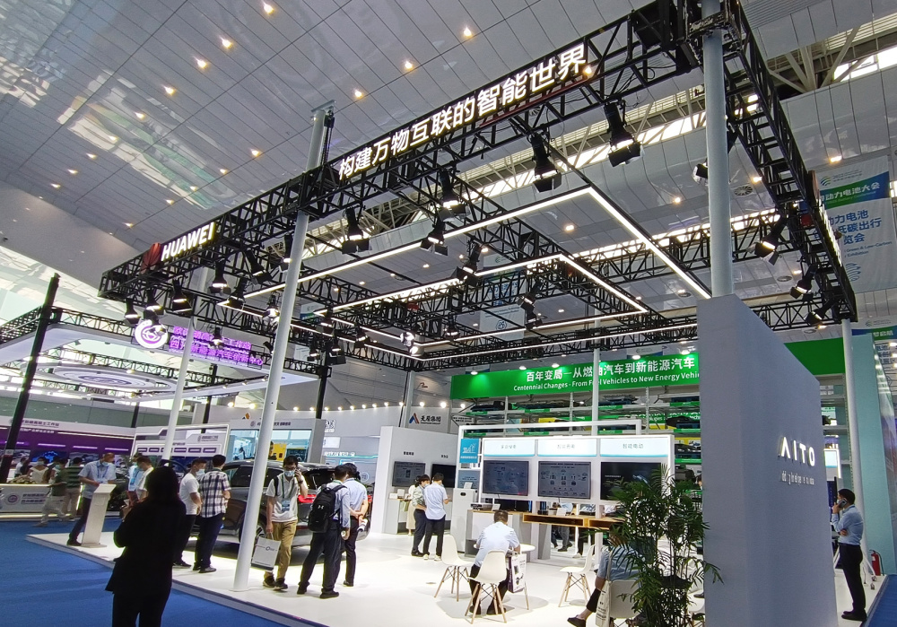
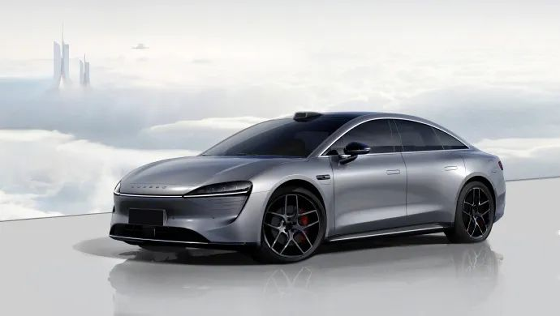

# 3109亿元！华为公布今年上半年“成绩单”，辟谣车BU独立传闻

每经编辑：李泽东

8月11日，华为发布了2023年上半年经营业绩。

具体到业务板块方面，ICT基础设施业务收入为1672亿元人民币，终端业务收入为1035亿元人民币，云计算业务收入为241亿元人民币，数字能源业务收入为242亿元人民币，智能汽车解决方案业务收入为10亿元。

**对于经营成绩，华为方面表示，整体经营稳健，结果符合预期。**

2022年上半年，华为销售收入3016亿元人民币，净利润率5.0%，上半年净利润约为150.8亿元人民币。对比来看，今年上半年，华为营收略有增加，但净利润率提高了10个百分点。

其他值得注意的是，2022年上半年，华为终端业务收入为1013亿元人民币，同比下滑25.4%。但今年上半年，华为终端业务收入停止下滑趋势，实现同比微增2.17%。

**华为轮值董事长孟晚舟表示：“感谢客户、伙伴的支持及全体员工的团结奋斗。华为抓住数字化、智能化和低碳化的发展趋势，在根技术上压强投入，聚焦为客户和伙伴创造价值。2023年上半年，ICT基础设施业务保持稳健，终端收入实现增长，数字能源和云业务实现良好增长，智能汽车增量部件竞争力持续提升。”**

据了解，7月底，国内第二季度智能手机销量报告出炉，IDC数据显示，华为已不再被归入“others”，报告显示，OPPO以17.7%的市场份额在第二季度保持国内手机市场第一；紧随其后的是vivo，荣耀和苹果分别位列第三、第四；华为和小米同时位列第五。

IDC称，随着新品发布节奏的正常，华为出货量继续恢复，二季度在TOP厂商中同比增幅最大（76.1%）。虽然依然受到外部限制，但
**华为在600美元以上高端市场依然保持在第二位。**

据了解，自2019年以来，华为终端经历了一场漫长的“寒冬”。在产品不能正常交付时，华为在国内智能手机市场的份额从2020年第二季度的46%一路下跌至个位数。不过，今年3月，华为在春季新品发布会上同时推出了旗舰新机P60系列、折叠屏手机Mate
X3等多款产品，国内市场份额迅速回归。

_每日经济新闻 资料图_

此外，值得关注的是，“不造车”的华为，近日又打出一张新牌。

8月7日，华为常务董事、终端BG CEO、智能汽车解决方案BU
CEO余承东在个人社交平台发布了华为智选首款纯电轿跑车的官图，并表示，新车将成为首个搭载鸿蒙4系统的车型。

后据媒体了解，该车的合作方是奇瑞汽车，商标命名为“LUXEED”，中文名为“智界”，预计配备华为ADS 2.0智能驾驶系统，于今年三季度亮相。

 _华为智选车业务首款纯电轿跑。图片来源：余承东微博_

据了解，此次奇瑞汽车和华为的合作，属于智选车模式。目前，华为智选车模式合作车企还有3家：包括赛力斯、江淮汽车和北汽蓝谷。

在今年4月举办的2023中国电动汽车百人会论坛上，余承东曾透露，随着奇瑞、北汽和江淮的加入，华为将进行统一管理。“如果每家车企都采用不同的品牌，我们营销、服务、零售会很复杂，所以希望采用共同的元素和品牌。”余承东说。

华为云方面，7月7日，在华为开发者大会2023（Cloud）上，华为常务董事、华为云CEO张平安发布了盘古大模型3.0。据他介绍，盘古大模型3.0是一个面向行业的大模型系列，包括“5+N+X”三层架构。

张平安分别介绍了盘古大模型在金融、金融、制造、医药研发、煤矿、铁路等诸多行业发挥的价值。

例如，在煤矿领域，盘古矿山大模型已经在全国8个矿井规模使用，一个大模型可以覆盖煤矿的采、掘、机、运、通、洗选等业务流程下的1000多个细分场景，让更多的煤矿工人能够在地面上作业，减少安全事故；在气象领域，原来预测一个台风未来10天的路径，需要在3000台服务器的高性能计算机集群上花费5小时进行仿真。现在基于预训练的盘古气象大模型，10秒内就可以获得更精确的预测结果。

张平安表示，华为的盘古大模型不会写诗，只会做事。它要帮助各行各业，在各个领域都要让AI来赋予它们价值。比如金融、矿山、政务，有很多工作小组都派下去，“我们一直坚持的方向就是‘AI
for Industries’”。

每日经济新闻综合华为官网、每日经济新闻（记者 王晶）、公开资料

