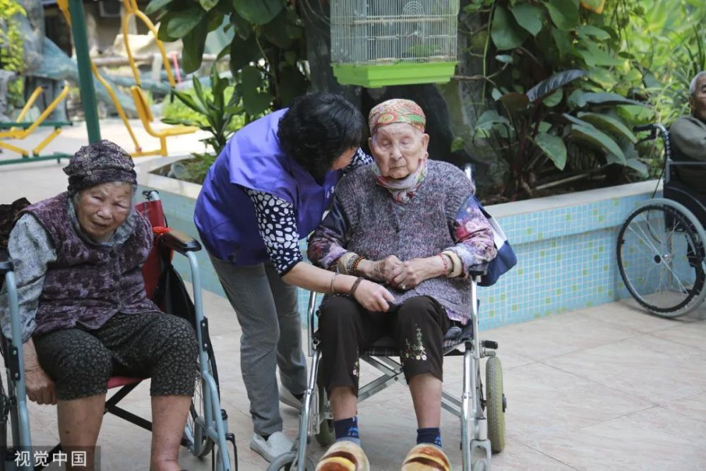
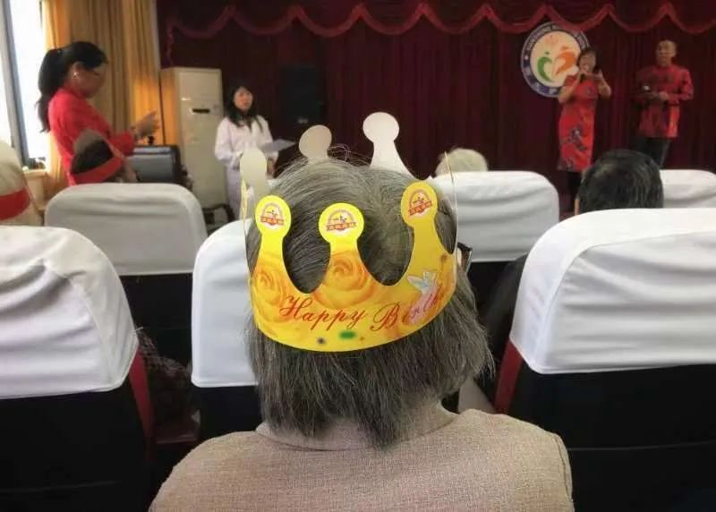
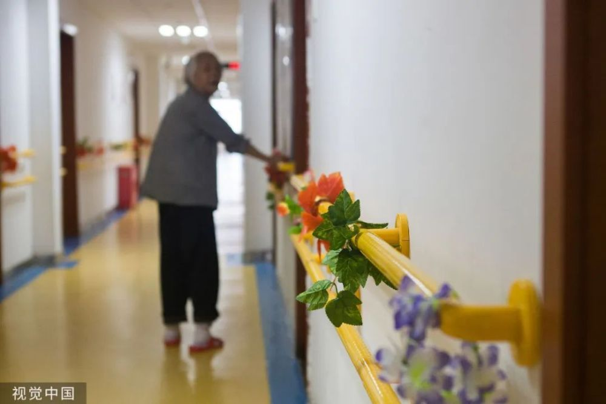
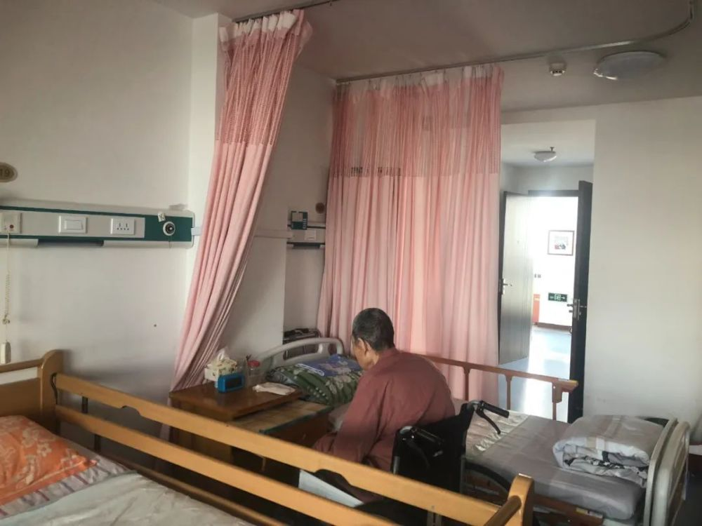
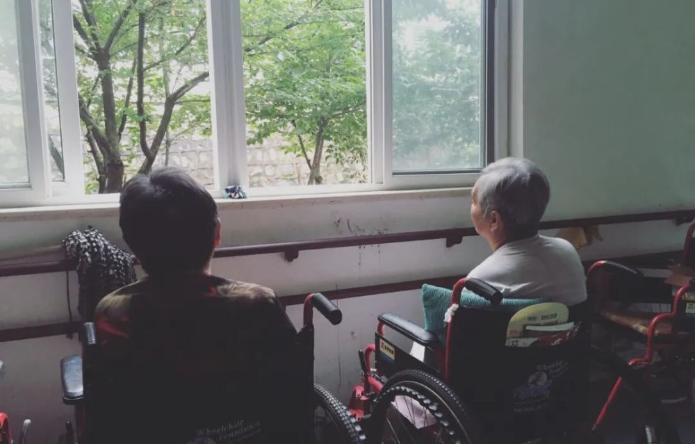
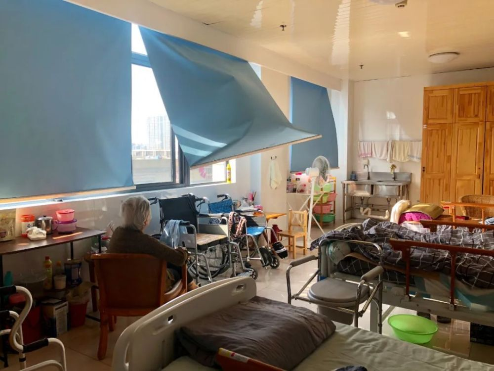

# 60岁的她们，还在养老院当护工

“这种年纪还能去做什么？”

这是吴心越在养老院里最常听到的话。吴心越是东南大学的博士后，研究方向为老龄化与照料劳动。多年前，她的家人向爷爷提出去养老院看看的建议，遭到爷爷的强烈抗拒，爷爷表示“死都要死在家里”，而奶奶也认为护理员经常虐待老人，还有老人不堪虐待去小树林自杀。

带着对这些“都市传说”的好奇，吴心越进入江苏省南部一个县级市“永安”（化名）做田野调查。作为全国率先推行计划生育政策的城市之一，永安在1982年就已经进入老龄化社会，比全国提前18年。截至2019年末，全市60周岁以上老年人口33.45万，占户籍人口的31.34%。

在养老院，吴心越没有看到“恶人”虐待老人的场景，而是一群老人在照顾另一群老人，甚至有些护理员本身就需要照顾。

更确切地说，是来自农村的中老年女性在照顾城市的老人。在吴心越做田野的养老院里，被照顾的老人绝大多数来自城市，而护理员几乎都是女性，并且大多数来自农村，年龄集中在50到60岁。

从种地到工厂流水线再到养老院，这些女性护理员始终被困在劳动力市场的底层，面临有限的工作选择。“这种年纪还能去做什么”，透露的正是她们对从事护理员工作的无奈。

这不仅是永安的现状，也是全国普遍的情况。随着中国老龄化程度的加深，机构的养老照护成为一种刚需，与之伴随的却是专业护理人员的短缺。

国家卫健委、老龄办和民政局的数据显示，全国60岁及以上老年人口达2.49亿，失能、半失能老人已经超过4063万，而养老护理员只有32.2万人。在巨大的用工短缺之下，老人照顾老人的情况越来越普遍。

然而，在承担着高强度照顾劳动的同时，这群中老年女性护工却面临着长期的被忽视、社会污名和缺乏保障的晚年。为了维持生活，有一位68岁的阿姨，年老体弱，走路佝偻，依然做着这份大家眼里的“肮脏工作”。颐养天年的退休生活，对她来说根本遥不可及。

这群中老年女性究竟是如何成为养老护理员的？她们为什么不退休？为什么要做这份工作？她们如何照护老人？她们面临着哪些困境？我们和吴心越聊了聊。

_广东东莞， 女性护理员和她照顾的老人_

以下内容来自吴心越的讲述及研究论文：

2016年，我在永安的两家养老院做田野调查。“上班”第一天，老人们看到我纷纷问道：这是不是新来的阿姨？

在养老院，无论是老人、家属，还是护理员自己，彼此之间都用“阿姨”这一非常笼统的称谓，一方面表明这一职业的专业性尚未建立，另一方面也反映了养老护理员群体的性别和年龄结构：在我做田野的养老院里，护理员几乎都是女性，年龄集中在50到60岁，最年轻的40多岁，最年长的68岁。

第一次看到68岁的邹阿姨的时候，她身上绑着那种非常宽的护腰，腿上绑着护膝，行动也没那么利索，看起来很需要休息，甚至需要别人照顾，所以我一开始还以为她就是住在养老院里面的一个老人。

后来我才知道，她已经做了6年的看护工作。但她没有和机构正式签劳动合同，她属于家属雇佣的一对一的看护，一开始在老人家里做，后来跟着照顾的老人进了养老院，跟老人住在同一个房间，24小时看护。

因为工作上可能会有一些危险，养老院其实不是特别想要65岁以上的护理员，但由于难以招到合适的人选，事实上不少将近70岁的女性也仍然留在养老院工作。养老院的院长总结，现在都是老人在养老人。

更确切地说，是农村的老人在照顾城市的老人。养老院里的护理员绝大多数来自农村，但养老院的照护通常是中产阶级家庭才能负担的选项。

_重阳节，在养老院过生日的老人（受访者供图）_

永安市各家养老院的收费从每个月2000到4000元不等，一二线城市的价位则普遍更高。我在几个养老院中随机访问了53位老人，其中企业退休职工人数最多，占六成；国家公务员和事业单位退休人员占三分之一，农村户籍的老人则不到一成。

护理员沈阿姨曾对我说，养老院的老人都算幸福的，乡下人活到哪里是哪里，瘫在床上一段时间就死了。她自己的母亲八十多岁，行动不便，一个人独居在乡下，但每月750元的失地补贴根本不够支付永安市区任何一家养老院的费用。

这也是步入老年的护理员阿姨们继续工作的原因。在养老院的时候，一开始我都会问她们你有没有退休，她们基本上都会纠正我，说我们乡下人没有退休。

这句话有两层含义，第一，农村老年人没有退休金；第二，对她们来说不存在像城里人一样到了50岁或者60岁要退休的概念，她们能做的话一定会继续做下去，像很多报道里面讲的那些高龄的农民工一样，会做到做不动为止。

这个其实也不是说她们经济上真的有到贫困或者说赤贫的地步，她们这样背后的情感驱动其实是对未来的焦虑和不安全感。

一方面，很多农村的老人没有养老金，有的有新农合，但一个月也就两三百块钱。还有的老人会有失地的补贴，或者把地转给种田大户来种的话，也会有一点收入。但收入加起来还是比较微薄，她们对自己的老年就会很没有安全感。

另一方面，没有护理员会指望小孩给自己养老。永安市五六十岁的这一辈农村女性大多也只有一个孩子，她们对自己小孩的付出是非常多的，包括帮小孩买房买车，帮他们带孩子，但她们没有期待我的小孩以后怎么样来孝敬我。

这比较像阎云翔说的“下行式家庭主义”，父母对子女甚至孙辈的照顾都是理所当然，但逆向的反馈已经越来越薄弱。尤其在农村家庭中，有限的资源更应该投注于子辈、孙辈，那或许是整个家庭向上流动的唯一希望，而丧失了劳动能力的、“赚不到铜钿”的老人往往成为一家人的拖累与负担。

像68岁的邹阿姨，她早年丧偶，在厂里做工的两个女儿也都收入微薄，因此只能通过继续参加劳动维持经济自足，有时甚至还要贴补外孙。即便年老体弱，且常常受到老人家属的责备，邹阿姨还是坚持做看护工作。

后来她照顾的老人去世了，她就回老家了，但是我听养老院里面的其他护理员阿姨说，邹阿姨回老家以后还是打电话来问能不能帮她介绍新的老人让她去做看护。她只要能做的话，还是愿意继续出来赚一份钱。

我第一次去邹阿姨的房间聊天，一进门就闻到一股浓重的药味，邹阿姨解释那是止痛药膏的味道。因为每天要把照顾的老人从床上抱起来，她腰部受伤了。她绑腰带，也是这个原因。

邹阿姨来自农村，早年种过田，之后又在内衣厂从事服装加工，直到年纪大了腿脚站不动才经人介绍到城里做护理员。她一直强调自己做这个工作，就是看在钱的份上，她过去吃了非常多苦，所以觉得照顾老人这种苦她怎么可能吃不了。她对我说，“我这种脚，痛到抽搐，我都还在做。我们老了，弄不到铜钿啊。”

和邹阿姨一样，很多护理员阿姨会反复强调“这种年纪还能去做什么”，“我们这种年纪正尴尬”，对从事护理员工作有一种无奈的“甘愿”，甚至对照顾工作充满抱怨。还有相当多的护理员觉得从事这份工作“没有面子”，在亲友面前难以启齿。

_吉林一家养老院，女性护工正在照料老人_

的确，即便从照料行业的内部分化来看，老年照料也位于当前照料行业的底层，养老护理员和月嫂、育儿嫂在薪资待遇、社会地位上都存在明显的层级分化。

首先很直观的，她们的薪资待遇差非常多，月嫂的话月薪肯定要一万以上，育儿嫂也要八千左右，而养老护理员的薪水只有她们的一半甚至更低。

另外从社会地位来讲，社会对月嫂和育儿嫂职业化想象的程度越来越高，现在很多育儿嫂都有各种各样的专业证照，但大家对养老护理这个行业还是有很多的偏见和歧视，对它的想象就是端屎端尿，伺候人，很脏。

既然如此，这些中老年女性为何会进入这一行业，从事这份工作呢？即使她们不能退休，但就没有更好的选择了吗？

我的田野调查发现，护理员阿姨的劳动生涯普遍呈现出从农业生产、工厂劳动再到服务业的转变，但她们始终被困在劳动力市场的底层，从事高度性别化的工作，工作并未带来专业技能的积累和自我的发展。

_北京一家养老院，老人在楼里散步_

基本上六十岁以上的护理员，一开始在农村都有种田或者养殖的经历。20世纪80年代私营经济开始发展的时候，她们会进一些小的工厂打工。永安是全国重要的纺织服装集群基地，有着化纤、纺织、印染、服装加工等完整的产业链，所以很多护理员都在纺织厂、印染厂之类的工厂打过工。

但在工厂，男性会被分派如机修、配料等有一定技术含量的工作，而女性则大多从事可计量的简单重复劳动，既无法得到职业技能的提升，也难以获得自我发展的机会。

20世纪90年代中后期，乡镇企业的效益普遍下滑，大量国营棉纺织厂面临转制或倒闭，第一批失业者便是在其中从事基层车间劳动的女工。护理员密阿姨就是在那个时候被以买断工龄的形式解除合同，离开了国营棉纺织厂，后来辗转多家大型超市担任商品促销员，最后来了养老院做护理员。

另一方面，工厂流水线基本上是重复的非常机械化的身体劳动，对于身体的损耗非常大。尤其是做夜班的时候非常苦，有的阿姨说凌晨三四点的时候，她整个人像“瘟鸡”一样，一点精神都没有。基本上50岁左右，她们的身体就没有办法支撑这种高强度的工作了，她们就会离开工厂。

这时候，她们已经在社会底层的职业轨道上消磨了自己大半生的岁月，既没有技能、知识或资历的持续累积，又处于年龄、性别、阶层的多重劣势位置，只能继续被困于劳动力市场的底层，面临有限的工作选择。

她们就会去做一些门槛比较低的服务业，比如饭店服务员、洗碗工、保洁员、食堂切配等，几乎都是枯燥、繁重、肮脏的身体劳动。在这些部门中，老板几乎不会帮员工缴纳任何社会保险，而且也不太稳定，她们随时可能面临失业的危险。

所以她们听到有熟人介绍养老院的工作，就觉得一方面照顾工作没有一个很标准化的考量，有很大的弹性操作空间，工作节奏也相对灵活自主，完成任务以后还能在房间跟人聊聊天，看看电视；另一方面也比较稳定，养老院不会随便把你开掉，所以相较之下，她们会选择从事养老护理员这样一个工作。

对这些护理员阿姨来说，相较于农田劳动巨大的体力消耗，以及工厂劳动中机械化的身体规训和被强制分割的时间表，她们在照护老人的过程中主要面对的困难有三点。

首先她们提得最多的还是工作中的“肮脏”。

除了对老人一日三餐的照料，护理员最主要的日常劳动就是清洁，而处理老人的便溺则是其中最为费心费力的任务。尤其是很多重度失能的老人，终日躺在床上，大小便只能依赖成人纸尿裤。

很多老人难以适应下身包裹着纸尿裤、护垫这些异物，尤其在炎热的夏天，常常下意识地去撕扯。也有的老人因为失禁而感到挫折、羞愧，总是试图自行清理，反而容易把大小便沾染到整个床铺。

护理员因此对照顾这些失能的老人充满抱怨，有阿姨曾经对我说，“这种生活没做头的，搬搬他们倒是小事情，主要又臭又脏，一开始两天我差点走掉，屙屎屙得啊，弄得手上都是。”

与此同时，每天重复着这些劳动的护理员难以获得情感上的正面反馈，反而遭受着“肮脏工作”的社会污名，不太被看得起。

在这样一个循环着负反馈的工作环境中，护理员们只能以抱怨和责怪的方式发泄自己的负面情感，很难自发地生产出悲悯、同情、关爱这些正面的情感，有的阿姨甚至毫不避讳地在老人面前形容这个工作“又臭又脏”、“最最低等”。

第二点就是女性护理员在照顾男老人的时候，需要克服性别上的尴尬。

除了洗澡换尿布以外，很多护理员都跟我讲过，她们会在失能的男性老人的阴茎上绑一个塑料袋，那叫集尿袋。绑上之后，如果老人小便以后就不用把整块尿不湿换掉，只需要换一下这个袋子，而且也能够比较及时地发现和更换。

她们说一开始接触这个工作，心理障碍非常大。有的护理员说，第一天来看到这个觉得丢死人了，在想第二天还要不要来继续做这个工作。

不过大概一个月左右，她们就没什么特别的感觉了。有的护理员会自我说服那不就跟动物一样，动物也不穿裤子，想穿了其实都是一样的。这就是把老人的身体“去性化”，就像很多男性妇产科医生面对女性的身体的时候，可能也会经历这样一个过程。

_失能老人住的护理间（受访者供图）_

第三点就是对认知症老人的照顾。

2017年7月的一天，我第一次跟着阿姨上夜班。大约晚上7点多，三位阿姨带着我开始巡房，并且给那些可能撕扯尿布或半夜爬下床的“脑子不好”的老人系上约束带，一层楼大约有十几名。

第一位是80多岁的朱爷爷，护理员说他平时“人很慈善，不发脾气”，但也曾多次在半夜爬下床，还踢翻了房间里的椅子。这一晚，护理员先给他的双手套上约束手套，然后在手腕处系上软布绳，将另一头分别系在床两侧的护栏上。朱爷爷大约习惯了，并不反抗。

但并不是所有的老人都像朱爷爷一样顺从。同一楼层的殷奶奶也是认知症患者，并且由于重度失能长期卧床。护理员告诉我，殷奶奶常常下意识地撕扯尿布和衣裤，因此只能给她戴上约束套。

但殷奶奶会在有些时段无休止地敲击床沿的护栏，以至于手套的表层都已经磨损。她不断要求护理员帮她把手腕上的约束带解开，护理员不在时就会喊我：“妹妹，帮我把手解开，不要紧的”，“妹妹，我要回去看两个小孩，两个孩子都睡着呢”……

殷奶奶的哀求让我陷入深深的为难，我能想象这种失能且被约束的状态有多么的痛苦和无助。但另一方面，我也理解在养老院的情境下，除了约束之外似乎没有更好的方法。

 _整日对着床头柜的老人（受访者供图）_

我的为难也是大多数护理员曾感受过的困境。

由于认知症老人都有一定程度的行为问题，他们往往比其他老人更为脆弱。有的老人曾半夜翻出护栏跌倒在地，有些老人会无意识地拔掉鼻饲管，还有的常常到处游荡，即便在看管严格的环境下仍然有走失的可能。

为了规避这一系列风险，同时也为了保证护理员的工作效率，约束便成为当前养老机构中普遍采用的手段。

而对于护理员来说，一个护理员要同时照料五六个甚至十几个老人，只要有一个摔伤或弄脏床铺，她们就得大费周章甚至一夜无眠，一旦失智的老人跌倒或自我伤害，护理员更是面临被罚款、辞退的风险，她们也只能克服自己本能的同情。

每当我在学术研讨会上投影出失智老人被绳子绑缚在椅子上、床上的照片，人们都会自然而然地产生同情与怜悯，并对养老院的做法感到愤慨。

但如果深入养老院的环境，就会发现在令人疲累、身心耗竭的照顾劳动中，护理员面对的复杂与脆弱。她们在给予他人照顾的同时，自己却面临着劳动剥削、社会污名与缺乏保障的晚年。

_凝视窗外的老人（受访者供图）_

在日常工作环境中面对着老人们的衰弱、失能、孤独，更是大大增加了她们对于自己晚年生涯的恐惧。我在养老院里面问过护理员，她们对于自己老了以后有什么想法，大部分人都没有一个清晰的规划，但她们非常害怕老了以后变成养老院里面的这种老人，尤其是那种重度失能、长期卧床的老人。

她们正在照顾的老人仿佛成了未来自我的镜像。有护理员阿姨说，“最好不要睡翻在床上，一下子死掉了拉倒。一脚去了，自己也爽气，小孩也省力。”还有阿姨甚至说老了以后准备三尺绳，“上吊死掉总归来事的。”

无论是被照顾者还是护理员，他们都是被社会遗忘了的，在一定程度上被抛弃了的老人，虽然社会一直在强调对老年人和养老的重视，但它可能只停留在一个价值呼吁的层面。我们是不是真的关心这个事情，或者说我们对于这个事情关心到了什么地步？

我觉得每一个养老机构可以从完善自己的小环境开始。比如主管是不是可以用一种专业、平等的态度对待护理员们，从日常对话的态度，工作培训，薪资福利待遇到日常管理。让护理员能从工作中获得职业的成就感和尊重感，这其实也能转化到她们的日常服务中。

从社会层面来说，一个方面是推进养老护理员的职业化建设，提高这个工作的专业内涵和社会形象。这也是政府目前一直在做的，通过建立职业技能标准，举办职业技能大赛，提高护理员的岗位津贴和奖励等。

另外一方面是，护理员（尤其是外来务工护理员）也需要社会组织提供支持和后援，去听取她们的需求并提供相应的服务。比如北京鸿雁社工服务中心和深圳绿色蔷薇社工服务中心都对家政女工的生存现状进行了深入的调研，并且为大家举办各种社群活动。

 _永安养老院里，孤独的老年女性（受访者供图）_

在养老院的日子里，我也第一次直面人的衰老、失能、死亡，并且去感受他人的孤独、欲望和苦闷。我没有在任何意义上“克服”对衰老的恐惧，反而总是在照顾现场感受到深深的无力，每个人都有各自的苦衷，各自的无奈，却又常常加深彼此的脆弱。

我爷爷在几年前已经去世，奶奶今年也已经90岁，目前独居在家，还可以自己料理日常生活。奶奶抗拒请保姆，并且说只有到了自己失能、卧床的阶段，才会考虑养老院。

我和先生都是独生子女家庭，并且和父母都居住在不同的城市，将来一定会面对很大的养老压力。虽然父母曾说过，以后和朋友抱团养老，但目前既没有讨论，也没有清晰的规划，只是走一步看一步。毕竟父母刚满60岁，还年轻，大家都还没有感受到这个问题的迫切性。

希望在这几十年里，社会的照护体系能够更加完善，不要让每一个小家庭陷入孤立无援的境地。

撰文 | 聂丽平

编辑 | 周小琪

排版 | 何城

监制 | 传举

「解法」致力于报道社会问题的创新解决方案，创变者的观念、方法与行动。

由腾讯新闻和腾讯SSV联合出品。

