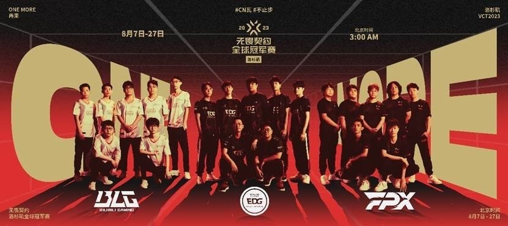
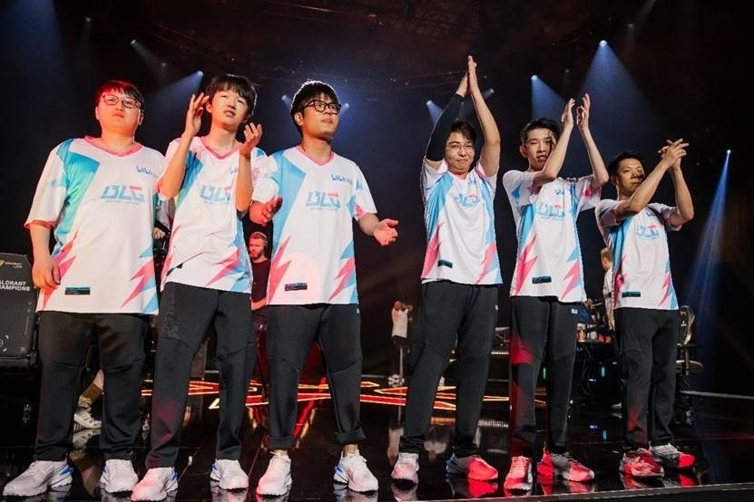

# 三支中国队伍亮相2023无畏契约洛杉矶全球冠军赛

新华社北京8月10日电
2023无畏契约洛杉矶全球冠军赛于当地时间8月6日在美国洛杉矶开赛，四个比赛日过后，EDG、BLG、FPX三支经中国大陆赛区（CN赛区）资格赛晋级的中国队伍均已在小组赛中亮相。

洛杉矶全球冠军赛共有16支队伍参赛，分为4个小组。小组赛于8月6日至13日进行，采用双败淘汰赛制，每个小组前两名晋级八强。

7日，FPX作为CN赛区三号种子在今年的全球冠军赛赛场上率先亮相，但以0:2不敌美洲国际联赛一号种子EG。

初登国际赛场的CN赛区二号种子BLG8日以2:0击败来自美洲国际联赛的二号种子NRG，但在9日的比赛中以0:2不敌EMEA（欧洲、中东和非洲）国际联赛头号种子FNC。

CN赛区头号种子EDG9日经过三局对战，以2:1力克EMEA国际联赛的GIA，迎来本次赛事的首胜。

