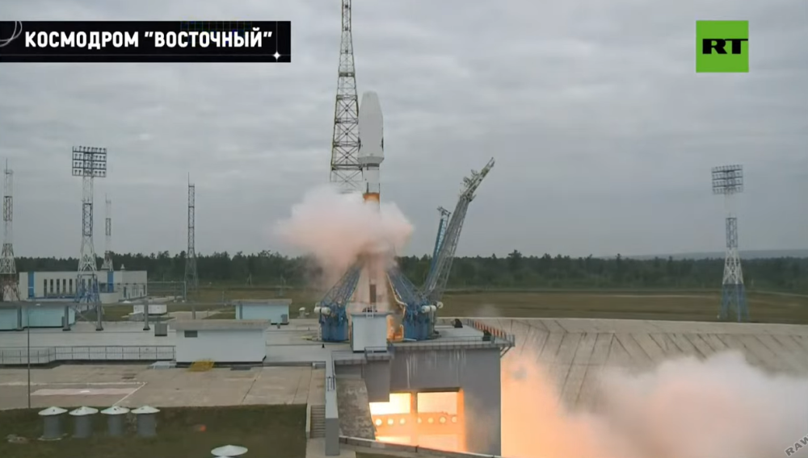
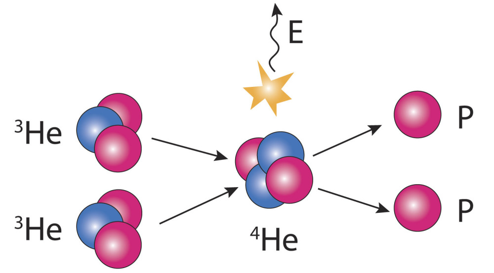

# 俄罗斯月球探测器发射升空，距上次苏联探月已过去47年

腾讯太空 乔辉

北京时间8月11日7时11分，俄罗斯利用联盟号火箭发射了
“月球25号”探测器，发射地点位于东方航天发射场。目前探测器正奔赴月球，如果一切顺利，预计5天后进入环月轨道，然后再花5天到7天的时间择机着陆，着陆地点位于月球南极区域。

1976年，苏联发射了“月球24号”，并成功进行了月球的采样和返回任务。时隔47年之后，“月球25号”才踏上奔月征程。

这次“月球25号”只是一架着陆器，着陆月球南极后，进行取样和原位分析，不返回地球。此前，月球南极还没有人类探测器造访过。“月球25号”预计8月23日前后着陆。

_图注：月球25号探测器奔月轨道示意图。_

7月14日，印度发射了“月船三号”探测器，该探测器目前已进入环月轨道，预计也是8月23日前后着陆月球南极。

俄罗斯的“月球25号”和印度的“月船三号”最终谁将成为第一个降落在月球南极的探测器？就让我们拭目以待吧。

**一、为什么世界各国都对月球南极感兴趣？**

除了俄罗斯和印度外，美国和中国同样对月球南极非常感兴趣。

2022年8月19日，NASA公布了“阿尔忒弥斯3号”任务着陆月球的13个候选区域，全都在月球南极。中国探月工程总设计师、中国工程院院士吴伟仁此前向媒体透露，我国探月工程四期经过多年论证，已于2021年底正式立项，进入实施阶段。他具体谈到：“探月工程四期的主要目标是对月球南极开展科学探测，建立起月球科研站的基本型。后续将分3次任务实施，分别是嫦娥六号、嫦娥七号和嫦娥八号，计划在2030年之前完成。目前研制工作进展顺利。”

_图注：美国航天局公布的位于月球南极附近的13个潜在的载人登月区域。_

此前，不管是俄罗斯、美国还是中国，所有月球着陆器都选择在纬度不是太高的区域，这些区域相对南极地区比较平坦，成功率更高。

但近年来，各国月球卫星发现，月球南极可能蕴含大量的水（冰）资源，水资源真是太宝贵了，这能为人类未来开发和利用月球提供最基本保障。只是在月球轨道上观测还不够，还要实地进行考察一番。

除此之外，月球南极的艾特肯盆地（Aitken
basin）是月球上最大的由撞击形成的地形，里面的物质来自月壳的深处和月幔，通过对这些月球深层物质的研究，能够让我们更好地理解月球的形成和演化等。

因此，尽管去月球南极比去其他区域更难，但探测价值更高。俗话说：“无尽风光在险峰”嘛。

**二、俄罗斯“月球25号”与印度“月船三号”比较**

1、从探测器重量上看：“月球25号”重约1.75吨；“月船三号”重约3.9吨。因此，“月船三号”比“月球25号”要复杂一些。

2、从探测器类型上看：“月球25号”是一架着陆器，着陆月球后是不能移动的。它搭载有30千克的载荷，分成9大类科学分析仪器，只能对月球进行原位探测和原位分析；“月船三号”分为着陆器和月球车两个部分。其中着陆器搭载了三类科学分析仪器，月球车搭载了两大类科学分析仪器，月球车可以在月面移动探测。

 _图注：月船三号和月球25号比较（艺术图）。_

3、从奔月方式上看：“月球25号”采用的是直飞月球的轨道，从月球飞到月球仅需5天；“月船三号”则采用的是像荡秋千一样的方式，利用探测器自身的动力慢慢提升轨道抵达月球，这种方式比较费时间，耗时长达20多天。

_图注：月船三号的奔月轨道。_

4、从任务目标上看：“月球25号”主要瞄准的是月球风化层和水的研究；“月船三号”除了对水的研究外，还为了验证探测器在月面软着陆以及月球车运动等新技术。

**三、月球是人类迈向深空的跳板**

月球被誉为人类的第八州，有着丰富的自然资源和地球上稀有的矿物，比较有名的是月壤中的氦3资源，氦3是氦元素的一种同位素，可以作为核聚变的燃料，且反应过程中不产生放射性物质。理论上，几十吨氦3聚变产生的能量相当于全世界的全年用电量。

当然，鉴于目前人类连第一代核聚变（氘-氘）还没有完全驯服，更新一代的氦3核聚变的研发还有更长的路要走。

月球是离地球最近的天体，相对于广袤的宇宙空间，月球犹如在家门口，月球的引力只有地球六分之一，航天器的逃逸速度只有2.4千米每秒，非常适合作为人类向深空发射航天器的基地，也是人类向深空进发的跳板。

