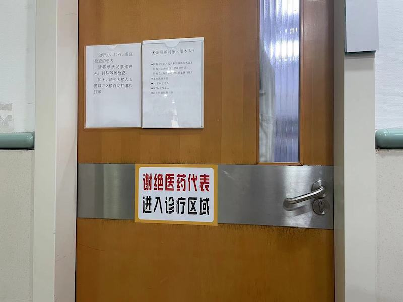

# 医生收入调查：月工资1600元起步，薪酬改革艰难推进

8月，医疗反腐震动整个行业，医生收入问题成为社会瞩目的焦点。

在沸腾的舆情中，一位国内三甲医院的著名专家在朋友圈转发了一篇3年前的报道，标题意味深长：《人民网评：请永远记得，医生为我们拼过命》。

国家统计局数据显示，2022年末全国执业医师和执业助理医师为440万人。

400多万中国医生的收入究竟高不高？医生的收入与奉献和付出是不是相符？公众在这些问题上各执一词，不满、愤怒与压抑、委屈，各种情绪交织在一起，让人眼花缭乱，不知何去何从。

求医问药是人的基本需求，让医生获得一份体面的收入，可以光明正大获得与付出相匹配的薪酬，是实现高水平医疗服务可持续的关键。

在中国要实现这个目标，应该怎么办，第一财经记者采访了大量一线从业者，其中有的在一线城市，有的在内地县城，既有三甲医院的大专家，也有刚走出医学院大门的规培医生，他们各抒己见，希望找到一个理想的答案。

_（图片摄影：任玉明）_

**医生收入几何**

在中国的各行各业中，医生非常特殊，越是年轻，越只能坐冷板凳，收入越低。

某三甲医院一位科室主任告诉第一财经记者：“医生就是要熬，熬到35岁～40岁，才有出头之日。各方面的经济实力才能够提升，时间成本太高了。”

一个从医学院毕业的大学生，要经过规培（住院医师规范化培训）、住院医生阶段才能一步一步晋升成为主治医生、副主任医师、主任医师等，一位医生介绍，硕士规培属于最底层，干着最繁琐的工作，可能每个月到手工资只有1600元。

一位正在广州某三甲医院进行规培的医生对第一财经记者表示：“就拿同龄人来说，能做医生的一般都是学习较好的人，别的行业从业者有些在30岁左右已经有车有房，成为人生赢家了，但我们还在靠‘情怀’支撑。对于医生而言，25岁～30岁是人生最艰难的五年。”

上海一家三甲医院主治医师告诉第一财经记者，一般而言，规培需要三年，规培完正式工作满两年后才能去考主治医师，之后满五年才能升副高（副主任医师，记者注）。在规培阶段，第一年因为还不具备执业证，每个月到手工资只有2000元～3000多元，之后的第二年、第三年，月收入大概在5000元～6000多元。到了住院医生阶段，到手月薪在7000元～10000多元。但在升副高之前，收入主要还是依靠科室“大锅饭”。

医院有很多科室，不同科室的医生收入也有不同。

比如急诊是医疗机构最重要的部门之一，也是医院最苦最累的部门，但是收费低。一些好的医院为了鼓励医生去急诊科，特别在制度方面进行优化，提高急诊科医生的收入，鼓励医生在一线治病救人。

某头部三甲医院相关人士对第一财经记者表示，“很多人以为我们医院的外科收入高，急诊是亏损部门，但其实急诊部门收入并不低，因为急诊非常需要好的医生，他们的劳动价值必须得到体现。”

一位医生告诉第一财经记者，医生最大的收入来源其实是奖金，奖金是根据科室的收入来分配的，这部分主要体现的是医生的工作量、年资以及业务水平。“具体的奖金分配体系还是比较复杂的，每个医院都不太一样，但原则差不多。”他对第一财经记者说道。

中日友好医院等单位的作者于2019年发表了一篇关于《中国公立医院医生薪酬收入的现状与趋势分析》研究显示，我国主要三级公立医院医生平均实际年收入从2016年的9.57万元增加到2019年的12.22万元。2016～2019年四年间我国主要三级公立医院医生实际年收入虽略有增加但总体变化不大。

选择医生这个行业，对于不少家庭来说，相当于一笔长期投资，一位医生感慨道，在上海这样的大城市选择当医生的，很多都是家境还不错的孩子，家里有一定经济实力，可以长期资助。“很多做医生的人是因为理想，或者是父母的理想。如果为了钱，恐怕不一定能达到预期。”他说。

**失衡背后**

中国人口超过14亿，求医问药的需求十分旺盛，面对海量的看病需求，中国一直在努力，但是医生的数量仍然存在缺口，在一线城市的三甲医院，病人大排长队屡见不鲜。

在新冠疫情发生之前，全国医疗卫生机构总诊疗量总体呈稳步上升趋势。2021年，全国医疗卫生机构总诊疗人次84.7亿，比上年增加7.3亿人次（增长9.4%）。2021年居民平均到医疗卫生机构就诊6.0次，恢复到了2018年的水平。同年（2021年），全国医疗卫生机构入院人次24726万，比上年增加1713万人次（增长7.4%），居民年住院率为17.5%，比六年前提高了2.18个百分点。

诊疗次数和住院量虽然实现恢复和增长，但医生的数量仍有限。

《中国卫生健康统计年鉴（2022年）》数据显示，近10年来我国医疗卫生机构数量逐年递增，2021年达到约103.1万家。近年来，我国执业医师数量也保持了约20万左右的年增长量。但总体而言，我国医生资源总量不足的问题依然凸出。2021年，全国每千人口执业医师约2.55人，农村地区仅1.81人。

世界卫生组织数据显示，中国每1万人对应的医生数量是23.9人，而美国是35.6人，日本是26.1人，法国33.2人，德国45.2人，英国31.7人。

医学院毕业生是中国医生队伍的“后备军”。我国医学院招生规模逐年递增，但毕业后有相当比例的医学生流失到其他岗位。

公开数据显示，培养医学生最多的高校之一——上海交大医学院，其2023届毕业生部分就业去向数据显示，在553名本科毕业生和长学制毕业生中，其中签约医疗机构的仅有276人。

医生缺口大，进一步加大工作负荷。多名受访医生表示，如感染科、儿科等科室，或因为平时病源不多，或因依照现有定价体系，“不能为医院挣钱”，导致工资待遇低，人才留不住，设备引不进来。

以二级公立医院为例，根据国家卫健委今年4月发布的“国考”成绩单：在人员结构方面，2021年二级公立医院的麻醉、儿科、重症、病理、中医医师数量虽较2020年有一定程度增长，但增长的速度低于二级公立医院执业（助理）医师整体的增长速度。此外，仍有个别二级公立综合医院尚未配备麻醉、儿科或病理医师，或紧缺医师占比明显低于全国平均水平。

县级医院的专科能力和高层次人才更显欠缺。根据国家卫健委“2021-2022年度县医院医疗服务能力评估情况的函”，一级科室中，精神科、耳鼻咽喉科、眼科等设置率仍不足80%，感染性疾病科、重症医学科、康复医学科、皮肤科、病理科等设置率不足90%。平均每家县医院硕士及以上学历人员仅16人，东、中、西部地区分别为40人、11人、5人；高级职称人数为60人，东、中、西部地区分别为99人、61人、40人，区域间差距明显。

有专家表示，医生工作量大，再加上无法获得合理报酬，容易产生心理失衡问题，这也给追求“灰色收入”埋下伏笔。

值得注意的是，公立医院医生的薪酬主要由医生提供医疗服务的费用及政府对医院的财政投入构成。目前我国政府对公立医院的平均投入仅占医院总收入的一成，剩余九成均由公立医院通过医疗服务收费等手段来对医生的薪酬进行发放。近年来，我国也在深化医疗卫生体制改革，弱化公立医院的逐利性。但是，在财政投入减少以及公立医院仍还需要“自负盈亏”下，也促使公立医院均以患者的数量以及提供医疗服务的数量等作为获取利益的直接手段，从而导致过度医疗、以药养医等不合理的医疗服务行为出现。

2015年原国家卫计委发布的《公立医院预决算报告制度暂行规定》提出，“不得将医院收入指标分解到各科室，更不得将医务人员收入与科室收入直接挂钩”。此后我国陆续出台了多个政策文件，要求严禁向科室和医务人员下达创收指标。

与此同时，尽管政策也一再强调“医务人员薪酬不得与药品、卫生材料、检查、化验等业务收入挂钩”，但作为财政差额补助的二级事业单位，公立医院常期因医疗服务价格总体偏低、财政投入长期不足，而负债累累、“收不抵支”。在创收压力之下，第一财经记者了解到，医务人员薪酬管理仍然存在单纯以“多劳多得”为激励倾向，这也可能带来“过度医疗”现象。

_（图片摄影：冯小芯）_

**医生薪酬改革困境**

与发达国家相比，中国医生的数量仍然存在较大缺口，医生工作量大，对收入的增长有较强的预期，让医生光明正大满足自己的需求，需要进行医生薪酬改革，这是一块“硬骨头”。

一位医生说，他所在的医院一直提倡医生的劳动付出应该遵循多劳多得，优劳优得，高风险多得、高技术多得的原则。“事实上，医院在实际的收入分配过程中也是往这个方向努力的，一定要鼓励医生提升技术水平。”他对第一财经记者表示。

今年7月24日，国家卫健委等6部委联合发布的《深化医药卫生体制改革2023年下半年重点工作任务》（下称《任务》））正式对外公布，其中明确：落实药品和医用耗材集中采购医保资金结余留用政策；合理确定内部薪酬结构，注重医务人员的稳定收入和有效激励，进一步发挥薪酬制度的保障功能。同时，推动各省开展2023年医疗服务价格调整评估，符合调整的在总量范围内及时调整价格。

因此，医生薪酬改革前景备受期待。而医生薪酬如何改呢？上述《任务》中再度提到了两个关键点，一是公立医院主要负责人探索年薪制；二是注重医务人员的稳定收入和有效激励。

在公立医院体系中，院长是一个非常重要的角色，在各种利益诱惑下，一些院长容易出事。大部分接受第一财经采访的医改专家、医院院长和一线医生均认为，院长相当于政府管理公立医院的委托代理人。医院院长的经营管理能力和对员工薪资水平提升的重视程度，关乎医生实际收入待遇。

“院长年薪制”让上述两方面目标能够实现的一种制度性保障，目前已在福建、安徽、河北等地开展省级试点改革。

蒋平是安徽某县三级医院院长。他告诉记者，目前，“年薪制”一般分为基本年薪和绩效年薪，不同地区绩效的比例不同。其中，绩效年薪有一个底薪标准，按照一定的考核要求在这个底薪上增扣。对于市级医院的院长而言，在一定比例和时间内可能是降薪；对于县级医院的院长而言，是否会加薪，取决于能否提高员工平均薪酬水平，如果做得好，可能翻倍（比如从20万到40万）。

根据6月份安徽省人社厅、安徽省卫健委等多部门印发《安徽省深化公立医院薪酬制度改革实施方案》。公立医院主要负责人实施年薪制，年薪原则上为本院职工平均薪酬水平的2—4倍。

与此同时，往往与“高薪”挂钩的年薪制也用于医院吸引一些高端人才上。蒋平表示，他所在的县医院，为了吸引人才，除了对引进的一名院士实施比院长收入高出3～4倍的年薪制以外，也对一些青年骨干实行年薪制。这些福利待遇均为院方开支。

不过，据蒋平介绍，按照地方卫健部门对三级公立医院定下的员工薪资在医院支出中的占比，40％是个基准线。经过几年的努力，医院最高也只能达到38.5％左右，这在当地是“相当不错”的水平。

国家卫健委在2021年发布《关于深化公立医院薪酬制度改革的指导意见》中提出七点要求，其中之一就是“拓宽深化薪酬制度改革经费渠道，逐步提高诊疗、中医、护理、手术等医疗服务在医疗收入中的比例。在确保收支平衡的前提下，合理确定人员支出占公立医院业务支出的比重。公立医院可根据考核结果分配医保结余留用资金，主要用于相关人员绩效。”

按照医保支付体制改革初衷，旨在将收入激励转为成本激励。中国药科大学国际医药商学院伍琳等日前撰文称，所谓成本激励，即一般指在按病种付费、按人头付费等总额确定的预付制体系中，医院的医保资金结余可以全部或部分转化为医生收入及职业发展支持(如科研基金、学术交流费用等)，从而产生激励效应。而“结余留用”的成本激励机制则大幅提高了医院缩减成本的动机，“结余资金”部分可以以经济收入或福利保障的形式惠及医生，从而使医生自主规范服务行为，提高医疗服务效率。

“但事实上，能有结余已经很不容易了，会否将结余用于人员收入提高也是个问题。”北方某县卫健委副主任对第一财经记者表示，近年来，当地县医院和中医院经营收入在下降，但人员收入占比也在下降。“每年都走几个青年骨干医生。”

记者在调研中发现，随着医保支付方式改变，一些临床医生救人、开药变得畏手畏脚。“多劳多扣”“医院没有结余，哪来的成本激励”“问责压力加大”成为多名受访临床医生的共同困境。

中部某省会三级综合性医院感染科主任张立给记者举了一个例子：今年二季度，他们科室曾遇到过一个腹腔复杂性感染的病人，按照按病种付费的模式，最多能用医保报销约1万元，但由于并发症、耐药性等问题，实际医疗花销达到20万元，也即除去医保基金支付的1万元，剩下的都得算作院方亏损，院方则会将亏损算在科室月度整体绩效中进行扣除。

怎么办？张立说，如果选择不救，该名患者已经被东部几个大省某些大三甲医院拒收过，生命开始垂危，如果救，那么他连带科室都得承受当月的绩效扣除，甚至会影响到年度部门间的考核，这对于“原本就不赚钱”的科室而言，无疑是雪上加霜。当然，医保部门也在制度设计时考虑到高费率病例（超过支付标准的3倍），但申诉后，可报销的比例也只是超过高费率数额的部分（20万元-1万元×3），剩余的2万差额依然得由科室承担。

“在我从业的几十年，薪资计算一直都是‘基本+绩效’，基本工资包括工龄、职称以及年度教学任务收入等；绩效简单来说就是问诊量的‘收入-
支出’，也即多劳多得，唯一的变化就是在实行从按项目付费到按病种付费后，要想取得和此前相同收入，需要尽可能地减少一些药耗。此外，如果遇到上述情况，科室还可能亏损，也就是多劳多亏。”张立表示。

公立医院的收入来源主要为医疗服务收入和财政拨款收入，其中，财政拨款收入包括专项拨款和基本补助。在人力成本支出方面，离退休人员的经费、规培生的补贴由财政拨款解决，在职医务人员基本工资和绩效工资则主要由医院承担，财政基本补助资金可以提供支持。

“（医疗服务）价格改革是关键。” 上海创奇健康发展研究院创始人、执行理事长蔡江南在接受第一财经采访时说。

他解释称，医生收入待遇难以提高，根本上还是“盘子”不够大，即公立医院的亏损问题。化解手段一般有两种，一是财政支出，这是过去惯常的手段。但由目前各地政府财政吃紧，所以指望政府加大拨款力度并不现实；二是医疗服务价格改革。过去，由于公立医院医生相对比例是编制内的，如果通过提高医疗服务价格水平来改善医生收入，那么如教师、公务员、警察等其他编制内的群体可能存在攀比心态，同时，如何与患者期待找到一个合理的平衡点，也是个博弈过程，所以过去近十年时间一直推进缓慢。但从长远来看，这是一个难啃但不啃不行的硬骨头。

医疗服务价格改革有多难？医改专家徐毓才对记者举了一个例子，重庆曾在2015年试点“新价格”后，因一些患者治疗费用显著增长，而骤然叫停改革。这被业界称为“史上最短的医改”。

他分析称，医保部门作为医疗服务主要支付方，可以通过“腾空间、调结构、保衔接”三个方面，提高医院运营效益，进而反馈给医生。但目前，医保部门的主要着力点放在了“腾空间”（即通过集采等方式推动药械降价）和“保衔接”（医保支付方式改革，以减少过度医疗）上，而对于“调结构”也即医疗服务价格改革，还没有探索出有效路径。地方有试点，但基本都如重庆一样，目前以失败告终。

在此背景下，徐毓才认为，医院医疗服务支出实际承担了一些财政“欠账”，用于支付医生薪资。故而，普通医生待遇可能不会降，但也很难明显上涨。作为应对，需要让医生资源流动起来，这样可以让医生一些创收的途径“阳光化”，也有利于改善医疗资源分配不均的问题，多方受益。

比如，虽然近年来，政策层面允许医生“多点执业”，即注册医师可以在注册的执业地点之外合法执业。但由于多点执业需要获得所属单位和当地卫生主管部门的双重审批，而院方因担心患者流失而层层设限，这一政策上的松绑往往难以落到实处。如果，医生在院方不知情的情况下去外地会诊或做手术，面临原单位处分。

“我认为解决中国医疗问题下一步的走向是自由职业，比如医改探索‘注册医师多点执业’就是一个很好的尝试。但矛盾的是，国家有关部门又着重于加强公立医院的编制管理，这种政策之间本身就存在矛盾的地方，进而给公立医院更多做出符合医院利益的解释余地。医院利益和医生利益是否统一，或者说如何让这二者形成相互促进的关系，都值得政策制定者和医院管理者进一步的探索。”徐毓才认为。

（文内蒋平、张立皆为化名）

