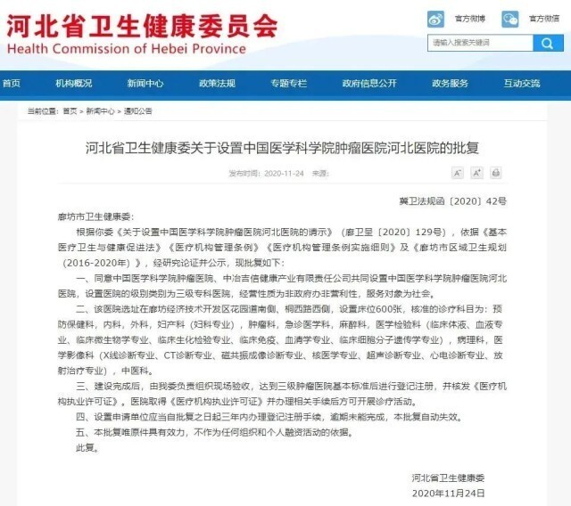
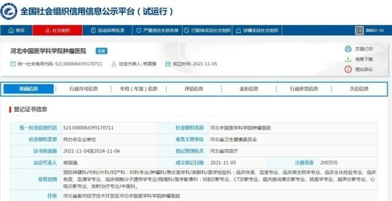
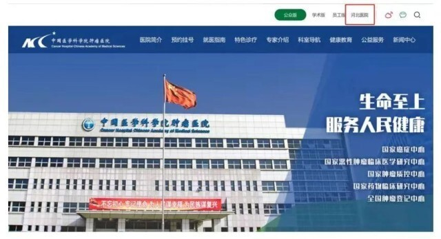
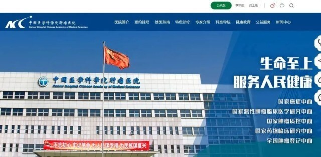

# 号称“亚洲最大肿瘤医院分院”，这家总投资90多亿的医院突然申请注销

号称“亚洲最大肿瘤医院分院”的河北中国医学科学院肿瘤医院(简称“河北医院”)，近日突然宣布申请注销。

河北青年报8月9日刊载的一则注销公告显示，河北中国医学科学院肿瘤医院拟向组织登记管理机关申请注销登记。请债权人于公告发布之日起 45
日内向清算组申报债权，逾期不提出的按相关规定处理。

 _截图自河北青年报_

2020年11月24日获批设置的河北医院，从2021年11月5日注册为民办医院到2023年8月9日宣布拟注销，短短2年不到时间，河北医院经历了什么离奇的事情？

**未批先建？**

廊坊市政府官网信息显示，2019年2月，廊坊市政府与中国医学科学院肿瘤医院签署战略合作协议，合作建设中国医学科学院肿瘤医院分院。

据中国医学科学院肿瘤医院官网介绍，中国医学科学院肿瘤医院是国家卫生健康委所属三级甲等肿瘤专科医院，也是新中国举办的第一家肿瘤专科医院，是集医、教、研、防于一体的国家级肿瘤防治中心。

2019年5月13日，廊坊经济技术开发区管委会、中国医学科学院肿瘤医院、中国冶金科工股份有限公司(简称“中国中冶”)在北京签订《中国医学科学院肿瘤医院廊坊院区项目三方合作框架协议》。

_截图自中国医学科学院肿瘤医院官网_

彼时，项目相关方表示，此次签约，将极大推动中国医学科学院肿瘤医院廊坊院区项目建设，发挥国家级肿瘤防治优质资源辐射带动作用，是进一步贯彻落实京津冀协同发展战略的重要举措，同时也是缓解广大患者到我院看病难的有力举措。

廊坊市政府官网显示，2020年1月21日，中国医学科学院肿瘤医院分院(廊坊院区)项目开工推进会召开，标志着这一项目完成所有前期工作，正式进入具体施工阶段。当时，有媒体报道，中国医学科学院肿瘤医院廊坊院区总投资达94.6亿元。

项目从签约到开工建设，不到一年时间。但是直到2020年11月24日，河北省卫健委才批复设置中国医学科学院肿瘤医院河北医院。

_截图自河北省卫健委网站_

河北省卫健委的批复指出，同意中国医学科学院肿瘤医院、中冶吉信健康产业有限责任公司(简称“中冶吉信”)共同设置中国医学科学院肿瘤医院河北医院，设置医院的级别类别为三级专科医院，经营性质为非政府办非营利性，服务对象为社会。

**数次更名**

值得注意的是，河北医院的名称前后发生多次变化，一开始叫“中国医学科学院肿瘤医院分院”“中国医学科学院肿瘤医院廊坊院区”，河北省卫健委批复的名字为“中国医学科学院肿瘤医院河北医院”，而在民政系统登记的名字为“河北中国医学科学院肿瘤医院”。

根据中新网记者获取的材料显示，河北医院共同设置方中国医学科学院肿瘤医院、中冶吉信因“中国医学科学院肿瘤医院河北医院”更名为“河北中国医学科学院肿瘤医院”一事向河北省卫健委出具承诺书。

承诺书显示：我院明确知道《医疗机构管理条例实施细则》医疗机构名称管理中关于识别名称和通用名称的具体规定。今后，如果发生由于国家卫生健康委规范医疗机构名称管理的原因，被行政许可监督机关责令改正的情形，保证届时将按规定使用医院名称并接受卫生行政部门监督，在接到行政许可监督机关书面通知后的10日内严格按照法律规定提出相应的变更申请，逾期自愿接受河北省卫健委依照《行政许可法》第七十条规定作出的行政处理。

**股权疑云**

值得注意的是，当时三方签约的主体之一是中国中冶，而河北省卫健委正式批复的设置方则变为了中冶吉信。

国家企业信用信息公示系统显示，中冶吉信2019年9月23日成立，其控股股东为康和信(大连市)健康医疗管理有限责任公司(简称“康和信”)，注资47700万元，持股99.58%。中冶吉信另一股东为中国中冶的全资子公司中冶国际，但持股仅0.42%，并未控股。

2020年11月16日，康和信全资收购了一家自然人独资公司北京康养建筑设计咨询有限公司(简称“北京康养”)，随后就在2020年11月24日河北省卫健委批复设置河北医院的这一天，中冶吉信发生了2次绝对控股股东变更。

北京康养出资2.98亿元收购吉林信托持有的中冶吉信的全部股份，随后康和信又出资2.98亿元收购了北京康养持有的中冶吉信的全部股份。

此后，河北医院建设进展不时见诸媒体，最新的消息是，2023年4月21日，据河北日报报道，河北中国医学科学院肿瘤医院项目3号综合住院楼主体结构封顶。

不过，2023年7月份，中新财经接到举报称，河北医院的设置方之一中冶吉信疑似为“假国企”。

经过核查，中冶吉信控股股东康和信注册资金来源不明，社保参保人数为0，股权变更亦存在疑点，康和信工商登记信息中的控股股东为吉林省信托有限责任公司(简称“吉林信托”)，但在其官方资料中查不到康和信的身影。吉林信托工作人员表示“没听说过”这一子公司。法律专家表示，从现有信息看，康和信和其持股99.58%的中冶吉信的国企身份确实存疑。

**何以注销？**

全国社会组织信用信息公示平台查询显示，河北中国医学科学院肿瘤医院社会组织类型属于“民办非企业单位”，注册资金只有200万元。

_全国社会组织信用信息公示平台截图_

若从工商信息看，中冶吉信实际控制人为吉林省财政厅，属于国企；中国医学科学院肿瘤医院为公立医院，但两者共同设置的河北医院却是“民办非企业单位”。如果中冶吉信当真为“国企”，为何与一家公立医院共同设置了一家“民办非企业单位”医院？

中新财经记者近日分别向吉林信托、吉林省财政厅、河北省卫健委、河北省民政厅、中国中冶、中国医学科学院肿瘤医院等相关方致函或致电采访，以核实相关信息，但截至发稿时尚未收到回复。

尽管相关方不约而同保持了“沉默”，但一系列变化正在发生。

国家企业信用信息公示系统显示，8月3日，中冶吉信法定代表人从付列武变更为孙修善，付列武退出。

值得注意的是，7月份，中新财经查询中国医学科学院肿瘤医院官网，其官网上曾有“河北医院”字样，但点击无法打开，而目前再查看其官网，“河北医院”字样已经消失。

_2023年7月份中国医学科学院肿瘤医院官网还有“河北医院”字样_

 _目前中国医学科学院肿瘤医院官网“河北医院”字样已消失_

北京市高默克律师事务所资深律师宗海潮对中新财经表示，法律上，申请注销登记意味着原开办单位(股东)想要终止该民办非企业单位的法律主体资格，有可能是注销不开了，也可能是换一种开法，具体要看投资人和政府主管部门的决策。这也间接证明了该项目设立、审批、投资、操作过程中可能会存在一些问题，无法简单调整完善，只能采取注销模式。

宗海潮认为，有关部门批复成立河北医院有助于解决环京病患就医问题，部分疏解北京非首都功能，但在依法治国、依法行政、依法经营的当下，合规守法还是必须要遵守的基本原则，希望有关部门、有关企业在积极发现问题、改正问题后，以合法合规的方式再次进入公众视野。

来源：中国新闻网

