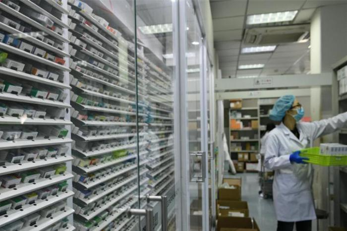

# 回款“绕开”医院，医保直接结算，多地斩断医药腐败利益链

中新网8月11日电
不光销售要有“渠道”，收账的时候也要“打点”……长期以来，医药购销过程中的“回款”环节也被不少人盯上，相关岗位也成了捞油水的“肥差”。为解决“回款难”的顽疾，从国家到地方层面已经出手，推动改进结算方式，斩断利益输送隐秘链条。

_资料图：民众正在医院门诊楼内等待就诊。(图文无关) 殷立勤 摄_

**想回款先送钱？财务科也难逃诱惑**

中新财经注意到，在近期的医药反腐中，除了医院的“一把手”“一把刀”成为企业主要行贿对象，腐败也蔓延至财务、行政后勤等部门，在被查干部中不少是出自财务科。

2022年7月，中央纪委国家监委网站发布的《纠治医疗腐败顽疾》一文就披露，多名医疗卫生领域党员干部“靠医吃医”。瓜分医药购销回扣这块“蛋糕”的利益群体，远不止临床业务医生和相关负责人。

例如，江苏省响水县人民医院财务科原科长刘某荣主要负责医院各种收入、支出、预算等财务管理活动，尤其在供应商的发票入账、对账、回款上，他是不可缺少的一环。

为了能尽快拿到“回款”、回笼资金，供应商千方百计地巴结讨好刘某荣，准时准点地在中秋、春节等重要节点奉上“诚意”，少则几千，多则上万。在2015年至2021年期间，他非法收受供应商等人贿送的现金和购物卡等财物，合计48万余元。

而这样的现象并非个例。有医疗器械代理商就向中新财经透露，除了销售，医院给企业的回款结算等环节也存在收受贿赂的空间。

据其介绍，目前，一些医院回款周期快的是三个月，慢的话六到八个月，超过一年甚至到两年的也有，“正常情况下，是排队等待回款，但有时候是‘选择性地回’，有些地方，供应商需要去要债，这时候没准就得给财务主管方面的领导送点好处。”

这也就意味着，在利益的驱使下，无论是临床的医护、采购，还是行政后勤人员，都有可能成为供应商的“目标”。而在医疗器械设备、耗材采购上攫取私利，多付的成本最终会转嫁给患者。

 _资料图：自动分药系统(图文无关) 中新社记者 佟郁 摄_

**“三角债”问题由来已久**

事实上，医院、企业、医保基金之间的“三角债”问题由来已久。公立医院作为绝对的采购主体，在产品实际采购过程中长期处于强势地位，这也导致第三方的代理商总是需要先垫付货款，从而催生医疗机构“回款慢”的业界难题，甚至被默认为“规矩”。

不光销售要有“渠道”，最后收账的时候也要“打点”，不少代理商对此也深表无奈，长期的拖欠货款也令企业利润受损。

尽管药械企业对于解决上述问题的呼声一直都有，但现实中，想破解“收账难”却仍有诸多壁垒。医院无偿占用了生产企业的流动资金，而生产企业减少销售费用的一个最直接、最有效的办法就是提高价格。

有业内分析认为，在药品、耗材集中带量采购的大背景下，显然一些医院的收入渠道变窄，单靠还未成熟的医疗服务收入无法实现医院收支平衡，那么医院最后就可能将压力转嫁到药械企业身上，回款的时间也就越来越长了。

更有医院不是不能回款，而是不想回款，以自身的强势地位倒逼药械企业让利，以弥补在收入上的缺口。甚至因为有的医院长期拖欠款项，产生“愧意”，造成立场偏移，在药械采购等问题上睁一只眼闭一只眼，最后还是损害了患者的利益。

_湖南省医疗保障局官网截图_

**回款“绕开”医院 医保直接结算**

中新财经注意到，针对“回款难”的顽疾，从国家到地方层面都在推动改进结算方式。

例如，2021年发布的《国务院办公厅关于推动药品集中带量采购工作常态化制度化开展的意见》中就曾提到，医疗机构应承担采购结算主体责任，按采购合同与企业及时结清药款，结清时间不得超过交货验收合格后次月底。

另外，文件还提到，在落实医疗机构采购结算主体责任的前提下，探索通过在省级药品集中采购机构设立药品电子结算中心等方式，推进医保基金与医药企业直接结算。

目前，多地已经陆续开始试水，在回款过程中“绕开”医院，改为医保直接结算。

例如，此前，山东省德州市就在全省率先实行医保基金结算药款。公立医疗机构采购国家、省集中带量采购药品，以及基层公立医疗机构采购的所有药品，都通过山东省药品和医用耗材招采系统，由医保基金与药企直接结算，相应金额从医保对医院结算的资金中扣除。此举令平均8到12个月的药品耗材结算周期缩减至30天。

2022年12月，《江西省人民政府办公厅关于推动药品和医用耗材集中带量采购工作常态化制度化开展的实施意见》对外公布。

该文件也明确提出，中选药品和医用耗材的采购货款实行医保基金与医药企业直接结算，建立健全周转金制度，具体由医疗保障部门通过带量采购周转金代保管账户与药品和医用耗材供货企业(生产企业或配送企业)对中选药品和医用耗材的采购货款进行直接结算。

就在几天前，湖南省医保局网站公开了《关于实施医保基金直接结算集中带量采购中选产品医药货款的通知》，明确自2023年10月1日起，在全省范围内实施集中带量采购中选药品和医用耗材货款由医保基金直接结算工作。

伴随全国范围内直接结算制度的加速推进，“三角债”顽疾或有望破解，并最终起到斩断利益输送、维护患者利益的作用。(完)

