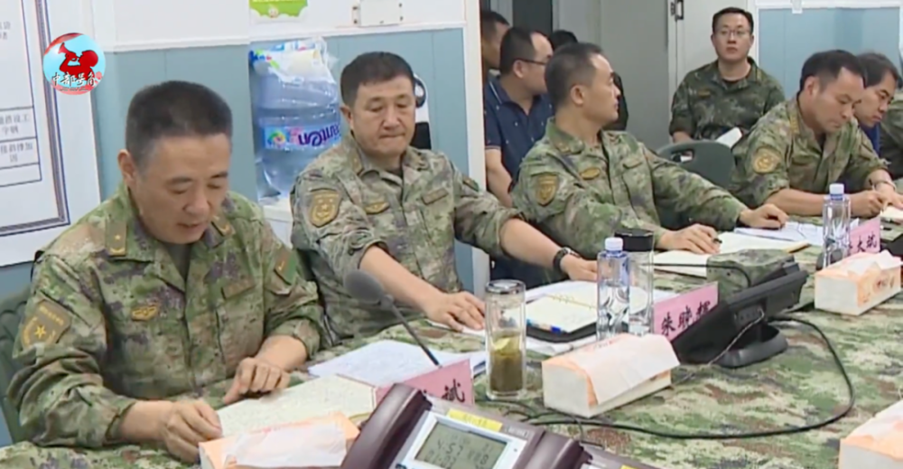
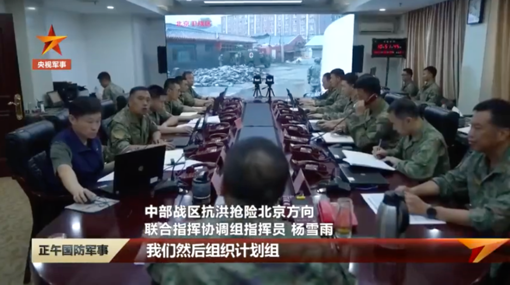
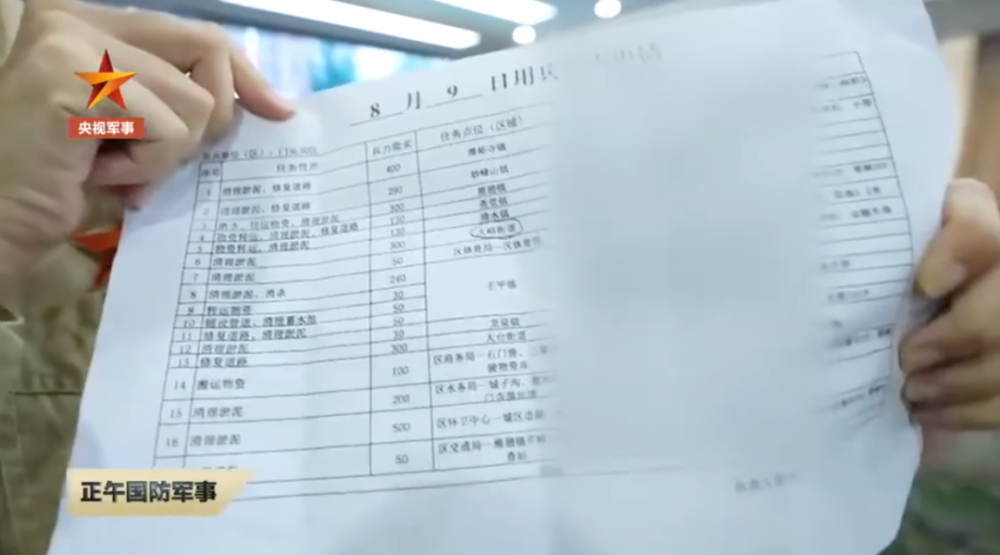
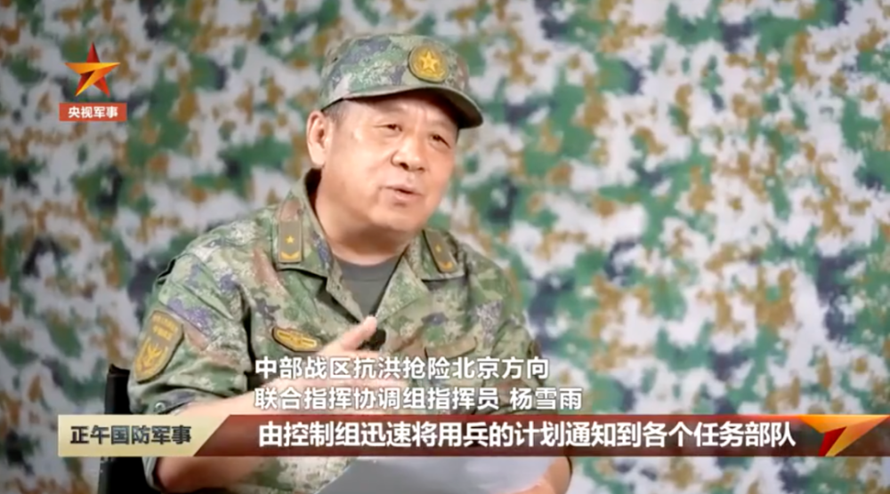

# 将军坐镇一线！联合指挥所内部画面披露，中部战区副司令员担任指挥员

**撰文 | 余晖**

据《天津日报》8月11日消息，8月9日，军地第二次抗洪抢险任务综合研究会在静海区台头镇军地联合指挥所召开。

报道中提到， **中部战区副司令员、联合指挥所指挥员李志忠** ，天津警备区司令员白忠斌，中部战区陆军副司令员朱晓辉，天津市领导李树起出席会议。

上述消息显示，中部战区副司令员李志忠，担任了联合指挥所指挥员。

**市委书记、市长、中部战区司令员、政委赴一线**

天津防汛泄洪，备受外界关注。

7月28日以来，海河流域普降大到暴雨，局地特大暴雨。7月31日，天津市水务局洪涝灾害防御应急响应提升至Ⅰ级。

随着永定河、大清河、子牙河上游泄洪量加大，天津境内河道水位逐步上涨。

此次会议召开的地点，是在静海区台头镇军地联合指挥所。

**静海区台头镇，是此次天津防洪重点地区。**

台头镇党委委员王震说，台头镇与河北省交界，大清河与子牙河穿过镇域，泄洪压力不小。

8月7日，在天津汛情进入攻坚的关键时刻，
**中部战区第一时间向天津方向派出前指，在大清河一线开设联合指挥所，对参加抗洪抢险的战区陆军、武警部队、民兵力量实施联合指挥。**

8月8日，天津市委书记陈敏尔、市长张工分别与中部战区司令员黄铭、政治委员徐德清，武警部队副司令员朱文祥一行到静海区大清河右堤检查会商天津市防汛抗洪救灾工作。

**内部画面披露，将军坐镇指挥**

8月11日，中部战区披露了联合指挥所内部画面。画面显示，李志忠中将在现场。

李志忠曾长期在原沈阳军区服役，担任过原第39集团军副军长等职务，2017年调任东部战区陆军第71集团军副军长。

履新第71集团军之后，李志忠在2017年7月30日的建军90周年阅兵中担任工程防化保障方队将军领队。该保障方队由第71集团军某合成旅抽组组建。

2018年，澎湃新闻报道称，李志忠已出任南部战区陆军参谋部参谋长。如今，他跨战区到中部战区任职。

说回这次会议。

参加8月9日军地第二次抗洪抢险任务综合研究会的还有：

中部战区陆军、武警第一机动总队、武警天津总队有关领导，市有关部门、静海区政府负责人。

在现场，李志忠强调，全体部队官兵要坚决贯彻落实习主席重要指示精神，按照战区统一部署，牢固树立“一盘棋”思想，
**全身心投入天津防汛抗洪救灾各项工作，强化军地协调、精准安排部署，统筹做好巡堤查险、抢险排险等各项重点任务落实。**

他同时提到，按照战区指挥调配，遂行做好后续任务落实，全力以赴夺取防汛抗洪攻坚战胜利。

天津市政府党组成员李树起表示，要进一步健全完善
**交通运输共保、水文信息共享、查堤抢险共防、医疗保障共融、宣传报道共促、用兵协调共商等军地联合抗洪工作机制**
，强化配合联动，提升协同成效，竭尽所能提供保障服务，共同打赢抗洪救灾这场硬仗。

**8月10日下午，中部战区天津方向联合指挥所再次召开抗洪抢险任务部署会**
，会同天津市气象、水利部门，严密监测当地天气情况和大清河水域河水流量，精准研判当前汛情综合态势。

天津警备区继续组织相关力量加强对堤坝的巡查巡视，确保能够及时发现险情，第一时间处置。

**如何与地方需求对接？**

连日来，解放军多支救援力量奋战在抗洪一线。

就在8月10日，央视军事频道还披露了 **中部战区抗洪抢险北京方向联合指挥协调组** 的现场画面。

节目披露了军队救援力量是如何与地方上的救援需求精准对接的。

据报道，每天晚上6点之前，地方会形成一张需求申请报到前指，两个小时后，即晚上8点，前指会开会协调使用兵力。

中部战区抗洪抢险北京方向联合指挥协调组指挥员杨雪雨接受了媒体采访。

他说，“比方说，门头沟区、房山区还有其他区都汇总到我们这里，然后我们组织计划组对第二天的兵力调整提出他们的意见，然后我们会上共同研究，最后来决定，由控制组迅速将用兵的计划通知到任务部队。”

杨雪雨透露，初期因为受到通行条件、通讯没有恢复等的制约，基本上是靠前指挥，真正做到哪里有灾情，哪里就有部队，哪里就有救灾行动。

“到第二个阶段，主要是考虑救灾安全，不要在救助百姓的同时，我们自己变成灾民了。所以要求我们的救灾部队必须具备自我保障能力。”

他说， **老百姓有困难，部队就要有行动，“我们不能推，当然我们也不是蛮干，我们在这个过程当中， 也是精心组织、科学实施的过程”。**

**【版权声明】本文著作权归政知新媒体独家所有，未经授权，不得转载。**

