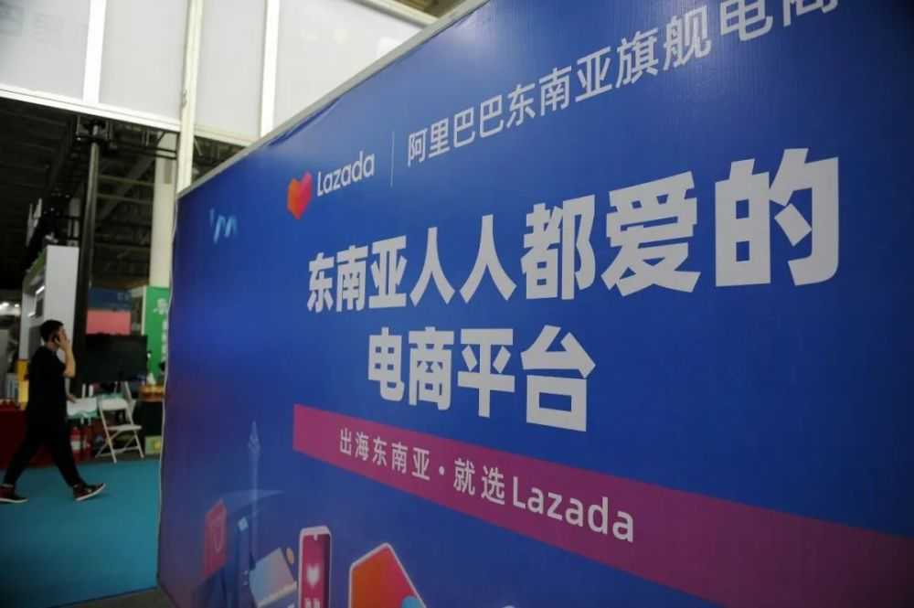

# 打破大锅饭的阿里，究竟更好还是更坏了

**这里是每日人物的栏目——「前线」，我们想要捕捉复杂商业世界里，那些重要的、可能影响深远的切片。**

**互联网巨头阿里巴巴，在今年做了一次堪称史上最大力度的架构调整，直接拆分成六个独立的业务集团，大家各干各的，干得好赚更多，干不好也没人管。在剧烈的变动中，阿里内部人心惶惶，许多部门被拆分出去成了外包公司，许多人被裁员。外界也在观望阿里变革的效果，等待阿里交出的答卷。**

**现在，答卷来了。「前线」第4期，我们试图从阿里一拆六之后的首份财报里，看看打破大锅饭的阿里，究竟是好是坏。（前几期传送门：扎克伯格和马斯克、抖音外卖、妙鸭相机）**

**文 |** 徐晴

**编辑 |** 赵磊

**运营 |** 栗子

这是阿里一拆六之后的首份财报，意义重大。

阿里宣布架构调整，时间是在3月底，正值阿里上个财年结束，这意味着，从4月开始，阿里就进入了调整期，这份4月到6月的财报，能够确认阿里内部发生的一些变化。

比如，业务被打乱重新划分，在截至3月的年报里，高鑫零售、盒马、银泰、阿里健康还归在淘天为主的中国商业板块，现在则进入了“others”；飞猪也从本地生活独立出来；大文娱板块也变化巨大，灵犀互娱、夸克和UC被拆分出来，只剩下优酷、大麦和阿里影业。

虽然重新划分业务体系不能改变整体的营收和盈利情况，但从报表层面可以改善六大业务集团的面貌，毕竟，这些都是计划独立融资并上市的核心。

而从整体来看，阿里这次交出的答卷也确实不错，说明让各大业务独立出来直面市场竞争、改善决策反应速度、重拾创业活力的初衷已经开始见效。

在2024年第一季度，阿里营收2341.56亿元，相比去年同期增长14%；调整后EBITA（经营利润）453.71亿元，同比增长32%；经调整净利润449.22亿元，同比增长48%。可以看出，虽然收入增长不多，但经营层面和投资层面，阿里这个季度都比较成功，一方面降本增效做得不错，另一方面吃到了股市回暖的红利。

重要的是，此前亏损的业务集团，要么亏损收窄，要么扭亏为盈，财务表现都还不错。

国际数字商业经调整后亏损4.2亿元，相比去年亏损的13.8亿元，亏损大幅收窄；本地生活集团去年第一季度亏了28.34亿元，今年调整后亏损19.82亿元，这已经是近年来最漂亮的一个数字；连常年被看作“扶不起的阿斗”的大文娱都出息了，赚了0.63亿，实现首次盈利；菜鸟也终于赚到了钱，去年同期亏损1.85亿，本季度利润有8.77亿元，实现了一大步跨越。这些业务集团的表现，为寻求独立融资和上市开了个好头。

说到底，阿里一拆六，一方面是想激活业务，另一方面则是重构估值模式，拆开再打包卖，资本市场给出的将是另一个价格，要比一锅粥混杂在一起更有想象力。

结合这三个月期间阿里的一些变化，每日人物梳理了几个最关键的问题，或许在这份财报里，能得到一些答案。

**问题1**

**亏了这么多年，大文娱怎么突然盈利了？**

在阿里刚刚宣布“一拆六”时，一位分析师曾经忧心忡忡地预测，当大锅饭被打破，大文娱随时有可能垮掉。在他的印象中，在阿里庞大的业务群里，大文娱就像是一个永远在保温箱里的孩子，无论怎么输血，都很难健康生长。

从2016年组建至今，阿里大文娱连年亏损，亏的最多的时候，2018年亏了214亿，2019年亏了158亿。

虽然马云曾经说，大文娱没有赚钱目的，“大文娱是给大家带来快乐的，我们给大文娱的时间是11年”，这些年大手笔纳入许多业务，但后来要么衰落，要么被剥离。

2021年虾米音乐关停，优酷烧钱多年也没有在长视频战争中胜利，甚至面临被B站、芒果TV超越的危机，之后，阿里文学、灵犀互娱、UC也被拆出去。前段时间，还传出了优酷要并入阿里影业的传闻。

背靠阿里的流量、资源，不管换多少总裁、高管，想多少战略，烧多少钱，大文娱一直都不赚钱，像一个互联网历史上的谜团。但这个季度，大文娱突然赚钱了，这让人不敢相信。

优酷支棱起来了吗？其实并没有，一季度优酷订阅收入涨了5%，罗云熙和白鹿主演的《长月烬明》被写进了财报里，号称收视率排名第一，但一部电视剧不可能让一家亏损多年的长视频平台扭亏为盈。

所以，能盈利全靠线下，即行业第一的演出赛事票务平台大麦网和近年屡屡押中爆款的阿里影业。去年，阿里影业就实现了年度盈利，今年又参与了大爆款《消失的她》，担任第二出品方和重要发行方，盈利再次预定；而大麦网，随着今年线下演出的爆火而躺着数钱，本身其行业地位和运营模式也很难亏损。

因此，就像几天前那场让西安人震撼、“秦始皇来了都统一不了”的TFBOYS演唱会一样，是大麦吃肉，优酷搞个独家直播跟着喝汤一样，大文娱能盈利，全靠影迷和粉丝们的热情，而不是最没有平台忠诚度的长视频观众。

虽然大文娱盈利了，但优酷这个最大的包袱，仍然是大文娱寻求融资和独立上市的最大阻碍。阿里当年买下优酷土豆就花了45亿美元，而当下最值钱的爱奇艺也不过50亿美元市值，长视频已经没人看好，很难找到接盘侠；注入阿里影业，明显是个拖累，阿里影业作为上市公司，股东们会同意吗？

大文娱，注定是六大业务集团里，最难甚至最晚上市的那一个。

▲ 图 / 视觉中国

**问题2**

**张勇专职云智能，改变了什么？**

过去许多年里，张勇一度被认为是“中国最忙的CEO”。

根据《晚点LatePost》报道，张勇勤奋、忍耐力和执行力极强，有12年时间，数年如一日住在杭州西溪的喜来登酒店。他不只是管理阿里主业，很多业务都有过他的身影。比如，他曾经管理Lazada，每月从杭州飞到新加坡开两天会，接受7个国家、几十人的汇报；在饿了么，甚至曾经有一间张勇专门的办公室。阿里的规模越来越大，组织越来越复杂的几年，有30多位高管向张勇直接汇报。

一拆六之前，张勇也曾兼任阿里云智能总裁。在他加入之前，阿里云危机重重。2019-2022年，阿里云的增速逐年放缓，到2022
年三季度，增速降到了4%。去年12月18日，阿里云在中国香港的数据中心机房降温系统出现故障，导致服务器宕机，在没有备用冗余方案的情况下，持续了近12个小时，被称为“发展史上重大丑闻”。张勇接手阿里云，就是这场丑闻的两星期后。

一拆六之后，阿里随即宣布张勇将卸任董事会主席，由阿里元老蔡崇信接任，张勇则全职担任阿里云智能集团董事长兼CEO。看似是降级，或许也代表着集团对阿里云的看重，当“最忙CEO”不再那么忙，把全部精力放在阿里云上，能否扭转颓势？

目前看，还是有一定的效果。在六大业务集团里，云智能集团营收增速最低，仅为4%，不过相比上季度回暖比较明显，环比增加了35%。虽然云智能的盈利能力在改善，本季度盈利3.87亿，同比增长106%，却不是因为收入增加导致的，财报给出的解释是钉钉主机托管和宽带费用降低所致。

目前看，阿里云最大的问题还是营收增速停滞，可是中国仍有巨大的数字化缺口，阿里云难以突破的是政企客户的深水区。虽然目前处于第一名，但外有AWS、微软云虎视眈眈，内有华为云、腾讯云紧追不舍，最重要的，是三大运营商和中国电子云等国资背景的云厂商，面对阿里云难以触达的客户，有着天然的优势。

张勇的任务是，带领云智能集团探出一条第二增长曲线。大模型或许是个重点，2023年4月，阿里云发布了生成式AI模型“通义千问”，又升级了音频转写平台“听悟”，7月份推出了生成式AI文生图模型“通义万相”。开源平台魔搭提供大量机器学习和深度学习的模型、工具和服务，截至2023年7月，魔搭汇聚了200多万AI开发者，托管了超过1000个AI模型，累计模型下载量超过4500万次，想要成为AI时代的GitHub。

9月，张勇就要卸任阿里巴巴集团董事会主席，专职阿里云智能集团，这对他来说又是一场艰难的战役。

▲
2019年11月26日，阿里巴巴集团独立非执行董事张勇（右）和阿里巴巴集团联合创始人兼执行副主席蔡崇信（左）出席了该公司在香港交易所总部的首次股票交易。图
/ 视觉中国

**问题3**

**为什么蒋凡又成了合伙人？**

3年前，一场家庭纠纷引起的舆论危机让“阿里太子”蒋凡一夕之间跌落，他从阿里合伙人的名单中被除名，人也从淘宝天猫总裁的位置上调离，到海外的国际业务“垦荒”。在外人眼里，这是一场试炼，干得好，重回权力中心，干不好，前途未卜。

事实可能也正是如此，在阿里的2023财年（2022年二季度至2023年一季度）财报当中，国际商业和菜鸟是增长最快的两个业务，菜鸟同比增长21%，包括速卖通、Lazada在内的国际商业同比增长13%。尤其是国际业务，蒋凡接手的时候，2021年第四季度亏损超过18%，一年后，收窄到4%。

国际商业和菜鸟在财报里表现惊艳，蒋凡则和菜鸟的首席执行官万霖一起成为阿里合伙人，阿里的赏与罚，就是如此简单粗暴，立竿见影。

今年一拆六之后，国际数字商业集团由蒋凡全权接管。这三个月里，可以看到的结果是，Lazada自建物流网络，让跨境包裹实现了2-3天送达，增加了第三方仓库合作制度，降低商家的仓储成本；Lazada和速卖通都推出了Choice服务，用户在Choice下单可享受免运费、免费退货的服务。

精细化运营、提升运营效率，以及在管理上的本地化，让阿里国际商业的盈利能力有所提升。

只是，国际商业虽然业务众多，但在整个阿里体系内，收入只是九牛一毛，体量太小；在头号竞争对手Shopee已经实现季度盈利的情况下，就算亏损收窄，也相距甚远。

阿里依然对国际商业寄予厚望：蒋凡上任后的2022年，阿里分三次向Lazada增资16亿美元，今年4月和7月，又分别增资3.529亿美元、8.45亿美元。但赛道却愈发拥挤了，TikTok
Shop在东南亚的2022全年GMV达到44亿美元，相比2021年增加超2倍，拼多多的Temu也盯着东南亚这块肥肉，今年6月进行了东南亚日韩商家信息调研，日本站也于7月低调上线。

蒋凡的战役，还在后头。

▲ 2023年5月26日，山东潍坊，首届潍坊国际电子商务博览会。图 / 视觉中国

**问题4**

**盒马和菜鸟上市，走到哪一步了？**

盒马和菜鸟，在一拆六后被看作最有希望最先上市的两块业务。

早在一拆六之前，盒马在2021年6月就升级为独立事业群，是第一个尝到拆分甜头的业务。2023年1月，盒马创始人侯毅发布全员信称，盒马的主力业态盒马鲜生已经实现了盈利。今年6月，盒马鲜生加紧筹备上市的消息不断传出来，预计最快11月就要IPO。

在阿里2023财年年报中提到，盒马线下门店超300家，2023财年的整体GMV也超过550亿元，同期经营一年以上的盒马鲜生自营门店，有超过90%实现了正现金流。

但在这次发布的2024财年第一季度财报中，盒马被放在其他业务当中，只提到“收入增长”，仿佛“隐身”了。

盘古智库高级研究员江瀚在接受媒体采访时猜测，“盒马独立上市，业绩或已出表”。但盒马官方否认进入上市缄默期。

隐藏盒马的经营数据表现，格外引人遐思。盒马的上市进度，成了一个谜团。

▲ 2023年7月30日，上海，盒马首次参加ChinaJoy中国国际数码互动娱乐展。图 / 视觉中国

另一面，菜鸟在启动上市计划后做了几个大动作：6月收购申通25%股权，成为申通第二大股东；阿里元老蔡崇信坐镇菜鸟，为IPO提供支持；6月末，万霖在全球智慧物流峰会上宣布，菜鸟推出自营快递业务“菜鸟速递”，号称“服务上对标行业最优，价格上兼具性价比”。

万霖说，菜鸟网络今年有四个重点：进一步加速国际快递发展；深耕海外的重点区域；加速推动供应链业务的规模化发展；开始建设快递能力，目前已拿到快递牌照。

只是，上市就要面对资本市场的审视，菜鸟虽然收入增速快，成绩亮眼，但这份增长建立在亏损之上，如何撑起估值还是个问题。已经上市的快递公司们，估值也不是那么好看，数据显示，截至2023
年上半年，顺丰控股股价区间涨幅-21.55%，京东物流股价区间涨幅-19.18%。

另一层危机来自拆分后，菜鸟与淘天的合作关系是否还能继续。这次发布的财报中提到，“收入增长的贡献來自外部客戶以及阿里巴巴的并表业务”。虽然暂时淘天和速卖通等还没有选择其他的供应商，但如果真到了各为己利的那一天，换掉菜鸟，选择性价比更高的物流供应商也不是不可能。

危机感就像是一把悬在头上的剑，笼罩在整个菜鸟的头上。一位菜鸟的员工觉得，在一拆六之后，“卷得没边了”，菜鸟员工开始打卡上班，leader们开始查勤查岗，催进度也比从前更紧了一些。

菜鸟一直在卷，今年3月，菜鸟联合天猫超市在杭州首次推出了“半日达”，也叫“1212”快递模式——用户中午12点下单，当天晚上9点前可以收到货；夜里12点下单，第二天中午12点能收到货。

如果真的按照菜鸟的计划在全国重点城市推广，在今年年底覆盖20个城市，恐怕在卷死一众同行时，也面临着更高投入、更大亏损的危机。

**问题5**

**阿里和蚂蚁目前是什么关系？**

被重罚了70多个亿之后，刚刚过去的7月下旬，蚂蚁集团召开了股东大会，做出了一个重要的决定：向其全体股东回购不超过 7.6% 股份。按照公司估值约为
5671亿元人民币去计算，7.6% 的股份约为431亿元。

这也就是说，如果蚂蚁的大股东们把手里的股份卖出去，能立刻获得大笔的现金流进账。但同时，在蚂蚁集团估值下跌了70%的此时出手，相当于割肉，是赚是亏，这很难说。

富达投资、普信集团等股东已经同意出售所持股票，没有参与回购的股东，有的抱着乐观的信心，比如自然人股东杭州君瀚、杭州君澳，有的是不甘心，比如凯雷集团、新加坡政府投资公司。而握着蚂蚁33%股权的阿里，认为蚂蚁是“重要战略伙伴”，放弃此次拟议回购，维持持股。

今年以来，蚂蚁与阿里好像一直在切割当中，比如年初时，马云不再是蚂蚁集团的实际控制人，蚂蚁的高管也不在是阿里合伙人的一份子。业务上，支付宝不再一味地向阿里各大业务倾斜资源；蚂蚁和阿里员工也不再能顺滑转岗——这跟拆分后的各大集团很相似，得先离职再入职。

但现在看来，阿里依然是蚂蚁最稳定的大股东之一，两家公司依旧有着紧密的联系。

这种联系反映在了财报上。2024财年第一季度，蚂蚁集团营收132亿元，为阿里巴巴贡献了43.6亿元的利润。同时因为蚂蚁的市值下降，给员工的股权激励大幅降低，直接影响了阿里的股权激励费用，第一季度，阿里的股权激励费用共计16.29亿元，去年同期为67.25亿元。这也间接地摊薄了阿里的成本，省下来的钱让总体运营成本占收入的比例下降了两个百分点。

培育多年，阿里对蚂蚁还是不可能说放就放，蚂蚁即便不在阿里的控制下，也会继续作为阿里的优质资产，为阿里贡献利润。

▲ 2023年6月4日，北京，第31届中国国际信息通信展览会。图 / 视觉中国

**参考资料：**

[1]菜鸟启动上市筹备，创业十年啃下硬骨头.钛媒体

[2]世纪拆分，阿里动骨.中国企业家杂志

[3]阿里拆分后首份财报：6大集团业绩增长 盒马“隐身”.经济观察报

[4]蒋凡“杀”回合伙人，阿里海外商业何时止亏？.钛媒体

**文章为每日人物原创，侵权必究。**

