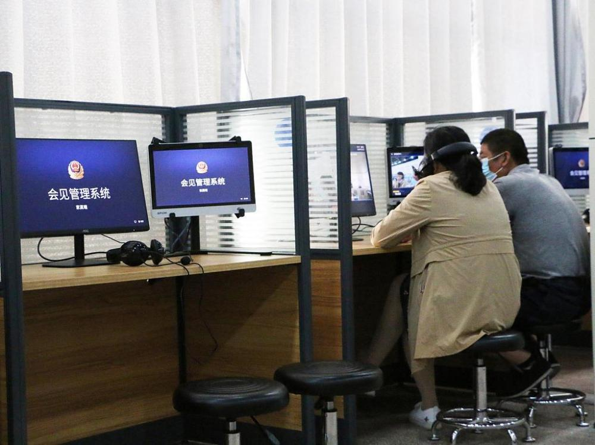

# 河北“亲情会见”，隐秘的监狱视讯生意

 _疫情期间某地监狱提供的视频会见服务。图文无关。 （视觉中国/图）_

2023年8月7日，有网友爆料称，河北省有监狱采用了一款供服刑人员和家属远程视频的手机应用，每次通话20分钟，收费50元，牵出一门隐秘生意。该网友发出的截图显示，这款应用名为“亲情会见”。

据微信公众号“亲情会见”发布的“视频会见流程”图，该平台向河北女子监狱等14所监狱提供服务。平台背后的运营公司名为河北立驰信息科技有限公司（下称立驰信息）。

在此之前，为河北省各监狱提供远程视频会见服务的公司名叫山东中磁视讯股份有限公司（下称中磁视讯）。

据河北新闻网报道，2017年12月27日，河北省监狱远程视频会见系统启动仪式在保定监狱举行，由河北省司法系统向中磁视讯购买。

中磁视讯于2014年1月在新三板挂牌，当时与其合作的监狱已有140余所，到2019年底，该数字增长到400余所。2021年，中磁视讯退市，差不多同一时间，“亲情会见”进入河北各监狱。

部分监狱查不到公开招标

天眼查显示，立驰信息成立于2019年6月，实缴资本仅20万元，注册地址位于河北省石家庄市。公司由吴秀岩100%控股，监事为吕姗姗。

2023年8月10日，立驰信息的官网已无法打开。据澎湃新闻报道，立驰信息官网介绍，其自主研发的监狱远程视频会见平台，于2020年11月在河北省监狱系统部署完毕，并上线运营，到2021年7月底已累计完成6万人次罪犯会见。

据公众号“亲情会见”，立驰信息为河北女子监狱、鹿泉监狱、出监监狱、未成年管教所、保定监狱、冀中监狱、定州监狱、深州监狱、衡水监狱、沧南监狱、隆尧会见、邢台监狱、沧州监狱、太行监狱合计14所监狱提供视频会见服务。

但根据采招网，立驰信息的中标结果未囊括上述所有监狱。

中标结果显示，立驰信息在2020年至2023年间，中标过河北省女子监狱、河北联宇实业集团、河北省沙河监狱、河北省深州监狱、河北新世泰机械有限公司的项目。

天眼查显示，上述河北联宇实业集团、河北新世泰机械有限公司均由河北省监狱管理局100%控股。

其中，据河北省女子监狱会见管理平台采购中标公告，立驰信息中标价格为32.3万元，供货期为20日历天。

针对立驰信息是否中标等问题，南方周末记者致电河北省监狱管理局，接电话的工作人员表示，已把问题汇报上去，截至发稿，未获回复。

8月11日，“亲情会见”的客服电话已无法接通，提示来电者到公众号后台留言。

特殊行业领跑者

据河北新闻网，2017年底，河北省首批8所试点监狱视频会见系统建设完成，并于2018年在全省30余所监狱实现全覆盖。

为河北省提供视频会见系统的是中磁视讯，后者是当时市场上的“隐形冠军”。

中磁视讯起家于山东济南，前身为山东中磁远程监控技术有限公司，成立于2005年。

据公开转让说明书，中磁视讯的主营业务是为监狱提供“特殊群体社会帮教系统”，并收取运营服务费，该系统包括亲情桥非即时信息、VOD视频点播、图书屋等模块。

其中，亲情桥非即时信息为0.25元-0.5元/条，其它单项模块均为5元-20元/月。

中磁视讯在公开转让说明书中透露，由于公司涉足的是一个不为大多数企业所了解的特殊行业，公司占有着较高的市场份额。公司的业务范围已辐射全国17个省份，是监管场所特殊群体教育改造领域中的领跑者。

从2007年起，中磁视讯采取“设备(系统)投入、服务运营、使用产出、资金回收”的商业运作模式，通过免费投入帮教服务系统，在一段时间内(一般为5-8年时间)收取运营服务费，实现业务收入及获得盈利。

换言之，中磁视讯给监狱提供的设备是免费的，收入主要通过收取服务费获得。

2011年、2012年、2013年上半年，中磁视讯前五大客户分布的地区都有河北，来自河北地区的客户分别贡献了508.62万元、570.23万元、325.67万元的营收，占比分别为22.19%、14.63%、12.82%。

值得一提的是，中磁视讯在介绍公司的销售模式时表示，公司凭借多年来积累的行业经验，经过监管场所的综合考察(如通过借鉴其他监管场所已开展类似业务等方式)后，再与公司进一步协商合作的细节，协商一致后直接与公司签订合作协议，即不通过公开招标程序形式。

2015年底，中磁视讯表示“特殊群体远程视频会见系统”已在宁夏部分监狱投入试运营。截至2018年12月31日，中磁视讯的远程视频会见业务已在近170所监狱完成搭建。

赚的钱都买了设备

中磁视讯在新三板挂牌后，一直保持盈利。2015年-2018年，净利润分别为3315万元、5854万元、8500万元、1.02亿元。

但到2019年，中磁视讯的经营状况突然恶化。2019年公司实现营业收入2.78亿元，同比减少37.68%；净利润亏损4221.65万元，同比下降141.56%。

针对大幅亏损，中磁视讯在年报中表示，受疫情影响，暂时无法确认部分收入，故审计机构调减了未收回的项目。此外，公司的旧设备在2018年末进入报废期，新设备到位缓慢，影响了收入。

值得注意的是，中磁视讯的固定资产增长速度较快。2014年底，公司固定资产为1.5亿元，到了2019年末，已增长至7.67亿元。

2019年，中磁视讯还继续花大价钱购买设备。当年，公司向济南脉恒信息技术有限公司（下称济南脉恒）购买了设备、工程物资等3.04亿元，占采购总额的比例为98.57%。

自2017年起，济南脉恒就是中磁视讯的第一大供应商。2017年、2018年，中磁视讯从济南脉恒采购的金额分别为1.29亿元、1.79亿元，占采购总额的比例分别为30.62%、52.43%。

蹊跷的是，济南脉恒成立于2016年12月底，实缴出资额为0元，成立第一年就成为中磁视讯第一大供应商。中磁视讯的工商注册地就位于济南脉恒的楼下。

2019年年报的审计意见指出，中磁视讯实控人贾伟光与济南脉恒互相提供担保，已共同被列为被执行人，无法判断双方是否存在关联关系。

这份年报公布后，中磁视讯股价暴跌。

根据公告，贾伟光于1983年毕业于山东大学光学专业，毕业后先任天津光学仪器厂二九车间助工，后在天津职业技术师范学院工作。目前，贾伟光为失信被执行人。

南方周末记者 封聪颖

