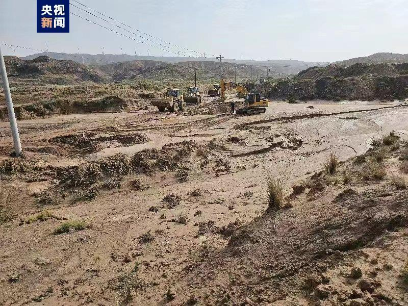
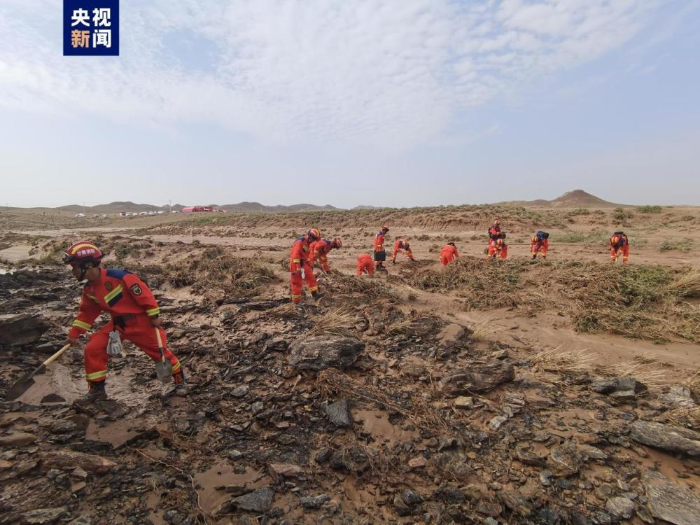

# 甘肃景泰山洪灾害5名失联人员全部遇难

来源：央视新闻客户端

据甘肃省白银市景泰县相关部门消息，8月10日0时40分许，甘肃省白银市景泰县喜泉镇大水䃎村马场山区域，7名群众在野外突遇山洪，5人被洪水冲走失联。

截至昨天中午，已找到4名失联人员，确认遇难。今天上午8点05分，经过36个小时不间断搜救，最后一名失联人员找到，但已无生命体征，搜救工作结束。

据当地干部介绍，7名群众中，6名为喜泉镇兴泉村村民，1名是芦阳镇芦阳村村民，当晚结伴前往山中找寻家中的80多只羊，并将驾驶车辆停在山下河道。突降暴雨后，7人进车避雨，不慎遭遇山洪来袭河水暴涨，其中一台车辆冲上滩涂，2人成功获得救援，另一台车卷入山洪，5人失联。（总台记者
王妍 卢山）

