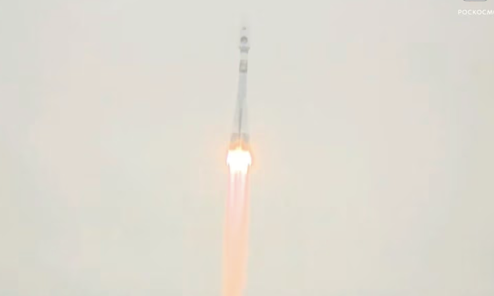
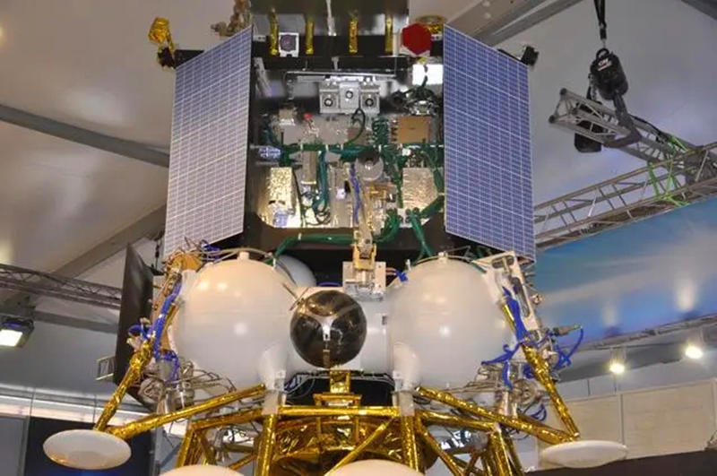

# 着陆月球南极，俄印都想争第一？两国均已发射探测器，结果月底见分晓

据央视新闻报道，莫斯科时间11日凌晨2时10分许，俄罗斯载有“月球-25”号（Luna-25）无人月球探测器的“联盟-2.1b”运载火箭，从位于远东地区的东方发射场发射升空。预计飞行持续约4天半后，探测器将进入环月轨道，之后将在数天内多次改变轨道，以便在月球南极地区着陆。

_▲“联盟-2.1b”运载火箭发射升空_

当地媒体报道称，“月球-25”号是自苏联解体后，俄罗斯制造出的首个月球探测器，且所有部件均为“国产”。这也是47年以来（即1976年）以来，俄首次发射月球探测器。

**印俄争“第一”？**

**专家：凸显月球南极区域价值**

鉴于月球南极地形的复杂程度，想在其表面实现软着陆非常困难，至今没有一个国家实现在月球南极软着陆。欧洲航天局月球探测负责人尼科·戴特曼介绍，月球南极有很多坑，想要实现在月球南极成功着陆，航空器的目标精确程度需达到100-200米，而现有的航空器很难达到这个标准。

据悉，如果一切顺利的话，“月球-25”号预计将于8月21日在月球南极地区着陆，其主着陆点位于博古斯瓦夫斯基环形山以北，备选着陆点位于曼齐尼环形山西南处和彭特兰环形山西南处。

有分析指出，“月球-25”号有可能比印度的“月船-3”号（Chandrayaan-3）探测器更早着陆，这意味着“月球-25”号有望成为首个在月球南极着陆的探测器。印度在7月14日发射了“月船-3”号探测器，目标同样瞄准月球南极，预计在完成预定的月球轨道缩减机动后将在8月23日着陆。

_▲印度于7月发射了其月球探测器“月船3号”_

研究太空地缘政治的蒂姆·马斯谢尔指出，如果此次俄罗斯“月球-25”号能成功完成任务，那将是俄罗斯在科技和科学领域取得的巨大成就。

卡内基基金会下的卡内基太空项目分析师本杰明·西尔弗斯坦表示：“俄罗斯和印度都计划在月球的同一片区域（即南极）着陆，这一事实凸显出月球上某些区域比其他区域更有价值。”

**首要任务是“找水”**

**分析：科学探索背后还有象征意义**

据介绍，“月球-25”号无人月球探测器的主要任务是研究月球软着陆技术、采集和分析月壤，并勘探月球上可能潜藏的水冰。

俄罗斯科学院太空研究所研究专家奥尔加·扎库特尼雅亚在谈到“月球-25”号的主要目标时指出，“其首要目标就是找到水，确认水是否存在，并研究其（水的）丰富程度。”

“月球-25”号任务科学设备综合体规划小组负责人、俄罗斯科学院太空研究所教授马克西姆·利特瓦克也表示，该探测器“不仅会在无人降落过、可能富含水冰的地方着陆，而且还要充分探索这些地方”。

 _▲“月球-25”号探测器_

报道称，一旦“月球-25”号成功实现软着陆，其所获得的发现也将是“历史性”的。因为科学家一直相信月球南极有丰富的水被锁在冰里，而水资源储备是供生命体生存所需氧气、饮用水，甚至是火箭燃料的关键资源，若一个国家未来准备进一步探索月球，水资源就显得尤为重要。

除了在科学探索方面的意义，有分析认为，“月球-25”号还具有象征意义。美国福特汉姆大学教授阿斯福·史迪奇认为，俄罗斯对“探月计划”的渴望可能出于多方因素，但其中最重要的一点可能是希望借此在全球舞台上展现国家力量。据此前报道，自俄乌冲突爆发后，西方国家纷纷制裁俄罗斯，相继宣布中止与俄罗斯的合作。

红星新闻记者 黎谨睿

编辑 郭宇 责编 李彬彬

