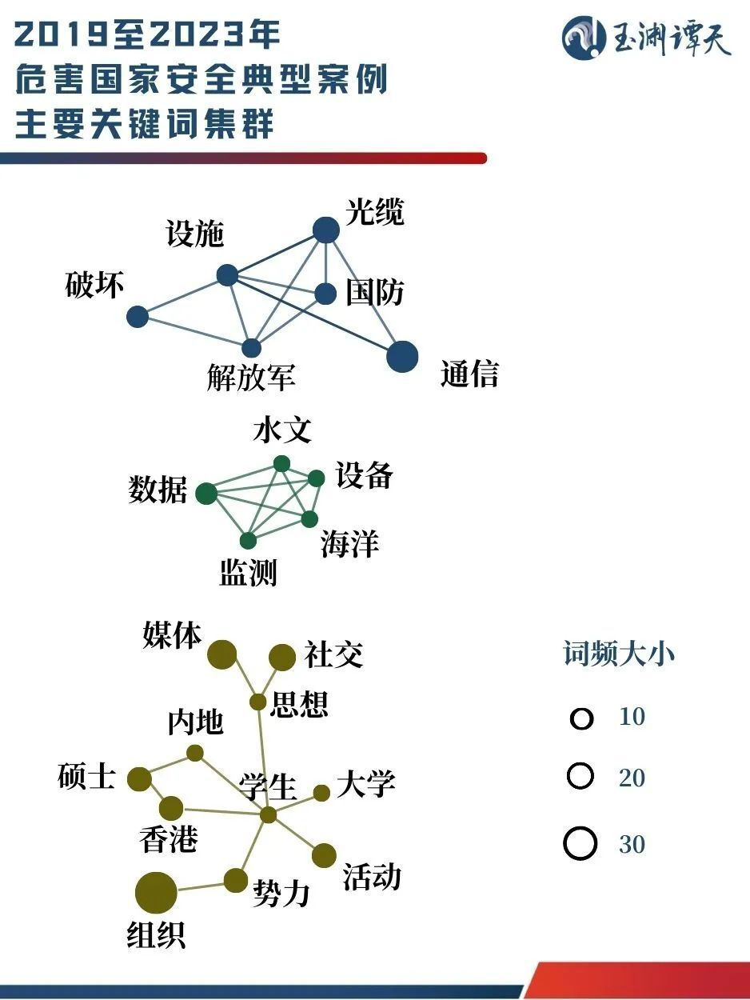

# 起底境外势力：有这些类型和渗透手段，正对中国发起一场“攻心”战争

不久前，美国中央情报局（CIA）局长伯恩斯在出席一场安全论坛时，说了这么一句话，美国重建在华情报网络已经取得进展。

其口出狂言不到一个月，我们就用行动进行了回应。

今天，国家安全部公开近期破获的一起美国中情局间谍案。这起案件有几个细节值得注意：

这名间谍原本是军工集团工作人员，被公派出国留学；

出国期间，其被美国中情局盯上，对方与其建立密切关系后，亮明身份要求其成为间谍，承诺给付巨额报酬并为其全家办理赴美移民；

此人同意成为间谍，并接受美方考核和培训；

这名间谍学成回国后，继续为美国提供情报。

这个案例中提到的美国中情局，就属于我们常说的境外势力。

那眼下的境外势力究竟还有谁，渗透手段有哪些，我们又应该如何防范？谭主找到了相关专业人士，他们给出了一些线索。

作为境外势力的典型代表，美国中情局一直在开展渗透中国的行动。

特别是这两年，美国中情局还专门成立了两个中心，“中国任务中心”和“跨国与技术任务中心”。

“中国任务中心”是美国中情局唯一一个针对单一国家设立的任务中心。“跨国与技术任务中心”则负责帮助美国间谍精进谍报技术，美国中情局特别重视人工智能技术在网络空间的应用，美国中情局随后任命的首席技术官，就来自硅谷。

由此，我们可以看出，美国对我们搞渗透有数字化的趋势。这在另一个部门也可以验证。美国国防部成立了一个办公室——影响力与认知管理办公室。在公开披露的材料里，可以发现，这个机构会通过数字化分析结果影响别国战略决策。

这给了我们一个启示，境外势力的内涵和外延，早已经发生变化。

谭主找到了李伟，他是中国国家安全的权威研究机构——中国现代国际关系研究院研究员。他告诉谭主，
**一般来说，境外势力包括境外间谍情报机关，东突、港独、台独、藏独等势力，反华媒体和部分境外所谓的非政府组织，还有一些境外敌对势力会伪装成境外商业机构。**

谭主搜集了近期国家安全机关公布的境外势力危害国家安全典型案例，制作了下面这张图。

境外势力能影响我们身边人，原因在于，普通人的活动空间通过网络和社交媒体得到了极大延伸，而境外势力很擅长在社交媒体空间埋线。

有些今天冒出来的事，可能是几年前埋下的种子。

国家安全机关前段时间公开的典型案例中，就有这样一个与社交媒体有关的：

一些社交媒体账号从2020年以来，先以介绍国外日常生活为幌子，吸引了众多粉丝。在此之后，这些账号开始夹带私货，频繁以造谣、诽谤的方式，发布抹黑我们国家形象的内容，甚至煽动教唆他人以暴力方式推翻政权。

在社交媒体，这些操纵手段已经超越了传统上集中化的“和平演变”路径，而呈现出多点开花、快速迭代、全平台联动的特点，潜移默化地通过信息操纵来影响我们的认知。

兰德公司的研究明确说，以前只有军事力量才能实现的某些目标，现在可以用网络空间的工具达成。

李伟提到，
**不论披着什么样的皮，美西方对中国的整个渗透活动有一个很重要的特点，那就是和相关国家的总体对华战略保持一致。这些国家的国家战略指向哪里，它的情报机构就会相应调整重心。**

这种调整，也正对应着认知的争夺。

谭主梳理了2019年至今危害国家安全的典型案例，根据关键词的共现关系，可以发现一些聚集的话题领域。

具体我们从图中的第一个集群，军事议题说起。围绕军事议题，境外间谍情报机关盯上我们重要武器装备研发的专家，搜集我们研制尖端武器的情况。他们还收买普通人观测我们的军港，指使其搜集军舰信息。

除了这样“硬碰硬”，情报搜集也在转向更不易被察觉的方向。就拿图上的第二个集群来说，其中涉及的海洋数据也与搜集军事情报有关。

一批可疑的外籍人员曾以“免费安装海水质量监测设备”为名，找上大连的一家普通养殖个体户。他们名义上是免费帮助养殖户监测水质，实际上，这些人用这样的幌子同时监测非开放海域的潮汐、海流等重要敏感数据。这些数据将为外国潜艇秘密潜入我国领海附近提供导航。

**除了这些传统的“物理攻坚”，还存在认知领域的争夺。它的主要手法有两个，一个是多部门精准配合协调一致，另一个是针对不同议题精心设计。**

我们对过去三个月涉我军的话题做了一个大数据分析，以中国人民解放军为关键词，将搜索范围限定为海外，得到了近2万条数据。可以发现，在高频话题中，美西方构建中国军事威胁的话题数量与中国军事援助的话题数量比例是8：1。

其中，除了美国国际媒体署下的美国之音、自由亚洲电台等反华媒体，炒作中国军事威胁，甚至编造我军谣言的触角更向外延伸，包括美国国防、情报各个部门。

**这种协调一致性的目标很明确，就是为了歪曲中国形象，并且要将这种形象传递给两类人：**

一类是除中美之外的国家，把中国描述成他们害怕的样子，制造外部矛盾。

大家应该都还记得今年香格里拉对话会，谭主在现场看到美国防长主动与中国防长握手，装出一副想跟中国交流的样子。但转头他就在会上说，中国在对亚洲国家制造军事威胁，并让反华媒体大肆配合炒作。

第二类就是中国人自己，通过建构与中国民众不同认知的形象，来制造内部矛盾。

实际上，这种认知争夺不只是出现在军事领域。从图上第三个集群可以看出，它在社会领域也相当胶着。

相关专业人士和谭主提到了境外反华媒体的一个常用手段：专门对中文和英文版本的报道做不同设计，定制化地引导认知。还有一些社交媒体账号，在十条中性的推送中，穿插一条误导性的推送。

大家的认知就在这样的过程中被影响了。中国人民公安大学国家安全学院副教授赵辉指出，
**根据他的观察研究，近几年境外反华媒体和外国间谍更加注重对社会领域的渗透和破坏。他们利用我们的社会矛盾、热点问题、重大事件，挑起社会冲突，制造群体的分裂。**

可以看出，境外间谍情报机构和境外反华媒体等多个机构正在军事、社会各个领域协同，对中国发起一场“攻心”的战争。

而在上图之外，还有一个话题，这两年也开始成为认知争夺的焦点，那就是经济。围绕这个议题，美西方协调一致的认知引导手法也已经露出马脚。

今年美国财长访华前，谭主发布了一个围绕美国“知情人士”的数据视频，其中唯一一个持续被美国“知情人士”拿来炒作的就是经济议题，它几乎每月都会出现，其中大多数都是围绕芯片和科技领域制裁的话题。

这些“知情人士”中，有一部分透露了单位，其中密集出现的单位就有五个——国会、国防部、白宫、联邦调查局
、司法部。美国政府上下营造脱钩氛围的协调一致性可见一斑。

总结起来，美西方对我们开展渗透工作，从传统的窃取国家机密和军事情报，到现在已经发展成为从认知层面影响人对事件的判断，制造线上、线下两个世界，通过改变我们对事情的预期，进而影响我们的决策。

面对美西方渗透之猖獗，中国对其一直都怀有戒心。

美媒曾披露，十多年前，中国系统瓦解了美国中情局在中国的间谍活动，对此，一些美国情报官员悲观认定，美国中情局的机密通讯系统已经遭到破坏。

随着美国间谍情报机关和其他协同部门转变战术，开始通过社交媒体环绕在我们周围开展认知争夺，那我们应对的手段也必须相应变化。

不过，万变不离其宗， **想要不被别人改变认知，关键是得有清晰的思想和认知坐标。**

我们是怎么做的？

在美国中情局成立“中国任务中心”的2021年，中国面向世界提出“全球发展倡议”；在美国国防部成立影响力与认知管理办公室的2022年，中国面向世界提出“全球安全倡议”。

统筹发展与安全，这就是中国的基本坐标。

没有发展，我们就没有维护国家安全的物质基础，而如果没有安全，我们的发展成果很可能一夜归零。

就像当你关心你的自行车车闸灵不灵时，其实你是想骑得更快一点。我们现在去起底认知争夺这一安全问题，就是为了更好地发展。

我们已经看清楚了，美西方针对中国开展认知争夺的领域与遏制我们发展的重点领域完全一致。

我们跨越了5000年的历史走到今天，不能动辄被一个5秒钟的视频带跑偏了。

**在此基础上，我们还需要建立起广泛参与、共同防范的新模式。**

上个月，新修订的《反间谍法》正式生效。

中国政法大学诉讼法学研究院院长熊秋红介绍，
**这次修订很重要的一点，是建立反间谍工作的支持体系。国家安全机关作为反间谍的主管机关，现在更加强调对间谍行为的防范，这就需要各个相关部门的协调和每个公民支持。**

大家也都注意到了，这个月，国家安全部通过社交平台发布文章，进一步走上前台。国家安全机关在开展隐蔽工作的同时，越来越重视公开性。

这说明，社交媒体的认知争夺确实已经迫在眉睫。

面对社交媒体繁杂的信息，如果我们都多问一句，是这样吗，那他们的谎言就会经历多一次的检验。当人人都手握麦克风，如果我们多问一句，是真的吗，那他们的阴谋就多了一分被揭露的希望。

**应对美国间谍情报机关和其他协同部门，必须还要依法惩戒。**

熊秋红提到一个细节，新修订的《反间谍法》的管辖范围在扩大。

**｜｜** 主体范围在扩大，现在建立间谍组织，参加间谍组织，主动去投靠间谍组织及其代理人，都算间谍行为；

**｜｜** 行为范围在扩大，特别是针对网络间谍，比如网络攻击、破坏我们的关键信息基础设施等。

我们已经到了最关键的时候，捍卫国家安全，一步都不能让，一步都让不了。

面对美西方的渗透，中国人的工具箱是充足的。今天我们依然走在发展的正途，依然屹立于世界东方。

中国人是不好惹的，惹了是不好办的。

