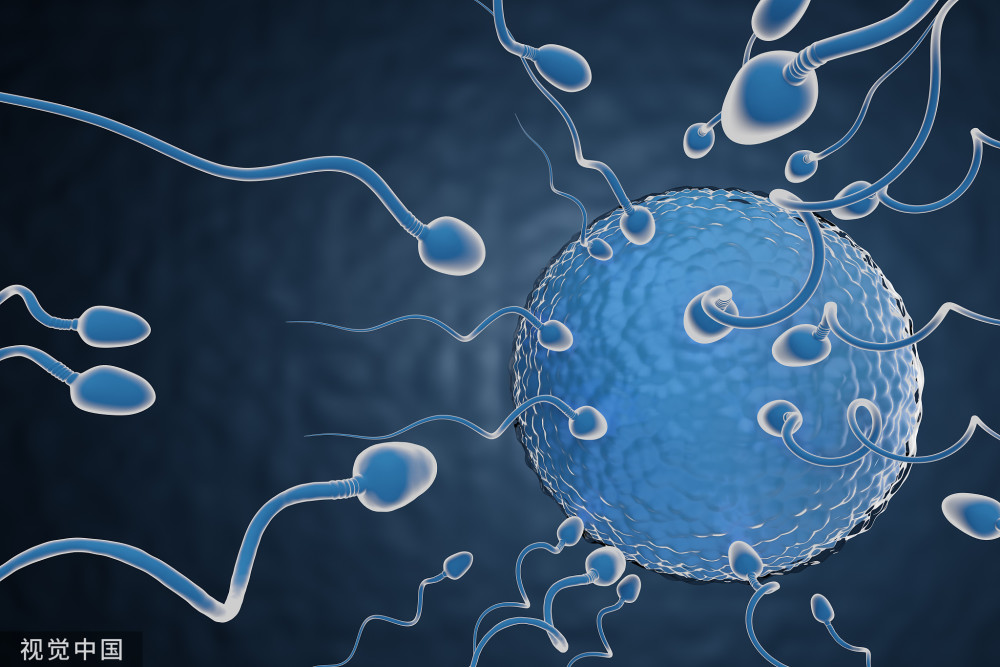
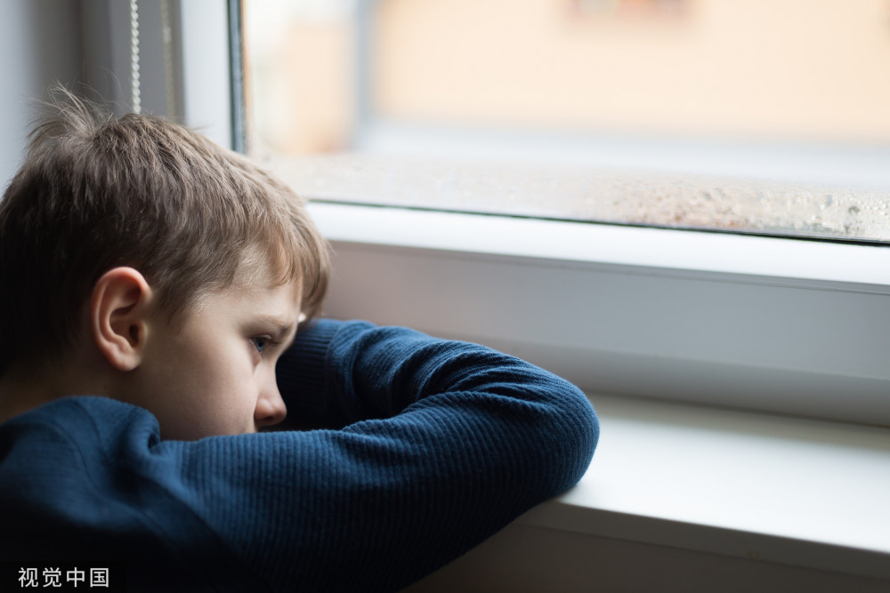

# 轻症新冠感染也会导致生育力下降？有人500天后仍然没有改善

**每周看点：**

  * _1_ 即使只是轻症，新冠病毒也可能会损害精液质量
  * _2_ 长新冠症状“脑雾”相当于衰老10岁
  * _3_ 大流行阻碍了英国儿童的社交和情感成长

据外媒报道，根据美国疾病控制与预防中心（CDC）最新估计， **新冠病毒奥密克戎亚变体EG.5成为美国最主要的毒株，约占该国新病例的17%**
，而另一个最常见的毒株XBB.1.16
占病例的16%。8月9日，由于EG.5在全球的稳定增长，世界卫生组织将其从不太令人担忧的“受监测变体”类别升级为“受关注变体”。“三阳”要来了吗？目前还没有答案。在这篇文章中，我们整理了一些有关新冠病毒的最新研究，让你更深入地了解这种“未曾远走”的病毒。

即使只是轻症，新冠病毒也可能会损害精液质量

在丹麦举办的欧洲人类生殖和胚胎学学会（ESHRE）年会上，科研人员报告了一项针对未接种新冠疫苗的男性的小型研究，表示在轻度感染新冠病毒超过3
个月后，精液质量仍然受损。

 _图源：欧洲人类生殖和胚胎学学会（ESHRE）年会官网_

参与研究的45 名男性年龄从 18 岁到 46 岁不等（中位数31 岁），均为新冠病毒轻症感染。与感染新冠前的检测结果相比，这些参与者在感染新冠后100
天（中位数）的检测结果显示，他们的精子数量较低，运动速度较慢，整体精子质量较低。

参与者的各项精液参数在感染新冠病毒后显著恶化：

● 精液量减少 20%（从 2.5 降低至 2 毫升）

● 精子浓度降低 26.5%（从 68 降低至 50 百万/毫升 精液）

● 精子数量减少 37.5%（从 160 降低至 100 百万/毫升精液）

● 精液总活力降低 9.1%（49.5% 降低至 45%）

● 活跃精子数量减少约 5%（80% 降低至 76%）

研究人员在比较感染后 100 天以内和超过100天后采集的精液样本时没有发现差异。研究人员解释说，产生新精子大约需要 78
天，最开始他们假设一旦产生新的精子，精液质量就会改善，但事实并非如此。

研究人员也不清楚精液质量需要多长时间才能恢复，即使这些男性只是轻症感染，新冠病毒也可能造成永久性损害些参与者的精液质量在 500
天后仍然没有改善，研究人员拟对这些患者进行长期监测。

**幸运的是，虽然观察到精子质量下降，但这些男性的精子质量仍然处于可以自然受孕的范围内。**

研究者表示，此项小型研究的研究结果可能不适用于其他群体。早前的研究发现，对新冠病毒严重感染的男性进行的尸检发现与感染相关的睾丸损伤。在比利时进行另一项研究显示，未接种疫苗的轻症感染者男性的精液检测值受损，但在
3 至 6 个月后恢复到基线水平。然而，新冠病毒到底如何影响精子细胞的机制尚不得而知。
**对于任何试图怀孕的夫妇来说，在感染新冠病毒后，进行生育力检测可能十分重要。**

长新冠症状“脑雾”相当于衰老10岁

对于一些人来说，新冠感染似乎一直“没好透”，他们感觉自己“变笨了”，反应迟钝，记忆力下降，大脑动不动就“卡壳”，出现了被称为“脑雾”的长新冠症状，这是一种认知功能的损害。

最近《柳叶刀》出版的临床杂志的研究发现，与长新冠相关的所谓“脑雾”的症状相当于衰老10岁。

伦敦国王学院的研究人员调查了新冠病毒对于记忆力的影响，发现症状超过三个月的阳性感染者个体认知障碍最严重，自第一次感染后，一些人个人感觉尚未完全康复，症状已持续近两年。

这项研究通过一个智能手机的应用程序招募了超过5,100 名来自新冠症状研究生物库的参与者。研究人员通过12 项测量速度和准确性的认知测试，检查参与者
2021 年和 2022 年两个时期的工作记忆、注意力、推理和运动控制能力。

在 2021 年 7月和 8月的第一批共3,335 名的参与者中，研究人员发现新冠阳性感染者认知得分较低，其中，症状超过 12
周的感染者认知得分下降最大。这些影响与“年龄增加约10岁”或“表现出轻度或中度心理困扰症状”的影响相当。

同时，这一影响小于其他的一些因素例如“教育程度较低”或“疲劳水平高于阈值”等的影响。在 2022 年 4 月和 6 月，也就是第一批的九个月后，第二批的
1,786 名参与者的分数没有显着提高。

**研究发现，从新冠感染中完全康复的人没有认知障碍，即使是症状超过三个月的人** ，这该研究的主要作者称这是一个“好消息”。

截至 2023 年 1 月，约有 200
万生活在英国的人自我报告经历长新冠（感染后症状持续超过四个星期）。常见的症状包括疲劳、注意力不集中、呼吸短促和肌肉疼痛。研究者表示，有必要监测那些大脑功能受新冠病毒影响最严重的人，以了解他们的认知症状如何继续发展，并为康复提供支持。

_图源：新华社图片_

大流行阻碍了英国儿童的社交和情感成长

最近，一项针对英国家长的调查显示， **在新冠大流行的第一年，一半儿童的情感和社交发展受到阻碍，年幼的孩子比其哥哥姐姐更有可能受到负面影响。**

研究人员对居住有 4 至 16 岁孩子的6,095 名父母进行了调查。父母回答了 13 个有关孩子行为的问题，在 2021 年 2
月以及之前一年内，孩子们表现出担心的频率、有多容易失去信心和发脾气。

近一半的父母(47%)表示，他们的孩子在 2021 年会比 2020 年遇到更多的社会情感困难。来自不同家庭背景的儿童都受到了影响，4 至 7
岁的儿童社交和情感发展倒退的可能性比 12 至 15 岁的孩子高出 10 个百分点（分别为52% 与 42%）。

**父母的工作因疫情而改变的孩子，他们的社交和情感技能也更有可能倒退，** 新冠大流行的第一年只有六分之一的儿童的社交和情感发展得到了改善。

研究者称，大流行期间，孩子们经历了许多变化：学校关闭、与朋友和家人缺乏联系、亲人可能患上毁灭性的重病或死亡；无论是否导致了巨大的收入损失，父母的经济中断无疑是儿童技能下降的一个重要驱动因素。研究结果提醒人们，大流行带来的家庭经济不确定性可能会产生多代人的影响，弥补儿童们在大流行期间失去的学习机会非常重要，需要更多的照顾和关注。

**感染新冠是否改变了你的日常生活？评论区一起来聊一聊吧。**

来源：

https://www.theguardian.com/world/2023/jul/21/long-covid-brain-fog-
ageing-10-years-study

https://www.theguardian.com/world/2023/aug/01/pandemic-set-back-social-and-
emotional-growth-of-children-in-england-study-finds

https://www.medpagetoday.com/infectiousdisease/covid19/105312

