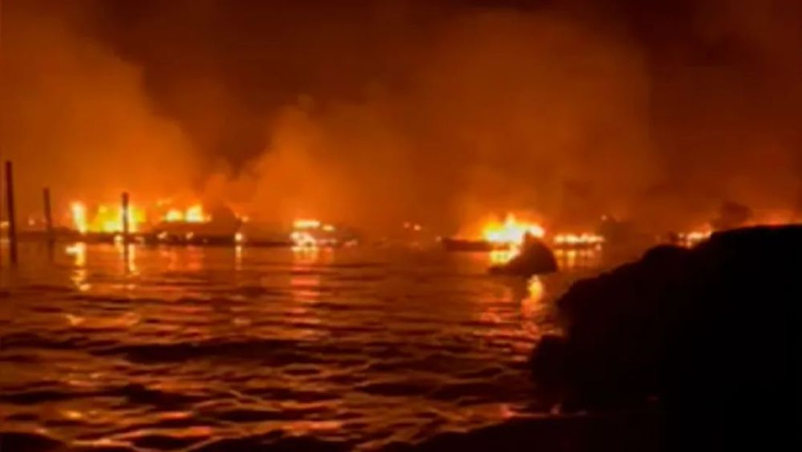
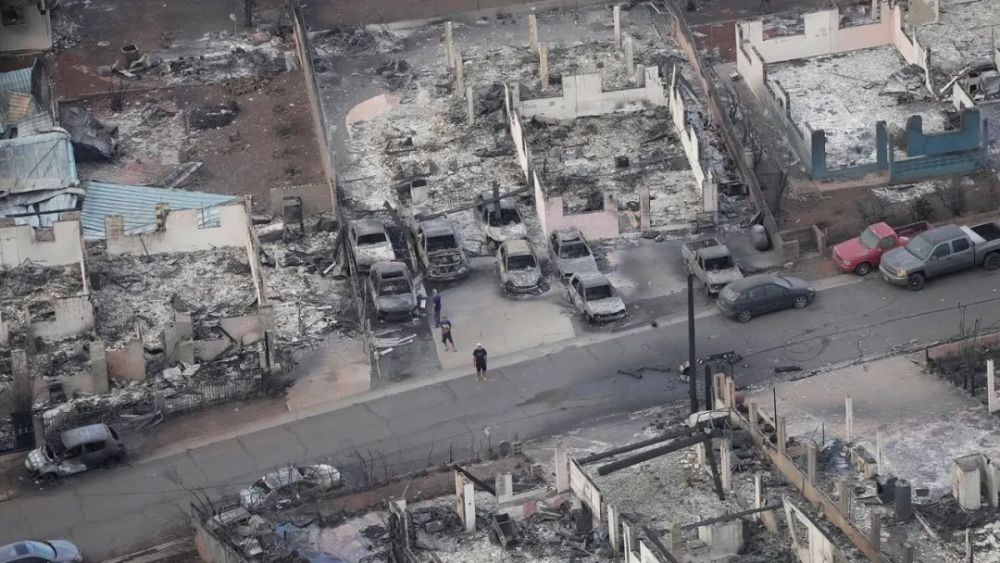

# 野火肆虐，居民被迫跳海逃生...夏威夷进入“重大灾难状态”

从旅游名胜到一片废墟，短短三天时间，疯狂肆虐的野火让夏威夷毛伊岛面目全非。目前，这场仍在持续的野火已造成53人死亡，失踪人数尚无法估算，上万人被迫疏散，超过1000栋建筑物被毁，历史文化小镇拉海纳几乎“消失了”。

美国总统拜登10日批准了该州进入“重大灾难状态”。夏威夷州州长乔希·格林说，这是自1960年大岛海啸以来该州最致命的自然灾害，而随着搜救行动的继续，死亡人数可能进一步攀升。

**几乎来不及逃生**

“火焰来得太快，整栋建筑在几分钟内就被烧毁了。”在拉海纳，死里逃生的幸存者这样告诉美媒记者。小镇居民博斯科·裴8日晚在脸书上发布了现场视频：火警响起，风吹火花呼啸而过，几乎烧毁了街上的每一栋建筑。迅速蔓延的大火留给人们的行动时间只有几分钟，大约100人不得已跳入太平洋逃生。

来自危地马拉的厨师马龙·瓦斯奎兹说，听到火警时，他们已经来不及开车逃离了，“我打开门，火几乎烧到了身上。”

弃车逃生的瓦斯奎兹与兄弟爱德华以及一大群人在街上“狂飙”，与大火“赛跑”。“我们跑了又跑，几乎跑了一整晚，一直跑到第二天，而大火没有停止。”

目前，他们待在一家体育馆的疏散中心里。因为吸入有毒烟雾，瓦斯奎兹开始呕吐。他说，他不确定他的室友和邻居们是否安全。

_一段从船上录制的视频显示，周二晚，在拉海纳，陆上建筑和水中船只起火。图源：Emma Nelson_

与此同时，当地医院挤满了被烧伤和吸入烟雾的病患，多地电力、信号中断，交通拥堵，心急如焚的居民和游客疯狂寻找失散亲友。

加州居民金伯利·布恩正焦急地寻找她79岁的父亲莫里斯，一名居住在拉海纳镇，视力和腿脚都不好的退休渔民。

布恩说，“我一直在查找人员名单，翻看社交媒体，关注避难所的所有人，也打电话给了红十字会。我不知道还能做什么。”

毛伊岛官员在卡胡鲁伊社区中心开设了一个家庭援助中心，寻找下落不明者。毛伊岛应急管理局将发放表格并帮助搜寻失踪人员。

**名胜小镇几乎消失了**

拉海纳镇是本次野火的重灾区，曾经的活力社区如今一片灰黑。美联社记者从飞机上俯瞰，街上到处是瓦砾和地基，还有烧焦的车辆，一所小学掩映在倒塌的钢材中。

“一切都没有了。”毛伊岛市长理查德·比森周四说，拉海纳镇的中心地带已被完全摧毁。

正在该镇的美国有线电视新闻网记者比尔·威尔报道称：“拉海纳镇彷佛发生了炸弹爆炸。”

“我的眼睛在燃烧，我的城市在空中炸开”“我们失去了拉海纳”……心碎的小镇居民难掩悲伤。

_10日的航拍画面显示夏威夷拉海纳被烧毁的房屋。图源：美联社_

据夏威夷州州长乔希·格林估算，毛伊岛野火造成的毁灭性破坏需要多年时间和数十亿美元才能重建。

**干旱、强风加剧灾难**

据悉，此次毛伊岛野火已成为2018年加利福尼亚州坎普大火以来美国境内最致命的野火，那场火灾造成至少85人死亡。

虽然本次大火的起因尚未确定，不过，美国国家气象局认为强风、低湿与干旱的植被都增加了野火风险。

根据美国干旱监测机构周四发布的数据，夏威夷过去一周干旱加剧，导致火灾蔓延。毛伊县的严重干旱率从上周的5%上升到16%，而全州的中度干旱率从6%上升到14%。

干涸的土地和植被为野火提供燃料，而飓风“朵拉”带来的强风令火势蔓延，引发致命后果。

据美媒报道，目前，本次野火尚未完全扑灭，救援和清理工作仍在紧张进行中。

**出品 深海区工作室**

**撰稿 王佳烨**

