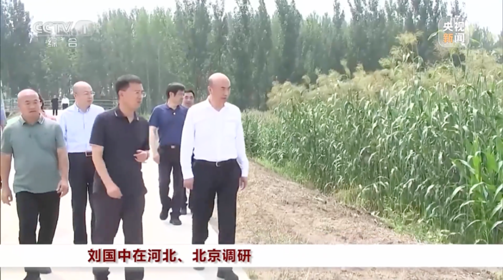
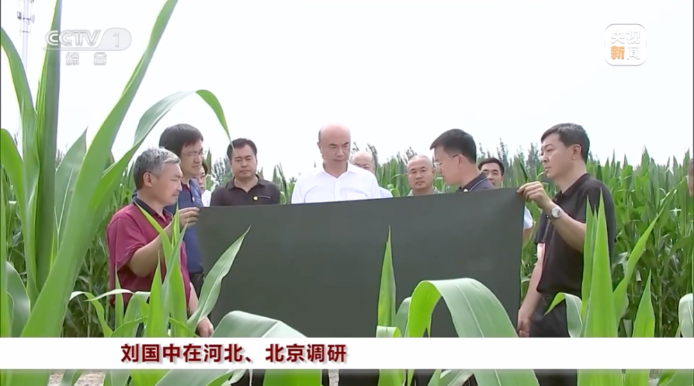
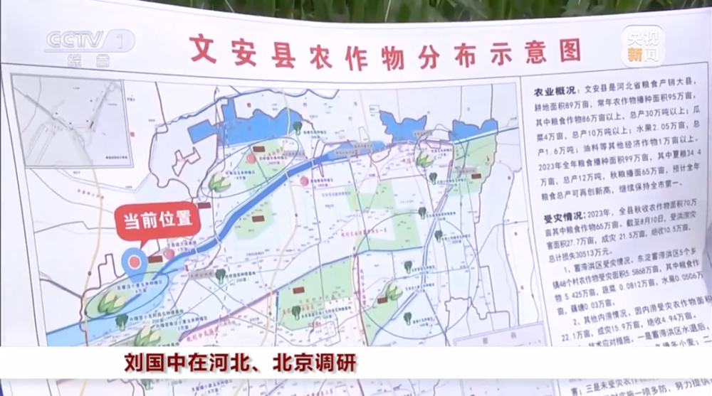
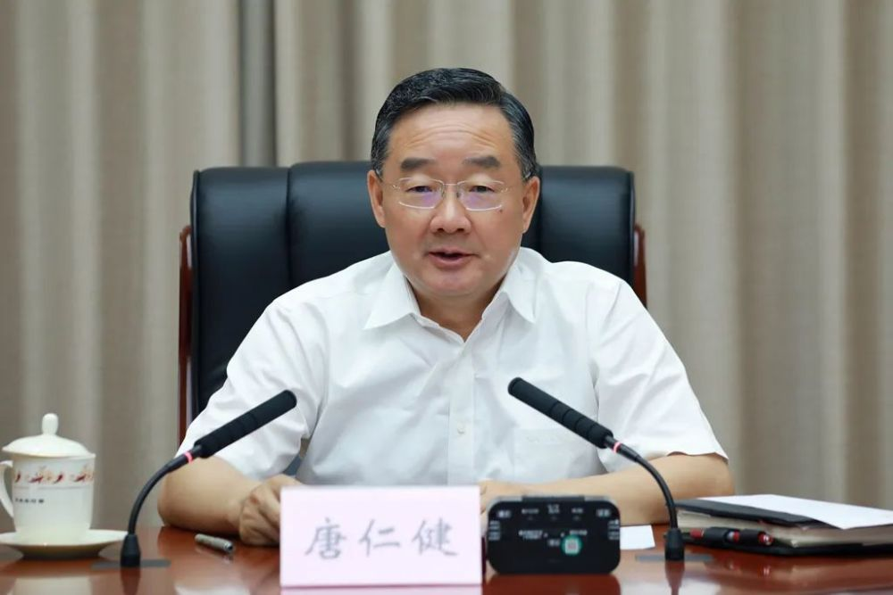

# “十分重要和紧迫”！国务院副总理刘国中下地看玉米长势

**撰文 | 余晖**

8月11日，中共中央政治局委员、国务院副总理刘国中到河北、北京调研，他调研的内容是“灾区卫生防疫和农业生产恢复工作”。

在京津冀、东北地区遭受洪涝灾害之后，如何确保大灾之后无大疫和全年粮食丰收，是当前的一个重点工作。

**现场**

政知君注意到，此次遭受洪灾的河北、吉林、黑龙江等地，都是粮食主产区。

受台风“杜苏芮”影响，河北全省多地遭受洪涝灾害，部分农田冲毁，农作物、畜禽、水产品和农业设施不同程度受损，给农业生产带来不利影响。

此次在河北、北京调研期间，刘国中强调，要“ **采取有力有效措施扎实抓好灾区卫生防疫和农业生产恢复** ”。

刘国中先后到东淀蓄滞洪区和受灾村庄，详细了解蓄滞洪区运用、农作物受灾和农业防灾减灾等情况，实地察看玉米长势。

央视还披露了现场画面：

新闻画面显示，刘国中现场了解了河北省文安县农作物受灾的情况。

根据《文安县农作物分布示意图》显示，文安县是河北省的粮食产销大县。今年全县秋收农作物面积70万亩，其中粮食作物65万亩。

截至8月10日，该县受洪涝灾害面积27.7万亩，成灾21.5万亩，绝收10.5万亩，总计损失30513万元。

在调研期间，刘国中表示， **当前正值秋粮产量形成关键期，抓好农业灾后生产恢复十分重要和紧迫。**

他提到：

要 **迅速组织动员农民因地制宜开展在田作物生产恢复** ，受损较轻的要适时补肥扶壮，仍有积水的要及时排涝除渍，因灾绝收的要加快补种改种，
**尽最大努力减少损失，没有受灾的要力争多增产。**

要 **抓紧修复受损农业生产设施** ，加强农资供应和农机组织调度，保障农业生产恢复需求。

要扎实做好 **死亡畜禽无害化处理** ，严防病原外溢和污染环境。

要落实责任、落实举措，强化因灾返贫致贫监测和帮扶， **确保不出现规模性返贫** 。

有关部门要加大支持力度， **尽快落实农业救灾资金** ，强化信贷和保险理赔服务，帮助受灾地区加快恢复农业生产。

**农业农村部部长赴河北**

另外，近期，农业农村部党组书记、部长唐仁健也到了河北。

8月8日，唐仁健到河北调研了农业抗灾救灾。

农业农村部提到， **河北蓄滞洪区、行洪区秋粮生产受洪涝影响较重；多个受灾地区的高标准农田和农业设施等出现不同程度损毁，灾后重建任务较重。**

在廊坊市霸州市霸州镇的东淀蓄滞洪区，唐仁健实地察看了水淹受灾较重地块。

他强调，当前受涝地区的当务之急是尽快排涝降渍，要抢排田间积水，尽可能减轻作物受灾损失，确保不影响冬小麦播种。

他还提到，对受淹地块，要根据不同受灾程度和作物生长发育进程，有针对性地制定生产恢复技术指导意见，组派工作组和科技小分队，进村入户提供精准服务，落实好“一喷多促”、追施肥等田管措施，促进在田作物恢复生长，绝收地块要因地制宜及时改种补种短生育期作物。

他说， **各级农业农村部门要精准摸排农户受灾情况，帮助受灾农民群众解决实际困难，防止出现因灾致贫返贫。**

8月9日，唐仁健主持召开专题会议。

会议提到，
**近期华北、黄淮和东北地区极端强降雨引发洪涝灾害，给农业生产造成较大影响，特别是蓄滞洪区和行洪区等区域受灾较重，近日东北部分地区还可能遭遇台风等极端天气，防灾减灾形势严峻。**

会议还提到，要一手抓受灾地区排涝救灾，尽最大努力减轻灾害损失，一手抓未受灾地区秋粮田管，全力以赴提升单产，力争以丰补歉。

防灾救灾资金也已经紧急下达。

8月8日，财政部、农业农村部紧急下达农业生产防灾救灾资金7.32亿元，支持北京、天津、河北、山西、内蒙古、吉林、黑龙江、浙江、福建9省（区、市）及北大荒农垦集团等，抓紧开展农业防汛救灾及灾后农业生产恢复等相关工作。

8月9日，财政部、水利部紧急预拨10亿元，对国家蓄滞洪区运用期间群众的农作物、专业养殖、经济林、住房、家庭农业生产机械等水毁损失予以补偿。

**金壮龙、李云泽赴灾区**

政知君注意到，目前，灾后恢复重建是北京市、河北省工作的重点之一。最近这几天，北京、河北先后明确了灾后重建思路。

北京市提到，全市将统筹规划，全面做好灾后恢复重建工作，总的思路是：一年基本恢复，三年全面提升，长远可持续发展。

河北省明确，计划用两年时间完成重建工作；2024年汛期前，全面完成水毁防洪工程重建工作；2025年汛期前，完成各项重建任务。

近期，除了农业农村部党组书记、部长唐仁健之外，工业和信息化部党组书记、部长金壮龙，金融监管总局党委书记、局长李云泽也先后到灾区调研督导了灾区恢复重建等工作。

8月10日，金壮龙赴北京市门头沟区， **详细了解北京地区通信设施受损和抢通抢修恢复情况。**

他提到，全力修复受损通信设施，尽快将北京全域通信服务恢复至正常水平，“科学谋划通信设施灾后重建工作，提升设施防护等级，加大装备预置力度，加强新技术新产品应用，提升应急通信保障能力”。

8月10日至11日，李云泽带队先后赴北京市门头沟区、房山区和河北省涿州市， **调研督导保险理赔和金融支持灾后恢复重建工作。**

在北京市，李云泽一行来到受灾严重的门头沟区南辛房村、房山区中粮健康科技园、房山区保险理赔车辆停放场，实地察看灾区车辆、房屋、道路桥梁受损情况，详细了解财产损失和理赔情况，现场办公推动解决相关难题。

在河北省涿州市，李云泽一行走访察看河北智沃新农业发展有限公司、东城坊镇宁村大棚及周边农田受损和理赔情况，倾听企业和农户迫切诉求。

他强调，当务之急是全力以赴做好保险理赔工作，要坚持“特事特办，急事急办”原则，最大限度简化理赔流程和手续，开辟“绿色通道”，切实做到能赔快赔、应赔尽赔。

**资料 ｜ 新华社 人民网 央视 河北日报 农业农村部官网等**

**【版权声明】本文著作权归政知新媒体独家所有，未经授权，不得转载。**

