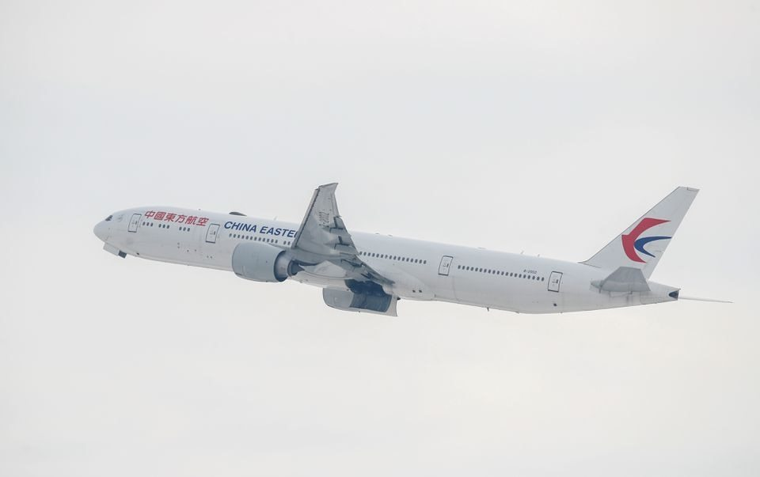
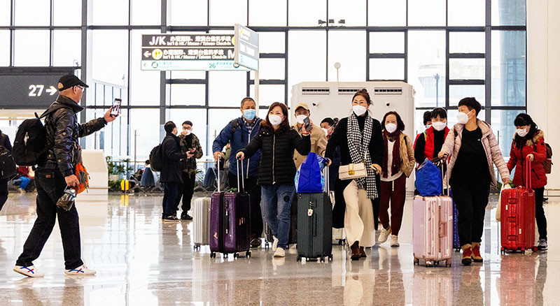

# 中美批准每周往返两国客运航班数量增加一倍，达每周24个

【文/观察者网 熊超然】“这是世界上最大的两个经济体之间罕见的合作迹象。”当地时间8月11日，路透社报道称，美国和中国将批准两国之间的客运航班数量增加一倍。

美国交通部当天宣布，从9月1日起，将允许飞往美国的中国客运航班数量增加到每周18个，从10月29日开始，将允许飞往美国的中国客运航班数量增加到每周24个，而目前的数量则为每周12个。路透社还称，中方也将同意美国航空公司的同等航班数量增幅。

报道称，尽管中美两国目前仍在许多方面存在分歧，但有关往返两国航班数量这一决定的作出，正值中国于8月10日公布了恢复出境团队游的第三批国家和地区名单，其中美国、日本、韩国和澳大利亚等国在列。

_资料图：2018年11月30日，中国东方航空一架客机从美国伊利诺伊州芝加哥奥黑尔国际机场起飞_

据报道，美国交通部表示，第一批增加的航班已批准于9月1日启动，“以满足学校开学前后预期的需求增长”。不过，消息人士称，预计美国航空公司不会立即利用所有18个每周航班数。

美国交通部在批准指令中表示：“我们的首要目标是改善环境，使双方的航空公司能够充分行使其双边权利，以保持竞争平衡，并在美中航空公司之间保持公平和平等的机会。”

同时，美国交通部还强调，在美国国务卿布林肯6月访华之后，美国国务院、交通部和中方官员的持续接触，“使这一重要进展成为可能”。此前，在布林肯6月访华并与中方官员会谈期间，双方同意鼓励扩大两国人文和教育交流，就增加中美之间客运航班进行积极探讨，欢迎更多学生、学者、工商界人士到彼此国家互访，并为此提供支持和便利。

路透社称，目前，包括中国国航和美联航在内的中美两国航司，都在寻求增加往返两国的航班班次。与此同时，中国东方航空、中国南方航空、厦门航空以及美国航空、达美航空目前也有往返中美两国的客运航班。

报道称，中国驻美国大使馆方面表示：“直飞航班对增加中美两国人民的互访至关重要，我们希望恢复更多航班将有利于两国之间的人员流动和贸易。”

_8月10日，文旅部网站发布《文化和旅游部办公厅关于恢复旅行社经营中国公民赴有关国家和地区（第三批）出境团队旅游业务的通知》_

路透社还称，尽管将每周客运航班数量增加了一倍，达到了24个，但这一数量与因新冠疫情而实施限制之前相比，仍然只是一小部分，当时中美两国允许150多次往返航班运营。

过去三年时间，受新冠疫情影响，中美航班大范围削减。2020年1月底，由于中国疫情较为严重，美联航、达美航空、美国航空等先后暂停了中美航线运营。国内航空公司在民航局“五个一”政策限制下，只保留少量中美航班的运营。

自今年1月8日起，我国正式对新冠病毒感染实施“乙类乙管”，各类国际客运航班管控措施悉数取消，中外航司纷纷宣布恢复或增加国际及地区航班。然而，在这样的局面下，中美航线依然是“纹丝不动”，与“乙类乙管”前的航班量保持一致，没有任何新增。

根据此前报道，当地时间5月3日，美国交通部曾发布指令称，批准中国的航空公司将每周往返中美的航班班次从8个增加至12个，这与美国的航空公司往返中美的航班班次数量相当。

英国《金融时报》当时报道认为，中国航司获准扩大赴美航班数量，这是中美关系处于不稳定之时，美方对中方做出的“小让步”（small
concession）。此前的4月30日，该报援引知情人士称，美国同意将每周中国赴美航班班次从8个增加至12个，但前提是中国赴美航班不得飞越俄罗斯领空，这使得中美航线完全恢复的谈判陷入僵局。由于美方提出无理要求在先，5月3日只是同意恢复到对等局面，《金融时报》所谓的“让步”其实并不成立。

**本文系观察者网独家稿件，未经授权，不得转载。**

