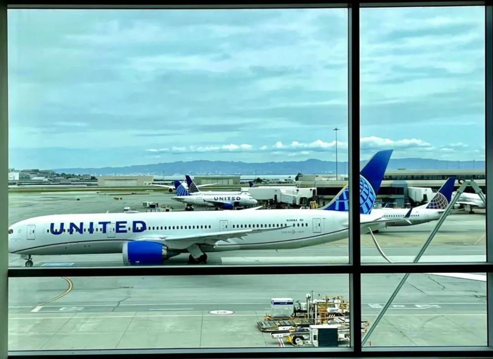

# 中美航班翻倍增加，去美国变得更容易了？

_中国的国际航班在平稳的恢复过程中，美联航是中国疫情后旅行限制取消后的第一家于今年1月底恢复中美直飞航班的美国航空公司。摄《财经》记者金焱_

**文｜《财经》特派记者 金焱 发自华盛顿**

**编辑｜苏琦**

在人们期待中美关系止跌回升之际，两国合作的绿灯亮起，双方将批准把航空公司在两国间获准执飞的客运航班数量增加一倍，中美航线的票价则有望进一步下降。地缘政治对国际航班往来是否密切，起着基础性和决定性作用，中美国际航班的恢复，重新回归直航时代，也有利于两国修复关系。

**当地时间8月10日，美国交通部发布最新通告，批准了中国的航空公司可进一步增加中美直飞航班。**
从9月1日起，将允许飞往美国的中国客运航班数量增加到每周18个，并从10月29日开始从目前每周12个增加到每周24个班次。在此之前的几天，中国刚刚批准恢复第三批到多个国家的出境游，其中包括美国，这也为中美增加航班提供了政策上的支持，而境外旅游是国际航班的主要客流之一。

美国交通部表示，中国政府将同意允许美国的航空公司增加同样多的班次。据悉，国航和东航已经向美国申请了新的中美航线增班。

消息一出，就引发了在美华人的大量讨论。今年4月《财经》记者从华盛顿飞北京时，由于此前的直航取消，导致过去13个小时的飞机变成经停三四个城市，费用也是过去的一倍多。大多数华人对《财经》记者表示，正是由于航班数量，尤其是直航班次少，带来了巨大的时间成本和票价成本，使其推迟了往返中美的计划。但相当一部分奔走于两国间的航班常客认为，即使航班增加，票价也不会回到2019年疫情前的水平。比如那时南航往返中美的商务舱价格是2000美元左右，现在已经涨了三倍，高达6000多美元。

有消息人士指出，中美之间疫情前的全盛时期，每周直飞航班量平均为340班，目前的航班量每周还不到40班。即将恢复的每周24个航班的数目只是2020年初因疫情而实施限制之前双方允许的150多个往返航班的一小部分。在疫情前，执飞中美航线的中国航司很多，但按航空公司来看，中国的三大航恢复得比较少。因为中国航司的客户主要是中国人和美籍华裔等，需求成为一个制约条件。

**另外，中美航线增班还有一个现实考虑是，美国的地面服务资源和人员还比较欠缺，要飞美国需要评估当地的资源是否能够匹配。**
虽然美国交通部表示，第一批增加的航班获准从9月1日开始，“以满足学年开始前后预期的需求增长”，但9月之后留学生已经开学，属于中美市场的淡季，航司要评估增加航班后的成本与收益，据此推测，美国的航空公司不会立即启用每周获批的所有的18个航班。

一份关于2023年前5个月的全球商务旅行回顾报告发现，有18.7%的航班预订属于商务舱，与2022年相比上升了3.6个百分点，与2019年同期相比也增加了3.2个百分点。但由于中美贸易和商务热度已今非昔比，商务旅行会在多大程度上因两国航班增加而回血，还是一个大大的问号。

6月18日，美国国务卿布林肯来华访问期间，中美双方同意鼓励扩大两国人文和教育交流，就增加中美之间客运航班进行积极探讨，欢迎更多学生、学者、工商界人士到彼此国家互访，并为此提供支持和便利。布林肯访华后，美国交通部和美国国务院与中国官员的持续接触“使这一重要进展成为可能”。
**美国交通部称，“我们的首要目标是改善环境，使双方航空公司能够充分行使其双边权利，以保持竞争平衡以及美中航空公司之间的公平与平等机会。”**
中国驻华盛顿大使馆要媒体向中国有关部门问询有关具体细节，但表示“直航对于增加中美两国人民之间的互访至关重要，我们希望恢复更多航班将有利于两国之间的人员流动和贸易。”

_单边主义、保护主义和地缘政治等风险因素更深层次左右了国际航班的恢复，中美直航的恢复有利于两国更多地互动。摄《财经》记者金焱_

最近中美两方的一些政策发布和表态，为中美间进一步增班提供了更乐观的预期。

**美国交通部10日表示。中国国际航空公司9日在提交给美国运输部的文件中表示，该公司正在寻求许可在北京和洛杉矶之间增加一个新的每周航班。**
最新的飞行计划具体是自2023年8月25日到10月27日间，申请增加一班每周五的北京和洛杉矶之间的往返航班。

受局部地区地缘政治的影响，部分国家的航空公司都需要绕路飞，飞行距离增加，成本也更高，愿意飞的航空公司更少。美国有部分航司并不急于增加中美航班，他们希望在有限的人力资源下，选择执飞更多更容易赚钱的欧美航线。

不过美联航一直热衷于扩大服务范围来利用中美两国间快速增长的运力需求。它也是中国疫情后旅行限制取消后第一家于今年1月底恢复中美直飞航班的美国航空公司。美联航10日宣布，从2023
年 10 月 1 日起，将增加从旧金山飞往上海的每日航班班次，从11月开始，新增旧金山与北京之间的直飞航班。

目前有国航，东航，南航和厦航四家中国航司执飞中美航线，其中洛杉矶以每周8个直飞中国的航班（南航2班，厦航3班，国航2班，东航1班），成为直飞中国内地最多的美国城市，中国航司剩余每周四个直飞航班则都是飞往纽约。之后，东方航空也向美国交通部提交了从每周3班增加至每周4班的上海洛杉矶往返航班的申请。预计南航和厦航也会提出新的增班申请。

不过，也有新的美国航司希望进入这一市场。就在7月底，美国交通部曾发布公告，批准了一家美国航司新开每周4班纽约肯尼迪-
上海浦东航线，这家新获中美航权的美国航司也叫东方航空，不过它能否执飞也还需要获得中国民航局的批准。

今年初，中国民航局年定下“2023年预计总体恢复至2019年75%左右水平”的目标。中国民航局局长宋志勇在半年工作会上透露，下半年预计国际客运航班量有望恢复至疫情前60-65%。中美之间的航班增加对国际客运量的提升将起到一定作用。

