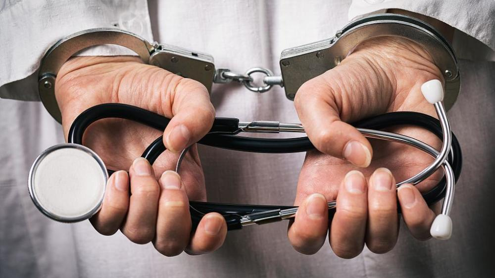

# 医药反腐风暴已席卷20省份：纪监部门出手配合，多地公布举报电话

各地监管部门继续加强医药反腐力度。

据澎湃新闻记者不完全统计，截至8月11日，最近三周，至少有20个省份监管部门和纪委监委就反腐问题发声，要求深入开展医药领域腐败问题集中整治。

从各地监管部门发布的新闻稿可见，部分省份的集中整治行动是由药监部门发起主导，也有多部门联合参与的行动，而不少省份的相关整治行动还得到了纪检监察部门的配合。

**多地卫健委、药监行动**

据澎湃新闻记者的不完全统计，山东、天津、江苏、新疆、江西等省份的药监部门在近期召开了相关会议。其中，8月8日，据“江苏药品监管”公众号发布的消息，全省药品监管工作座谈会暨落实企业主体责任、药品安全巩固提升和行风建设三年攻坚行动推进会在连云港召开。会议指出，集中整治药品领域腐败问题，对违法犯罪行为零容忍严肃查处。推动制定后续改进措施，一体推进“不敢腐、不能腐、不想腐”。

而广东、海南、上海则是由当地卫健委发布相关消息。其中，海南省医药领域腐败问题集中整治工作动员部署视频会议7月25日就已召开。会议指出，对突破行业底线、问题性质恶劣、群众反映强烈的违法犯罪行为，以“零容忍”的态度严肃查处，涉嫌违纪违法人员，按程序移送纪检监察、公安机关处理。对一般问题线索，根据管辖权限由主管部门依规依纪依法进行处置，对重大问题和典型案例重点督办或提级管理，违纪违法线索该处理处理、该移交移交、该督办督办。

上海还是包括上海市卫健委、上海市市场监督管理局、上海市药监局在的13个部门，联合印发了《上海2023年纠正医药购销领域和医疗服务中不正之风工作要点》的通知，通知提到，2023年10月31日前，各医疗机构要按照要求建立健全工作制度，严格落实各项工作要求，重点围绕高值耗材、整治“红包”、回扣、医德医风教育等三个专项行动内容，开展行风建设工作的自查自纠。

这与中央层面的部署一脉相承。

此前的7月21日，据国家卫健委网站，近日，国家卫生健康委会同教育部、公安部、审计署、国务院国资委、市场监管总局、国家医保局、国家中医药局、国家疾控局、国家药监局，联合召开视频会议，部署开展为期1年的全国医药领域腐败问题集中整治工作，会议强调，深入开展医药行业全领域、全链条、全覆盖的系统治理，进一步形成高压态势，一体推进“不敢腐、不能腐、不想腐”。

**多地纪委监委出手**

值得关注的是，多地的医药领域反腐风暴得到了纪检监察部门的配合。

7月28日，纪检监察机关配合开展全国医药领域腐败问题集中整治工作动员部署视频会议在北京召开，会议指出，加大执纪执法力度，紧盯领导干部和关键岗位人员，坚持受贿行贿一起查，集中力量查处一批医药领域腐败案件，形成声势震慑。

澎湃新闻记者的不完全统计显示，包括贵州、天津、西藏、山东、陕西、山西、云南、黑龙江、湖北在内的纪检监察部门均已对外发布消息，将配合开展医药领域腐败问题集中整治。

其中，贵州省纪委监委于8月8日召开全省纪检监察机关配合开展医药领域腐败问题集中整治工作动员部署视频会，对配合开展集中整治工作进行安排部署。会议强调，要强化震慑纠治并举，紧盯“关键少数”和关键岗位人员，深挖彻查权力寻租、利益输送、以权谋私等违纪违法问题，集中力量查处一批典型案件，惩治一批腐败分子，形成强大声势和震慑。

值得关注的是，内蒙古、四川、云南、重庆、北京、海南、山西、福建等八地还公布了医药领域腐败问题集中整治工作期间的举报电话。

