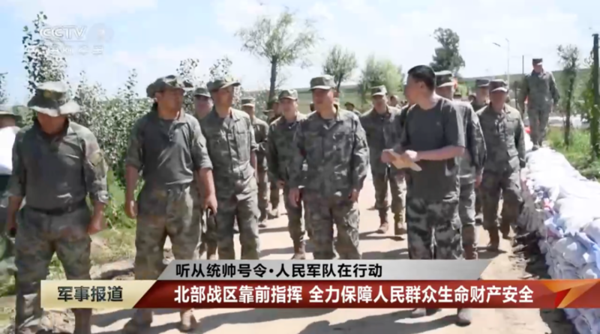
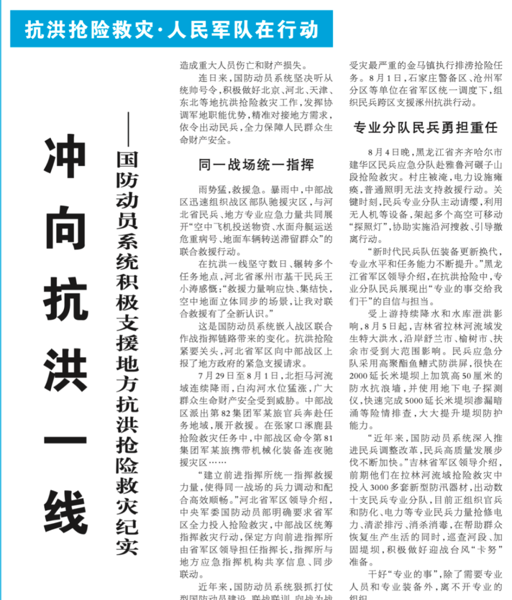

# 多位将军赴防汛一线，军报还披露了一个新变化

**撰文 | 余晖**

8月11日，针对“卡努”台风入境辽宁可能造成的洪涝灾害，北部战区成立辽宁方向抗洪抢险前进指挥所。

政知君注意到，近段时间以来，多位将军赴抗洪抢险一线。同时，北部战区、中部战区连续成立了多个前进指挥所。

**多位将军赴一线**

最近，受台风“杜苏芮”影响，华北、黄淮、东北等地出现极端降雨过程，引发洪涝和地质灾害，造成重大人员伤亡和财产损失。

政知君注意到，这段时间，中部战区、北部战区多位将军赴一线。

中部战区下辖领导和指挥北京、天津、河北、河南、山西、陕西、湖北的所属武装力量。

北部战区下辖领导和指挥辽宁、山东、吉林、黑龙江、内蒙古的所属武装力量。

8月5日，黑龙江省委书记许勤、省长梁惠玲，在哈尔滨与 **北部战区中将副司令员付国强** 一行就共同做好防汛救灾工作进行会商。

付国强曾任空军航空大学校长、空军指挥学院院长，这是他首次以北部战区中将副司令员身份出现在公开报道中。

_资料图_

8月8日，天津市委书记陈敏尔、市长张工分别与 **中部战区司令员黄铭、政治委员徐德清，武警部队副司令员朱文祥**
一行到静海区大清河右堤检查会商天津市防汛抗洪救灾工作。

黄铭担任过中部战区陆军第81集团军首任军长、陆军副司令员。今年1月晋升上将。

徐德清曾任原第13集团军副政委、原第47集团军政委、71集团军政委、西部战区陆军政委等职，2022年1月晋升上将。

另据央视8月11日报道，目前，台风“卡努”“兰恩”北上，针对可能引发的新一轮灾情， **北部战区主要指挥员赴黑龙江双城抗洪救灾一线，加强现场指挥** 。

**北部战区再有大动作**

政知君还注意到，中部战区、北部战区还先后派出前进指挥所靠前指挥。

8月1日，中部战区联合作战指挥中心前置指挥所、靠前指挥；8月7日下午，中部战区在天津大清河抗洪抢险一线开设前方指挥部。

8月5日，北部战区联指中心分别向黑龙江、吉林方向派出抗洪抢险前进指挥所。

最新的消息是， **8月11日，北部战区成立辽宁方向抗洪抢险前进指挥所。**

此次北部战区成立辽宁方向抗洪抢险前进指挥所，是针对“卡努”台风入境辽宁可能造成的洪涝灾害。

辽宁方向抗洪抢险前进指挥所将在北部战区联合作战指挥中心统一指挥下， **在汛情征候明显、地方受灾严重等时机，直抵辽宁地区抗洪抢险一线现场指挥**
，统筹协调组织各军种、各领域任务兵力共同遂行抢险救灾任务。

据北部战区透露，目前，辽宁方向抗洪抢险前进指挥所 **已启动与辽宁省防汛指挥部沟通联络**
，跟踪掌握台风过境雨情走势、加强驻辽部队应急备勤检查指导等工作，确保部队保持良好备战状态，一旦出现灾情，随时能高效出动。

**变化**

8月12日，《解放军报》头版刊发了《冲向抗洪一线——国防动员系统积极支援地方抗洪抢险救灾纪实》文章。

此次 **联合救援，救援力量响应快、集结快，空中地面立体同步。**

文章中提到，上述场景是“ **国防动员系统嵌入战区联合作战指挥链路带来的变化** ”。

在抗洪抢险紧要关头，河北省军区向中部战区上报了地方政府的紧急支援请求。

河北省军区领导说，“ **建立前进指挥所统一指挥救援力量，使得同一战场的兵力调动和配合高效顺畅** ”。

他还提到，
**中央军委国防动员部明确要求省军区全力投入抢险救灾，中部战区统筹指挥救灾行动，保定方向前进指挥所由省军区领导担任指挥长，指挥所与地方应急指挥机构共享信息、同步联动。**

值得一提的是，构建联合作战指挥体系，是我军孜孜以求的目标。

党的二十大报告强调：“优化联合作战指挥体系，推进侦察预警、联合打击、战场支撑、综合保障体系和能力建设。”

2022年11月，《解放军报》刊发了《优化联合作战指挥体系》文章。

文中提到，这次深化国防和军队改革，对我军领导指挥体制进行整体性重塑，形成了“军委管总、战区主战、军种主建”的新格局。

通过改革，健全了军委联合作战指挥机构，组建了战区联合作战指挥机构，形成了平战一体、常态运行、专司主营、精干高效的联合作战指挥体系，联合指挥更加顺畅，联合行动更加高效，联合训练更加常态，联合保障更加协调。

文中还提到，只有强化全局意识，加强协同配合，培育联合文化，形成整体合力，才能防止相互掣肘、推诿扯皮，变过去各自为战、情报难互通为联合侦察、多“情”能共享，
**变过去指挥上“各唱各的调”为联合决策、群策群力，变过去火力上“各打各的靶”为联合打击** ，最终实现攥指成拳，取得最佳毁伤效果。

**资料 ｜ 新华社 人民网 央视 解放军报等**

**【版权声明】本文著作权归政知新媒体独家所有，未经授权，不得转载。**

