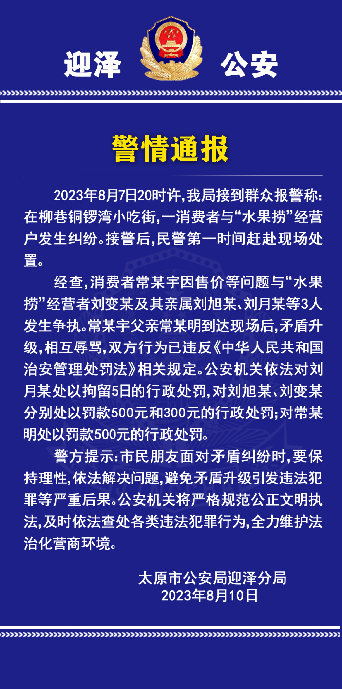

# 太原迎泽警方再通报“女生拒买水果捞被辱骂事件”，回应网络关切

来源：平安迎泽

**此前报道**

**女生拒买47元水果捞被店家骂“小三”，太原迎泽公安通报**

警情通报

2023年8月7日20时许，我局接到群众报警称：在柳巷铜锣湾小吃街，一消费者与“水果捞”经营户发生纠纷。接警后，民警第一时间赶赴现场处置。

经查，消费者常某宇因售价等问题与“水果捞”经营者刘变某及其亲属刘旭某、刘月某等3人发生争执。常某宇父亲常某明到达现场后，矛盾升级，相互辱骂，双方行为已违反《中华人民共和国治安管理处罚法》相关规定。公安机关依法对刘月某处以拘留5日的行政处罚，对刘旭某、刘变某分别处以罚款500元和300元的行政处罚；对常某明处以罚款500元的行政处罚。

警方提示：市民朋友面对矛盾纠纷时，要保持理性，依法解决问题，避免矛盾升级引发违法犯罪等严重后果。公安机关将严格规范公正文明执法，及时依法查处各类违法犯罪行为，全力维护法治化营商环境。

太原市公安局迎泽分局

2023年8月10日

