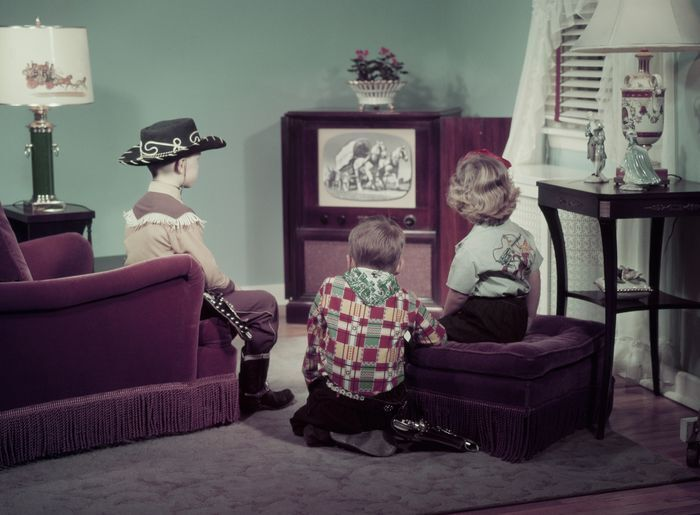

# 小孩哭了，小孩闹了，让人工智能哄孩子，靠谱吗？

**划重点**

  * _1_ 随着技术的发展，人工智能未来很可能成为婴幼儿的电子保姆，就像电视或游戏机那样，帮助节省成本和减轻父母的育儿负担。
  * _2_ 人工智能技术可能会给那些经历发育迟缓的孩子带来福音。它可以帮助释放认知潜力，缩小与正常人的差距。
  * _3_ 与电视和游戏机不同的是，由于人工智能育儿设备在模仿人类行为方面非常复杂，它们可能会改变人类的进化结构。

腾讯科技讯 8月12日消息，
我们可以想象一下，十年后的父母会如何养育后代？事实上，育儿的大多数方面不会改变，但人工智能的普及可能会改变某些方面。人工智能设备很可能成为孩子的电子保姆，就像前几代父母把电视和视频游戏作为减轻育儿负担的工具那样。

拥有人工智能支持的玩具泰迪熊可以以个性化的方式回应婴儿的哭声，帮助解决幼儿遇到的大多数问题。电脑辅助的“保姆”们不厌其烦地、一遍又一遍地朗读相同的书籍内容，这会让孩子入眠变得更容易。高级育儿版Alexa可以播放和教授孩子最喜欢的歌曲，陪他们玩游戏，甚至可以推断婴儿哭泣的原因。

就像过去几代的创新一样，这些智能工具将利用技术来吸引孩子的注意力，为父母节省时间和减轻压力。然而，与以前的工具不同，人们担心，由于人工智能育儿设备在模仿人类行为方面相当复杂，它们可能会改变婴幼儿对世界体验的处理方式。

将年轻的大脑与响应式人工智能相结合，可能会以我们无法预料的方式从根本上改变婴幼儿看待世界的方式。这是因为，我们的大脑在生命诞生的最初几年会以一种非凡的方式发育。人类婴儿来到这个世界的时候，还没有发育完全。一个可能的进化原因是，如果胎儿在母亲子宫里发育更长时间，它的头就会变得更大，无法安全分娩。

因此，大自然不得不做出妥协：婴儿在母亲受孕40周后出生，但40周大的婴儿大脑仍有很多需要发育的空间。婴幼儿的大多数基础性发育发生在生命诞生的头两年，速度之快令人叹为观止，每秒钟约有100万个新的神经连接形成。到孩子三岁生日时，大脑将可以发育到成人大小的80%左右。

这提供了一个短暂的时间窗口，通过培养孩子大脑的基础性发育，为他们在今后的生活中取得成功奠定基础。这就是为什么人类是所有物种中最聪明、最具创造力、最具生产力的核心。

婴儿早期发育中最需要的是进行丰富的对话，即发展心理学家所说的“服务和回报式”互动。对于父母与孩子来说，双方的互动可以很自然地进行，而且众所周知，这可以促进孩子处理认知和情感方面问题的能力。

_图：电视的出现引发了人们对儿童影响的担忧，但它没有人工智能的互动能力_

在此之前，这种必要的互动只能由充满爱心的成年人提供。不管营销人员如何宣传，古典音乐、教育电视和爱因斯坦宝宝的视频都无法在婴儿大脑中建立有意义的新神经连接。因为它们没有应急反应，也没有互动。

新兴的人工智能工具改变了这一切。它们是按照人类形象被设计出来的，就像人类大脑的构造一样。它们由复杂连接的神经网络组成，由大量数据训练而成。ChatGPT以大语言模型的形式接受必要的输入，而儿童则以与成年人的友好互动接受输入。当我们用自动化替代方案来补充构建大脑的人类互动时，这条界限将变得模糊。

不难理解为什么父母想要利用技术创新来减轻家庭负担。养育孩子，尤其是在孩子幼儿时期，是非常耗费精力的任务。对于不堪重负的父母来说，人工智能的帮助可能会带来变革，就像洗衣机和其他电器在上世纪中叶彻底改变了照顾孩子的方式那样，这让女性得以大量进入劳动力市场。

为什么不让人工智能保姆与人类婴儿进行那种建立大脑互动的对话呢？这可能会对儿童发育产生深远的积极影响，在儿童大脑最具“可塑性”的时期，增加大脑构建时刻的互动频率和一致性。也就是说，这会让他们根据所遇到的情况重新构建自己。这项技术可能会给那些经历发育迟缓的孩子带来福音。它可以帮助释放认知潜力，缩小与正常人的差距。

但我们必须谨慎行事，毕竟新技术可以塑造我们大脑的结构。当早期人类开始使用工具制作标记和图案时，新的神经元被激活，最终使大脑能够以一种全新的方式使用视觉皮层，进行阅读和写作。在我们这个时代，《美国医学会儿科学》(JAMA
Pediatrics) 杂志1月份发布报告显示，习惯性地使用社交媒体正在改变青少年大脑对社交奖励的反应。

_图：人工智能家庭助手已经可以与孩子进行对话交流了_

关于大脑的基础性发育，我们还有很多不了解的地方。将年轻的大脑引入响应式人工智能中，可能会以我们无法预料的方式从根本上改变孩子们看待世界的方式。如果我们提供了错误的输入或互动方式，可能会扭曲孩子们的认知发展。

这从神经科学领域最近的一个发现中可以得到借鉴。研究人员早就知道，成人和儿童之间更多的对话会促进儿童语言能力发展，帮助他们记住更多词汇。但过去十年的研究揭示了这种关系背后的一个关键机制：当儿童和他们的人类照顾者试图交流或一起玩耍时，他们的脑电波实际上是同步的。在成年人进行集体活动，如唱歌或跳舞，面对面交流时，也可以观察到这一点。他们在相同的大脑区域经历相似的大脑活动，他们的脑电波越匹配，结果就越有成效。

普林斯顿大学的一个研究小组在2020年报告称，在儿童及其照顾者中，这种现象在前额皮质特别明显，这是学习发生的地方。对幼儿的进一步研究表明，这种“神经同步”促进了积累词汇、社会学习和解决问题的能力。人工智能虽然能够进行互动，但缺乏神经同步所必需的人类大脑。我们还不知道，对于发育中的人类大脑来说，体验其中一种互动而没有体验到其他互动意味着什么。

从终身成就的角度来说，适应力和认知能力一样重要，这是另一种几乎完全依赖于早期基础性大脑发育的技能。当一个孩子在生命早期遇到各种各样的经历，并得到一个充满爱心的成年人的指导时，他们学会了如何做出适应性的反应。

研究还表明，对父母的关爱有着积极记忆的成年人表现出更大的“毅力”和抱负。但是，如果父母放弃一些基本的责任，孩子对机器人产生依恋，结果会怎样？谢菲尔德大学研究员诺埃尔·夏基（Noel
Sharkey）和阿曼达·夏基（Amanda
Sharkey）在2021年发表在《伦理与信息技术》杂志上的论文中写道：“这可能会对他们的社交和情感发展产生严重影响。”

我们不能把人工智能的精灵重新收回瓶子里，也不应该这样做。但是，如果没有对人工智能技术更好的理解，我们就有可能浪费生命最初几年的发展潜力，并有可能破坏我们自己的进化结构。（文/金鹿）

