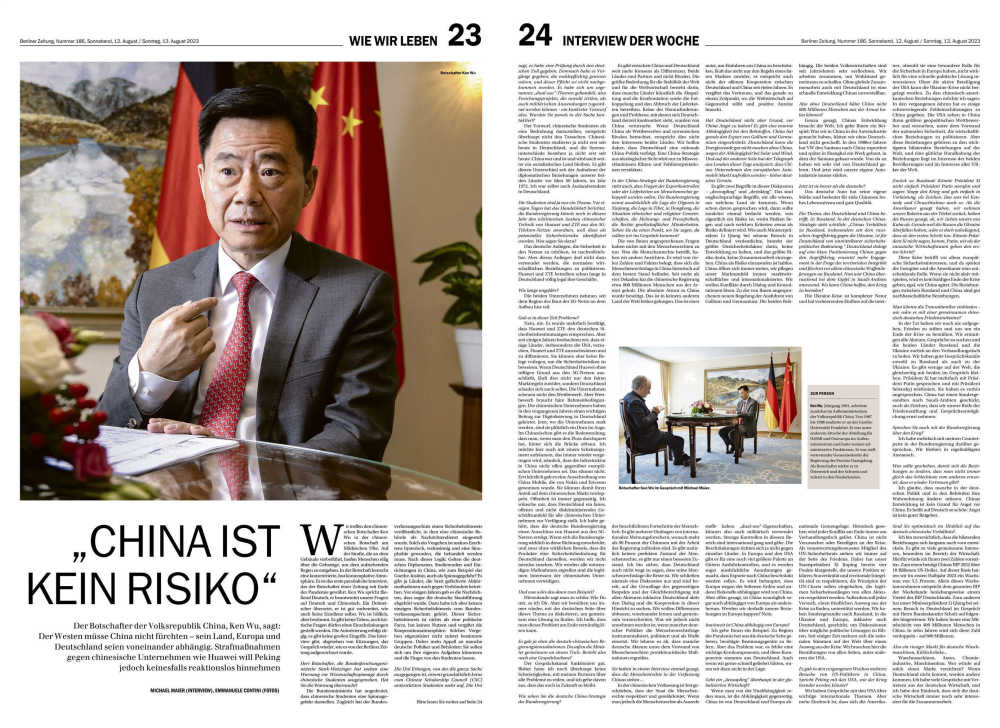

# 德国“恐华”毫无道理吗？对德中关系是否保持乐观？我驻德大使回应

据中国驻德国大使馆网站消息，2023年8月12日，德国《柏林报》刊登吴恳大使接受该报发行人迈尔专访“中国不是风险”。

**问：德联邦教研部部长施塔克-瓦青格日前表示，需警惕在德中国留学人员学术间谍风险，您对此是否感到惊讶？**

我注意到德联邦教研部部长有关言论。与此同时，德联邦宪法保卫局近期也发布安全提示，将中国有关机构列为情报部门。这些言论和做法歇斯底里、近乎癫狂，是严重的“恐华症”，需要好好治一治了。按照他们的逻辑，德国驻华外交官、在华留学生及歌德学院等机构是不是也对中国构成间谍风险？有些国家开展大规模监听，触角深入自身盟友，曾有报道称甚至监听到了德国最高层，但我却从没听说过德方发布过什么安全提示。可见，所谓安全提示完全是政治操弄，带不来半点好处，只会毒化合作氛围、污名化有关群体。我想奉劝德方一些人和机构，管好自己应该管的事情，让学生们安心读书。

**问：这一系列事件源于埃尔兰根-
纽伦堡大学（FAU）的一个决定，该校表示原则上将不再接收受中国国家留学基金委（CSC）资助的奖学金生，德方是否曾就此与您沟通？**

将中国留学生视为威胁，完全不符合事实。中国学生赴德留学不是从今天才开始的，我本人也曾在德留学。中德之间的体制差异也不是今天才出现的，自1972年中德建交便已存在。中国过去是、现在是社会主义国家，未来也将坚定不移走社会主义发展道路。

**问：据德《商报》报道，联邦政府可能在年内出台措施，以潜在安全风险为由，在德5G网络建设中逐步排除华为、中兴等中国科技企业。您怎么看？**

德方希提高自身电信网络安全的关切可以理解，但不应以此为借口将中德正常经贸合作泛政治化。华为、中兴长期在德依法合规经营。

**问：它们在德经营大概多久了？**

从2G网络开始，相关中国企业就参与德国电信网络建设。

**问：以前出现过问题吗？**

没有，从未有过。德方多次表示华为、中兴等技术符合德国安全标准。近年来，美国等一些国家不断抹黑华为、中兴，但始终拿不出证据证明其设备存在安全风险。如果德方以莫须有罪名排除中国企业，不仅违背市场公平竞争原则，而且只会损人不利己。中国企业不惧怕竞争，但竞争需要公平环境。中国企业为德国数字化进程作出积极贡献，现在做大做强了，却被一些人视作眼中钉、肉中刺，这是典型的过河拆桥。

在此，我还想驳斥一个反复被炒作的伪命题，即所谓“中国网络基础设施建设不对欧洲企业开放”，这完全不符合事实。不久前，诺基亚和爱立信获得中国移动的招标采购，它们在中国的市场份额将提升一倍。开放是相互的。我希望德方能为中国企业营造公平、开放、非歧视的营商环境。

我也听说，德联邦政府正在讨论是否要在5G建设中排除华为。如果德方最终作出相关决定，又拿不出实质证据证明所谓“安全威胁”，中方绝不会袖手旁观，将采取必要措施坚定捍卫中国企业的正当合法权益。

**问：中方可能采取哪些措施？**

德国人也常说，“以其人之道还治其人之身”。当然，中方也将继续同德方就此进行充分沟通，共同寻求解决方案，希望有关问题最终能得到合理解决。

**问：此前德中举行政府磋商，两国相关部门多位部长出席，双方沟通渠道是否依然顺畅？**

中德沟通渠道是畅通的，双方可以就广泛议题进行坦诚交流。我相信，未来也将如此。

**问：您如何评价德联邦政府最近发布的“中国战略”？**

中德共识远多于分歧，合作远大于竞争，双方是伙伴而非对手。当前全球稳定和经济复苏的最大风险是某些国家推动分裂对抗和脱钩断链。德国当前面临的挑战和问题并非是中国造成的。将中国视为“竞争者和制度性对手”不符合两国共同利益。中方希望德方秉持理性对华政策。以意识形态为导向制定对华政策只会加剧误解和误判。

**问：德“中国战略”还将出口管制及供应链同人权问题挂钩，并明确提及新疆、西藏、香港、少数民族和宗教信仰及新闻言论自由。您是否认为双方应在上述领域开展对话？**

你提到的这些问题与人权无关，中方在人权问题上有不同看法。大量事实证明，中国人权状况处于历史最好时期。改革开放40多年来，中国政府帮助约8亿人脱贫并消除绝对贫困，这一成就在世界上独一无二，是人类发展史上举世瞩目的进步之一。多个国际机构民调显示中国民众对政府满意度超过90%。人权保障没有最好，只有更好。相信德国也不敢说自己的人权状况是完美的。事实上，中方并不排斥讨论人权问题，我们愿意在平等和相互尊重基础上，同包括德国在内的各方积极开展人权对话和合作，减少分歧、相互借鉴、共同进步。但我们绝不接受德方动辄将人权问题工具化、政治化、武器化，坚决反对德方以人权之名行保护主义之实。

**问：您曾在过去接受采访的时候提到过，保护人权被写入中国宪法……**

中国宪法明确规定“国家尊重和保障人权”。

德方若以人权为由限制对华出口，不仅违背市场经济和自由贸易原则，不符合多年来中德开放合作的根本要义，也将破坏和毒化互信，特别是在当前全球经济遭遇逆风且亟需正向激励的关键时刻。

**问：德国“恐华”毫无道理吗？例如在原材料方面，德国对华具有很强依赖性，而中国近期对镓和锗等关键原材料实施出口限制。再如，由于在太阳能、风能等领域对华依赖，没有中国德国根本无法实现能源转型。英国《电讯报》近日分析称，中国车企将占领欧洲市场，而这正是德国企业的优势领域。**

近期关于这方面的讨论涉及到两个概念——“脱钩”和“去风险”，都是英文概念，众所周知它们从何而来。谈论“去风险”，首先要思考什么是风险，风险在哪里，以及以什么标准界定风险。正如李强总理访德时指出的，不合作才是最大的风险，不发展才是最大的不安全。中国坚定不移推进高水平对外开放，始终致力于完善市场化、国际化营商环境，推动通过对话协商解决分歧。将中国定义为风险根本站不住脚。

针对你提到中方对镓、锗实施出口管制，需要指出的是：相关物项具有明显军民两用属性，对此类物项实施出口管制是国际通行做法，并不针对特定国家。欧美实施出口管制的物项范围更广，甚至明令限制对华出口。部分国家总是强调在稀土等原材料领域的对华过度依赖，坦率讲，中方在某些领域对欧洲的依赖可能更大，难道我们能因此就切断同欧洲的关系吗？当然不会。

**问：中国在多大程度上对欧洲依赖？**

我可以给你举个例子：新冠疫情暴发之初，德方曾向中方请求，希望中方尽快提供急需的呼吸机设备。但问题在于生产呼吸机所需的一个核心部件恰恰是德国生产的，所以尽管中方有意愿尽快提供，但亦无能为力。

**问：在当前经济全球化时代，“脱钩”是否可行？**

如果一定要把相互的经济联系视作“依赖”并谈“脱钩”，那么这种依赖是相互的。中德、中欧经济发展紧密交织，数十年来携手合作、共创繁荣。如果没有包括同德方在内的国际合作，中国实现快速发展亦难想象。

**问：是否可以理解为，如果没有德国，中国无法实现8亿人口脱贫？**

准确地说是，中国发展离不开世界。我再给你举个例子：中国在汽车领域取得发展进步，也得益于同德国的合作。上世纪八十年代，德国大众对华出口桑塔纳且不久后便在上海合资建厂。从那时起，我们在这一领域从德国学到了很多。现如今，我们自己的汽车工业也不断发展壮大。

**问：中国汽车已赶超德国了吗？**

德国汽车有自身优势，对很多中国人来说仍代表着良好的生活品质和优秀的产品质量。

**问：另一个涉及德中关系的话题是俄罗斯。德“中国战略”中提到，“中俄关系—特别是自乌克兰危机爆发以来—在政治安全方面对德意义凸显。”德方敦促中方就乌克兰问题表明立场，发挥更大作用，同时担心中方向俄罗斯提供武器。日前，中方派特别代表赴沙特出席吉达乌克兰问题国际会议。为实现早日停火，中方将发挥何种作用？**

乌克兰危机延宕已久并复杂演变，对国际形势产生重大影响。从历史上看，任何冲突最后都需要通过对话和谈判解决。中国不是危机的制造者，也不是当事方。作为联合国安理会常任理事国和负责任大国，中方始终站在和平一边。为此，习近平主席提出了“四个应该”，即各国主权、领土完整都应该得到尊重，联合国宪章宗旨和原则都应该得到遵守，各国合理安全关切都应该得到重视，一切有利于和平解决危机的努力都应该得到支持。此外，中方还派出特别代表赴俄、乌和包括德国在内的欧洲就政治解决危机同各方深入沟通。一段时间以来，国际社会关于危机的理性思考和声音增加。同时，为早日实现危机政治解决，还需要包括美在内的各方作出努力。

**问：一段时间以来，多名美国政客访华。中美是否就乌克兰问题交换意见？**

中美就重大国际问题保持沟通。我的印象是，虽然美国对欧洲安全架构具有特殊影响力，但对尽快实现危机政治解决好像没有太大兴趣。解决乌克兰危机离不开美国的参与。

关于中美关系需要指出的是：近年来美国对中国严重误判，将中国视为最主要竞争对手和最大地缘政治挑战，不断打着国家安全的幌子，将经贸问题政治化，对中国进行遏制打压。需要强调的是，中美关系是当今世界最重要的双边关系之一，处理好中美关系不仅符合两国人民根本利益，也有利于世界和平与繁荣。

**问：让我们回到乌克兰问题：中方领导人是否可以向普京总统呼吁，率先停火，迈出第一步。**

乌克兰危机事关欧洲安全秩序，欧方和美方应发挥关键作用。如果欧方和美方不发挥积极作用，那么无论中国作出怎样努力，都无法快速解决危机。至于中俄关系，两国是友好邻邦。

**问：让大西洋国家参与进来如何，中德能否共同发起一项和平倡议？**

事实上，我们从未放弃劝和促谈、结束危机的努力。中方始终支持各方开展对话，推动俄乌双方重回谈判桌前。中方是少数同俄、乌保持良好沟通的国家。危机爆发以来，习近平主席曾多次同俄罗斯总统普京沟通，也同乌克兰总统泽连斯基通电话。你刚刚也提到，中方近期派特别代表出席吉达乌克兰问题国际会议，正体现出中方在乌克兰问题上始终致力于劝和促谈的建设性态度。

**问：您同德联邦政府就乌克兰危机也保持着沟通吗？**

我与德方伙伴多次就此进行交流。双方保持经常性沟通。

**问：在您看来应如何改善双边关系，以加强互信、减少误判？**

我认为，德个别政客需要改变其对华认知。中国发展不应该成为对华恐惧的理由，正如德国谚语所说：“恐惧不是好参谋”。

**问：您对德中关系是否保持乐观？**

我相信，中德双边关系将继续向前发展。两国之间有很多共同利益，特别是在经济领域。在此，我愿与你分享两组数字：一是2022年中国GDP总量达18万亿美元，在此基础上今年上半年中国经济实现了5.5%增长，仅增量就相当于荷兰GDP总量或德国GDP总量的近四分之一。二是当前中国的中产阶级规模约4亿，据专家预计未来10年将翻番至8亿。

**问：这意味着对德企是一个巨大的市场，比如说德国洗衣机、电冰箱等产品……**

洗衣机、汽车、化工产品、机械制造等等。有谁会放弃这样的市场呢？德国人不来的话，总有人会来。我同德经济界代表进行过多次交流，给我留下的印象是，他们仍致力于互利合作。

