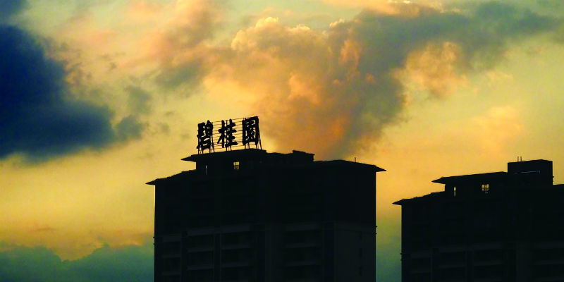

# 碧桂园关键30天：两年能卖的都卖了，最后稳住3万供应商和千万购房人

**经济观察报 记者 陈月芹 田国宝 丁文婷** 8月11日，连续七年位列中国头号房企的碧桂园控股的一封公开信，正式将自身存在的经营风险公布于众。

这封由公司董事会主席杨惠妍和党委书记、总裁莫斌联合署名的信中称，“2023年上半年预计出现较大的亏损，当前也正承受阶段性的流动压力。”虽然公司上下已全力以赴自救，但市场整体尚未回暖，行业绝对规模下降，资本市场信心修复尚需时间，公司整体经营压力有增无减，面临自创办以来的最大困难。”

碧桂园是一家成立于1992年的民营房企，在参与了中国城镇化建设的第31个年头、迎来了第二代掌舵的同时，也迎来了自己的非常时刻。

自三道红线正式实施的2021年开始，房地产行业就开始步入前所未有的调整，房企普遍面临生存大考：包括恒大、绿地、建业、融创、万达等一批大型房企，先后出现不同程度的经营困难，其中以恒大为最，自风险敞口暴露后，该公司2022年净亏损527亿元，流动负债1.6万亿元。

作为支柱行业，房地产市场的主体先后陷入困境，与整个市场运行状况相互拖累，全国商品房的销售额也从历史最高点2021年18万亿元，在一年时间内迅速滑落到13万亿元。

尽管此间，从中央到地方围绕“保交楼、保民生、保稳定”做出了一系列的政策安排部署，但在政策效力发挥之前，全行业的资产负债表的深度收缩，令所有房企都经历了刮骨断臂之痛，然而，继续恶化的市场让很多企业和从业者陷入绝望。

一位接近碧桂园管理层人士坦言，从2022年底以来，公司不得不考虑坚持还债之外的可能性：如果硬撑下去，最后的结果很可能是资不抵债。是不是有可能先保住一部分，留存资产，集中力量保交楼。

一位房地产观察人士分析，从过往房企违约情况来看，一旦企业违约，虽然不会马上陷入绝境，比如直接走向破产，但可以肯定的是，购房者、股东方、债权人、地方政府等一系列利益相关者对企业的态度可能发生实质性的变化，令企业境况更差。

鉴于碧桂园的市场影响力，以及作为目前硕果仅存未违约的两家千亿民营房企之一，接下来的30天，不仅是碧桂园的关键时刻，可能也是房地产市场的非常时刻。

根据碧桂园发布的《2022年环境、社会及管治报告》，碧桂园地产的合作供应商总数33207家，意味着超过3.3万家下游企业。

**难过的坎**

8月7日，碧桂园两笔美元债约2250万美元（折合人民币1.62亿元）的票息到期未付，消息引得股债大跌。

根据豁免条款，碧桂园在30天宽限期后，如若仍没有支付，才构成实质性违约。

一位香港私募基金投资人向经济观察报表示，部分香港债权人对碧桂园无法支付1个多亿元利息的真实性存疑，认为已经熬到政策逆转关口，此时动用宽限期，是想释放信号，向监管层施压、求助。

多名碧桂园财务人士、区域总裁否认了这一点：能逼出什么政策呢？且政策传导至少为半年，“碧桂园等不了”。

资本市场了解宽限期，但普通购房人的直观感受就是“碧桂园（即将）爆雷了”，没有人敢买一家出险民企的房子，这比实质性违约还要可怕。

碧桂园账上真拿不出1个亿的现金了吗？

答案是否定的。直到8月，碧桂园仍在正常兑付公开债，自2023年以来，已经累计兑付了148.9亿元公开债。

但碧桂园需要面临的债务，远远不止这些。

根据碧桂园财报，截至2022年末，碧桂园总负债1.44万亿元，其中合同负债6682亿元，有息负债2713亿元，贸易及其他应付款4374亿元，其他负债581亿元。

有息负债中，银行及其他借款是大头。

在这些债务中，一年内到期的非流动负债和短期借款合计937亿元，意味着在销售回款和再融资双重受限背景下，2023年碧桂园需要还掉千亿负债。

境外债方面，目前碧桂园共有17笔存量美元债合计107.96亿美元，但最早到期一笔时间，是在明年的1月27日。

而国内债方面，碧桂园控股、广东腾越建筑、碧桂园地产共三家主体的存量国内债券合计230.9亿元。据经济观察报不完全统计，碧桂园2023年内仍需偿还或回售的债券本息合计超过150亿元。

此外，碧桂园还有为数更多的银行借款及少量商票。“还了这一笔，下一笔呢？9月呢？年内要还的债超150亿元，且明年1月前，还有60多亿元的美元债要还，那会儿还是春节前，总包单位农民工的钱必须结算，怎么还？”这是摆在集团管理层面前的难题。

但是，和每个月上百亿的债务支付相比，每个月融资流入仅约20亿-30亿元，而每个月的销售额，也比之前大大减少。

2023年，1-4月，碧桂园每月的权益销售数据还能稳定在220亿-250亿元，从5月开始出现了连续断崖式下跌，7月权益合同销售额仅121亿元。

此外，每个月工程款、营销费用和人员工资等成本都是刚性的，例如，这家6万多员工体量的公司，每月的雇员支出十分可观。

一线对销售转冷的感知最为直观。某碧桂园区域高管坦言，从5月以来，销售急转直下，一个月比一个月差。

该区域高管表示，2-3月的小阳春确实小幅拉升了一点业绩，导致当时对区域总的考核标准都调整了，从要保销售和现金流变成保利润，还把当时保现金流做得太过的区域总裁撤掉。“当时集团提出，对各个区域公司的考核变成‘3+1’，把利润提到了一个前所未有的考核高度，大家都很有信心，认为市场要回来了。”该区域高管回忆。

但从4月份开始就发现不对劲了，销售十分艰难，收入完全无法覆盖支出，而且大家看不到未来形势好转的可能。

一家地产私募债权人坦言，“能坚持到现在的民营地产公司，根本不用质疑它的还债意愿，要不然去年早就躺了。”

**和时间赛跑的三年**

“这两年，我们为了不违约，把能卖的资产都卖完了，比如卖给城投的，卖给当地土豪的，到了贱卖的程度，但也杯水车薪。现在是卖也卖不出去了。”一位碧桂园内部人士透露。

2020年8月，由住建部、央行等多部门制定的三道红线，开始重塑房企的资产负债表。

按照规定，三道红线全部触碰，为红色档，有息负债不得增加；触碰二道红线，为橙色档，有息负债规模年增速不得超过5%；触碰一道红线，为黄色档，有息负债规模年增速不超过10%；全部达标，为绿色档，有息负债规模年增速不超过15%。

事实上，为了能够保住基本盘，很多企业都倾向于逐步降低自己的资产负债表，因为房企一般采用借新债还旧债的模式持续融资，一旦快速缩表，意味着从销售端进入的现金流将全部用于还债，就很难留存下一步继续拿地—开发—销售的本钱。

然而，恒大问题的逐步暴露，打破了市场的侥幸心理，甚至成为所有房企，尤其民营房企的噩梦。一系列围绕开发商融资链条上的工具，被严厉检查。这使得房企原有的融资生态被打破。

一位资深融资人士介绍，最多的时候，房企拥有信托、前融在内的13类渠道60种融资工具，最后只剩下开发贷、公司债和海外银团贷款等少数几种，企业的融资状况深度恶化，很大程度上，导致企业不得不刚性缩表。

而市场端，由于奥密克戎的登陆，本已开始反弹的中国经济又遇到了阻碍，销售端的不畅，让市场陷入进一步观望。

进水口严重萎缩，出水口依然存在，使得原来将降杠杆目标按监管要求定在2023年底的很多房企，开始强行缩表。

2020年到2022年期间，碧桂园的权益合同销售金额从5707亿降到3575亿元，资产规模从20158亿降到17445亿元，负债规模也进一步下降，提前一年完成了三道红线的要求。

然而，2022年7月，一些房企的资金链问题最终引发了全国多个项目不能按时保交楼的维权运动，随着政府工作组入驻恒大半年之后，开发企业项目资金挪用等顽疾彻底暴露在世人面前。

政府对此高度重视，安排有关部委和各级政府制定周密的保交楼政策，通过对房地产项目前所未有的严厉监管，掐断了项目与公司之间原有的资金拆借通道。

从2022年8月开始，监管层的信贷、债券、股权和内保外贷“四支箭”齐发，以求保证市场主体的稳定，尤其是对一些资产负债情况优良的企业打开融资通道，龙湖、碧桂园、旭辉、新城等优质民营房企位列其中。

一家闽系房企高管透露，碧桂园头顶“发债示范性房企”等光环，多家银行给予优待，在行业内一直备受艳羡。

但是实际上，情况并没有那么乐观。

例如在信贷方面，2022年11月底，碧桂园一天内获得邮储银行、工行、中行共1500亿元授信。直到今日，一位知情人士表示，“这些千亿授信都没有变成很实质性的融资”。

2023年1月底，碧桂园还获批200亿元储架式中期票据发行额度，是民营房企中获批额度最高的，但这笔中期票据没有实际落地发行。

2022年9月底，央行和银保监会要求六大行，加大对房地产融资的支持力度，每家银行年内至少提供1000亿元融资支持，形式包括抵押贷、按揭贷、开发贷或购买债券等。

但多家银行优先选择将新增融资额度向按揭贷倾斜，以及给央企、国企城投做开发贷，民企在三四线的项目是部分大行批开发贷的“屏蔽区”，很难分到这6000亿的“大红包”。

一家大型民营房企融资负责人说，他们没有感受到因为这个政策有新增的贷款，开发贷还是正常在做，有没有这个政策都一样。

据了解，碧桂园总部所在地的佛山市提供了相当力度的支持，比如第二支箭出台时，碧桂园没有符合中债增要求的反担保物，最后将佛山两块宅地抵押给佛山交投、佛山地铁投资，后者对碧桂园的中票进行了反担保。截至今年5月，碧桂园成功发行了四期中债增信中票，金额共计42亿元。

一位接近碧桂园的人士告诉经济观察报，碧桂园之所以一直坚持偿债，除了积极履行企业应有职责外，另一个理由是认为2023年下半年楼市会有一定恢复。

2022年，碧桂园进行全方位的降杠杆，逐步了清理了供应链融资、员工理财等方面的“地雷”，所以全年几乎没有拿地。“2023年上半年进行了一定补仓，也是基于下半年市场会好转的判断”。

3月，碧桂园开始在土地市场活跃起来，4月和5月陆续在杭州、无锡、佛山和太原等地获得5幅宅地，总成交价超过65亿元。5月碧桂园销售金额同比下滑36%。从6月开始，碧桂园再次暂停了投资拿地行动。

上述人士判断，2023年虽然碧桂园有充足的货值可供销售，但由于2022年拿地较少，导致缺乏真正的流量盘。

**战略反思**

在8月11日的致歉信中，公司管理层进行了深刻的反思：虽然对本轮市场调整周期有所预判，但依然估计不足，对三四线及更低线城市投资比例过大、负债率压降速度不够等潜在风险的认识不够深刻、化解行动不够及时有力。

事实上，碧桂园长期以来对现金流相当重视，如何保障现金流的安全，除了优化负债结构外，高速的周转也是现金流保障重要措施之一。它也是中国开发企业中最早提出高周转的企业之一。

在2008年金融危机前后，杨国强意识到公司的现金流是公司运营过程中，最重要的生命线。由于企业本身在融资方面的条件远不如大型国企，就是与一些成名已久的开发商万科、金地等相比，融资条件也处于劣势。

针对自己建筑企业出身、全产业链条和对三四线大盘开发有经验等特点，碧桂园通过产品标准化、建设高效化能力的锻造，形成了独有的高周转能力。

2010年以后，随着一二线城市地价的不断攀升，如很多城市精品地块的地价占到房屋价格的一半以上，使得众多开发商在开发投入环节，资金占用的比例越来越大，周转整体在变慢。

相比之下，三四线城市的土地价格在房屋价格的占比相对较低，据一位在2016年以后深耕三四线城市的大型房企负责人透露，有的地方房价地价比达到了10倍。两相对比，房企间布局出现了明显差异，也给碧桂园进一步提高资金周转带来助力。

此后，碧桂园又通过成就共享、同心共享等奖金和项目股权激励等形式，以周转高效、交付完美为目标，将经理人的动力充分调动起来。

所有的企业能力和制度机制，在2015-2017年释放三四线城市购买力的棚改潮中，猛然爆发，也让碧桂园从此登顶。

因此，碧桂园不仅仅在三四线城市建立了几乎独此一家的市场壁垒，还拥有非常强的获取经营性现金流的能力。

2017年四季度后，“房住不炒”提出，宏观经济下行与一二线城市抢人潮因素叠加，三四线购买力在一定程度上也被透支。

相对于三四线城市大部分项目主打改善型、大户型不同，由于有产业支撑带来持续的人口流入，一二线城市才是当下刚需和刚改的主战场。

自2021年下半年以来，主流房企开始大量收缩自己的战线，这在2021年底恒大爆雷之后表现的尤为明显。包括万科、龙湖在内的多家房企都开始将自己管理半径收缩，比如龙湖将拿地城市从2021年的近40个收缩到2022年的10个左右。

在这个问题上，碧桂园步调也一致。2020年，碧桂园的区域由47个裂变成73个，后分化成104个，2021年12月31日，碧桂园区域公司由原来的106个缩减至65个。今年3月，再度缩减至29个区域。

2023年3月，杨惠妍正式接班碧桂园董事局主席，在4月的业绩发布会上，杨惠妍宣布，从市场布局来看，过去碧桂园以主做三四线市场著称，但接下来希望做到一二线和三四线的销售额、资产总额甚至投资额都是“五五开”。因此，公司中长期发展强调要夯实两个核心竞争力，一个是产品力，另一个是成本力。

4月10日，碧桂园发布了一则《关于成立集团产品联合研发小组的通知》，此前在2022年业绩会上，杨惠妍提到的研究一二线产品的“非常豪华、专业的团队”正式亮相。除了杨子莹、程光煜等一众高管担任组长副组长，还从集团11个部门、子公司中选调人员参与。

产品力提升将是碧桂园的中长期重点工作。杨惠妍直言，碧桂园可能需要花2~3年时间。

不过这个时间，对要解决眼下问题的碧桂园而言，显然太长了。

**关键30天**

上述知情人士透露，这次碧桂园未能按期支付的一笔美元债票息，原本应于8月4日打款，但公司并未支付，但同一日，提前兑付了“20碧地02”未回售债券的本息。

这可能与碧桂园对债务偿还顺序、取舍做的整体部署有关，上述人士解释，“前者是外债，是信用无抵押贷款，而后者的境内债有抵押。且监管层有相关要求，会问询企业，为什么先还了外债，而将境内债先违约？”如何回答这个问题，可能关系到届时整体债务重组方案能否顺利通过。

一些市场人士分析，碧桂园没有按时偿还票息，实际上是给外部提供了一个预期信号。那就是让债权人了解到碧桂园的真实困境，友好协商双方都能接受的展期方式。

如果从8月7日算起，接下来的30天，将是碧桂园的关键时刻，可能也是房地产市场的非常时刻。

现在，整个碧桂园集团上上下下都协同起来，他们面临一次危险的闯关。

8月10日，莫斌等管理层将28个区域总裁全部召回到总部开了为期一天的闭门会议，部署后续保交付、资产处置等事宜。

对各区域来说，8月尤其关键，主要是稳住供应商和购房者的信心。

危机显现后，碧桂园连发多个表态，先是8月10日公告披露上半年预亏损450-550亿元，直言受近期销售和再融资持续恶化的影响，出现了阶段性流动压力，“公司遇到了自成立以来最大的困难”，并提出四大自救措施。

8月11日，碧桂园官微刊发致歉信，在战略、市场研判、降负债执行力度等方面做了深刻反思：“对市场下行深度、烈度和持续度估计不足”，对三四线及更低线城市投资比例过大，负债率压降速度不够等，直言对这份不满意的答卷非常内疚，“确实是我们自己做得不够好”。

对外，稳住投资人、合作方、购房者等的信心；对内，碧桂园也在保障经营有序开展，最大限度削减支出，高管带头降薪。8月10日，多名员工反馈，准时收到了足额工资，连奖金都发了。“管理层说，不管公司怎么样，员工的工资必须要发。”前述接近碧桂园管理层人士透露。

管理层仍在通过优化债务还款安排和调整经营节奏，期待市场有所起色。今年2月以来，碧桂园销售金额持续下滑。7月，碧桂园权益销售金额同比下滑59%，1-7月权益销售金额1408亿元，同比下降34.6%。

此时，谁更关心碧桂园？

可能是6万多名雇员及其家庭、3.3万家供应商、众多境内外金融机构和债权人、分布在不同能级市县的3000余个项目的千万购房人。其次才是更外围的房地产同行，尤其是还坚挺着的民营房企们，此刻更深刻地理解“唇亡齿寒”，进而反观自己的余粮和出路。

到了今年，金融机构对任何一家民营房企对债务做展期，已经见怪不怪，甚至到了训练有素的程度。“大部分债权人能理解公司的难处，没暴雷前，他们也许会想尽一切办法要求还钱，但是一旦有风吹草动，他们也就认命了。”

对于集团选择将债务进行展期，部分区域总十分理解，感觉“如释重负”。

这是因为，市场极端恶化的第二季度和7月份，各区域去和供应商、总包分包谈判用工抵房、车位、公寓还债时，进展并不顺利，大部分债权方还是想多要些现金。

这次票息没有如期还上的消息公开出来，近几日，主动要求拿更多工抵房的供应商多了起来，因为怕什么都拿不到。

这位区域高管也表态，“我们不会对供应商的欠款置之不理，集团要求我们主动去谈，现在公司确实出现困难，怎么做，对你（供应商）是最有利的，对我们保交楼、对客户是最有利的？比如抵房子怎么操作，商票问题怎么处理，怎么置换成房子，这些都需要各区域积极去处理。”

希望用一个月时间，稳住供应商，避免发生挤兑，过渡到9月以后，公司上上下下才能抽身出来，把精力放在扩大销售、增加回款上，进一步保障资金安全。

尤其要避免发生次生灾害——像恒大2021年第四季度那样，出事之后什么都卖不动了，直到最近半年因为有政府保交楼等努力下才开始重新销售，但那也是“去恒大化”后。

碧桂园不希望走恒大的路，而要像旭辉那样，把出险的影响控制在一定范围，金融机构的钱晚点还，但对于老百姓的房子，对供应商的欠款，“我们还是希望想办法通过自身现有资金和销售来解决，不能让这一部分人失去信心啊”，前述区域高管表示。

8月以来，各地政府也在收紧对碧桂园等民企的预售资金监管。该区域高管认为，这对一线不一定是坏事，换句话说，政府的目的是不准资金违规回流到集团，必须在地使用，来解决保交楼，这和公司的初衷是一致的。

供应商们也正时刻关注着碧桂园的动态。

长期以来，碧桂园一般用商票和现金给供应商结算货款，但今年7月，湖北一家园林公司收到了碧桂园旗下顺茵绿化设计工程有限公司（以下称“顺茵”）的消息，被告知集团现金周转有些困难，能否将剩余100多万元的货款抵房。几乎同一时间，重庆一家为碧桂园提供建材的战略供应商也收到了结算款作“工抵房”通知，碧桂园方还在催促办理手续进行工抵。

到了2022年年底，碧桂园开始对多个区域供应商推行货款抵房，不少项目还被拖欠了进度款。合作项目还会要求包括供应商帮忙完成项目销售，消化几套工抵房。

局势在变，供应商的心态也在变。多家供应商表示，去年以前一般不愿意抵房，但现在，“结算现金肯定是要不到了，准备能开商票就开票，再不行就抵房”。

就在8月9日，同行给前述湖南建材企业负责人打来了电话，约着他，凑齐几十号人，一起去碧桂园的区域公司讨要欠款。但老陈没有选择赴约，“闹也没有用，我还是希望碧桂园能挺过来”。

