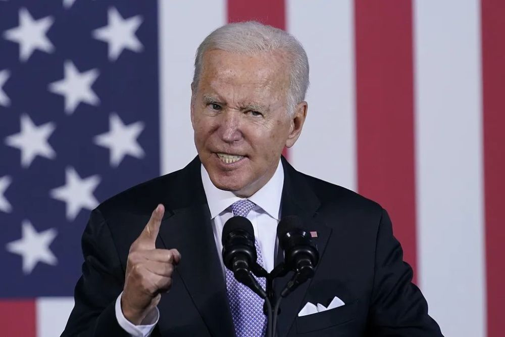

# 针对军事基地、华为和人民币，美国向沙特提涉及中国三要求？

【环球时报综合报道】美国推动沙特以色列关系正常化的条件竟是与中国保持距离？美国《华尔街日报》10日援引一名美方官员的说法称，美国已与沙特就后者同以色列关系正常化协议的大致框架达成一致。据美国官员透露，若这项协议最终达成，沙特将承认以色列，而作为交换，以色列将对巴勒斯坦作出让步，此外美国也须向沙特提供安全保障并帮助其发展民用核项目。值得注意的是，在这项关于沙特、以色列和美国的三方协议中，美国专门针对中国向沙特开出条件，涉及军事、经济等领域，要求限制沙特与中国的关系。美国官员称，拜登政府对该协议的关注反映出其对相关问题的看法，即美国必须继续在中东扮演核心角色，以遏制伊朗，孤立俄罗斯，并阻止中国在中东地区取代美国。对于《华尔街日报》的报道，美国国家安全委员会战略沟通协调员约翰·柯比称，“目前还没有一套商定的谈判方案，也没有一个商定的框架”。11日接受《环球时报》记者采访的中东问题专家认为，美媒披露的信息真实性有待考证。若美国真的提出上述条件，沙特不太可能接受，因为这将影响其作为主权国家的独立自主，且为未来同中国的合作设置障碍。

_拜登 资料图。图源：视觉中国_

**涉军事基地、华为和人民币**

据《华尔街日报》报道，沙特王储穆罕默德·本·萨勒曼两周前在吉达会见了美国总统国家安全事务助理沙利文，希望加快相关协议谈判进程。谈判代表们现已开始讨论具体细节。美国官员认为，在未来9至12个月内，他们可以敲定该协议更详细的细节。

彭博社、《华尔街日报》等数家媒体援引知情官员透露的谈判内容称，除一些涉及三方的条件之外，沙特向美国提出了3个主要诉求：协助沙特发展民用核技术；扩大对沙特武器出口；一旦沙特遭到袭击，美国将提供支援。而美国要求沙特从经济和军事上保持与中国的距离。美国希望沙特能保证不让中国在当地设立军事基地；要求沙特限制使用中国华为公司研发的技术；在对华出口石油时，沙特必须保证用美元而非人民币与中国结算。除了针对中国的要求外，美国还希望沙特能增产石油等。

中国现代国际关系研究院中东所所长牛新春11日对《环球时报》记者分析称，根据美媒报道，沙特向美国提出的3个要求都可以归为安全要求。美国在整个中东地区都未给予其盟友类似北约的条约性质的安全保障，这让包括沙特在内的美国盟友感到不可靠。而美国向沙特提出的3个涉华条件，本质是不希望沙特与中国发展更加紧密的关系。他认为，无论是美国还是沙特，都不太可能答应对方提出的要求。

对于《华尔街日报》的报道，沙特方面并未予以置评。《华尔街日报》引述沙特官员的说法称，沙特王储告诉助手，他还没有准备好同以色列建立类似于后者与阿联酋之间的那种全面外交关系。据俄罗斯卫星通讯社阿拉伯语网站报道，沙特战略与安全事务分析人士法瓦兹认为，巴勒斯坦问题是沙以关系正常化的主要考验，沙特方面在这个问题上不太可能作出让步。

柯比10日对有关报道回应称，谈判人员还有很长的路要走。美国国务院发言人米勒也称，《华尔街日报》的报道“大幅夸大了当前现状”。不过，美国官员没有明确表示，美国开出的涉华条件是否属实。

海外国语大学中东研究所助理研究员文少彪11日对《环球时报》记者表示，沙特在能源、政治、宗教等方面的地位于中东地区而言举足轻重，该国有比较强的地区大国抱负，一直在谋求多元外交的灵活空间和自主性，积极奉行“向东看”战略，高度重视与中国深化战略伙伴关系。文少彪说，中沙持续推进“一带一路”倡议与“2030发展愿景”对接，不断丰富两国合作内涵，已形成十分紧密的相互依赖关系。尽管美国试图将沙特纳入对华战略竞争轨道，但是沙特肯定会权衡持续扩大的中沙经贸利益和中沙关系的战略价值，而不愿意卷入中美战略竞争。

**醉翁之意在中国？**

彭博社10日称，拜登政府已经悄悄探索推动沙特和以色列关系正常化几个月了。从表面上看，这样做是为了促进中东和平。但从战略角度看，美国有多重考虑。半岛电视台网站引述外交分析人士的观点认为，随着2024年美国大选季全面展开，拜登政府已将沙特与以色列之间关系正常化视为一项政策目标。

与此同时，美国对中国在海湾地区日益增长的影响力感到担忧。半岛电视台分析称，此前，美国方面发出的许多信号表明，该国对中国与其海湾盟友之间的任何安全合作持保留态度。“美国意识到，随着中国崛起为全球参与者，美国已经无法阻止中国与海湾阿拉伯国家合作委员会发展更为广泛的关系。因此，美国的目标是确保这些新关系不会威胁到美国在该地区的战略霸权。”

彭博社评论认为，拜登政府推动沙特和以色列关系正常化，其醉翁之意是针对中国。要说服沙特，美国必然作出不少让步，拜登政府之所以愿意在中东问题上下这么大赌注，就是为了防止中国在中东这个关键地区扩大影响，这也折射出美国为阻止沙特与中国拉近关系愿意付出很大的代价。

针对美媒透露的3个涉华条件，牛新春11日对《环球时报》记者分析说，在军事领域，美国视中东为禁脔，军事安全是美国中东政策的支柱，也是美国影响中东的主要手段。目前，美国认为在经济领域，中国在中东的影响力领先。因此在军事上，美国不会允许其中东盟友与中国走得更近，也对相关问题十分警惕。在经济领域，美国为保证美元霸权，提出沙特的石油出口以美元结算，也有其考量。关于华为的条件，牛新春说，美国重视与中东国家在高科技领域的合作，如5G、卫星导航等。这关乎一整套技术和经济生态系统，该系统由美国和中东国家共同构建，华盛顿担心使用中国技术会威胁其整个系统的安全性，更担心中国取代美国的系统。

**实现战略意图阻力重重**

近年来，美国多次被揭露插手别国的内政外交。此次美媒相关报道再次显示出，华盛顿为达到自己的目的，不惜公然干预中东地区国家外交政策的独立与自主。文少彪11日对《环球时报》记者表示，美国妄图把与中国的战略竞争蔓延到更大的范围，不遗余力将中东裹挟到中美战略竞争轨道，华盛顿将大国零和博弈逻辑强加给中东地区，毫不在意后者谋和平、求发展的集体诉求，这是典型的冷战思维。牛新春认为，近年来，华盛顿持续推动中东战略收缩，在中东的影响力相对下降，中国、欧洲、俄罗斯、印度等的影响力相对上升。当前美国的中东政策正出现一个悖论。一方面，美国战略收缩、减少投入，为中东国家提供发挥更大自主性的空间；但另一方面，美国又希望保持自身影响力，限制中东国家的自主性，这无疑是矛盾的。

虽然美媒透露出美方向沙特提出的条件，但不少分析人士表示，其战略意图能否真的实现有待观察。目前，以色列尚未参与美国和沙特的谈判。无论是美国还是以色列，想全盘接受沙特提出的条件都困难重重。各方在安全保障、民用核项目等问题上，都面临着不小的阻力。美国中东研究院官网10日刊发文章称，拜登政府的有关外交动作能否成功涉及5个因素：美沙关系、美以关系、巴勒斯坦问题、中东地缘政治问题以及美国国内政治，特别是美国政治撕裂现状和即将到来的2024年总统选举。

彭博社11日称，想遏制中国影响力固然是美方目标，但拜登政府倘若真的为此而跟沙特达成协议，那才是漫长痛苦进程的开始。

【环球时报驻阿联酋、美国特派特约记者 任皓宇 孟翰 环球时报记者 赵觉珵 环球时报特约记者 甄翔】

