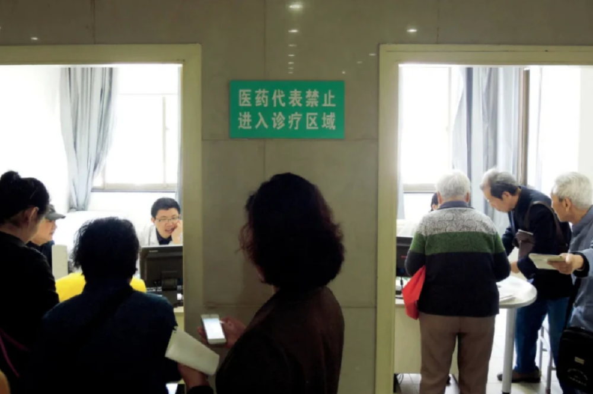
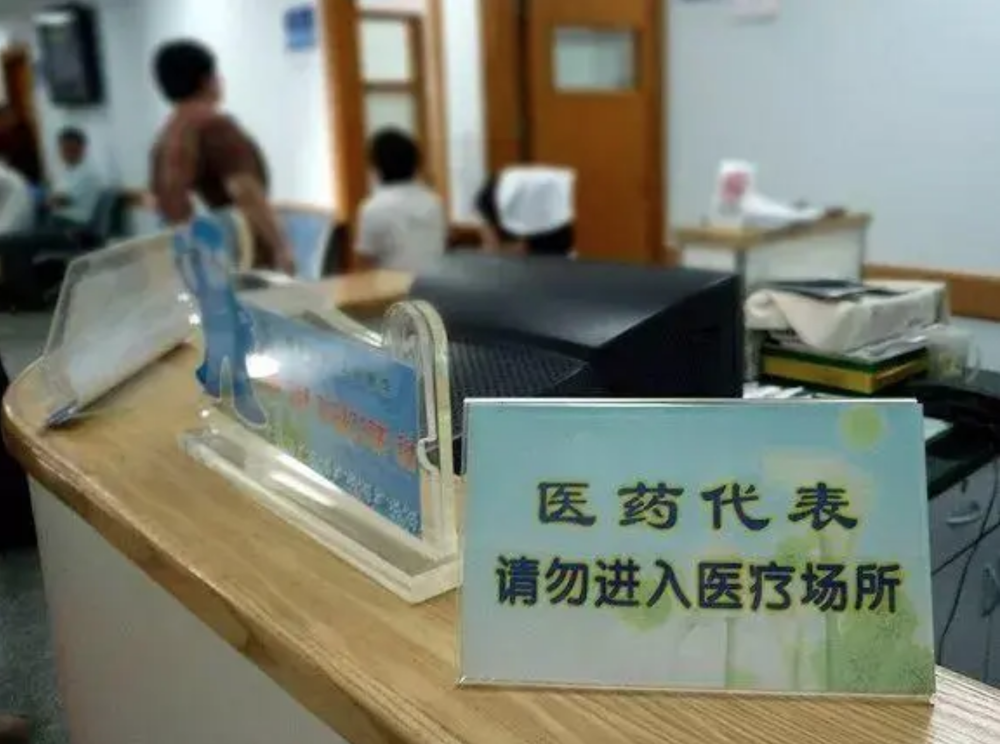

# 院长为何能收供应商1600万元回扣？业内揭秘

大象新闻记者 李昌

近日，一条内容为“中纪委曝光一台直线加速器回扣1600万”的话题，迅速“引爆”网络，登上微博热搜榜榜首。一名网友评价道“医疗反腐、刻不容缓”，成为话题词下的高赞评论。当前这轮医疗反腐的背景是什么，医疗行业的腐败如何滋生，而反腐的重拳又将砸向何处？8月11日，大象新闻记者对话多名业内人士，试图揭晓这些疑问。

**一台让院长得到1600万回扣的机器**

“一台直线加速器回扣1600万”的微博热搜，源自于今年5月中央纪委国家监委的一篇曝光文章，云南省普洱市人民医院原党委副书记、院长杨文俊和原党委委员、副院长杨文红，与供应商称兄道弟，肆意吃请玩乐、收受礼品礼金。一台进口价1500万元的医疗器械直线加速器，医院以3520万元买入，远远高于同期市场价格。而其中，杨文俊拿了1600万元的回扣！

截至8月10日，据不完全统计，今年全国至少有168名医院现任或者原任院长、书记被查，数量已超过去年全年的两倍。这些落马被查的院领导大多来自于县级或者地级市公立医院，但其中，也不乏三甲医院院领导。

医院领导为什么会与供应商打得火热，甚至最终禁不住诱惑身陷囹圄呢？

据某医药公司负责人透露，以药品流通环节为例，药品从研发之初，就需要找医生、药师参与前期研发。而药品研发完毕，为保证新药的安全性和药效，就要找更多的医生进行临床试验。临床试验成功后，药企一般都会为新药上市召开发布会或学术研讨会。此时，药企会在全国范围内邀请更多地医院领导、知名专家参与其中，除了了解新药外，药企最大的目的就是让他们为新药上市站台。

“这个过程本身没什么问题，但在这些合规的、频繁的工作交集中，医生与药企医代表之间的连接越来越紧密，关系越来越‘铁’。”该负责人表示，两者关系的拉进，为进一步的利益绑定提供了基础。

“从法律大数据角度反馈，医疗腐败主要集中在商业贿赂上，涉及医院采购、医院统方和医生处方等环节。”河南零度律师事务所主任王华丽律师介绍，“近年来此类案件出现了一些新特点，如行贿对象更广、行贿手段和方法更隐蔽、行贿目的更间接，医疗行业高定价、高费用、高回扣、高毛利也随之产生。”

**一笔笔唯恐数额不够高的销售费用**

医疗反腐重拳不光砸向了医院的院长、书记，同样也砸向了医疗企业，陆续有医疗公司实控人被查，引发股价下挫。

7月3日，医疗卫生信息化龙头企业卫宁健康披露，公司实控人、董事长周炜因涉嫌行贿罪被立案调查及实施留置，当日公司股价跌停。7月31日，抗血清抗毒素领域的生物医药企业赛伦生物披露，公司实控人之一、董事长范志和涉嫌职务犯罪被实施留置并立案调查。

据万得平台A股资料显示，2022年，A股488家医疗企业共支出销售费用3523亿元，其中92家企业去年的年销售费用超过10亿元，平均每家医疗企业年销售费用约为7.2亿元。

“作为一项开支，我们却唯恐销售费用不够高。”
有着近十余年从业经验前医药代表张贤伦（化名）向大象新闻记者透露，医疗企业的销售费用，包括市场推广费、业务招待费及销售团队薪酬等费用。

“赞助医院搞学术活动，配合医生搞科普活动，这都是明面上的开销，目的是为了拉近和院领导和医生的距离。”张贤伦坦言，“拉近距离”最直接的方式就是“金钱开路”，想方设法替院领导和医生支付差旅、招待等各种费用，“目的就是熟络了之后，方便更深程度的‘打点’他们，从而促使自己公司的产品进入医院。”

“其实，实行药品零差价和带量采购之后，药品上的提成已经少很多，现在只是在小品种药品、部门中药、医疗器械、耗材上存在一些销售提成。大部分药企的销售费用，还是花在了产品能够进入医院的‘入场费’上。”张贤伦坦言：“药效都差不多的情况下，凭什么选择你的产品？这就要看你和院长、科室主任、药剂科这些有准入话语权的人，关系有多‘硬’了——也就是双方利益绑定程度有多深。”

此外，他还透露，如今医疗反腐的背景下，“不少医药代表被客户拉黑，不得不暂时停止推广工作。很多学术会议也宣布延期。”

**一记记精准砸下的反腐重拳**

医药领域内风声鹤唳，这种局面源自2023年开年，国内医疗领域反腐重拳便频频砸下。

2023年1月5日，中央纪委国家监委网站发布《坚决打好反腐败斗争攻坚战持久战》一文，指出要进一步深化民生领域不正之风和腐败问题专项整治工作，集中纠治包括医疗、食品药品安全等民生领域群众反映强烈的突出问题。

5月10日，国家卫健委等14部门联合发布2023年《纠正医药购销领域和医疗服务不正之风工作要点》，“纠风”成员单位也从9个增至14个。

而进入7月后，国家医保局等四部门、国家卫健委等10部门更是分别就医疗保障基金、医药领域腐败问题展开检查整治行动。此外，中央纪委国家监委召开动员会，部署纪检监察机关配合开展全国医药领域腐败问题集中整治，并在其网站发文指出，“单位行贿行为多见于权力集中、资金密集、资源富集等‘三集’领域，医疗卫生便是其中之一”。

某三甲医院主治医生告诉大象新闻记者，医药代表作为医药公司和医生之间的纽带，通过有效的推介新药品、器械，在产业链上发挥着应有的价值，“但在这个过程中，因为医代和医生并非是产品的最终使用者，所以很容易从销售角度形成利益共同体，而非从产品自身优势、性价比这一初衷进行考量——这的确需要通过监督检查，进行有效的遏制。”

“德不力辅以重法，因此，根据医疗腐败的特点，加大医疗贿赂打击力度，严查医药主体，杜绝股权交叉、隐名持股、企业关联等现象，才能在一定程度上起到正本清源的效果。”王华丽律师表示，医疗腐败长期存在，关乎民生，影响重大。国家在医德建设、制度建设等方面始终不遗余力。医疗反腐力度的加大，最终会推动医疗行业健康发展，这不仅仅能让患者获益，也能为医药企业创造出一个良好公平的市场环境，也让医生更多地被社会尊重。

