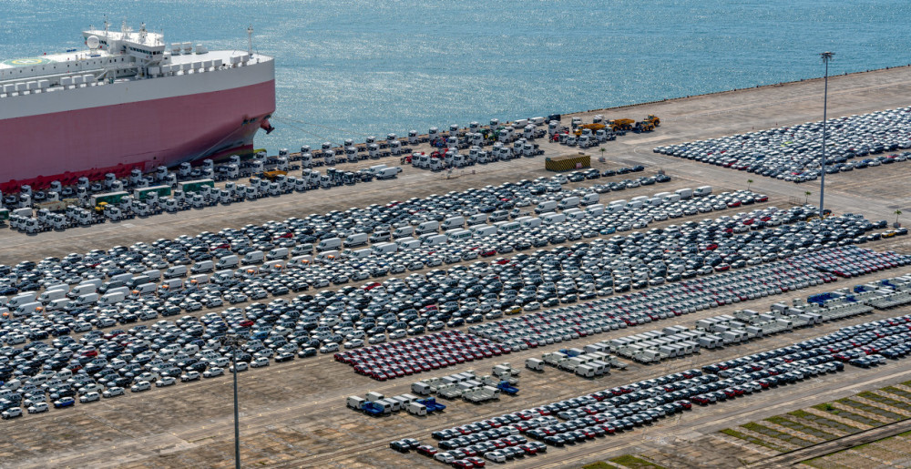

# 需求旺盛竟把新车当二手车卖，汽车平行出口悄然流行

**本报记者 濮振宇 北京报道**
理想汽车创始人李想近期在社交媒体发布的一则关于公司交付量的“漏洞”，撕开了当下存在于中国汽车市场上鲜为人知的一幕——新能源汽车平行出口正在流行起来。

“原来是平行进口，现在流行平行出口了。本月前两周，私人平行出口了200多辆车（这两周交付量和上险量差了200多辆），详细调查后发现以出口中亚和中东为主。”
李想对此事感到颇为意外。

更令人想不到的是，目前很多平行出口的新能源汽车，其实是把新车当做二手车销售。这部分销售数据并不被统计在各企业的车型上险量当中，但着实存在于其交付量当中，也被计算到二手车出口数量当中。

8月10日，天津市二手车出口协会秘书长张婷婷对经济观察报记者表示，从此前的市场情况来看，二手车出口中大概25%左右是二手商用车，包括自卸车、牵引车、大巴车等，这些是真正意义的二手车，另外75%是二手车乘用车，这里面大概90%其实是新能源新车。

“好多（二手车出口）企业去年集中出口到迪拜，因为它是重要的中转国，可以去非洲、欧洲等地区很多国家，但迪拜港口消化能力和周转速度也是有限度的，而中国二手车出口业务发展太快，企业出口意愿强烈，短期的集中出口，一度让迪拜口岸积压了大量的中国进口车，乃至在上半年还造成了一定程度的滞港，目前刚逐步恢复常态。”
张婷婷说。

迪拜口岸的滞港现象是中国二手车出口爆发的一个缩影。华泰证券最新研报预测，考虑到二手车出口存在较大套利空间且俄罗斯以及“一带一路”国家仍留有供给空白，今年我国二手车出口量可能超过10万辆。作为参照，2019-2022年，二手车出口分别为3036辆、4322辆、1.5万辆、7万辆，一直呈现快速增长态势。

在张婷婷看来，参考天津二手车出口的情况，预计今年我国二手车出口量有望能够增长2倍以上。天津的二手车出口规模排名国内前列，根据天津海关的统计，今年1-5月，天津口岸二手汽车出口5200余辆，同比增长超6倍。

**平行出口悄然流行**

国内消费者对于平行进口汽车已不陌生，每年国内的进口汽车中有相当一部分都是经由非厂家授权经销商引入国内的，这些车多是跑车、越野车等小众化车型，满足国内一部分追逐个性的消费者的需求。

李想提到的平行出口，与平行进口有些类似，也是由非厂家授权经销商主导的行为。但有别于汽车生产企业主导的新车出口，平行出口的车源虽然也是新车，但采用的模式却是在国内上牌后，再以二手车的名义出口到海外市场。

之所以出现这种情况，是由于非授权车商无法出口新车。根据相关政策规定，我国对汽车实行出口资质管理，符合要求的汽车生产企业可以向商务部申请出口资质。如果一家公司不是汽车生产企业，又想出口汽车，必须获得拥有出口资质的汽车生产企业的授权。

在我国，二手车出口曾长期被禁止，2019年后开始起步。2019年4月，商务部、公安部、海关总署联合下发《关于支持在条件成熟地区开展二手车出口业务的通知》。2019年5月，三部门共同召开二手车出口专题会议，正式启动二手车出口工作。

如今，二手车出口资质并不稀缺。据统计，截至今年8月，全国开展二手车出口业务的地区覆盖27个省（自治区和直辖市），已有超过400家二手车出口试点企业。

通过二手车出口的方式卖新车，程序上也不复杂。只需要车商或者私人首先在国内授权经销商处买到新车，然后销售给具备二手车出口资质的企业，接着再由二手车出口企业办理出口手续，完成中国海关出口清关、外国海关进口入关，最后就可以在海外销售。

为什么在出口二手车中，商用车大多是货真价实的二手车，而乘用车很多都是新车？张婷婷对此表示，中国的商用车包括售后养护在内的各类成本比较低，相较日韩等国家的二手商用车具备优势，而二手乘用车暂时并不具备这样的有利条件。

**非授权车商替主机厂“探路”**

对于平行出口现象，很多国内车企持默许的态度。张婷婷表示，一些车企的全球化战略，布局速度未必那么快，如果车企要在海外开展授权出口，需要做很多前期工作，涉及市场调研、质量安全、售后服务等各方面，投入非常大，而二手车可以出口到车企授权体系没有覆盖到的区域。

据了解，中国二手车已出口超过全球140个国家和地区，其中“一带一路”沿线的发展中国家对二手车进口需求大，例如中亚多国对二手车进口没有具体限制，非洲大部分国家允许进口二手车，缅甸超过90%的车辆来自二手车进口，且对车龄要求较低。

对于部分实力较弱的车企而言，平行出口甚至是它们将车卖到海外市场的唯一途径。根据商务部等部门2013年发布的通知，2014年起，未建有境外售后维修服务网点的生产企业不得授权或自营汽车出口。

“目前的情况，我们觉得（二手车出口企业与主机厂）是比较和谐的状态，它（指平行出口）是主机厂出口的有益补充”，张婷婷表示，从原则上看，在海外竞争不太激烈或者没有车企授权经销体系的区域，平行出口模式对国内车企是有利的，一些国内无法消化的产能可以通过平行出口输出到海外，也可以利用平行出口提前在一些海外市场“探路”，积攒用户。

天津华图汽车物流有限公司总经理史运昇也对经济观察报记者表示，应该理性看待平行出口，“对于好的产品的认可是没有国界的，也恰恰说明理想们的竞争力是具备的，在官方没有准备好的时候，这种方式也能从市场上提供很多有价值的参考数据，世界那么大，任何地区都有可能，底层逻辑还是我们中国制造和中国品牌竞争力强了”。

值得注意的是，如果二手车出口商与车企在海外的产能、渠道布局区域有所重合，则双方可能会产生矛盾。

据过往媒体报道的消息，比亚迪2022年曾在约旦市场发布声明称，比亚迪在约旦只有一家官方合作伙伴，只有在该处购买的比亚迪车型才能享受质保。该消息传递出的信号是，比亚迪官方不认可约旦市场的平行进口车。

**二手车出口日渐“内卷”**

近两年，受国际关系影响，欧美车企相继退出俄罗斯市场，留出的市场空白正吸引中国平行进口车的涌入。今年5月，俄罗斯《消息报》报道援引Avto.ru网站俄罗斯专家的话称，当前俄罗斯市场中国“二手”电动汽车售车广告是年初的3倍。

虽然机遇很大，但二手车出口商的竞争压力也在增大。在张婷婷看来，目前全球汽车市场并不在一个高速增长的轨道，中国二手车出口很大程度上并不是靠海外市场的增量带动，而是在抢日本、韩国等其他国家汽车的存量市场份额，但这些竞争对手肯定不会无动于衷，必然会想方设法反击。

日本是全球二手车出口第一大国，而俄罗斯是日本二手车的主要销售市场。日本E-
Stat政府统计网数据显示，2021年，日本二手车出口量高达122.49万辆，覆盖全球166个国家和地区，其中出口量超过10万辆的国家有3个，分别是俄罗斯、阿联酋、新西兰。

此外，国内二手车出口商之间的竞争也在加剧。张婷婷表示，以前海外的二手车采购企业，会先向国内出口企业支付20%-30%的采购定金，然后国内出口企业再去采购车辆，完成出口申报后马上收取尾款。现在试点企业增多，行业越来越“卷”了，很多企业都在建设海外仓，客户在家门口就能够看到车，不需要先支付定金再等待车辆采购，也不用再承担汇率、车价变动等方面的风险。

今年6月，浙江存富进出口有限公司签订了日本东京海外仓租用项目，宣布开展海外直售模式、缩短订单交付周期，提供便利条件。近日，江苏苏美达科技设备有限公司方面也透露，正和阿里巴巴国际站合作建设二手车出口网络平台，根据客户需求建设海外仓，用于储备和展示产品。

张婷婷认为，在海外很多国家，二手车出口已成为
“红海”，但行业整体来说仍然是一个具有巨大发展空间的优质赛道。只是在这个赛道上，有资源、有背景的企业可能会更加如鱼得水，而实力较弱的企业已不太适合入局厮杀。现在，一些企业出口的数量是上去了，但是却不挣钱，想在这个行业长久立足并非一件简单的事情，企业需要想清楚自身竞争优势是什么再参战。

