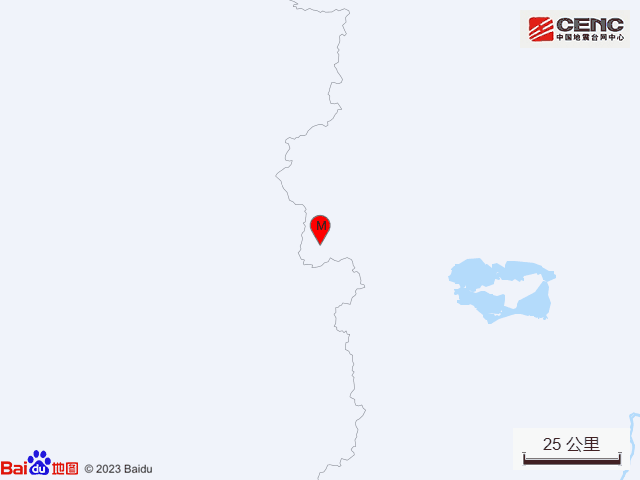
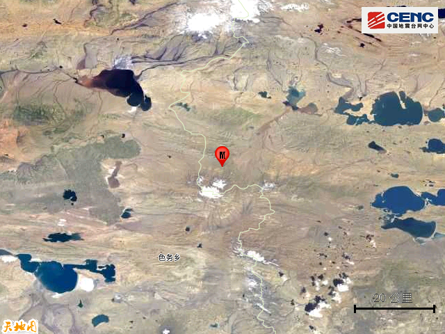
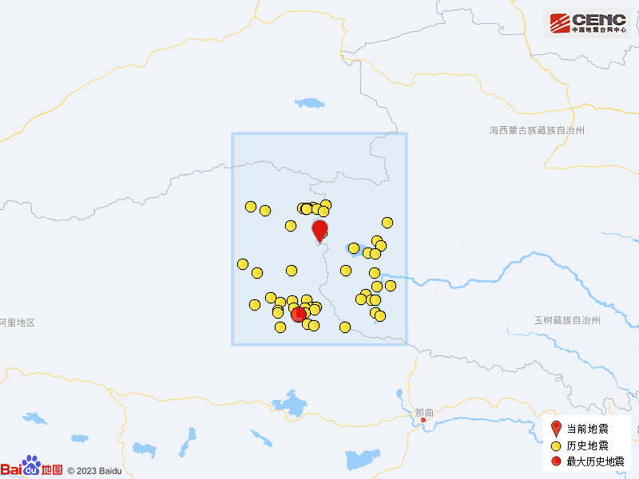

# 青海玉树州治多县发生3.6级地震，震源深度10千米

据中国地震台网正式测定，8月12日22时9分在青海玉树州治多县发生3.6级地震，震源深度10公里，震中位于北纬34.99度，东经89.66度。

本次地震周边10公里内的村庄有迎春口，100公里内无乡镇驻地分布。震中距西藏双湖县214公里，距西藏那曲市450公里，距玉树藏族自治州713公里，距西宁市1108公里，距拉萨市610公里。震中5公里范围内平均海拔约5093米。

根据中国地震台网速报目录，震中周边200公里内近5年来发生3级以上地震共60次，最大地震是2018年10月18日在西藏那曲市双湖县发生的4.8级地震（距离本次震中174公里），按震级大小前50次历史地震分布如图。

