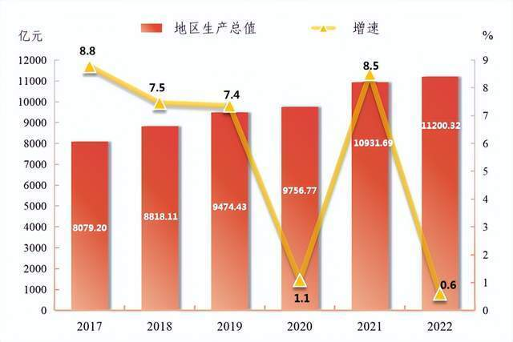

# 上半年GDP增速仅1.5%，“世界工厂”东莞怎么了

被誉为“世界工厂”的东莞，“失速”了。

7月26日，东莞市统计局披露：2023年上半年全市地区生产总值（GDP）为5262.10亿元，同比增长1.5%。较东莞今年一季度（2.2%），以及去年同期（1.6%）的水平均有所下降。

1.5%的增速意味着什么？放在省内，广东省上半年GDP增长5.0%，21个地级市有11个增速达到全省平均水平，揭阳增速最快，达到7.6%；东莞增速位居倒数第一，而倒数第二、三位的肇庆、茂名均增长2.9%，增速接近东莞的2倍。

放眼全国，今年上半年，全国GDP平均增速为5.5%，在目前已公布数据的主要城市中，东莞仅仅超过福建厦门，在主要城市中位居倒数第二。而作为万亿城市的“守门员”，东莞上半年在万亿GDP城市中，经济增速倒数第一。

作为改革开放之后快速崛起的工业城市，东莞在2021年迎来属于自己的“高光时刻”——GDP迈过万亿门槛。由此，也成为继广州、深圳、佛山之后广东第4座GDP超万亿的城市，也成为全国第15个GDP过万亿元、人口超千万的“双万城市”。

上半年仅1.5%的增速，东莞怎么了？

**“失速”背后**

去年受国内外多重因素影响，东莞经济增速下滑，全年GDP为11200.32亿元，同比增长0.6%，低于广东全省（1.9%）的水平。

今年新春首个工作日，广东全省高质量发展大会上，东莞便提出，要全力确保一季度开门红，争取实现全年增长6%的目标。

然而，半年过去，东莞GDP增长并不尽如人意。受访专家普遍认为，工业承压、外贸增速放缓是东莞经济“失速”的主因。

广州市博士科技创新研究会会长、广东省体制改革研究会执行会长彭澎向中国新闻周刊表示，东莞一直以“世界工厂”著称，制造业占比很大，但自有知识产权又不足，对外依存度很高。因此，产业外迁、订单减少、疫情和贸易保护主义打击产业链供应链等因素，对东莞经济增长影响很大。

上半年，东莞第一、二、三产业增加值分别为18.11亿元、2889.57亿元、2354.42亿元，同比增长3.4%、-2.5%、7.1%。其中，规模以上工业增加值2379.57亿元，同比下降5.9%，比一季度下降0.8个百分点。

工业是东莞经济的基石，作为制造业重镇，东莞的工业增加值去年高达6244亿元，位居全国第九，是全国工业十强城市之一。工业增速下滑，对东莞经济的影响不言而喻。

计算机、通信与其他电子设备制造业是东莞7个千亿产业之一，也是东莞工业实力的名片。这一产业不仅是东莞主打产业，其在全国的排名也仅次于深圳和苏州，位居全国第三。

然而，上半年，东莞计算机、通信和其他电子设备制造业增加值下降4.9%，电气机械和器材制造业下降7.4%。主打产业出现负增长，对于东莞经济的影响明显。

事实上，从东莞统计局披露的数据来看，近几年，东莞的主打产业下降趋势非常明显。

以手机产量来看，东莞是全国手机制造基地，曾经一年生产过4亿台手机，但在2019年产量见顶之后逐渐下滑。去年东莞手机产量只有19761.67万台，相比于巅峰时期降幅超过一半。

另外，作为外贸型城市典型代表之一，出口对于东莞至关重要。广东省社会科学院经济学研究员丁力长期关注东莞的发展，曾做过东莞外贸依存度的课题研究。

他对中国新闻周刊表示，作为全世界重要的加工贴牌生产基地，东莞外贸依存度比一般的城市要高得多，一度达到百分之二百到百分之三百，海外市场不景气，对东莞经济的影响自然比较大。

2022年，东莞出口总额9240.1亿元，其与GDP之比被视作外贸依存度，高达82.5%，位居全国第二。据了解，东莞外贸依存度历史最高值出现在1995年，高达433.8%。

东莞市统计局数据显示，今年上半年，东莞市外贸进出口6186亿元，同比下降11.3%，其中出口下降了9.4%。而根据海关总署日前发布的外贸数据，今年上半年东莞进出口增速仅有-11.3%，被宁波赶超，位列万亿城市第六位。

外贸订单的减少，直接影响到当地企业的发展和生存，特别是中小企业。一家在东莞经营多年的纸箱包装厂，就在6月30日全面停止经营，除了个别善后岗位的人员外，其余所有员工将在7月第一天被遣散。根据该公司5月30日发布的停工歇业公告，其停业原因是经营环境恶化，公司订单减少、业绩下滑。

前述纸箱包装厂并非孤例，东莞手机结构件大厂捷荣技术，也因受大环境影响订单量骤减，安排部分员工放长假3个月。据了解，该公司约有9000名员工，客户包括OPPO、华勤、三星、华为、Google等知名企业。

日前，捷荣技术发布公告称，预计公司2023年上半年净利润亏损4055万元～5272
万元，上年同期亏损3729.91万元。对于业绩变动的原因，捷荣技术表示，报告期内，受宏观经济及消费电子行业整体需求持续疲软影响，以智能手机为主的终端产品市场需求订单量和出货量下降，导致公司2023年上半年收入减少。

东莞外贸面临的核心难点，就是订单不足。多位外贸企业负责人在接受媒体采访时表示，从去年四季度开始，订单相较往年同期下滑非常明显。比如中国服装名城虎门，受欧美市场订单不足影响，今年1～5月约有七成服装企业出现负增长。

厦门大学经济学院经济学系副教授丁长发对中国新闻周刊说，出口对于东莞等外贸型城市来说非常关键，所以受到的影响也比较大。在他看来，这是大部分增长乏力城市“共同的命运”。

他说，“很多沿海城市，像东莞、泉州等外贸型城市，都有外贸订单流失的情况，所以外贸数据从去年七八月份到现在，每个月都在往下走，下半年可能更严峻。”

彭澎表示，出口下降严重是导致东莞经济“失速”的关键因素之一。他说，东莞产业结构外向型十分显著，而内需又是“弱复苏”状态，不能完全替代出口。

**东莞之困**

东莞地处珠江三角洲东部，是国务院批复确定的珠江三角洲东岸中心城市，重要的交通枢纽和外贸口岸，有“世界工厂”之称。截至2022年末，东莞市GDP超过1.1万亿，常住人口过千万，是全国为数不多的“双万城市”。

和多数新兴工业城市一样，在改革开放前东莞是传统农业县。曾担任东莞政府顾问的丁力告诉中国新闻周刊，东莞改革开放以前没有太多的工业基础，“它的工业化实际上是和招商引资同步的”。

统计数据显示，1978年时，东莞工业生产在整个国民经济中所占比重很低，三大产业结构比例为44.6∶43.8∶11.6。当时，东莞的GDP仅为6.11亿元。而到了2022年，东莞三次产业比例为0.3∶58.2∶41.5。

翻天覆地的变化，来自于东莞制造业的发展。改革开放之后，广东成为改革开放的先行地区，而东莞成为广东改革开放的前沿阵地。依托毗邻港澳，劳动力、土地价格低廉等优势，凭借“三来一补”加工贸易——来料加工、来样加工、来件装配和补偿贸易，东莞逐步奠定“世界工厂”的地位，经济飞速发展。

到1985年，东莞工业产值首次超过农业。1988年1月，东莞市升格为地级市。这一年，东莞工业产值占工农业总产值的72.3%，初步进入了工业化。而在1985年至1988年四年间，东莞工业以年平均增长50%以上。

时间拉长到改革开放前30年，东莞经济年平均增长18%，创造了比亚洲“四小龙”起飞时速度更快、周期更长的高增长奇迹。而之后的十年间（2009年～2019年），东莞的GDP增速也保持在8%左右高位，其中最高值是2009年的10.3%。

近三年来，受内外多重因素影响，东莞呈现出起伏不定的震荡态势。2020年，东莞GDP同比增长1.1%。2021年，在出口大幅增长的背景下，东莞的GDP增速有所恢复，最终核实增速达到8.5%。2022年东莞的GDP增速再度下滑，同比增长0.6%。

_2017-2022年东莞地区生产总值及增长速度。图/东莞市统计局_

在丁力看来，随着“蛋糕做大”，东莞经济正常的增长曲线应该也是一个逐渐回落的趋势。他说，“蛋糕做大”以后，同样增长1%，所需要的增量要更大。比如，过去1000亿元的体量和现在10000亿元的体量，同样增长1%，增长的GDP要翻10倍。

但东莞GDP增速大幅下滑并呈现震荡的态势，显然需要警惕。按照今年初的既定目标，东莞2023年GDP预期增长5.5％以上，争取达到6％。但上半年GDP仅增长1.5%，对于的东莞压力可想而知。

过去四十多年，东莞电子、玩具、鞋业、家具等产业蓬勃发展，已经成为我国最重要的制造业基地之一。

“全球每四台智能手机就有一台是东莞制造”“世界上每5台电脑就有一台是在东莞制造”“每5件羊毛衫就有一件是在东莞生产”……这样的数字足以让东莞引以为傲，但如同硬币的两面，给东莞带来沧桑巨变和增长奇迹的同时，“世界工厂”帽子下面，也潜伏着巨大的不确定性。

这种不确定性，在疫情暴发后开始集中显现。2020年上半年东莞GDP为4361.28亿元，同比下降1.7%。这一年，东莞的出口下降了4.4%，全年GDP增速只有1.1%。这也将东莞跻身“万亿俱乐部城市”的时间，往后推迟了一年。

在专家看来，国内外多重因素影响背后，东莞产业发展自身也存在着结构性问题。

丁力用“外源经济”——指东莞经济增长的动力来源于外部——来形容东莞的经济发展模式。他向中国新闻周刊表示，东莞经济的高速增长是经济全球化的产物，基本上资金、技术、设备、订单都是从境外来，所以就产生了严重的外部依赖性。

在他看来，创新能力不强，成本抬升过快，是东莞产业发展的现实困境。他说，东莞加工贸易主要是依靠低成本，包括土地、人力资源、水费电费等，“这些成本现在大幅提升，尤其是高房价、高地价带来了整个社会成本的快速增加。”

在中国宏观经济研究院国土开发与地区经济研究所区域三室副主任李晓琳看来，东莞正面临着再一次转型升级的挑战。

她说，“电子信息产业对东莞经济发挥了重要的支柱作用。当前，全球消费电子处于下行周期，内外需求均呈现疲软态势，东莞电子信息业受到较大冲击。”

此外，全球经济下行，外需不振，作为典型的外向型经济城市，全球外贸萎靡直接影响东莞制造业。

在丁力看来，东莞产业升级和经济转型，需要当地政府主动作为。他认为，无论是土地价格，还是创新引导，都需要政府在宏观上进行必要的调控与指导。

**如何破局？**

事实上，东莞也正在寻求破解之道。

从2012年开始，东莞就陆续推出一系列转型的重大措施。东莞曾连续5年拿出50亿元支持企业发展，这些资金主要用在产业转型、中小企业贷款、企业贴息、设立创业基金等方面。

近年来，东莞正大力发展战略性新兴产业，包括新一代信息技术、高端装备制造、新材料、新能源、生命科学和生物技术。《东莞市现代产业体系中长期发展规划纲要(2020-2035年)》，明确了未来15年的产业发展目标、实施方式和保障措施。

彭澎对中国新闻周刊说，东莞发展新兴产业应该优先发展有一定基础、配套较成熟的产业。“作为电子产业大市，信息产业放在首位，相关的新材料、装备制造也容易形成上下游关联。”

东莞经济总量中，制造业贡献占比过半。

就在7月25日，广东省省长王伟中到东莞调研并主持召开座谈会，提出东莞要举全市之力稳住工业基本盘，坚持稳存量、拓增量、挖潜量并举，精准发力做强做优电子信息产业，加快发展高端装备制造产业，着力推动传统产业改造升级。

在彭澎看来，东莞的产业链供应链配套比较齐全，但是核心技术大多受制于人，产业链供应链需要“强链补链”。同时，要更多与深圳、广州产业融合，抱团发展，逐渐形成稳定互补的产业链供应链。

此外，他还提到，应按照“双循环”思路，不断拓展新兴市场，大力拓展内需市场。

丁力认为，东莞的传统产业具有深厚的产业基础和发展优势，在大力发展新兴产业的时候，要充分考虑产业技术储备、创新能力、人才数量、企业生态等发展要素，同时还要“喜新不厌旧”，这也能为已有产业的发展带来新机遇。

在座谈会上，王伟中还要求当地党委政府围绕重点企业“一企一策”加强服务，推动惠企政策直达快享、见到实效，强化服务支撑和要素保障，支持企业开展技术改造、产线升级和产品更新迭代。

丁力提到，东莞历届政府虽然也倡导创新，号召企业转型升级，但给人的感觉依然存在侥幸心理，“原来靠招商引资，能够活得很好，未来也可以继续延用这一套办法。”丁力表示，“麻雀”飞行的路线，也即劳动密集型企业飞行的路线，和“凤凰”——高新技术企业——飞行的路线，实际上是不一样的，通过低成本可以吸引一些“麻雀”，但是要吸引真正的高科技企业，还是有难度的。“因为没有产业基础，也没有相应人才储备。”他说。

丁力以东莞和合肥为例，两个城市都要发展新能源、发展战略性新兴产业，虽然东莞在招商引资上“花了不少力气”，但是一直没有真正形成有竞争力的高新技术产业链和产业生态。

“发展高新技术产业，核心竞争力不是产业工人，而是创新人才，合肥之所以能够抓住某些机会发展新产业，背后有中国科学技术大学，以及中国科学院在安徽的研究机构的支撑，而东莞没有这样的基础和支撑。”丁力说。

在他看来，如何利用省内其他城市，比如广州，乃至国内外的科研力量，来帮助自身实现转型升级，是东莞需要研究的课题。

彭澎认为，广州、深圳、东莞是三大电子产业城市，可以一起转型升级。新材料、新能源可以依托深圳形成产业链供应链。生命医学、生物技术可以更多地承接广州的辐射。

“这些产业也要加强与中国科学院、国家实验室和央企等的合作。同时，广泛与国内外科研机构、世界500强企业合作。”他说。

在前述座谈会上，王伟中还提出，东莞要全力推动外贸稳增长，省市联动再研究出台一批稳外贸措施，探索推进“跨境电商+产业带”等模式，全力稳定加工贸易份额，加快培育外贸新增长点，打造电子元器件等集散枢纽。

丁力说，东莞某种程度上是广东积极参与全球产业分工的亮点，通过招商引资实现了经济的较快发展。但是，现在看来内生动力不强，对外部资源过度依赖，需要对发展格局要进行重新构建、综合调整，要真正构建起国内大循环为主体，国际国内双循环发展格局。这是东莞需要面对的现实挑战。

作者：孙晓波

