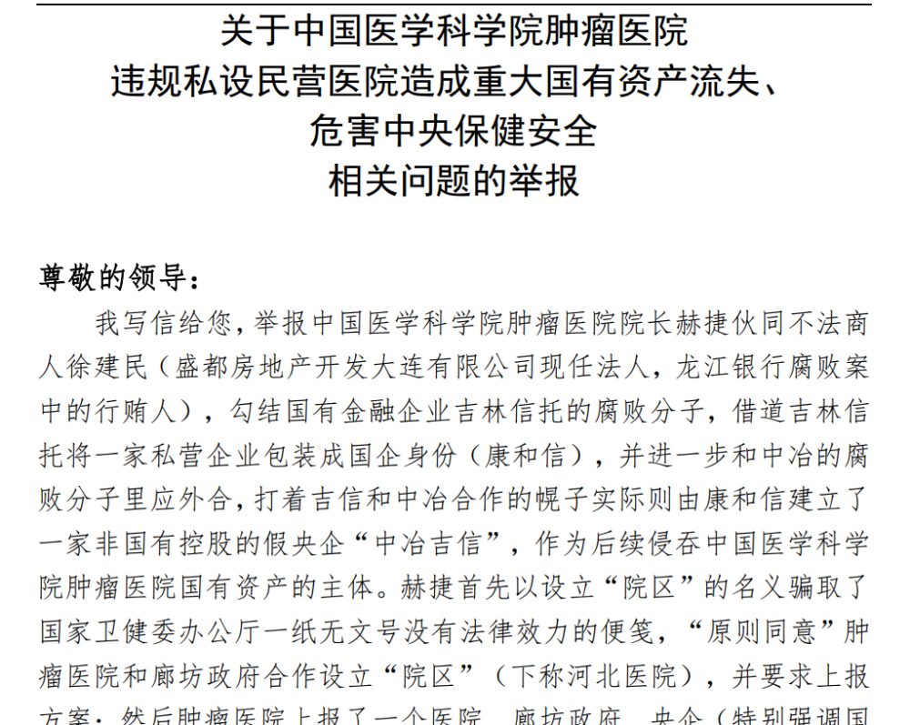

# 中国医学科学院肿瘤医院院长遭举报私设民营医院，致12亿国有资产流失

界面新闻记者 | 唐卓雅

界面新闻编辑 | 谢欣

《河北青年报》8月9日报道，河北中国医学科学院肿瘤医院（下称“河北分院”）拟向组织登记管理机关申请注销登记。请债权人于公告发布之日起45日内向清算组申报债权，逾期不提出的按相关规定处理。

河北分院从2020年11月获批设置至今三年不到，原计划于2024年建成投用，如今却迎来注销登记。而值得注意的是，就在本月，一封涉及河北分院的总院中国医学科学院肿瘤医院及其院长赫捷的举报信从业内流出。举报信称，赫捷违规私设民营医院，造成国有资产流失，所涉及的正是河北分院相关事项。

被举报后“光速”申请注销，就此事，界面新闻记者分别致电中国医学科学院肿瘤医院、该项目合作方中冶集团与河北卫健委，但多次拨打均无人接听。

据新华社此前报道，2019年2月，廊坊市政府与中国医学科学院肿瘤医院签署战略合作协议，合作建设中国医学科学院肿瘤医院分院。2019年5月，廊坊开发区管委会、中国医学科学院肿瘤医院、中冶集团三方签署合作框架协议。

按照《三方合作框架协议》，廊坊经济技术开发区管理委员会作为廊坊市政府指定的具体实施服务主体，与中国医学科学院肿瘤医院和中国冶金科工股份有限公司紧密合作，中国医学科学院肿瘤医院负责按照三级甲等医院标准提供本项目规划设计建设需求方案及医院运营，中国冶金科工股份有限公司负责组建项目公司，并以项目公司作为项目投资建设主体，负责公益及非公益性医疗院区全部资金投入、工程建设。

次年1月，正式开工，项目从签约到开工建设，不到一年时间。根据廊坊市人民政府官网信息显示，2020年1月，河北分院项目开工推进会召开，项目总投资94.6亿元。

不过，该项目直至2020年11月才被河北卫健委批复。批复中提到，同意中国医学科学院肿瘤医院、中冶吉信健康产业有限责任公司共同设置中国医学科学院肿瘤医院河北医院。设置医院的级别类别为三级专科医院，经营性质为非政府办非营利性，服务对象为社会。

不过值得注意的是，批复中提到的主体之一中冶吉信此前并不在签约主体之内，而此前的签约主体廊坊开发区管委会，也是廊坊市政府指定的具体实施服务主体，却不见踪影。

而在举报信中，上述批复共同设置河北分院的主体之一中冶吉信被指控为“假国企”。举报信中称：中国医学科学院肿瘤医院院长赫捷伙同徐建民（盛都房地产开发大连有限公司现任法人，龙江银行腐败案中的行贿人），勾结国有企业吉林信托，将一家私企康和信包装称国企，再借由康和信成立中冶吉信。

天眼查显示，中冶吉信的控股股东为康和信、中冶集团。其中，康和信持有中冶吉信99.58%的股份。根据国家企业信用信息公示系统，康和信为吉林信托控股公司。中新网报道称，吉林信托工作人员表示“没听说过”这一子公司。对此，界面新闻致电吉林信托，对方称不清楚该问题，了解清楚后再回电。

举报信共列举赫捷及其合伙人的“六宗罪”。一是设立民办医院，从而逃避政府监管、逃避审计监督；二是肿瘤医院将国有资金购置的质子等大型医疗设备异地安置到民营医院，造成12亿的国有资产流失；三是用肿瘤医院的钱免费给河北医院支付医务人员费用；四是通过伪造康和信国企身份，控股中冶吉信，通过内幕交易、长期持续性倾吞国有资产；五是对抗上级医科院调查；六是在上级机关要求整改并回购河北医院解决质子属性问题后，仍在评估、审计等多个环节弄虚作假。

其中，对于康和信、中冶吉信的国企身份，根据中新网7月报道，康和信、中冶吉信在企查查上的显示结果仍为国有企业，但是如今已经变更为投资机构。

公开信息显示，此事件核心人物赫捷除了是中国医学科学院肿瘤医院院长、党委书记及教授之外，还担任国家癌症中心主任、国家肿瘤质控中心主任，兼任中华医学会胸心血管外科分会主任委员、中国医师协会胸外科分会会长、亚洲胸外科医师协会会长等学术职务，擅长肺癌、食管癌和纵隔肿瘤的外科手术和综合治疗。

河北分院的总部，也就是中国医学科学院肿瘤医院始建于1958年，是国家肿瘤临床医学研究中心、国家肿瘤规范化诊治质控中心、国家食品药品监督管理局认证的国家药物临床研究中心所在地，是集医教研防于一体，全方位开展肿瘤相关基础研究和临床诊治的国家标志性肿瘤专科医院。

实际上，早在河北建立分院之前，中国医学科学院肿瘤医院已在深圳开设分院。2017年3月18日，中国医学科学院肿瘤医院深圳医院正式揭牌运营，这是由中国医学科学院肿瘤医院和深圳市政府联合创办的市属公立医院。

中国医学科学院肿瘤医院山西医院的合作共建，也在推进中。2022年2月17日，山西省人民政府发布消息，决定成立“中国医学科学院肿瘤医院山西医院管理委员会”，授权山西省卫生健康委就合作共建中国医学科学院肿瘤医院山西医院（山西省肿瘤医院）工作行使监管职能。

