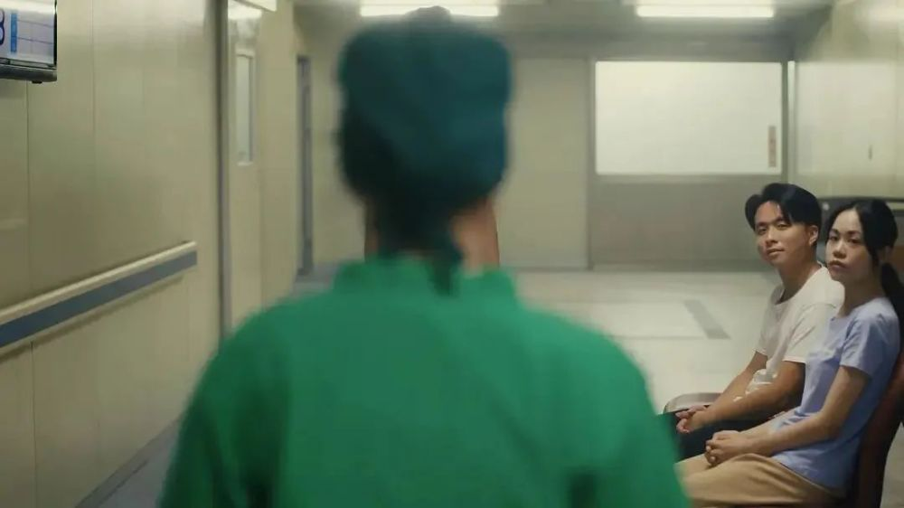
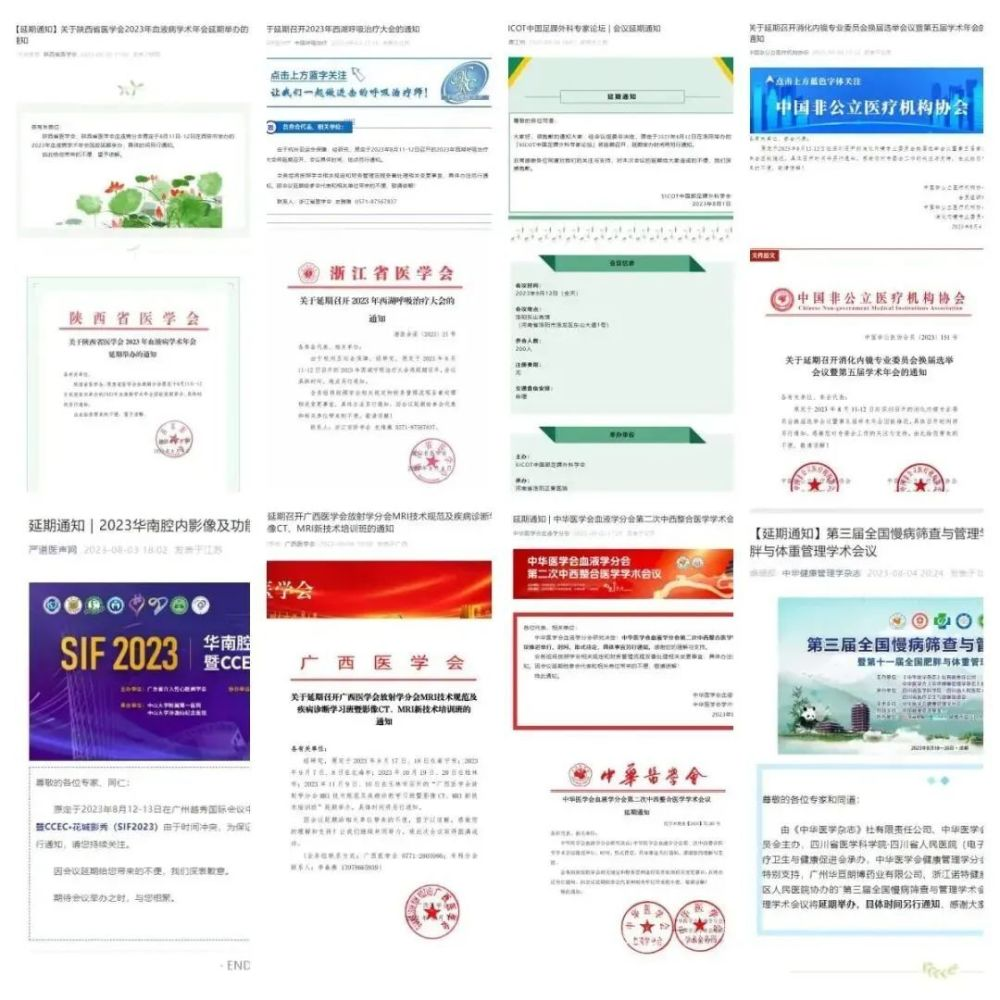
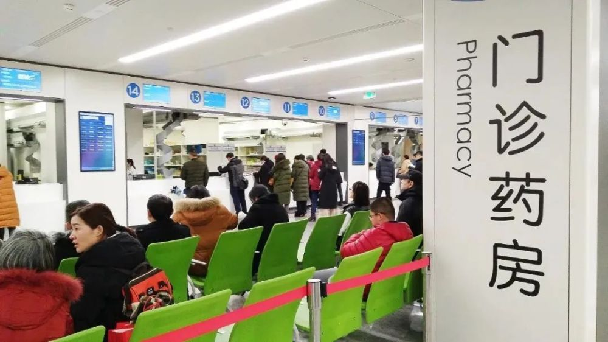
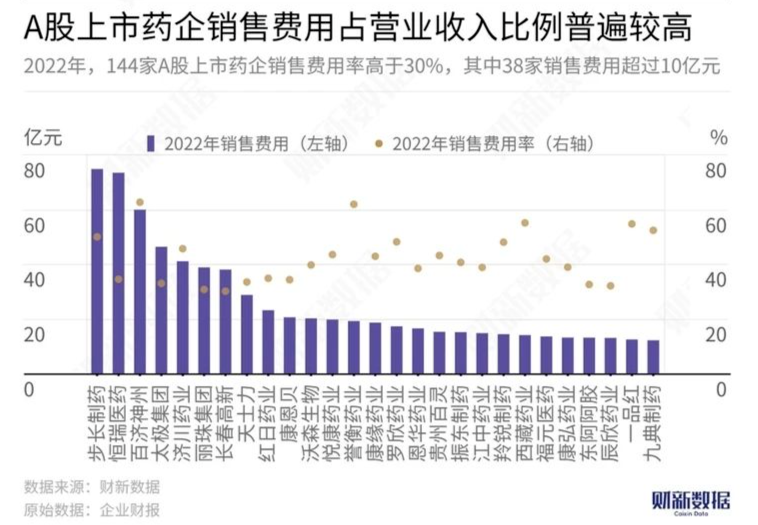
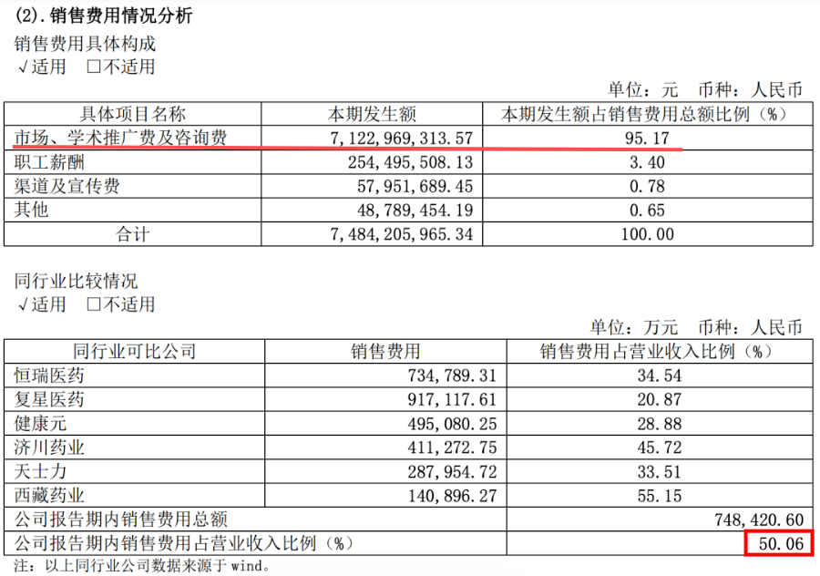
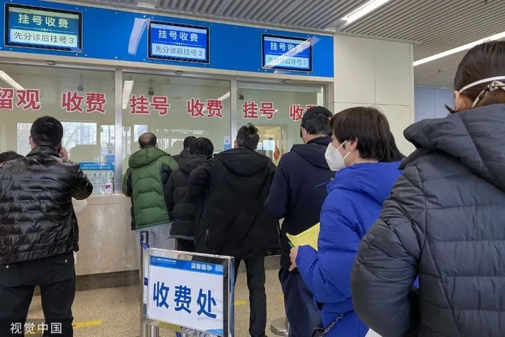
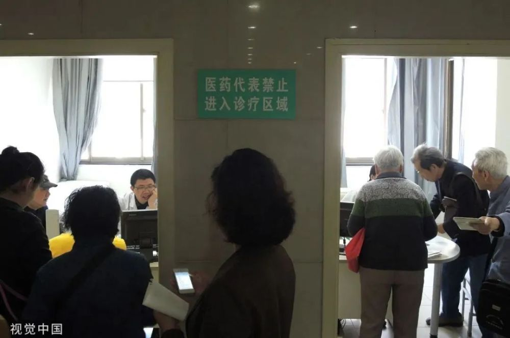

# 反腐升级300万医药代表慌了：连夜删除与医生聊天记录 院方人员已拒见

**作者 | 闰然**

一场力度空前的医疗反腐风暴正在全国范围展开，规模之大，史无前例。

据不完全统计，今年以来，全国已有160多名各级医院院长、书记落马，超过去年全年的两倍。医疗反腐的力度及决心不言而喻。

在这场风暴下，全国300万医药代表人心惶惶，担心随时可能失业，他们连夜删除与医生的聊天记录，对相关的职业问题避而不谈。

与此同时，多场医药学术会议也干脆延迟、停办，还有行业学会被点名关切。

_8月以来，至少有10场即将举办的医药行业学术会议、论坛等宣布延期。此外，还有部分学习班、培训班也在近日宣布延期举办/图源：央广网_

医疗是一个高度敏感的领域，对于这一领域的藏污纳垢，态度必须是高压态势、零容忍。

医院的堕落

一家公立医院原院长罗勇落马后，被查出收取的回扣高达2980多万元。

这不过是镇上的一所二甲医院。触目惊心的数字背后来源五花八门——收受病人红包礼金、医药代表回扣，以及与医疗设备供应商结成“利益同盟”。

而这些回扣款及虚增的药物设备价格，直接被转嫁计入医疗成本，导致人们“看病难”“看病贵”。

直接的表现是，在以罗勇为首的贪污犯落马后，这家医院今年1—5月门诊单次平均费用同比下降16.6%，住院次均费用同比下降21.4%。

这是什么概念呢？人均就医成本直接下降了1400余元。这个数字可不小，趋利性正是过度诊断、过度医疗的首要原因。

过往的医疗受贿案件显示，医院行政管理部门占到49%，临床科室占比17%，医技科室占比11%，后勤系统占到13%。可见，医疗腐败方式环节千变万化，各个部门都有涉及，利益输送更是无孔不入。

_某三甲医院的门诊药房/图源：视觉中国_

近期，中央纪委国家监委网站也披露了一宗令人发指的贪腐受贿案。一台进价为1500万元的医疗器械，云南普洱市人民医院却以3520万元的价格购入。

更令人震惊的是，院长杨文俊一人就吃掉1600万元的回扣，甚至比医疗器械厂家到手的钱还多。

当时在讨论购买事宜时，虽然医院领导班子其他成员都明确反对，但院长杨文俊把控着一言堂的局面，执意完成了这场离奇的医疗器械交易。作为医院一把手，他不用经过集体讨论和审批，也不接受任何监督和检查，甚至可以不顾医院的实际需求和财务状况。

在这个过程中，不仅院长受贿金额巨大，医院中层干部更是上行下效、各自盘算，躺在中间吸血。

从全国过往医院受贿案件显示的职位来看也是如此，正职的领导受贿占到30%，副职占到11%，中层干部达到了40.57%。

最终，该医院被定性为“塌方式腐败”。医院财务部原主任、后勤服务部原主任、医学装备部原主任等6名重要行政岗位的科室长被立案审查调查，公安机关对共计20人采取留置措施，涉案金额高达数千万元。

此事件后，当地开展了专项警示教育和整改，数百名医务人员主动退赃。

今年以来，国内医疗机构主要领导“落马”消息不断，截至目前已经超过160名。这些院长和书记，代表的是一家医院，背后牵涉着全体职工和无数病人。

2013年—2022年，有大概2900多例医药领域行贿受贿类案件的刑事判决书。相关案例显示，医疗器械领域的腐败案件最多，占比近40%。

近年来，虽然有些地方对医疗器械采用了“集采”的做法，但仍挡不住收受回扣、暗箱操作的事情。

_药品及器材进入医院的环节/图源：图数室根据公开资料整理_

怎么个暗箱操作法？有些医院工作人员甚至会提前示意采购部门和相关人员，把“公开招标”变成为其“量身定制”，在一些品牌或是机械参数等方面进行“定制式”招投标。

有业内人士透露，给医院内部人士的提成能达到30%。

除了医疗器械领域，腐败案件数量排在第二的就是药品领域，占比约30%，医疗耗材则占比近20%。此外，还有一些涉及医保基金、医院基建相关的案件。

从受贿案件显示的关键环节来看，决策环节的行为占比达到40%，医械使用环节的受贿将近36%，采购环节占到10%，可以说是盘根错节。

如今，多地医疗机构已经迅速开启自查自纠，倒查、清退“回扣”。

药企销售费用高？

除了医院这端，不少药企的领导也被立案审查调查。

上个月，赛伦生物公告，公司实控人之一、董事长、法定代表人范志和因涉嫌职务犯罪被实施留置并立案调查；百亿医疗信息化龙头卫宁健康实控人、董事长周炜因涉嫌行贿罪被立案调查及实施留置。

还有一则审计调查报告也引发了市场关注。2021年至2023年5月，丽珠制药、一品红和一方制药3家药品生产企业向1936家第三方商务推广公司支付费用，假借服务费用等名义套取资金40.77亿元，增加药品综合成本，推高出厂价格。

这些资金被用于公关等用途，导致药品公关费用远超研发成本，会计信息严重失真。

众所周知，医药公司的销售费用就包含了企业为推广产品和服务花费的各项费用。

Wind数据显示，2022年销售费用超10亿元的A股生物医药类企业就高达66家，排在前六的公司销售费用都超过了50亿元。还有39家公司销售费用相对营收比例超过了50%。

_2022年，A股上市药企销售费用占营业收入比例普遍较高/图源：财新数据_

多家公司都因销售费用高企等原因收到过交易所的问询函或监管函。比如步长制药，2022年度销售费用占营业收入的比例为50.06%，高于中药行业平均水平。

步长制药销售费用的主要构成为市场、学术推广及咨询费，发生金额71.23亿元，占比达到了95.17%。这也意味着这家药企去年平均每天要花费两千万左右用于销售。

_公司药（产）品销售费用情况/图源：山东步长制药股份有限公司2022年年度报告_

有业内人士向盐财经记者透露：“许多学术会议和活动就是为了圈钱，也是医生获得收入的重要方式，不同等级的医生出价不同。”

在这个过程中，医药代表成为了这场反腐风暴里最为敏感的职业，不少人反馈医院那边的工作人员最近已经拒绝跟他们见面了。

他们平常主要的工作就是在医生与药企之间传递信息。除了“送回扣”，他们也跟其他行业的销售一样，需要维护客户关系，替客户处理各种各样的私人事务，“就像个助理一样”。

另外值得注意的是，公开资料显示，药明康德、睿智医药等生物医药公司的销售人员人均年薪超百万元，相比之下，公司研发人员薪酬竟然不及销售的零头。

网络上有一个说法——消费者每买一盒药，属于药企成本和利润的只占35%，剩下的65%都要打点给各个环节。医生回扣要35%，医药代表要12%，公关招标部门要3%，公关医院要5%。

_2016年，央视记者历时8个月，暗访调查了上海、湖南两地的6家大型医院，发现药品中标价是市场价批发价的数倍，最高超10倍/图源：央视新闻_

有医药代表对记者反馈，上述比例在操作时不会精确到那么准，但这就是他们的“饭碗”。

药厂在竞争中为了让自己的药打开市场，必须要靠送钱的方式，可以说是严重损害了市场公平。而很多医院工作人员正是看中了这块巨大的利益蛋糕，才心存侥幸、铤而走险。

卫健委此前公布过一个数据，2508家参加评比的三级公立医院中，43.5%医疗机构处于亏损状态。

在这个公立医院每天都人满为患的时代，这个数据若不是官方公布，没人会相信绝大多数医院都处在勉强维持的状态。

_医院挂号收费窗口/图源：视觉中国_

那么行业内部的恶性竞争，以及公立医院自负盈亏压力大，是药价高的原因吗？

陕西省山阳县卫生健康局原副局长徐毓才对盐财经记者分析：“我们的药价是一个很离谱的事，但肯定不是竞争所致，也与公立医院运营压力无关，因为我们现在的药价就不是医疗机构能够决定的，也不可能是竞争的结果，而是管制的原因。”

徐毓才回忆，在2014年，被称为“天下第一司”的国家发改委价格司因为价格腐败“全军覆没”，放弃了药品价格管制，后来药品价格由“招标采购”决定，但太多事实证明，价格不是能管好的，必须依靠市场竞争才能形成。

“而近几年医院亏损面越来越大，根本在于医疗服务价格改革滞后，腾空间调结构保衔接没有协同起来，按病种付费推进速度快但各方都不适应。当然还有政策应该给予公立医院的财政保障责任没有尽到位。”

一场全国性的医疗反腐

药企们在被问询时都给出了许多看似合理的回应，高额的销售费用似乎成为了药企必不可少的部分，有些开销甚至成了业内心照不宣的潜规则。

医生这个职业，时间成本高。有专家表示，医生工作量大，再加上无法获得合理报酬，容易产生心理失衡问题，这也给追求“灰色收入”埋下伏笔。但开高回扣的药，最终是病人来承担一切。

还有医药代表在接受媒体采访时称：“医药是个民生工程，是工程就有回扣，只不过是形式不一样。”

 _医院里禁止医药代表进入诊疗区域的警示牌/图源：视觉中国_

看上去，不同的角色对医疗腐败有着不同的看法，都认为其“有理”。这正是我们需要警惕的怪论，医生不是“医商”，无论什么工程，回扣、贪腐，本身就是被禁止的。

贪腐涉及到的也不仅仅是回扣，背后更加牵涉到医药生态的建设，医疗资源的分配，以及关系到人们的健康问题。

那么今年医疗反腐的重点环节是什么？

徐毓才对盐财经记者表示，今年反腐将整治医药产品销售采购中不正之风问题，重点是医药产品销售过程中，各级各类医药生产经营企业及与之关联的经销商、医药代表，以各种名义或形式实施“带金销售”等。这一过程会由医疗机构医务人员扩展到医药企业以及协会学会等。

中国卫生法学会副会长、国家卫健委医疗领域反腐课题专家郑雪倩指出：“今年中央多部委的联合行动是有的放矢的，强调了重点领域、重点部门、关键少数人，目的是要完善新时代纠风工作体系，建立反腐倡廉长效机制体制，并不是临时性在医药行业搞一个风暴，打击一大片。”

另外有一个值得注意的医疗改革方向——“薪酬改革”。

2023年7月24日，国家卫生健康委等六部门联合印发《深化医药卫生体制改革2023年下半年重点工作任务》，明确了下半年医疗改革的20个重点任务，其中“薪酬改革”是最为关键的一项。

 _《深化医药卫生体制改革2023年下半年重点工作任务》中对于薪酬改革内容的描述_

改革要求，医疗机构注重医务人员的稳定收入和有效激励，严禁向科室和医务人员下达创收指标，医务人员薪酬不得与药品、卫生材料、检查、化验等业务收入挂钩。探索实行公立医院主要负责人年薪制。

改革的亮点颇多，但又错综复杂，如何让这种改革方向落实到位也非常考验智慧，但这是医疗领域不得不走的路。

净化医药行业生态，让医务人员回归专业身份，同时形成良好的市场秩序，才能实现健康中国的目标。

编辑 | 江江

新媒体编辑｜煎尼

排版 | 林溪

