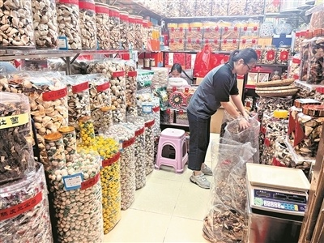

# 喝一天的中药就要100元：有中药材涨幅超80%，专家建议建战略储备库

今年6月以来，全国中药材价格持续上涨引发各方关注。来自中药材专业网站数据，今年上半年，当归、党参、牡丹皮、黄连、白术、甘草等常见中药材均出现大幅度的价格上涨。连日来记者走访发现，广州的中药材价格近期也普遍走高。

 _清平中药材市场，一位商户在整理店内中药材。_

中药材涨价后，对上、下游产业链均产生较大影响，有长期服用中药的患者表示，如今一服滋补中药的价格已从过去的60元涨到100元。有专家则建议建立国家统筹的中药材战略储备库，以平抑中药材价格波动。

**批发市场：有中药材涨幅超80%，商户称涨价后影响销量**

位于荔湾区的清平中药材专业市场是华南地区重要的中药材批发市场。在该市场从事中药材批发的廖国安告诉记者：“从没见过中药材价格涨得这么厉害。”

在廖国安的摊位上摆放着十几种中药材，这些中药材都源自外地。他说，中药材价格从2021年已经有上涨，今年涨幅格外明显。“像酸枣仁统货的价格达到900元/公斤，当归统货价格已经涨到250元/公斤。”

_清平中药材市场里销售的肉苁蓉。_

他告诉记者，像当归、党参、牡丹皮、黄连、白术、白芍、甘草、防风、枣仁等常见中药材的价格都有上涨，有的相比去年同期涨幅在80%以上。今年6月，廖国安还去了广西和江西的多个中药材种植产地，实地了解中药材种植情况。但他表示，中药材原材料价格上涨，作为批发商的他们并未从中受益。他告诉记者，自从酸枣仁涨价后销量就一直较低，肉苁蓉最便宜的也要400元/公斤，买的人也很少；而像菟丝子、柴胡、半枝莲、板蓝根等常见中药材的价格，有的也有50%以上的涨幅，涨价后销量都减少了很多，现在他只能通过网上销售走量。

在广州国际医药港，部分从事滋补类中药材批发的商户也告诉记者，中药材价格今年以来持续走高。某药材行经理韦芳（化名）告诉记者，中药材价格从今年初一直涨到现在，并且这轮涨价还在进行中。而涨价带来的直接影响就是很大一部分中药材品类的销量有所下降。“我们也是从产地拿货，进货价贵了，我们也只能高价卖。”

**种植户：中药材种植艰辛并未立即从涨价中受益**

颜泳棉从事中药材种植已有20多年，他表示：“过去中药材单个品种涨价比较普遍。但今年，中医上用量较大的麦冬、党参、川贝、黄芪、当归、沙苑子、天然牛黄等都在涨，这表明市场行情有些异常。”

颜泳棉和拍档在广州增城以及惠州、清远等地承包了不少山地来种植中药材，总种植面积超过1万亩，每周末他都要到种植园中查看中药材长势。尽管近期中药材价格上涨，但颜泳棉并没有喜上眉梢。“中药材种植周期长，即便近期价格上涨，种植户也不可能立即受益。特别是高品质道地中药材，需要从种苗选育、种植管理等方面执行严格的技术标准，产量上升通常需要5年以上。”

而种植中药材的艰辛远非旁人可以想象。颜泳棉介绍，以白术为例，施肥、打药、田管等各个环节都不能马虎，一旦有一个环节出错，就会导致颗粒无收。“白术怕水，雨后排水不及时就会死亡，而白术采收后不能连作，同一块地要先种其他作物，过几年才能再种白术，因此十分金贵。”他还介绍，如常用大宗中药材品种防风也是一种需要用心呵护的中药材，其种植周期需要3~5年，即便是遇到好行情，也不能“寅吃卯粮”提前采收。“提前采收，药效可能不达标。”他说。

**产量波动、需求上升、资本涌入……多重原因导致中药材价格走高**

在颜泳棉看来，中药材价格上涨是周期性的，他表示，此轮中药材价格上涨有几个原因：

一是如今种植户面临的成本压力普遍较大，前些年因为价格低，一些种植户减少了种植面积，还有不少人选择弃种，量少价格自然就涨起来了。

二是中药材需求在增加。随着广大群众对中药材的认可度进一步加深，中药保健的市场需求也在提升。

三是中药材种植易受天气影响，产量波动大，太热或太冷都会歉收。像近年来国内部分中药材种植区出现干旱或洪涝灾害，都会造成中药材减产。

四是有热钱涌入中药材市场，助推价格上涨。今年初，有医药公司得知颜泳棉在大面积种植中药材，就向他提出希望能收购他种植的全部中药材，但被他拒绝了。“一来我们种植的中药材大部分有稳定销路，二来中药材是有周期性的，必须到了成熟季节才能采收，不能进行投机。”

作为资深从业者，他认为近期部分中药材价格走高有囤积炒作之嫌。“以当归为例，随着资本涌入，炒药者先收购市场上成熟的当归压货，等到第二年要种植新的当归幼苗时，他们又从种植户手中高价收购当归幼苗。这样一来，市场上的旧当归被收购，新当归还没上市，价格就会被推高。”

**“涨价效应”传导：药企成本压力大市民一服中药或涨至100元**

中医药产业链包括上游中药材种植、中游中药加工制造以及下游中药流通，如今，中药材涨价带来的效应也正在向产业链各环节传导。

某医药公司张经理告诉记者，中药材价格上涨带来的影响正逐步传导到药企。“如果中药材价格持续上涨，医疗机构也会受到波及。”他解释，中药材持续涨价推高中成药原料成本，而医疗机构药品招标采购价格和终端价格短期内不会调整，药企在原料采购、生产销售中遭遇“双重挤压”，经营生产成本趋高。“像我们现在去市场上收购中药材，价格都在上涨，但我们供应给医院的中药材是按照事先签好的合同价格收购，所以，我们在药品采购中面临的成本上涨压力非常大。”

张经理表示，医药公司在向医疗机构供应中药材时有价格浮动机制，根据原料价格变化，收购价格可能有10%上下的浮动；但实际上，部分紧缺中药材的涨幅不止这个幅度，所以会导致生产成本上涨。

某公立医院副院长向记者表示，因为医院的中药材供应是通过公开招投标方式进行，有稳定的来源和相对固定的协议价格，原材料价格上涨的影响传导到医院还需要一定时间。“我们医院的中药汤剂和饮片的价格也都是相对固定的，所以消费者暂时还不会感受到影响；但那些在公立医院以外的医疗机构进行中医治疗或服用中药的市民，肯定已经感受到中药材价格上涨带来的影响了。”

在位于柯木塱的某中医门诊部，有十多位居住在附近的居民长期来这里煎服中药。今年60多岁的方伯服用滋补肝肾的中药已有3个月了，由于中药材成本上涨，如今同样的一服中药价格已从过去的60多元涨到100元。但即便如此，该门诊部负责人丁伟强告诉记者，这已经是“友情价”了。“价格上涨后选择中药治疗的人难免会有所减少，大家会对价格更加在意。”丁伟强表示，以前一服中药几十元就够了，但中药材普遍涨价后，喝一天的中药可能就要100元，这对那些长期服用中药的患者来说成本会有所增加。

**专家建议：建立国家统筹的中药材战略储备库**

中国中药协会近日发布倡议书提出，本轮药材价格出现较长时间的异常上涨，势必给行业健康稳定发展带来不利影响。协会呼吁，为有效平抑中药材市场价格异常波动，保证药品质量和市场供应，坚决反对以任何形式哄抬和操纵药材价格、投机炒作等。

该协会中药材种植养殖专委会资深专家、第三届专家委员会副主任刘红卫也表示，中药材价格的暴涨暴跌，最终危害的是整个行业。“种植户如果因为价格上涨而跟风，很可能因为种植面积过大迎来价格暴跌；而如果中药材价格快速上涨，对药企的中成药供应也是一大考验。”

刘红卫曾经做过调查，我国正常年用量5万吨以上中药材有14种，1~5万吨的是53种，5000~10000吨的是54种，1000~5000吨的是150种。“以上扣除50多种资源多、价格平稳的品种，需要重点关注的大约在220个品种左右。”

刘红卫建议，可从全国年用量5000吨以上的品种入手，组织相关专家研究确定国家收储的中药材品种、规格、数量、价格及库存轮换等。“特别是要建立中药材分类分级管理目录，建立储备中药材目录和定点储备企业名单，设立专项风险基金，组织相关专家对中药材储备品种和定点储备企业进行评估，建立国家统筹的中药材储备库，逐步形成规模适度、结构合理、管理科学、运行高效的中药材战略储备体系；同时，可以从国家层面统筹，在北京、上海、广州、深圳、天津等超大城市建立相对独立的中药材战略储备库，并在道地药材产地设立动态的中药材流通质保仓。”

在刘红卫看来，中药材战略储备可以发挥“蓄水池”作用，实施“丰储欠补”。“可以在某些药材价格低迷、种植户需要支持的时候加大战略储备，解决‘药贱伤农’问题，同时规避高价储备风险，防止价格暴涨暴跌。”

（原标题：中药材价格走高背后专家建议：建立战略储备库防止价格“暴涨暴跌”）

肖欢欢/广州日报

（来源：广州日报）

