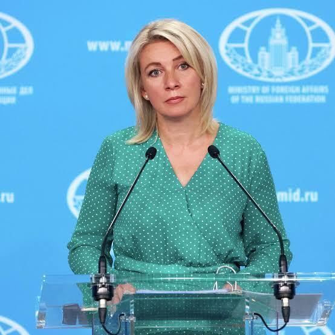

# 外媒：俄外交部谴责乌克兰袭击克里米亚大桥，誓言报复

【环球网报道】据路透社报道，俄罗斯外交部12日就乌克兰对克里米亚大桥的“恐怖袭击”发表谴责，誓言将采取报复措施。

_扎哈罗娃 资料图片_

综合塔斯社、路透社报道，外交部发言人扎哈罗娃在社交媒体Telegram
上发表声明说，“这种破坏行为让国际社会有机会亲眼目睹基辅政权的真面目”，“这种野蛮行径毫无道理可言，势必将得到回应”。

塔斯社此前报道称，8月12日，俄罗斯国防部发布消息称，俄军当天两次拦截试图袭击克里米亚大桥的乌军导弹。

