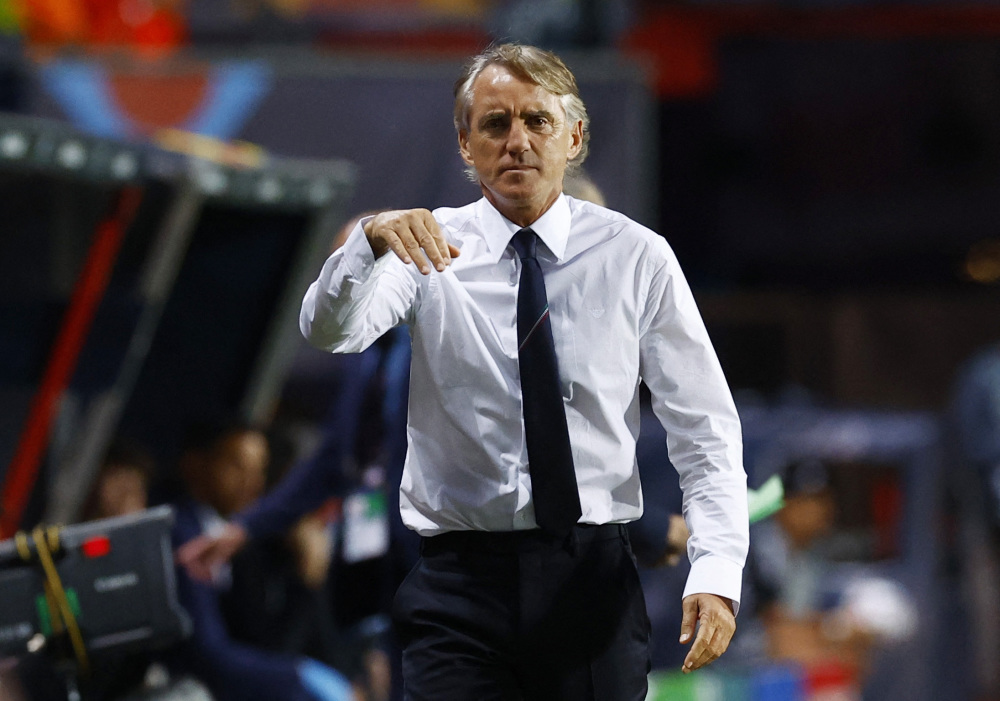
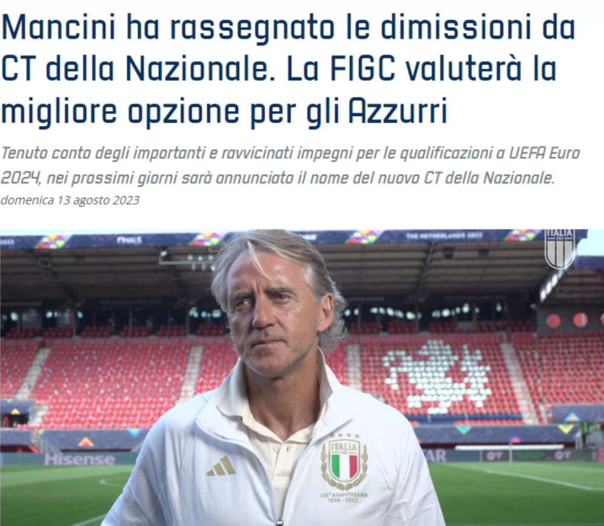
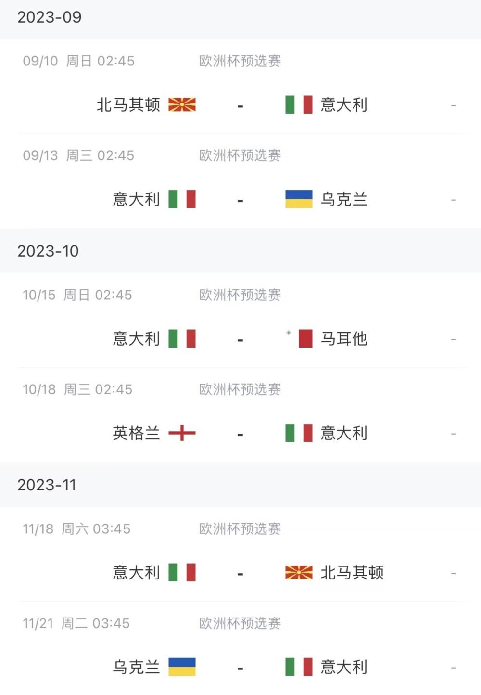

# 意大利足协：曼奇尼辞去国家队主帅职务 新教练未来几天内公布

直播吧8月13日讯 意大利足协官方宣布，曼奇尼辞任意大利国家队主帅，新的国家队主教练名字将在未来几天内公布。

【官方公告】

意大利足协宣布，已获悉昨天晚间收到的罗伯托-曼奇尼辞去意大利国家队主教练职务的消息。

考虑到2024年欧洲杯预选赛的重要而密切的承诺，意大利足协将在未来几天内公布新任国家队主帅。

————————————

曼奇尼现年58岁，2018年5月出任意大利国家队主帅，带队61场比赛39胜13平9负，赢得2020（实际2021年举办）欧洲杯冠军，但也无缘2022年世界杯正赛。2023年6月欧国联季军战，意大利3-2击败荷兰获得季军，这是曼奇尼带队的最后一场比赛。

**意大利接下来赛程：**

