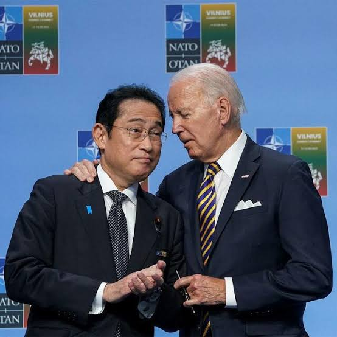

# 日媒曝美日将共同研发新型反导拦截弹，借口又是中朝俄超音速武器

【环球网报道】日本《读卖新闻》13日报道声称，多名日本政府消息人士透露，为对抗中国、俄罗斯、朝鲜推进研发的高超音速武器，美国与日本将共同研发新型反导拦截弹。

《读卖新闻》称，这将是美日第二次共同研发反导拦截弹，上一次是2017年结束研发工作的“标准-3 Block
IIA”拦截弹。报道称，美日韩首脑会谈将于8月18日在美国总统度假地戴维营举行，日本首相岸田文雄将在此之际与拜登举行单独会谈，共同研发新型反导拦截弹预计将作为公报内容的一部分对外公开。美日两国政府计划在10年内完成这种新型拦截弹的研发。

_7月12日，北约维尔纽斯峰会上的岸田文雄与拜登 资料图片_

报道声称，美日共同研发新型拦截弹是为对抗中俄朝的高超音速武器，中国此前已完成高超音速导弹试射任务，俄罗斯也在乌克兰冲突中使用了这种武器，而朝鲜近年也在反复进行导弹试射。报道还称，为拦截高超音速导弹，还需要能够尽早发现追踪导弹的体系。美国正在推进建立由多颗小型卫星组成的“卫星星座”，日本防卫省考虑与美国共享卫星网络。

此外，《读卖新闻》称，日本政府目前也在推进获得打击敌方导弹基地等的“反击能力”，在共同研发新型拦截弹的同时，还将加紧整备保证“反击能力”的远程导弹。

近期，美日政府推进加速军事捆绑。美国国防部长奥斯汀6月访日时声称，美国和日本正在努力使军事关系进一步现代化，为的是防范中国所谓“胁迫行为”。关于美日之间的军事关系，中国外交部发言人此前表示，我们一贯认为，国与国之间的军事合作应当有利于地区的和平稳定，不应当针对第三方，更不得损害第三方的利益。谈到胁迫，大搞胁迫的不是中国，而是美国。美日开展双边军事合作应确保不损害第三方利益，不损害地区和平稳定。

