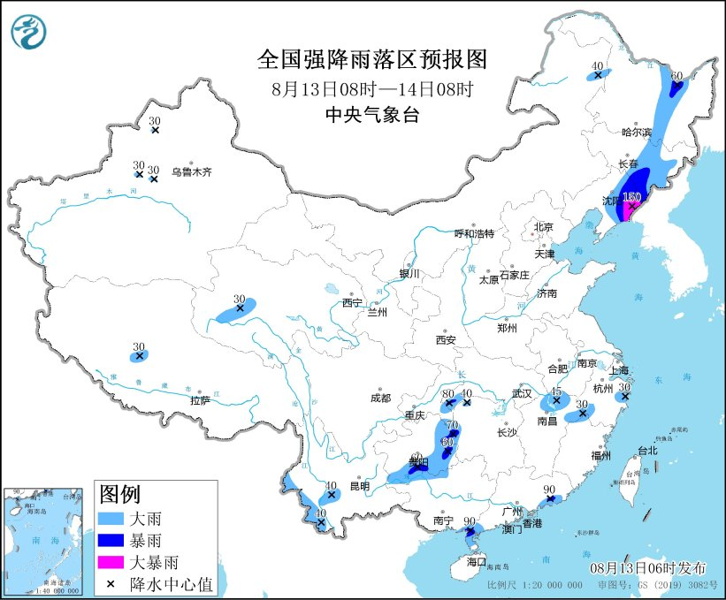
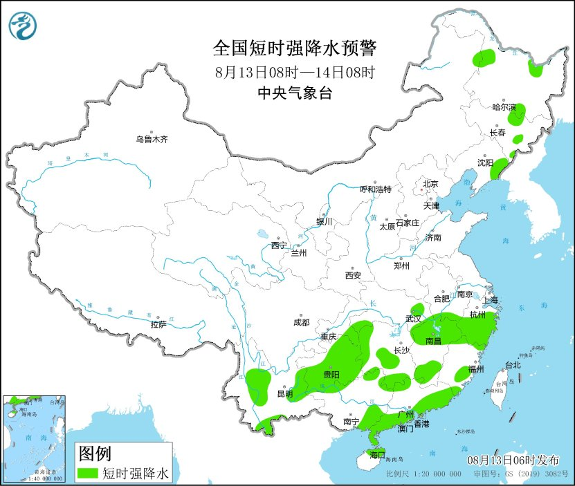
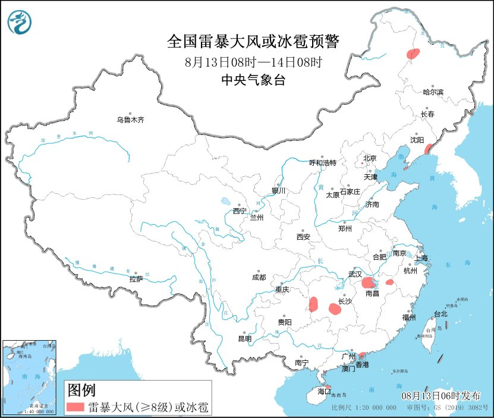

# 暴雨+强对流双预警！涉十余省份，局地大暴雨+雷暴大风

中央气象台

**中央气象台8月13日06时继续发布暴雨黄色预警：**

预计，8月13日08时至14日08时，辽宁东部、吉林东部、黑龙江中东部、江西北部、浙江南部、重庆东部、湖北南部、贵州东部和南部、云南西部、广东沿海、青海南部、新疆沿天山等地部分地区有大到暴雨，其中，辽宁东部等地部分地区有大暴雨（100～150毫米）。上述部分地区伴有短时强降水（最大小时降雨量30～50毫米，局地可超过60毫米），局地有雷暴大风等强对流天气。

防御指南：

1、政府及相关部门按照职责做好防暴雨工作；

2、交通管理部门应当根据路况在强降雨路段采取交通管制措施，在积水路段实行交通引导；

3、切断低洼地带有危险的室外电源，暂停在空旷地方的户外作业，转移危险地带人员和危房居民到安全场所避雨；

4、检查城市、农田、鱼塘排水系统，采取必要的排涝措施。

**中央气象台8月13日06时继续发布强对流天气蓝色预警：**

预计8月13日08时至14日08时，内蒙古东北部、黑龙江东部和西北部、吉林东部、辽宁东部、安徽南部、湖北东部和南部、湖南西部和南部、江西、浙江、福建东南部和西北部、重庆东南部、贵州、云南西部和东部、广西西北部和东部、广东、海南岛东北部等地的部分地区将有短时强降水天气，最大小时雨量30-50毫米，局地可达60毫米以上；辽宁东部、黑龙江西北部、湖南中部和西南部、江西北部、广东东南部沿海、海南岛东北部等地的部分地区将有8-10级雷暴大风。

预计，强对流的主要影响时段为今天白天至夜间。

防御指南：

1.政府及相关部门按照职责做好防短时暴雨、防雷、防大风准备工作，气象部门做好人工防雹作业准备；

2.户外行人和工作人员减少户外活动，注意远离棚架广告牌等搭建物；

3.驱赶家禽、牲畜进入有顶蓬的场所，关好门窗加固棚舍；

4.相关水域水上作业和过往船舶采取回港规避或者绕道航行等积极应对措施，工地注意遮盖建筑物资，妥善安置易受暴雨、风雹影响的室外物品；

5.检查城市、农田、鱼塘排水系统，做好排涝准备和对山洪、滑坡、泥石流等灾害的防御准备。

