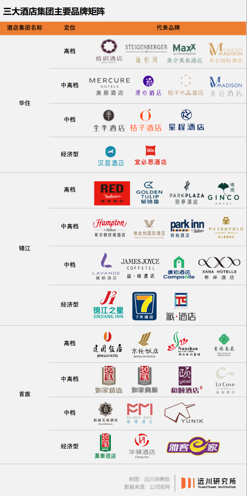
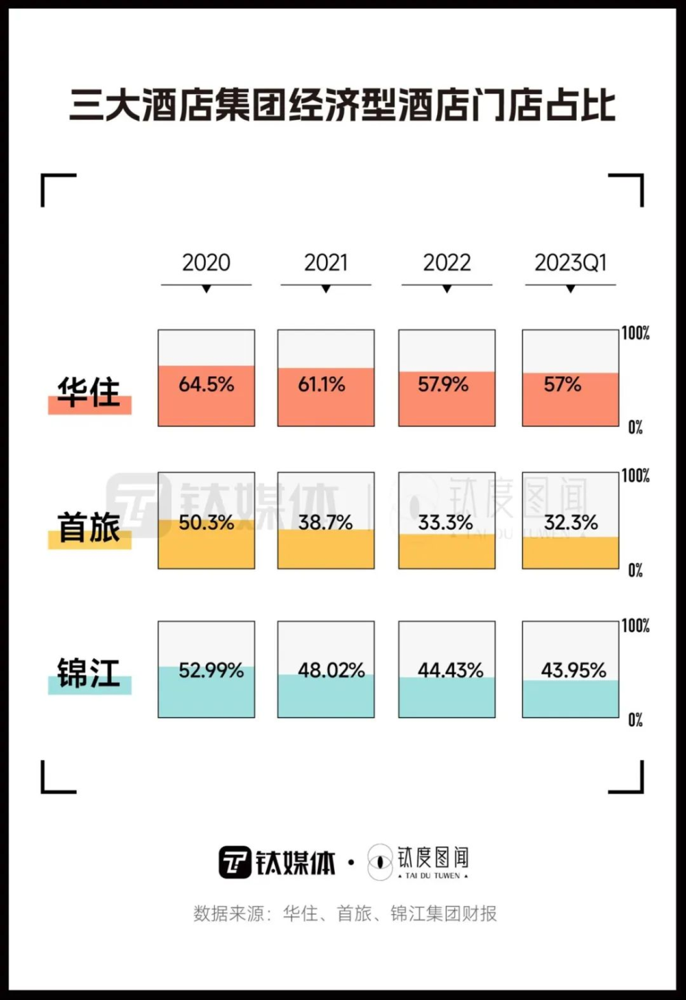
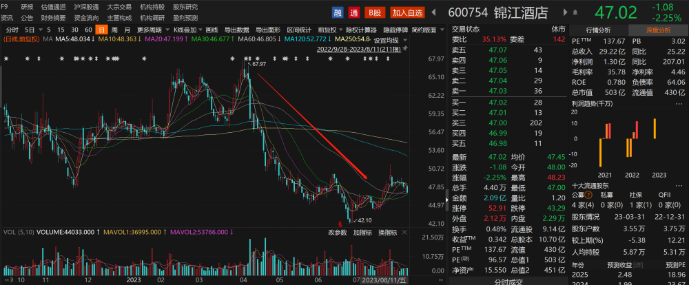
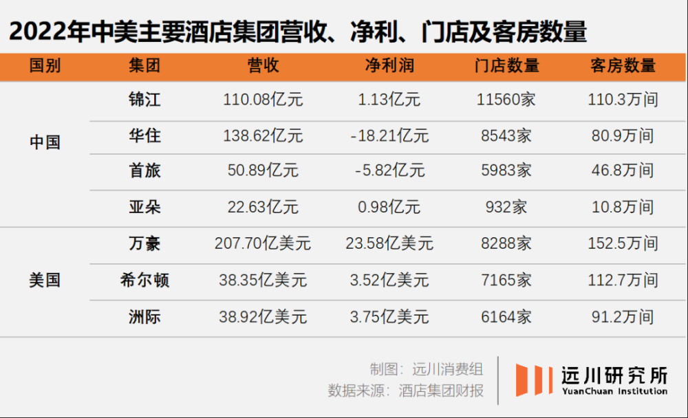

# 汉庭如家价格直逼香格里拉背后：客房数量赶英超美但盈利能力差距大

**财联社8月13日讯（编辑 刘越）** 酒店价格“逢假必涨”已不是什么新鲜话题，近日
**“汉庭如家，房价直逼香格里拉”、“月薪两万住不起如家汉庭”等登上微博热搜**
。游客不停，高价不止，打工人苦于酒店涨价，大家都在吐槽酒店们“三年不开张，开张吃三年”。

据财联社记者一线获悉，近期多地酒店调涨房价，部分酒店根据当天房态浮动调整价格， **有的酒店前后日入住价差超200元** 。OTA平台数据显示，
**位于北京核心商业地段的连锁经济型酒店近期房价接近千元甚至突破千元** 。

▌ **经济型酒店不经济 A股500亿酒店龙头锦江酒店股价提前暑期旺季三个月大跌近四成**

实际上，看似五花八门的酒店品牌们背地里都是一个集团的亲兄弟。大家熟知的汉庭属于华住集团，如家属于首旅酒店，锦江之星和7天则属于锦江酒店，而这
**三大酒店巨头合计占据了近半市场份额** 。

 _图源：远川研究所4月26日发布的文章《谁给了酒店涨价的底气？》_

酒店集团们的最新财报也可以印证，酒店的确在变得越来越贵。具体来看， **首旅酒店预计上半年净利润2.6亿元-3亿元** ，报告期内公司全部酒店
**RevPAR** （平均可出租客房收入）为147元， **同比上升66%** 。 **锦江酒店预计上半年净利润5亿元-5.5亿元** 。旗下全国酒店
**7月份RevPAR环比提升21%** 。 **华住集团公布2023年Q2RevPAR恢复至2019年水平的121%**
。3个月前，公司一季报显示，其RevPAR已经恢复到了2019年水平的118%。华住披露的“121%”和“118%”两个数据意味
**其要价能力已经超过了2019年**
。作为酒店的经营指标之一，RevPAR由入住率和平均房价相乘而得，衡量的是酒店整体及单个房间的收入潜力。在重要经营指标显著提升下，上市酒店业绩得以“回血”，扭亏为盈。

目前中国市场选择经济型酒店的人数较多，因此对其涨价也最为敏感。一方面，经济型客房减少。据中国饭店协会历年发布的《中国酒店业发展报告》，2022年初中国大陆地区客房总数1346.9万间，对比2020年初，两年时间减少415万间客房，
**房间供应消失了近四分之一** 。酒店老板面对高昂的租金压力，自然 **先向利润更微薄的经济型酒店“开刀”**
，并将目光对准盈利空间更大的中高端酒店。与2020年相比， **2022年经济型酒店客房数量减少了355.9万间**
，中、高档、豪华型酒店客房分别减少了22.7万、29.5万、6.9万间。经济型酒店供给端的下滑直接导致酒店价格的上涨。

_钛媒体8月11日发布的文章《汉庭速8价格破千，经济型酒店为何不经济了？｜钛度图闻》_

另一方面，连锁化率是酒店敢于涨价的筹码。根据盈蝶咨询的数据，2021年，一线城市酒店的连锁化率已达到50%。这就意味着，
**在一线城市随机选择一家酒店，就有1/2的概率会是连锁酒店品牌**
。方正证券指出，在相同的物业条件下，加盟经济型酒店的投资回收期约为5.4年，而酒店老板只靠自己努力，则需要奋斗22.8年。分析人士指出，
**个体户纷纷向连锁品牌缴械投降，这一趋势在过去三年里格外凸显** ，行业萧条期也是最好的抄底时机，新增酒店里，超半数都来自于头部酒店集团。

值得注意的是，尽管7月公布的财报扭亏为盈，暑期旅游旺季酒店房价大涨上热搜，但酒店巨头的股价却背道而驰。
**总市值500亿元的龙头锦江酒店股价今年4月创下历史新高，随后一路下探，迄今累计最大跌幅达38.06%** ，
**总市值225亿元的首旅酒店同期股价累计最大跌幅达27.32%**
。回顾今年五一，出行人数大增，国内多个景区爆满，但旅游相关个股并未因此上涨。中泰国际分析指出， **资本市场往往“买入预期，卖出事实”**
，除非节日消费数据大超预期，否则注意相关股票在节后可能有获利了结需求。

▌ **国内酒店巨头客房数量赶英超美但盈利能力差距大 盲目涨价易导致品牌“悬空效应”**

如果只看客房数量，中国酒店集团们已经实现赶英超美。目前， **锦江是全球第二大的酒店集团，客房数量次于万豪** 、高于希尔顿，
**华住、首旅也均在全球十大酒店集团占有一席之地** 。尽管同属“全球十大酒店集团”，但
**2022年万豪集团营收207.7亿美元，约等于10个华住、13个锦江、28个首旅** 。从盈利能力来看，
**万豪去年净赚了23.58亿美元，比锦江十年赚得还多** 。

_图源：远川研究所4月26日发布的文章《谁给了酒店涨价的底气？》_

分析人士指出，万豪“一骑绝尘”的盈利能力，一方面是由于营收多元，另一方面是因为客房可以卖得更贵。价格“往高处走”，就能多挣钱。开源证券研报指出，据测算，
**锦江集团的每间房收入提升1%，利润就能增厚6.9%** 。如果每间房收入提升5%，则利润就能增加34.5%。

再看 **贴上人文+IP两个标签的亚朵酒店，2022年其平均房价（ADR）为391元，远高于华住的240元和锦江的218元**
。也就是说，即便亚朵的入住率跌半，客房收入也能和满房的锦江打平。分析人士指出， **靠故事和情怀卖得更贵的亚朵让一众国内连锁酒店无不艳羡**
，希望自己的平均房价也能一路向北，扶摇直上。

但是，有分析认为，尽管酒店或许还嫌自己的客价不够贵，但是 **价格一路走高的同时服务却仍一言难尽**
。网易数读统计了黑猫投诉上今年6月-7月有关消费者对酒店吐槽的帖子，发现 **在线平台体验差、恶意退单、客房糟糕，是被投诉最多的问题**
。分析人士表示，以如家、七天为代表的经济型商务酒店之所以获得巨大成功，就是因为它们满足了一群低收入阶层以及外出公干的业务人员的隐性需求，而这个需求并没有因为“报复性出差”和“报复性旅游”而消失。
**经济型酒店依然是刚需，其规模性盈利空间依然存在** 。如果酒店没有明显提升设施环境质量，反而生硬地提升价格，则会伤害到经济型酒店固有的品牌价值，
**最后会因为市场热度的回落而导致“悬空效应”** ，即高不成低不就。

（财联社 刘越）

