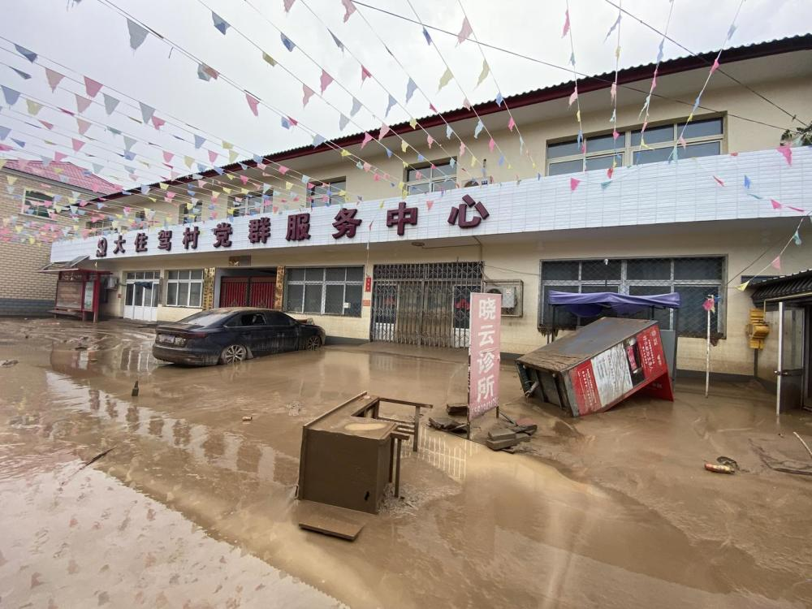
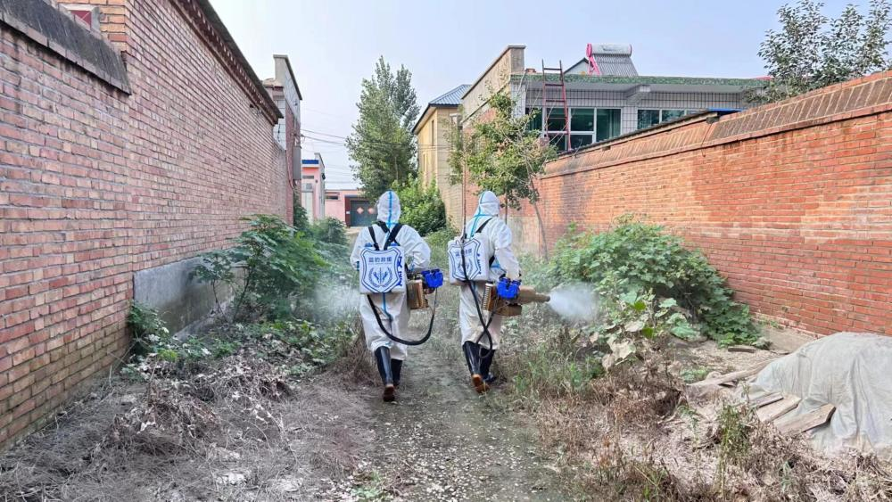
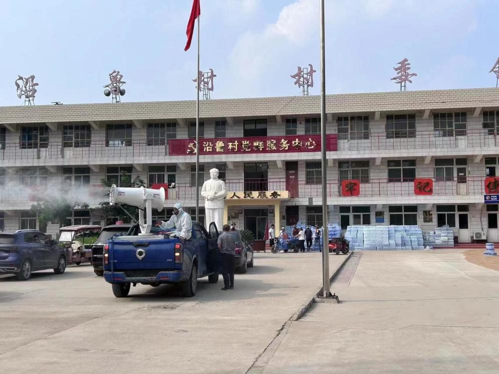
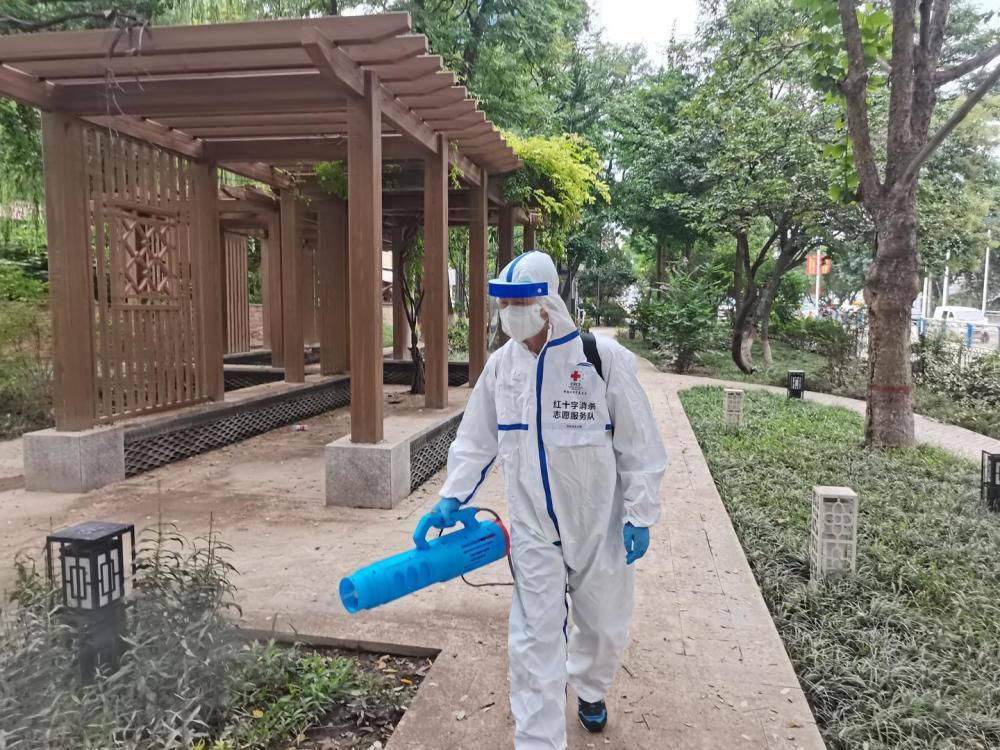

# 洪灾过后：河北涿州清淤与消杀，在烈日下重建秩序

8月4日上午，河北涿州水灾救援行动进入尾声。山东济南市红十字应急救援队队长敖玉峰开着越野车，绕着城西几个村庄开了一大圈。水退了很多，人应该都没事了。但看着翻倒的车辆、倒塌的砖墙、满地的淤泥、堆积的垃圾、随处可见的动物尸体，他知道，下一步赈济工作并不轻松，马上要开始的就是排涝、清淤与消杀。

 _▲敖玉峰8月4日巡逻时看到被水浸泡的村庄_

当天，大部分从全国赶来的队伍开始撤离涿州，但像这样有着赈济和消杀能力的救援队，继续留下来参与当地的恢复与重建。后来，敖玉峰还遇到了去而复返支援消杀工作的兄弟队伍。

国家疾控局日前发布《洪涝灾区环境卫生处置与预防性消毒指引（2023版）》指出，环境卫生清理和消毒的重点区域或对象，包括生活饮用水、洪水退去后的村落和场所、个人住宅。应及时清理淤泥、动物尸体、垃圾和粪便，做好无害化处理。清污所产生的大量垃圾应及时清运，严禁倾倒入河中。

随着洪水退去和水电渐渐恢复，人们陆续回到被水泡过的家园，他们首先要面对的就是清洁与重整。当地政府、志愿者、救援队、民众自己，一起来完成这灾后重建的第一步。

**动物尸体先行无害化处理**

敖玉峰说，正值盛夏，消杀任务比较艰巨。他们的工作从市区到乡镇，必须先清淤再立马消杀。他们是来到涿州支援的中国红十字会10几支队伍中的一支，每天大家轮流进行消杀、物资发放等工作。

8月4日晚，敖玉峰开了一晚上的会，计划第二天的消杀。8月5日下午，药和设备到齐后，中国红十字救援队与涿州市卫生健康局共同开展全面防疫消杀工作。敖玉峰8月10日与其他红十字救援队一起离开时，城区主要过水路面、小区等公共区域消杀已基本完成。据红会通报，中国红十字救援队14支队伍在涿州地区共转移1652名受灾群众，累计开展消杀清淤394万平方米，排灌总量29200立方米。

有市民告诉红星新闻记者，8月5日接到城区主街道预防性消杀通知，要减少出行，避让消杀车辆，避免消杀药物喷溅对衣物等的影响。

成都蓝豹救援队的消杀工作从8月8日开始。队长曾剑光介绍，这支“追着台风跑”的队伍中途两天曾抽调人手转战支援东北抗击洪灾，之后又回到涿州进行消杀。

 _▲成都蓝豹救援队在农村街道进行消杀_

水退后，整个城市弥漫着一股海边的味道。随着时间推移，很多村里已经有了酸臭味。“风一吹，味道有点酸。”曾剑光说。“一回家就特别臭。”来自码头镇三合庄村的小君告诉红星新闻记者，不过随着动物尸体和垃圾被清理，他们村已经好了很多。

据介绍，农村养殖的猪、羊等动物尸体，由当地农业农村局先行一步，专门进行无害化处理。“他们速度比较快，我们消杀的时候已基本见不到动物尸体，只是偶尔碰到进行一些处理、掩埋。”敖玉峰说。

根据《洪涝灾区环境卫生处置与预防性消毒指引（2023版）》，对环境清理中清出的新鲜动物尸体应尽快深埋或火化。对已经发臭的动物尸体，可用有效氯5000mg/L～10000mg/L的含氯消毒剂溶液喷洒尸体及周围环境，去除臭味并消毒，然后再深埋处理或火化。尸体清理后需要对其场所进行消毒处理。

**不同的消毒品、多种消杀工具**

城市清淤，因其规整，配合大型机器，难度并不大。但洪水从地里过后带来的泥沙，让农村形成了厚得多的淤泥，厚度有10-30厘米左右。越近河道，淤泥越厚。红星新闻记者8月4日曾来到市区拒马河边的永济公园，当时这里的淤泥最高没过了小腿肚。

村里的淤泥厚度也各不相同。小君村里的淤泥仅有1厘米左右，但邻村有的特别厚。村里做了街道清淤消杀工作，村民负责自己家里的清洁工作。他家进水不是很多，水泡过的地板砖鼓的鼓，陷的陷。他们把泡水的米面粮油、纸壳子“基本上能扔的全都扔了”，衣服、沙发垫子和靠背被水泡后洗了还是有味道，也只能丢弃。然后用84消毒液，拿着喷壶全方位喷3遍。前几天，村里来人进行危房评估，小君家房子还能住，但整个一楼得重新装修。

_▲清理后的小君家一楼，需要重新装修_

敖玉峰和队友们主要使用小型铲车清理淤泥。但成都蓝豹救援队没有合适的铲车，用的是挖机，之后再用高压水枪冲洗。

在地下室，尤其在农村，部分地区仍有积水，甚至是泥塘。成都蓝豹救援队采购了1000立方/时的双桶抽水机，帮助排涝。在敖玉峰离开时，城市排涝工作已接近尾声。

不同于一般的消杀，洪涝灾害后的消杀需要综合采用不同的消毒品。敖玉峰介绍，主要使用含氯消毒液，也要使用菊酯类药物，防蚊子等病媒。弥雾机产生的高温容易使氯挥发，因此会倾向于采用不含氯的消毒液。此外，垃圾堆由于表面消杀不够，会洒上药粉。

为了尽量做到无死角，由于街道的宽窄和路况不同，所采用的消杀工具也不一样，有时必须人工背设备，加满水时重达50多斤。例如，敖玉峰一开始在主干道范阳路上消杀时，在主干道上用洒水车，在非机动车道上开三轮车载着机器，在人行道上则由人背机器喷洒。

成都蓝豹救援队装备了雾炮，用皮卡载着，喷射范围达五六十米；进不了车的巷道，则人工使用弥雾机和电动喷雾器。曾剑光介绍，消杀重点是阳光照射不到的地方，如下水道，以及垃圾池、死过动物的地方。

_▲成都蓝豹救援队采购的雾炮_

**穿戴防护服、手套和口罩**

路边人偶尔被消毒液喷到可能没事，但由于暴露强度大，尽管天气热，消杀工作人员必须严格穿戴防护服、手套、口罩或面罩。这样免不了经常有人中暑。敖玉峰的保障救援车上备有急救包，还有冰镇电解质饮料等。

曾剑光说，经常半天工作下来，队友的衣服能拧出水。

在时间选择上，敖玉峰他们尽量不影响民众生活，错开人流高峰期；也尽量跟炎热的天气错开，选择早晨天一亮和傍晚作业。“我们有时候晚上8点队长开例会，人还没到，就是还在外面，活还没干完。”敖玉峰说。

_▲济南市红十字应急救援队进行消杀_

曾剑光还使用了他前年在河南洪灾救援时发明的方法：两人一组，一人作业，一人跟在后面观察，并配合进行加水等工作，轮换进行。“一个人怕倒在无人区。”

8月10日，成都蓝豹救援队17名队员从上午8点10分开始一直到11点，在白塔村进行消杀，这已经是第二次消杀了，消杀面积大约为60万平方米。按照防疫要求，必须前后至少消杀3次。有些村民来找曾剑光，他们也帮忙去家里消杀；曾剑光他们也会教村民一些消杀方法和重点部位，并叮嘱开窗通风等注意事项。白塔村90%的村民已经回家了，但曾剑光下午到莲池村时，这里还未来水来电，很少人回来。曾剑光发现清淤未完成，还不具备消杀条件，因此放弃了消杀。

小君说，他们家是水退后回来打扫了3天卫生，有电了才回来住的。他们村里没有自来水，都是用井水，但现在的井水没法喝，最多只能洗衣服，暂时买桶装水喝。

“重建家园还是要靠老百姓自己。”敖玉峰他们已经撤走，外部救援队不可能天天一直盯着。敖玉峰介绍，有些村镇干部从市里领了设备之后，让村里人向红十字队伍学习消杀技术，主要是个人防护、药品浓度配比和设备使用。“比日常农村打农药难一点点。”

西坛村书记向红星新闻记者介绍，由于村里退水和清淤程度不一，不具备大规模消杀条件，该村没有救援队来消杀，而是卫健局派人和村里共同进行消杀。截至8月11日早晨已完成两轮消杀，还至少需要一轮。消杀物品已向村民们分发下去了。

“最紧急的任务完成了。”不过，东北还在经历洪灾，回到济南的敖玉峰他们随时要做好出征的准备。

红星新闻记者 胡伊文 吴阳 受访者供图

编辑 彭疆 责编 邓旆光

