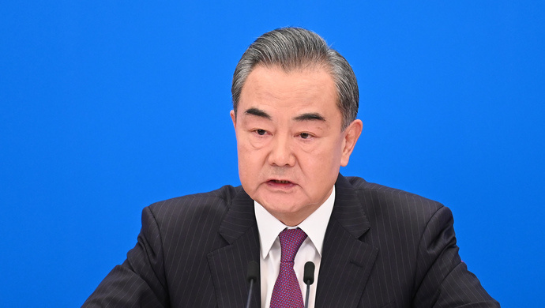

# 王毅东南亚之行：深化务实合作、回应南海事态、两处点名美国

8月13日，中共中央政治局委员、外交部长王毅结束为期四天的东南亚三国之行。

访问期间，王毅与新加坡、马来西亚、柬埔寨三国政要举行了会晤，就双边关系、地区和国际形势等问题广泛交换意见。

王毅此行是今年以来中国与东盟国家之间的又一次高层互动，也是中国着力周边外交落下的浓重一笔。

**落下浓重一笔**

从中国与新、马、柬三国公布的信息可以发现，此次访问信息量很大，亮点也很多。

第一个亮点是，中国与三国围绕各自的关键词推进双边关系发展。

在首站新加坡，“落实”成为关键词。

双方强调要落实好两国领导人3月会晤时对中新关系的新定位——建立全方位高质量的前瞻性伙伴关系。

新加坡外长维文说，按照两国领导人的战略指引，他与王毅就如何推进合作进行了很好的讨论。

在第二站马来西亚，关键词是“强劲”。

据马来西亚媒体报道，总理安瓦尔称赞王毅的访问“意义重大”，并表示马方将与中国建立强劲的全面战略伙伴关系列入国家主要议程。

王毅表示，中方愿同马方一道，保持双边关系健康强劲发展势头，推动中马命运共同体建设走深走实。

在最后一站柬埔寨，关键词是“支持”。

柬埔寨首相洪森说，在柬埔寨大选后第一时间发来贺电并派中国高级别代表团访柬，充分体现了中方对柬埔寨的坚定支持和柬中铁杆友谊。

王毅表示，中方将一如既往同柬方站在一起，坚定支持柬埔寨走符合国情的发展道路，坚定支持柬维护好国家利益和民族尊严，坚定支持柬在国际和地区舞台上发挥更大作用。

“王毅到访柬埔寨正逢柬政府换届的重大时刻，体现了中国对柬埔寨新政府的支持，以及将继续与柬埔寨加强合作。” **广东国际战略研究院副院长周方银** 说。

王毅此次到访东南亚三国，也为中国与东盟关系注入新的动力。

柬埔寨皇家科学院国际关系研究所所长金平告诉《金边邮报》，中国最高外交官此访体现了中国对东盟的高度重视，也预示着2023年中国—东盟关系水平将进一步提升。

**中国国际问题研究院副院长刘卿**
指出，今年对中国与东盟来说很不平凡。今年有三个十周年：习近平主席提出构建人类命运共同体、“一带一路”倡议以及“亲诚惠容”周边外交理念十周年。而东南亚是提出“人类命运共同体”和“一带一路”的首倡地之一，一直走在践行人类命运共同体理念的前列，是中国共建“一带一路”合作重要伙伴。

“因此，今年特别值得浓重书写一笔。今年以来，中国与东盟国家高层往来热络，王毅此访也是其中之一。这次访问将进一步密切中国与东南亚的关系。”

周方银评论称，王毅此访体现了中国高度重视东南亚国家，希望继续深化合作，特别是高质量共建“一带一路”。同时，此访也是在中国外长出现变化、国际社会不乏猜测的背景下展开的，可以对外展示中国外交政策的延续性以及政治稳定。

**深化务实合作**

第二个亮点是在深化经贸合作、促进人文交流方面传递积极讯息。

中新合作方面，中国外交部表示，双方将于年内举行中新副总理级双边合作机制会议，统筹规划下阶段合作，拓展新合作领域。

新方对此表达高度期待，希望进一步扩大在贸易和投资、金融和资本市场、互联互通、数字和绿色经济、可持续发展等领域的合作。

双方还将加快全面恢复两国直航航班，密切经贸、人文和旅游交流合作。

中马合作方面，按照马总理安瓦尔的说法，双方讨论了两国各领域的合作，特别关注投资、教育等问题。

就扩大投资，双方取得共识。

据马来西亚媒体报道，安瓦尔欢迎中国企业扩大对马投资，并感谢王毅在促进中国对马重大投资方面发挥的作用，例如石化巨头荣盛、汽车制造商吉利等企业对马投资。

王毅也表示，中方支持并鼓励更多中国企业赴马投资兴业，打造更多合作新增长点，愿深化两国在农业技术、粮食安全等领域合作，进口更多马优质农产品。

双方还就如何促进人文交流进行讨论。

安瓦尔表示，双方认识到进一步开展教育、学术交流的潜力。比如在教育方面，目前，在马来西亚有6万名中国学生，而越来越多的马来西亚人也选择赴中国留学。

中柬合作方面，双方表示，愿充实中柬“钻石六边”合作架构，拓展合作领域，打造高质量共建“一带一路”的样板。

“当前，全球经济面临挑战与风险，复苏疲软乏力，亚洲地区也不例外。在此背景下，中国与东盟国家加强经贸务实合作，利用地区和资源要素优势，尤其是充分发挥RCEP的积极作用，将有利于促进疫后经济复苏。”刘卿说。

**回应南海事态**

第三个亮点是这次访问就南海热点作出回应。

近期，发生在中国与菲律宾之间的“仁爱礁事件”引发舆论关注。

8月5日，菲律宾向中国南沙群岛仁爱礁非法运送建筑物资，中国海警船对此进行了专业、克制的执法劝阻。

然而，菲方却称中国进行拦阻并使用水炮攻击，违反《联合国海洋法公约》和南海仲裁案裁决，侵犯菲主权权利和管辖权。

美国也跳出来为菲站台，指责中国。

外界认为，王毅此行是在南海局势紧张之际开启的一次访问。中方期待加强“战略沟通”，促进地区稳定。

访问新、马期间，王毅同两国政要就当前南海局势交换看法，阐明中方立场。

纵观王毅一番讲话，层次分明，直击要害，又语重心长。

一是指明乱源所在——美国等一些势力唯恐南海不乱，不断在这一海域兴风作浪。最近又借仁爱礁问题煽风点火，在中菲之间挑动是非，怂恿对抗，破坏南海和平安宁，以服务美自身地缘政治战略。

二是对地区国家发出提醒——中方希望地区国家对幕后黑手保持必要警惕，把维护南海和平稳定的主导权掌握在自己手中。

三是向菲律宾提出忠告——希菲方恪守以往达成的共识，珍惜双边关系改善积累的互信，尽快同中方相向而行，寻求管控海上局势的有效途径。

四是坦承中方的心愿——愿同菲方通过对话妥处分歧，愿同东盟各国一道，加快推进“南海行为准则”磋商。

分析人士认为，王毅这番讲话针对性很强，体现了中方在发生紧张事态时，与相关方及时沟通、表明立场，展示公开、透明、理智、负责任的态度。

“地区形势趋紧，中国有必要与东南亚国家进行沟通，把事实经纬说清道明。同时，也提醒周边国家对美国利用第三方挑衅中国、拱火递刀的行为保持警惕。”刘卿说。

在刘卿看来，菲、美行为都显示出扩大问题、升级风险的意图，不仅损害了中菲关系，也有损东盟与中国的关系。而且，“南海行为准则”已完成二读，取得很大进展。此时发生仁爱礁风波，不无有意打断磋商进程、干扰制定“南海行为准则”的企图。

周方银指出，菲前总统杜特尔特执政时期，南海局势保持了6年稳定。马科斯上台后，虽然实现访华，但是也显示出向美靠拢的姿态，包括向美开放4个新军事基地、在南海挑事等等，中菲默契恐被打破。未来，南海问题可能会变得更复杂。

**两处点名美国**

还值得关注的是，据中国外交部消息，访问期间，王毅在两个场合点名美国。一个是在谈到南海局势时，另一个是与新加坡总理李显龙会晤时。

王毅对李显龙说，美国出于维持单极霸权需要，不愿看到中国等新兴国家发展振兴。一方面纵容支持“台独”势力“倚美谋独”，冲撞中国的红线底线；一方面撕去公平竞争伪装，胁迫他国搞针对中国的单边保护主义。这些倒行逆施只会损害其自身信誉，向世人证明美国已成为当今世界最大的不稳定因素。

分析人士认为，王毅此访另一个关键背景是美国在东南亚加大挑拨力度，并且意欲拉拢东盟国家一道对付中国。

周方银指出，美国近年来愈益重视东南亚，高层频频访问这一地区，推出的“印太经济框架”也拉拢东盟国家，总统拜登还宣称将很快访问越南。王毅的表态明确表达了中方的政治立场，指出美国做法破坏地区稳定，并提醒周边国家保持警惕。

刘卿认为，美国遏华的一个手段就是塑造中国周边。一方面竭力将东盟拉入反华包围圈；另一方面，利用中国与东盟的摩擦与矛盾，离间两者关系。与此同时，美国也试图撕裂东盟，比如借美菲同盟撕开东盟的裂口，这对东盟整体的政治外交构成风险。因此，必须警惕美国干扰破坏区域一体化进程，打乱东盟、中国共同崛起的脚步。

不过，两位学者都表示，东盟国家不愿选边站队，也担心该地区变成大国角力场。

新第一副总理黄循财在会见王毅时直言，新方反对丛林法则、强权政治。

“对东盟来说，保持独立自主的中心地位是最重要的。”刘卿说。

正如王毅与三国政要会晤时都强调了同一个立场：支持东盟中心地位，促进地区和平稳定发展。

