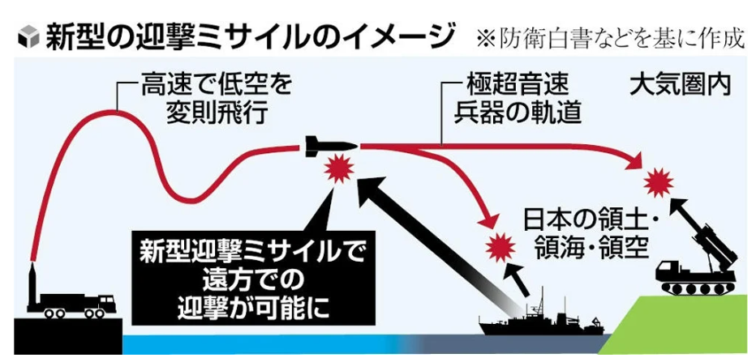
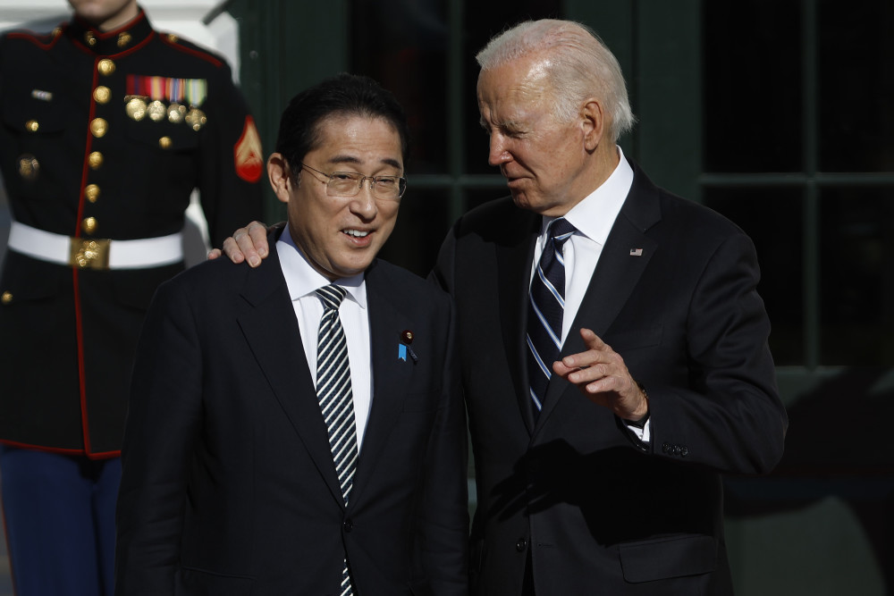

# 美日被曝将共同研发新型反导拦截弹，借口又是中朝俄高超音速武器

【文/观察者网
张菁娟】据日本《读卖新闻》13日报道，多位日本政府官员证实，美国和日本决定共同研发新型反导拦截弹，以对抗中国、俄罗斯、朝鲜推进研发的高超音速武器。双方预计将在18日举行的日美首脑会谈中达成协议。

报道称，这将是美日两国自2017年结束研发“标准-3 Block IIA”拦截弹后第二次共同研发反导拦截弹。

8月18日，美日韩首脑会谈将在距离华盛顿约100公里的马里兰州戴维营举办。届时，日本首相岸田文雄将会同美国总统拜登举行单独会面，或就联合开发高超音速武器拦截系统达成协议。美日两国政府计划在10年内完成这种新型拦截弹的研发。

 _新型反导拦截弹示意图
图源：《读卖新闻》_

对于高超音速武器，各国的定义不同，一般而言，高超音速武器指的是在大气层内飞行速度超过5倍音速的武器，可在临近空间高速、高机动飞行，受地球曲率影响，地面预警雷达很难对其进行预警跟踪。

《读卖新闻》称，目前，中国已拥有实用化的高超音速武器，俄罗斯在俄乌冲突中将高超音速导弹投入实战。朝鲜也称已经成功测试多型高超音速导弹。为应对所谓的威胁，日本防卫省正力求提升陆上自卫队03式中程防空导弹（Chu-
SAM）的性能。“宙斯盾”舰上搭载的SM-6导弹也有一定的拦截能力。但由于上述拦截导弹均为末段拦截，因此日本迫切需要在更远距离外获取对岸打击的能力。

报道称，若想拦截高超音速武器，还需建立能够尽早发现追踪导弹的体系。如今美国正在推进建立由多颗小型卫星组成的“卫星星座”，日本防卫省考虑与美国共享卫星网络。

目前，日本政府也在推进获得打击敌方导弹基地等的“反击能力”，在共同研发新型拦截弹的同时，还将加紧整备保证“反击能力”的远程导弹。

_当地时间2023年1月13日，美国华盛顿特区，美国总统拜登在白宫会晤来访的日本首相岸田文雄。_

高超声速导弹作为新型战略战术打击武器正日益成为军事强国争夺的技术制高点。今年6月，日本防卫大臣浜田靖一与美国国防部长劳埃德•奥斯汀举行联合记者会时称，日本和美国打算继续加强两国联盟的威慑力和反应能力，包括讨论联合开发拦截高超音速武器系统的可能性。

此前（2022年12月），《日经亚洲》曾报道称，日美正考虑联合研究使用高超音速滑翔战斗部拦截弹道导弹的技术。这将使导弹能够在现有反导系统无法到达的高度摧毁目标。

日本防卫省计划在2023年开始设计一种用于远程导弹的导弹助推器，使其可在敌方导弹飞行轨道发生变化时调转方向。

针对美日间的军事关系，我外交部发言人毛宁此前表示，中方一贯认为，国与国之间的军事合作应当有利于地区的和平稳定，不应当针对第三方，更不得损害第三方的利益。毛宁指出，大搞胁迫的不是中国，而是美国。

**本文系观察者网独家稿件，未经授权，不得转载。**

