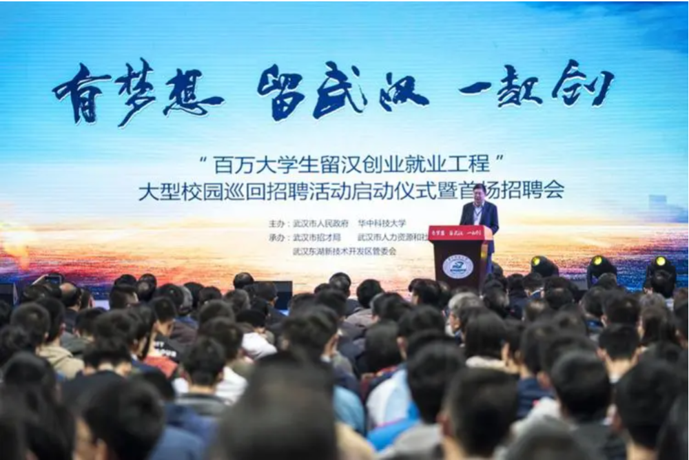

# 中国各地掀起抢人大战，从直接发钱到首付降三成

**撰文 | 续紫君**

**编辑 | 龚正**

近日，李嘉诚把旗下长实集团位于中国香港的新楼盘降价30%出售，引来万人抢房。各种解读很多，有一种声音认为，这也是为了配合港府今年上半年推出的高才通等抢人策略。最新的港府通报显示，上半年香港共吸引10万内地人申请香港特区身份证，目前已经批准6.1万人。

香港只是中国各地抢人的一个缩影。近年，从北上广深、到新一线以及低线城市，从发放真金白银的人才补贴，到送钱甚至送房，只为多博得一位年轻人落户。曾几何时，80、90后成长语境中的“人口负担”，摇身一变成为“人口资源”。这背后是大时代的激烈转化——大家都意识到，当一座城市少了年轻人，未来将变得一无所有。

**#01**

**各地人口拉新，政策急迫**

“除南京、苏州市区外，全省全面取消落户限制政策，试行经常居住地登记户口制度。”

这是8月中旬，一则来自江苏省发改委的公开征求意见稿。该意见稿的主题是“促进全省经济持续回升向好、助力高质量发展”。

意见稿共有18条，落户方面的意见归类在“ **有序推进农业转移人口市民化** ”一栏。

乍一看，这类政策的宏观目的是为了加速人口城镇化。但现实层面，对进城最积极的莫过于年轻人。如该意见稿实施，对年轻人显然是一大利好。因为他们终于可以根据自己的事业规划、爱情归属、自然环境喜好，自由选择自己想去、想待、想打拼的地方，虽然还是得除了省内两大经济龙头以外。

江苏并不孤单。在江苏发布意见之前的半个月，浙江也发布了类似文件，称“全省（杭州市区除外）全面取消落户限制政策，确保外地与本地农业转移人口进城落户标准统一，试行经常居住地登记户口制度”等。

相比较于江苏把政策实施范围限于“全省”，浙江的区别在于同时强调“外地”与“本地”。有媒体这样解读浙江的政策—— **省外抢人才，省内市民化** 。

比起江苏，浙江广纳人口才俊的心胸，看上去更具省内省外全局观。

东部吸粉，其他地方紧张。毕竟不管是人口、还是年轻人，都属于存量资源。这里引入得多，那里就流失得多。

8月初，坐拥百万大学生的华中大城市武汉也坐不住了。

当地省政府办公厅发布了《关于加快完善高校毕业生等青年就业创业工作体系的实施意见》，将这条政策匡定的目标用户，定格在了高校毕业生，其中多项指标引人关注。

其中包括 **“到2025年，每年全省高校毕业生留鄂比例在60%左右，新增高校毕业生留鄂来鄂就业创业40万以上”。**

百万凤凰东南飞，曾经是湖北培养大学生的真实写照。但相关的留才政策也探索和实施了多年，比如早在2017年，武汉市就启动了“百万大学生留汉创业就业计划”，发誓要打造“大学生最友好城市”，但像此次将留人的KPI定得如此明确，也是史上第一次。

_图 | 留武汉，是武汉近年人才发展关键词_

西部明星城市成都也不甘落后，借着刚刚落幕的世界大学生运动会热点，成都打出了成功的人才吸引官方广告，称“成都会大力实施青年创新创业就业筑梦工程，为广大青年人才提供人生出彩的广阔舞台”。

_图 | 成都大运会，城市的一种营销广告_

与其它地方一般“先来创业或工作、再落户”的政策不同，成都的招才政策特点是在全国率先推出了 **“先落户后就业”**
等政策，也就是来了就给身份证，工作再慢慢找。

或受惠于这类政策组合， **成都官宣近年吸引青年人才近70万人。目前成都人才总量已经达到了622.32万人（数据来自于四川新闻网），居全国第四位。**

而在深圳，当地抢人政策的特色是直接真金白银。就在8月2日，GDP仅次于上海浦东、北京海淀、有“中国GDP第三大区”的深圳南山区，就发布2023年度新引进落户人才生活补贴及实习补贴项目的相关通知。

当中称，硕士若毕业于世界排名前150位的知名大学、或教育部“双一流”高校，引进时30周岁以下，在相关企业工作满一年、符合条件的人才，
**一次性给予3万元的生活补贴。**

早在2016年，深圳就出台了相关政策，向本科以上学历发放租房和生活补贴，标准为本科生15000元/人，硕士25000元/人，博士30000元/人，但该政策2021年曾做出调整，现在基本上又重新恢复了“惜才”的姿态。

**#02**

**年轻人为何受欢迎，各地算盘不一**

我国各地吸引人才的政策较为纷繁复杂。实施主体既有省市政府、也有各区。既有发展改革部门，也有各地人力资源局。既有针对农村人口进城的城镇化人口政策，也有针对大学生、中高阶人才的吸引政策。

这些政策共同组成了一个体系，不管出自哪个部门，有一条主线已经日益明显——
**那就是扩大城镇化人口基数，提升城镇化率；吸引大学生、以及高精尖人才落户，为城市发展补充多层次智慧动能。**

这背后是对人口观念的改变。以前，人是资源消耗者的观念被过多强调。现在随着人口从增量市场转变成存量市场，人们也意识到，人是消费者、也是财富生产者的双重角色。

这对城市经济而言至关重要， **毕竟人口数量关系着一座城市的生产力和生命力、人才质量关系着一座城市的发展后劲**
，这样一个朴素的道理，已经越来越具备现实的紧迫感。

不过，受限于各个城市的资源禀赋，站在“求人舞台”上的各城市选手，其竞争力各不相同，背后怀揣的目标上限和下限也不同。毕竟现在占据着买方市场的是年轻人，他们掌握着选择的主动权，而不是各个城市。

如果以公司的发展阶段，来套用各个城市的人口发展策来看：

**北上广深这类一线城市，就类似于成熟的企业巨鳄，它们比较多渴求的是尖端、前沿的头部人才。**
这部分人才承担着国家产业发展职责，以及在国际舞台上进行全球竞争的重担。

今年5月，北京市就更新了外籍“高精尖缺”人才的相关标准。其中的一些条款明确指出：北京市急缺的是“曾任国内外高水平大学、科研机构中层以上管理职务或聘为教授（研究员）、副教授（副研究员）”、“曾任世界500强企业总部等高层管理职位和技术研发主要成员”等这类人才。

 _图 | 北京高精尖产业图_

以前人们常说，走在北京高校集聚的海淀，出门遇到的3个人里就有1个博士、1个海归。这显然不能满足北京瞄向未来的首都格局。

与北京相比，上海一直呈现海归精英气质。这种城市内在也体现在了当地政府的自我要求上。

今年8月初，上海颁布了《上海市事业单位高层次人才招聘办法》等，规定由用人的事业单位自行认定高层次人才，支持事业单位打破国籍、户籍、年龄、学历等制约，招聘外国人和港澳台人才，属于“高精尖缺”人才的、可临时超职数聘用。

一个高水平的服务型政府，显然是上海渴求的。

与北上广深城市这种“多挑最好”的相比，杭州、武汉、成都等准一线城市，则更像创业型公司，他们在招人上更类似于“ **招募创业合伙人**
”，和青年才俊分享城市发展的“ **期权** ”。虽然整体资源禀赋尚比不了北上广深，但也有自己的路数。

比如，作为中国的电商城、网红城，杭州近年在中国经济版图上的存在感不断升高，它本身就存在着很多吸引人才的综合优势。

其中有一点属于杭州特色——过去数年，杭州楼市一度存在着较为严重的新房二手房楼市倒挂现象，有的价差达千万。在过去数年，杭州屡屡发生数十次万人摇号买房的奇观，这当中不乏很多年轻人把头款放在了杭州。

_图 | 杭州成了年轻人最爱落户的城市之一_

房子一旦定格，人就跑不了，筑巢就能吸引凤凰来。近来，诸如无忧传媒这样的明星公司就将总部搬到杭州，这背后不仅是简单的人员流动，更深层次的是资源要素向杭州聚拢。

可以说，杭州这种靠房子来留人的打法近似于私域圈粉，成全了杭州近几年的火热。

**而对于普通的三四五线城市，他们在招才募才上类似于一种初创公司，优点是灵活弹性，擅长网红式的流量打法。**
他们深知自己的产业条件在吸引人口上优势不大，最拿得出手、能产生眼球效果的当属文旅资源。

今年来，在网络上最为活跃的以中小城市的文旅局长居多。比如，四川广元利州文旅局局长梁宝月就变装武则天，宣传故里；辽宁丹东凤城文旅局局长程志强则变身唐朝薛礼将军，一箭保一方平安，点击量超400万；新疆昭苏县女副县长贺娇龙身披红斗篷，飒爽策马，火遍全网。

今年上半年，中小城市中的流量之王当属山东淄博。以一块饼包一串肉的美食，征服了大北方。吃透了热点玩法的他们，不得不说都享受了一波高光的时刻。

_图 | 淄博成为上半年中国最有流量的中等城市_

但若实际来看，少有产业支撑的中小城市热度，多难以持久；在招才方面，也难以凭借舆论上的一时激情，去改变人才选择居住地时的慎重决策。

这些城市归根结底赚的是一波流量的买卖，如何把流量沉淀下来，更多转化为城市的动能，这是一个长期课题。

**#03**

**外来者的觊觎**

内地城市为争夺人才打得火热，香港特区也不例外。

今年以来，香港人才引进计划的广告呈现高频露脸态势，在内地菁英中刷了一波又一波存在感。总体感觉是，香港也在放低姿态、放低门槛，来才不拒。

上半年最具代表性的一个政策当属3月香港推出的高才通计划，称只要满足前一年的年薪高于250万港元，或者毕业于全球排名前100大学的人才，就可以凭此签证来香港工作或生活。

目前，据港媒报道， **过去半年来，有10万多内地人依据政策申请赴港，共有6.1万人获批。**

_图 | 很多父母去香港，为的是下一代教育_

不过，移居香港的魅力，近年来看总体呈现下降态势。越来越多的人们去香港，似乎更多是为了下一代教育问题考虑，逃避内地的教育内卷。

按照香港特区相关规定，在中国香港出生的小孩，出生就是中国香港人，在高考中可以在比内地考生平均低150分的情况下，进入985、211大学。

然而，这些孩子的父母却普遍面临的一个困境是，香港的产业相比新产业不断迭代的内地而言，显得太传统了，仍然是以金融、贸易、物流、房地产等为支撑。虽然香港也在发力新兴科技产业，但块头普遍不大，对新兴人才的就业吸纳能力，似乎还比较有限。

即便是金融业，受国际大环境影响，今年6月起，摩根士丹利亚太区（包括香港、北京、上海）多地的员工也遭遇裁员，折射香港IPO投行格局生变，这也影响内地金融及科技类人才的赴港意愿。

反观，跟香港比起来，内地包括新能源、新能源汽车、硬科技、新消费等在内的新产业总体还有较大的发展空间，从职业规划及薪资成长来看，内地城市的竞争力有不输香港的部分存在。

虽然综合实力尚绝不是香港的竞争对手，但内地有两个城市近年的发展，就走得是产业先行、再徐图吸纳人口的路子。

**一个是合肥。**
早在2008年，合肥政府拿出三分之一的财政收入，引进了当时亏损超过10亿元的京东方；2020年，合肥建投联手三级国资平台筹资70亿，拉了蔚来一把。而后的故事大家都很熟悉了，随着这些重大项目的带动，合肥形成了自己的新兴产业集群，成为近十年我国主要经济强市中GDP增幅最大的城市，连带合肥的人口也“涨势”喜人。

**另一个是东莞。** 7月底，东莞市人社局公布数据，今年上半年全市共新增本科人才10.67万人、硕士及以上人才0.9万人。

原因还是在于经济。目前在东莞，有20万家工业企业，超9000家国家高新技术企业，24家超百亿企业，和3家营收超千亿元的企业。这些制造业企业以及它们提供的工作岗位，在当下就业不景气的情况下，对年轻人来说是一根可靠的救命稻草。

智联招聘的大数据显示，今年第一季度，大学生向东莞用人单位投递简历的数量同比增长294%，增幅排名全国第一，比第二名高出160个百分点。

与其他网红城市比起来，合肥和东莞似乎很少被人想起，然而它们可以提供实实在在的工作岗位，这让它们闷声抢人成功。

在受惯了限制的80、90后来看，中国式抢人大战有点儿魔幻，数十年的束缚、改变就在一夕之间。

虽然政策看上去五花八门，但大道至简，解决了就业和向上发展问题，也就解决了民生。人自然会来，根本无需去抢。

