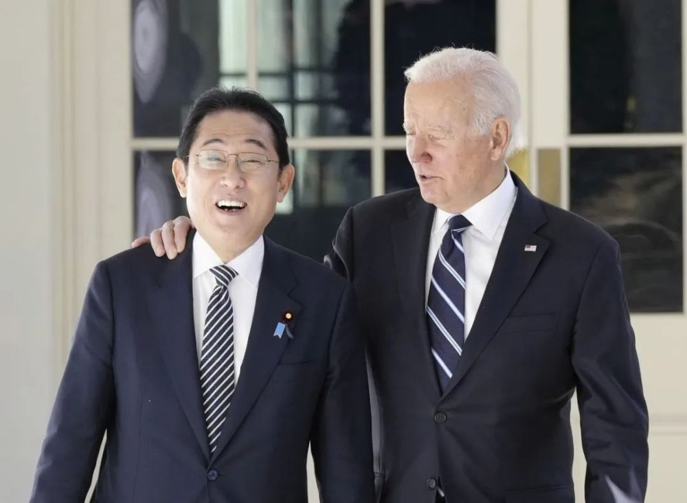

# 美日以中俄朝为借口，将共同研发新型反导拦截弹：动向不断，各怀鬼胎

美日韩三国首脑戴维营会谈前夕，美日传出正在酝酿军事合作新动作。

据日本《读卖新闻》8月13日报道，日美政府确定了共同研发针对高超音速武器的新型拦截导弹的方针，18日举行的美日韩首脑会谈中，日本首相岸田文雄将就此与美国总统拜登举行单独会谈。

_岸田文雄（左）、拜登 资料图 图源：视觉中国_

**借中俄朝，升级合作**

此次美日酝酿军事合作新动作，以中俄朝为借口，老调重弹。《读卖新闻》报道开篇就声称，“为对抗中国、俄罗斯、朝鲜推进研发的高超音速武器，美国与日本将共同研发新型反导拦截弹。”

高超音速武器能够以5倍音速以上的速度在低空进行变轨飞行，依靠现有雷达难以捕捉，拦截更加困难。

《读卖新闻》声称，中国此前已成功试射高超音速导弹，俄罗斯也在乌克兰冲突中使用了这种武器。2021年9月以来，朝鲜多次进行了高超音速武器试射。有分析认为，在2022年1月的试射中，朝鲜高超音速导弹的飞行速度最高达到了10倍音速。

报道称，日本防卫省正努力提升陆上自卫队03式中程地空导弹的性能。搭载于海上自卫队“宙斯盾”舰的新型导弹“标准”-6也有一定拦截能力。但这些拦截导弹均为末段拦截，因此“迫切需要”拥有能够在更远距离实施拦截的手段。

美日两国政府计划在10年内完成这种新型拦截弹的研发。

这是美日第二次共同研发反导拦截弹，上一次是2017年研制完成的“标准”-3 Block IIA拦截弹，研制工作由美国雷神公司和日本三菱重工共同承担。

2022年11月，日本战舰首次试射“标准”-3 Block IIA反导拦截弹。美媒近日称，美国明年还将首次在关岛试射这一反导拦截弹。

不过，美日对当下的反导合作仍不满足。《读卖新闻》声称，日美此次合作研发新型拦截弹，意在防范现有导弹防御网络难以应付的威胁，强化“威慑力”。

日媒报道还称，为拦截高超音速导弹，还需能够尽早发现追踪导弹的体系。美国正在推进建立由多颗小型卫星组成的“卫星星座”，日本防卫省考虑与美国共享卫星网络。

**动向不断，各怀鬼胎**

新型反导拦截弹合作只是最新动向之一。美日政府正在加速军事捆绑，朝着军事“一体化”方向狂奔。

实际上，此次传出的美日合作研制新型反导拦截弹消息早有预告。今年6月，美国国防部长奥斯汀访日，日本防卫大臣浜田靖一与奥斯汀举行联合记者会时就曾表示，日美计划继续加强两国联盟的“威慑力”和反应能力，包括讨论联合开发拦截高超音速武器系统的可能性。

不只是拦截弹，浜田靖一还称，日美还同意扩大无人机领域的合作。奥斯汀则进一步为两国军事合作动向寻找借口，称美日正在努力使军事关系进一步现代化，为的是防范中国的所谓“胁迫行为”。

日美军事合作进一步升级，在亚太地区不断强化军事部署，实际上两国仍各怀鬼胎。

《读卖新闻》13日的报道指出，日本政府目前也在推进获得打击敌方导弹基地的“反击能力”，在共同研发新型拦截弹的同时，还将加紧整备保证“反击能力”的远程导弹。

这再次暴露了日本的军事野心——乘着美国为地缘政治对抗不断加强亚太军事部署的“东风”，日本不断自我松绑，所谓的“拦截能力”背后，则是其急于扩大的“反击能力”。

对于美国来说，为日本进一步松绑，借助日本扩大美国在亚太的军事存在，是其实现地缘政治目标的路径。为此，美日正在图谋“统一调动部队”。

美国国会参议院7月底通过的2024财政年度国防授权法案，提到了修改驻日美军体制事宜，要求国防部研究在日本统一负责陆海空军和海军陆战队的调动运用，并深化与自卫队合作的机制。

共和党人、众议院军事委员会副主席惠特曼在接受《日本经济新闻》采访时，针对“台湾有事”情态指出，“在极其严峻的环境下，日美部队反应时间将决定胜负。”

多名消息人士透露，拜登政府也已开始讨论调整驻日美军的调动运用。建立起“战事发生之际”统一调动日美部队的机制，正在成为美国下一步搅局亚太的新动作。毫无疑问，这一图谋将使美日安保体制更具攻击性，将为地区安全增添又一危险因子。

_拜登、岸田文雄、韩国总统尹锡悦（右） 资料图 图源：视觉中国_

针对美日及韩国不断加强军事合作动向，有日本专家指出，在美国的牵动下，美日韩三国不断强化在东亚地区的军事力量部署，肆意插手亚洲事务，不仅不会为东亚地区带来和平，反而会让紧张局势升级。

中国外交部发言人此前就美日间军事关系应询指出，我们一贯认为，国与国之间的军事合作应当有利于地区的和平稳定，不应当针对第三方，更不得损害第三方的利益。谈到胁迫，大搞胁迫的不是中国，而是美国。美日开展双边军事合作应确保不损害第三方利益，不损害地区和平稳定。

